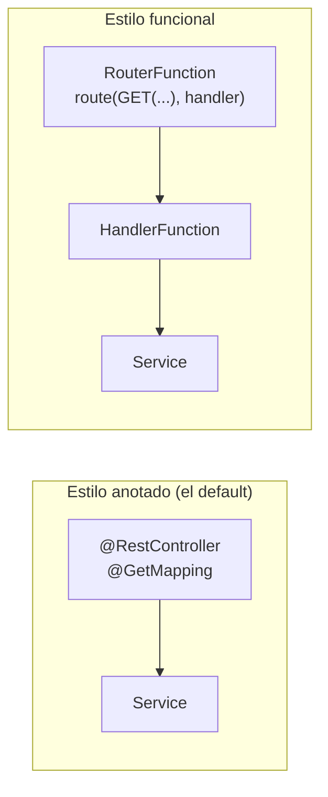

# Spring WebFlux — cómo se usa Reactor dentro de Spring Boot

Los operadores de Project Reactor (`Mono`/`Flux`, `map` vs `flatMap`, manejo de errores, `StepVerifier`) están cubiertos en profundidad en [`reactive-programming/`](../../reactive-programming) — este documento asume ese contenido y se enfoca en lo que **Spring Boot agrega encima**: cómo se cablea WebFlux como framework web (controllers vs endpoints funcionales, `WebClient`, testing con `WebTestClient`, seguridad, y la decisión de arquitectura frente a Virtual Threads).

## Anotado vs funcional — las dos formas de exponer un endpoint



| | Anotado (`@RestController`) | Funcional (`RouterFunction`/`HandlerFunction`) |
|---|---|---|
| Cómo se ve | `@GetMapping("/appointments/{id}")` sobre un método. | `RouterFunctions.route(GET("/appointments/{id}"), handler::findById)` en una clase `@Configuration`. |
| Cuándo preferirlo | Caso general — más legible, mejor soporte de IDE/OpenAPI (springdoc), lo que ya usa el equipo en Spring MVC. | Rutas muy dinámicas/condicionales, o cuando se quiere ver **todo** el mapeo de rutas en un solo lugar en vez de repartido en varios controllers. |
| Trade-off | Menos control explícito sobre el request/response crudo. | Más verboso para el caso simple; menos "magia" de anotaciones. |

**Frase para entrevista:** "el estilo anotado y el funcional son dos formas de definir el mismo `HandlerMapping` internamente — no hay diferencia de performance, es una preferencia de legibilidad/control." La inmensa mayoría del código en producción usa el estilo anotado; el funcional aparece en libs internas o casos con ruteo muy dinámico.

## `WebClient` — el cliente reactivo, y sus trampas típicas

`WebClient` reemplaza a `RestTemplate` (deprecado, bloqueante). Se configura una sola vez como bean, nunca `new WebClient()` disperso por el código:

```java
@Bean
WebClient inventoryClient(WebClient.Builder builder) {
    return builder
        .baseUrl("http://inventory-service")
        .filter(logRequest())
        .build();
}
```

Errores comunes que un entrevistador senior espera que sepas señalar:

- **`.block()` sobre el resultado de un `WebClient` dentro de un controller reactivo** — anula toda la ventaja de no bloquear el event loop de Netty. Si aparece, es porque alguien mezcló código bloqueante donde no correspondía (ver la nota de Virtual Threads más abajo).
- **No configurar timeouts.** Sin un timeout explícito (`.responseTimeout(Duration.ofSeconds(3))` o vía `HttpClient` de Reactor Netty), una llamada colgada consume un canal de Netty indefinidamente. Combinar con `retryWhen(Retry.backoff(...))` — ver [`reactive-programming/`](../../reactive-programming).
- **No manejar `WebClientResponseException`** — un 4xx/5xx del downstream levanta esta excepción por defecto; sin un `onStatus(...)` o `onErrorMap`, se propaga como una excepción genérica de infraestructura en vez de una excepción de dominio legible.

## Manejo de errores — `@RestControllerAdvice` + `ProblemDetail` (RFC 7807)

```java
@RestControllerAdvice
public class GlobalErrorHandler {

    @ExceptionHandler(AppointmentNotFoundException.class)
    public ResponseEntity<ProblemDetail> handleNotFound(AppointmentNotFoundException ex) {
        ProblemDetail problem = ProblemDetail.forStatusAndDetail(HttpStatus.NOT_FOUND, ex.getMessage());
        problem.setTitle("Appointment not found");
        return ResponseEntity.status(HttpStatus.NOT_FOUND).body(problem);
    }
}
```

- `ProblemDetail` (Spring 6+, RFC 7807) es el formato estándar de error — reemplaza los `ErrorResponse` custom hechos a mano.
- El handler funciona igual en WebFlux que en MVC — Spring resuelve la anotación `@ExceptionHandler` sin importar si el retorno se envuelve en `Mono<ResponseEntity<...>>` o va directo.
- **Trampa clásica de WebFlux**: un `Mono` vacío devuelto por un endpoint `GET` (ej. `findById` que no encontró nada) **no se traduce automáticamente a 404** — hay que mapearlo explícitamente (`.switchIfEmpty(Mono.error(new NotFoundException(...)))` o `ResponseEntity.notFound().build()` en el `map`/`flatMap` correspondiente). Si no se hace, WebFlux devuelve 200 con body vacío, lo cual confunde a cualquier consumidor del API.

## Testing — `WebTestClient`

Es a WebFlux lo que `MockMvc` es a Spring MVC — pero también sirve contra un servidor real (`bindToServer()`), no solo contra el contexto mockeado:

```java
@SpringBootTest(webEnvironment = SpringBootTest.WebEnvironment.RANDOM_PORT)
class AppointmentControllerTest {

    @Autowired
    WebTestClient webTestClient;

    @Test
    void shouldReturn404WhenAppointmentDoesNotExist() {
        webTestClient.get().uri("/appointments/{id}", UUID.randomUUID())
            .exchange()
            .expectStatus().isNotFound();
    }
}
```

`StepVerifier` (ver [`reactive-programming/`](../../reactive-programming)) testea el `Mono`/`Flux` que devuelve un *service*/*use case* directamente; `WebTestClient` testea el endpoint HTTP completo (serialización, status codes, headers) — son complementarios, no alternativas.

## Seguridad reactiva — `SecurityWebFilterChain`

Spring Security en WebFlux usa un modelo distinto al de Spring MVC (`SecurityFilterChain` clásico basado en servlets no aplica):

```java
@Bean
SecurityWebFilterChain securityWebFilterChain(ServerHttpSecurity http) {
    return http
        .authorizeExchange(exchanges -> exchanges
            .pathMatchers("/actuator/health").permitAll()
            .anyExchange().authenticated())
        .oauth2ResourceServer(oauth2 -> oauth2.jwt(Customizer.withDefaults()))
        .build();
}
```

`ServerHttpSecurity` (reactivo) en vez de `HttpSecurity` (servlet); `ReactiveAuthenticationManager` en vez de `AuthenticationManager` si hace falta autenticación custom. La validación de JWT (`oauth2ResourceServer().jwt()`) es no bloqueante por diseño — no hay equivalente a bloquear el hilo para verificar el token.

## WebFlux vs. Spring MVC + Virtual Threads — la decisión de arquitectura (JEP 444)

Con Virtual Threads (Java 21, JEP 444) estable, Spring MVC dejó de ser automáticamente "la opción bloqueante que no escala": un Virtual Thread por request bloqueado en I/O libera el hilo transportador (*carrier thread*) mientras espera, logrando una escalabilidad de I/O comparable a WebFlux **sin reescribir el código en estilo reactivo**.

| | Spring MVC + Virtual Threads | Spring WebFlux |
|---|---|---|
| Estilo de código | Imperativo, secuencial — igual que siempre. | Declarativo con `Mono`/`Flux`, curva de aprendizaje real. |
| Debugging/stack traces | Un stack trace normal, por request. | Stack traces fragmentados entre operadores — más difícil de leer. |
| Backpressure | No nativo — cada request consume un Virtual Thread completo. | Nativo — `Flux` puede aplicar backpressure real al productor. |
| Cuándo preferirlo | Equipos sin experiencia reactiva, código bloqueante existente (JPA/JDBC) que no vale la pena migrar. | Alto volumen con backpressure real necesario, o ya se tiene un stack 100% no bloqueante (R2DBC, WebClient) de punta a punta. |

**No se combinan dentro del mismo pipeline**: activar Virtual Threads en un servidor Tomcat (`spring.threads.virtual.enabled=true`) no vuelve "gratis" bloquear dentro de un flujo `Mono`/`Flux` de WebFlux — BlockHound y las validaciones de no-bloqueo de Reactor no distinguen si el hilo subyacente es virtual o de plataforma; siguen marcando el `.block()` como violación. La elección se hace **una vez, a nivel de framework web** (MVC+VT o WebFlux), no se mezcla operador por operador. Detalle completo de esta decisión en [`ia-agentes/agent-harness/agents/java-reactive-dev/instructions.md`](../../ia-agentes/agent-harness/agents/java-21-dev/instructions.md).

## Drills de repaso

| Tiempo | Pregunta |
|---|---|
| 4 min | "¿Por qué un `Mono` vacío en un `GET` no se traduce solo a 404? ¿Cómo lo arreglás?" |
| 5 min | "Tu `WebClient` no tiene timeout configurado y una llamada se cuelga. ¿Qué impacto tiene y cómo lo prevenís?" |
| 6 min | "Un equipo sin experiencia reactiva necesita escalar I/O. ¿WebFlux o MVC + Virtual Threads? Justificá con trade-offs." |
| 5 min | "¿`WebTestClient` reemplaza a `StepVerifier` o son complementarios? Explicá qué testea cada uno." |

## Referencias

- [Spring Framework — WebFlux Reference](https://docs.spring.io/spring-framework/reference/web/webflux.html) — modelo de programación, `WebClient`, testing.
- [Spring Security — Reactive Applications](https://docs.spring.io/spring-security/reference/reactive/index.html) — `ServerHttpSecurity`, OAuth2 resource server reactivo.

Relacionado: [`reactive-programming/`](../../reactive-programming) para los operadores de Reactor en profundidad, [`fundamentals.md`](fundamentals.md) para la ubicación de WebFlux dentro del ecosistema Spring, y [`ia-agentes/agent-harness/agents/java-reactive-dev/instructions.md`](../../ia-agentes/agent-harness/agents/java-21-dev/instructions.md) para la guía completa de reconciliación WebFlux vs. Virtual Threads.
