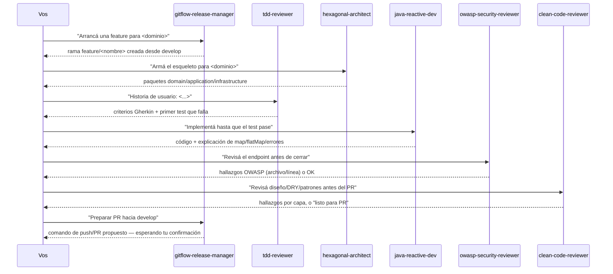

# IA aplicada al desarrollo — catálogo de subagentes de Claude Code

Catálogo de **subagentes reales de Claude Code** listos para invocar cuando arranca un desarrollo concreto — no son solo teoría, son configuración funcional. Vive acá, en vez de en la raíz del repo, porque la idea es que crezca como catálogo por dominio a medida que se necesite: hoy desarrollo de software, después analítica de datos, big data, etc.

> Esto responde directamente a un ítem que aparece cada vez más en procesos de selección técnica: *"experiencia usando herramientas de IA aplicadas al desarrollo"*. La idea es dejar documentado y practicado un flujo concreto de uso, no solo la afirmación de que se usa IA.

## Mapa de esta carpeta

`ia-agentes/` tiene tres piezas que no son lo mismo — ver [`claude-code-project-anatomy.md`](claude-code-project-anatomy.md) para el detalle completo de cada una y cómo se relacionan (agent vs. skill, cuándo usar cada uno, qué más puede tener un proyecto con Claude Code):

- **`.claude/agents/*.md`** — los 6 agentes, ya compilados, listos para que Claude Code los auto-descubra. **No se editan acá directamente.**
- **`.claude/skills/*/SKILL.md`** — 2 skills (procedimientos que corre el hilo principal, no un agente aparte): `conventional-commit` y `pr-description`. Estos sí se editan directo, ahí mismo.
- **`agent-harness/`** — la **fuente** de los 6 agentes (`agent.yaml` + `instructions.md` por agente) más el compilador que genera `.claude/agents/*.md`. Se edita un agente acá, se corre `compile.py`, y recién ahí se actualiza lo que Claude Code lee. El porqué de esta separación está en [`agent-harness/README.md`](agent-harness/README.md).

## Cómo activarlos

Los agentes de Claude Code se auto-descubren desde `.claude/agents/` del **directorio de trabajo actual**. Para que estén disponibles, abrí Claude Code con esta carpeta como raíz del proyecto:

```bash
cd ia-agentes/
claude
```

o agregá `ia-agentes/` como carpeta del workspace si trabajás desde el IDE. Una vez ahí, cualquiera de los agentes de la tabla queda disponible vía el tool `Agent`/`Task`, y las skills vía el tool `Skill`.

## Catálogo por dominio

### 🔧 Desarrollo de software

| Agente | Cuándo usarlo | Qué hace |
|---|---|---|
| [`hexagonal-architect`](.claude/agents/hexagonal-architect.md) | Al arrancar un microservicio nuevo desde cero | Arma el esqueleto de paquetes `domain/application/infrastructure` y valida que no se violen los límites del hexágono (ver [`hexagonal-architecture.md`](../software-architectures/hexagonal-architecture.md)). |
| [`java-reactive-dev`](.claude/agents/java-reactive-dev.md) | Al implementar o revisar código con Spring WebFlux | Prioriza la elección correcta entre `map`/`flatMap` y el manejo de errores reactivo (ver [`reactive-programming/`](../reactive-programming)). |
| [`tdd-reviewer`](.claude/agents/tdd-reviewer.md) | Antes de implementar una funcionalidad nueva | Traduce una historia de usuario a criterios Gherkin y guía el ciclo red-green-refactor (ver [`tdd/`](../tdd)). |
| [`gitflow-release-manager`](.claude/agents/gitflow-release-manager.md) | Al crear una rama, preparar un release/hotfix, o antes de mergear a `develop`/`main` | Guía GitFlow (`feature` → `develop`, `release`/`hotfix` → `main` con tag SemVer). Nunca ejecuta `push`/`merge`/PR sin confirmación humana explícita. |
| [`owasp-security-reviewer`](.claude/agents/owasp-security-reviewer.md) | Antes de dar por terminado un endpoint que toca input de usuario, auth o datos sensibles | Revisa el código contra los 10 riesgos de OWASP Top 10 (2021), con archivo/línea y mitigación puntual por hallazgo (ver [`microservices-patterns/`](../microservices-patterns#5-seguridad-owasp-top-10)). |
| [`clean-code-reviewer`](.claude/agents/clean-code-reviewer.md) | Antes de pedir revisión humana de un PR, o para auto-revisarte | Checklist de 4 capas (correctitud → diseño → legibilidad → estilo), violaciones de DRY/KISS/YAGNI, y detecta patrones de diseño aplicados sin necesidad real (ver [`clean-code/`](../clean-code) y [`design-pattern/`](../design-pattern)). |

### 📊 Analítica de datos — *pendiente*
### 🗄️ Big data — *pendiente*

A medida que haga falta, cada dominio nuevo suma sus propios `.md` acá mismo (mismo directorio `.claude/agents/`, discovery plano) y una fila nueva en su propia sección de esta tabla.

## Skills

Distinto de un agente: una skill corre en el mismo hilo (no abre un contexto separado) y resuelve un procedimiento puntual, no un dominio de juicio completo — ver la comparación en [`claude-code-project-anatomy.md`](claude-code-project-anatomy.md#agent-vs-skill--la-pregunta-que-más-se-confunde).

| Skill | Cuándo usarla | Qué hace |
|---|---|---|
| [`conventional-commit`](.claude/skills/conventional-commit/SKILL.md) | Antes de correr `git commit` | Redacta el mensaje a partir del diff en staging, detectando y respetando la convención que ya usa el repo (no impone Conventional Commits si el repo no lo usa). |
| [`pr-description`](.claude/skills/pr-description/SKILL.md) | Antes de crear un PR | Arma título + resumen + plan de pruebas a partir de los commits y el diff real de la rama contra la base. |

## Flujo de práctica sugerido (desarrollo de software)



Cronometrado a 45–60 min, este flujo simula bastante bien la presión de un ejercicio de arquitectura en vivo — y es un ejemplo concreto de "cómo integrás IA a tu forma de trabajar" para responder en una entrevista, en vez de una respuesta genérica. Notar el último paso: `gitflow-release-manager` nunca hace el push ni abre el PR por su cuenta, solo lo deja preparado.

## Cómo reusar este catálogo en un proyecto nuevo

La idea es que esto sea copiar y pegar, no reescribir. Dos formas, según si vas a solo *usar* los agentes o también a *editarlos* en el proyecto nuevo:

```bash
# opción rápida: solo usar agentes + skills tal cual están (sin editarlos ahí)
cp -r /ruta/a/software-engineering/ia-agentes/.claude ./.claude

# opción completa: además llevarte la fuente, para poder editar/agregar agentes después
cp -r /ruta/a/software-engineering/ia-agentes/.claude ./.claude
cp -r /ruta/a/software-engineering/ia-agentes/agent-harness ./agent-harness
```

Con la opción rápida alcanza para usarlos — Claude Code descubre `.claude/agents/*.md` automáticamente al abrir el proyecto, sin build ni dependencias. Con la opción completa, además podés editar `agent-harness/agents/<nombre>/instructions.md` y correr `python3 agent-harness/runners/claude_code/compile.py` para regenerar el `.claude/agents/` de ese proyecto puntual. Si el proyecto usa un stack distinto a Java/Spring WebFlux, los agentes igual sirven de base — el prompt de cada uno es editable, y la estructura (reglas concretas + "cuándo usar cada capa") se mantiene igual sea cual sea el lenguaje.

> Nota para la entrevista: contá esto explícitamente si preguntan por experiencia con IA — no es "usé Claude alguna vez", es "tengo un catálogo de agentes versionado, reusable entre proyectos con un solo `cp`, que cubre arquitectura, reactividad, TDD, seguridad, código limpio y control de versiones".

## Por qué subagentes y no solo prompts sueltos

Un subagente encapsula el criterio (buenas prácticas, convenciones del repo, qué evitar) una sola vez, en un archivo versionado — en vez de repetir el mismo contexto en cada prompt. Lo que Claude Code carga siempre es un único `.claude/agents/<nombre>.md` (frontmatter + prompt en el mismo archivo) — eso no cambia. Lo que sí cambia es dónde se **edita** ese contenido: acá se separó en `agent-harness/agents/<nombre>/agent.yaml` + `instructions.md`, con un compilador que genera el `.md` final. El razonamiento completo de por qué se agregó esa capa (y qué costo evita) está en [`agent-harness/README.md`](agent-harness/README.md#por-qué-esta-estructura-y-no-algo-más-simple-o-más-elaborado).

## Referencias

- [Claude Code — Subagents](https://docs.claude.com/en/docs/claude-code/sub-agents) — documentación oficial del formato `.claude/agents/*.md` usado en esta carpeta.
