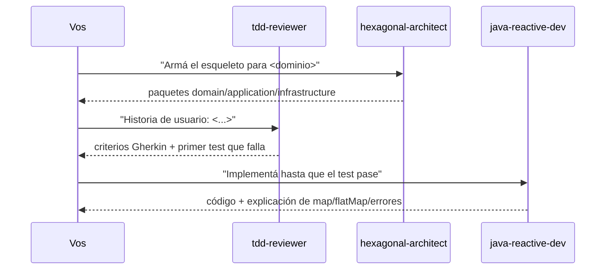

# IA aplicada al desarrollo — catálogo de subagentes de Claude Code

Catálogo de **subagentes reales de Claude Code** listos para invocar cuando arranca un desarrollo concreto — no son solo teoría, son configuración funcional. Vive acá, en vez de en la raíz del repo, porque la idea es que crezca como catálogo por dominio a medida que se necesite: hoy desarrollo de software, después analítica de datos, big data, etc.

> Esto responde directamente a un ítem que aparece cada vez más en procesos de selección técnica: *"experiencia usando herramientas de IA aplicadas al desarrollo"*. La idea es dejar documentado y practicado un flujo concreto de uso, no solo la afirmación de que se usa IA.

## Cómo activarlos

Los agentes de Claude Code se auto-descubren desde `.claude/agents/` del **directorio de trabajo actual**. Para que estén disponibles, abrí Claude Code con esta carpeta como raíz del proyecto:

```bash
cd ia-agentes/
claude
```

o agregá `ia-agentes/` como carpeta del workspace si trabajás desde el IDE. Una vez ahí, cualquiera de los agentes de la tabla queda disponible vía el tool `Agent`/`Task`.

## Catálogo por dominio

### 🔧 Desarrollo de software

| Agente | Cuándo usarlo | Qué hace |
|---|---|---|
| [`hexagonal-architect`](.claude/agents/hexagonal-architect.md) | Al arrancar un microservicio nuevo desde cero | Arma el esqueleto de paquetes `domain/application/infrastructure` y valida que no se violen los límites del hexágono (ver [`hexagonal-architecture/`](../hexagonal-architecture)). |
| [`java-reactive-dev`](.claude/agents/java-reactive-dev.md) | Al implementar o revisar código con Spring WebFlux | Prioriza la elección correcta entre `map`/`flatMap` y el manejo de errores reactivo (ver [`reactive-programming/`](../reactive-programming)). |
| [`tdd-reviewer`](.claude/agents/tdd-reviewer.md) | Antes de implementar una funcionalidad nueva | Traduce una historia de usuario a criterios Gherkin y guía el ciclo red-green-refactor (ver [`tdd/`](../tdd)). |

### 📊 Analítica de datos — *pendiente*
### 🗄️ Big data — *pendiente*

A medida que haga falta, cada dominio nuevo suma sus propios `.md` acá mismo (mismo directorio `.claude/agents/`, discovery plano) y una fila nueva en su propia sección de esta tabla.

## Flujo de práctica sugerido (desarrollo de software)



Cronometrado a 45–60 min, este flujo simula bastante bien la presión de un ejercicio de arquitectura en vivo — y es un ejemplo concreto de "cómo integrás IA a tu forma de trabajar" para responder en una entrevista, en vez de una respuesta genérica.

## Por qué subagentes y no solo prompts sueltos

Un subagente encapsula el criterio (buenas prácticas, convenciones del repo, qué evitar) una sola vez, en un archivo versionado — en vez de repetir el mismo contexto en cada prompt. Cada archivo en `.claude/agents/` sigue el mismo formato: un frontmatter (`name`, `description`, `tools`) y un system prompt con reglas concretas, no genéricas. Ver los tres archivos existentes como referencia de cómo escribir uno nuevo para un dominio distinto.
