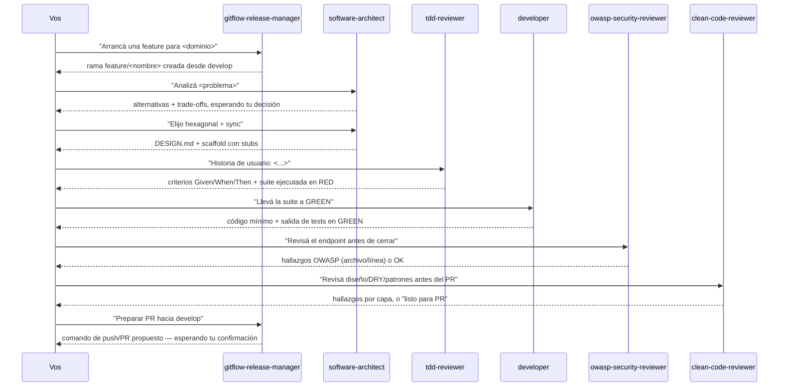

# IA aplicada al desarrollo — catálogo de subagentes de Claude Code

Catálogo de **subagentes reales de Claude Code** listos para invocar cuando arranca un desarrollo concreto — no son solo teoría, son configuración funcional. Vive acá, en vez de en la raíz del repo, porque la idea es que crezca como catálogo por dominio a medida que se necesite: hoy desarrollo de software, después analítica de datos, big data, etc.

> Esto responde directamente a un ítem que aparece cada vez más en procesos de selección técnica: *"experiencia usando herramientas de IA aplicadas al desarrollo"*. La idea es dejar documentado y practicado un flujo concreto de uso, no solo la afirmación de que se usa IA.

## Mapa de esta carpeta

`ia-agentes/` separa la **fuente** (lo que se edita) de la **salida** (lo que Claude Code auto-descubre) — ver [`claude-code-project-anatomy.md`](claude-code-project-anatomy.md) para el detalle completo de cada pieza y cómo se relacionan (agent vs. skill, por qué un compilador, qué más puede tener un proyecto con Claude Code):

- **`agents/<nombre>/`** — la **fuente** de los 8 agentes: `agent.yaml` (name, description, tools, model) + `prompt.md` (el system prompt). Se edita acá.
- **`skills/`** — la **fuente** de las 12 skills, agrupada exactamente como se organizaría el conocimiento de un repo de ingeniería de software agnóstico:
  - **`skills/architecture/{hexagonal,clean,onion}/`** — invariantes de arquitectura, agnósticas de lenguaje.
  - **`skills/quality/{tdd-workflow,clean-code,owasp-security,refactoring}/`** — cómo testear, revisar y refactorizar, agnóstico de lenguaje.
  - **`skills/stacks/{java,typescript,python}/`** — lo único que sí depende del lenguaje: versión, herramientas, sintaxis.
  - **`skills/{conventional-commit,pr-description}/`** — dos skills sueltas, sin categoría (procedimientos, no conocimiento de dominio).
  
  Cada skill es `skill.yaml` (name, description) + un archivo de contenido (`rules.md`, `protocol.md`, `checklists.md` o `catalog.md`, según lo que mejor describe esa skill). Ver la tabla completa en [Skills](#skills).
- **`compiler/compile.py`** — traduce `agents/` y `skills/` (con subcarpetas de categoría) al único formato plano que Claude Code auto-descubre: `.claude/agents/<nombre>.md` y `.claude/skills/<categoría>-<nombre>/SKILL.md`. Se edita la fuente, se corre `compile.py`, y recién ahí se actualiza lo que Claude Code lee.
- **`tests/`** — valida que cada agente/skill tenga lo mínimo para compilar, y que `.claude/agents/`+`.claude/skills/` estén sincronizados con la fuente (falla si alguien edita el compilado a mano).
- **`.claude/`** — la **salida**: `agents/*.md` y `skills/*/SKILL.md` generados (no se editan ahí), más lo que no se compila porque no tiene fuente nested — `CLAUDE.md` (reglas del proyecto), `settings.json`, `hooks/tdd_gate.py` (el hook que **hace cumplir TDD**, ver [TDD obligatorio](#tdd-obligatorio--cómo-se-hace-cumplir)) y `scripts/detect_stack.py` (detecta lenguaje/versión/framework; es el paso 0 de todos los agentes).

## Cómo activarlos

Los agentes de Claude Code se auto-descubren desde `.claude/agents/` del **directorio de trabajo actual**. Para que estén disponibles, abrí Claude Code con esta carpeta como raíz del proyecto:

```bash
cd ia-agentes/
claude
```

o agregá `ia-agentes/` como carpeta del workspace si trabajás desde el IDE. Una vez ahí, cualquiera de los agentes de la tabla queda disponible vía el tool `Agent`/`Task`, y las skills vía el tool `Skill`.

## Catálogo por dominio

### 🔧 Desarrollo de software

| Agente | Cuándo usarlo | Qué hace |
|---|---|---|
| [`software-architect`](.claude/agents/software-architect.md) | **Primero**, al arrancar un proyecto o feature | Analiza el problema, propone arquitecturas (hexagonal, clean, onion, capas) y trade-offs, **espera tu decisión**, deja `DESIGN.md` con diagramas y ADRs, y arma el scaffold con stubs en el lenguaje del proyecto. |
| [`spring-boot-webflux-dev`](.claude/agents/spring-boot-webflux-dev.md) | En lugar de `developer`, si el proyecto es Spring WebFlux | `map`/`flatMap`, manejo de errores reactivo, inyección de dependencias, `ProblemDetail`, validación, testing (ver [`spring-boot/webflux.md`](../frameworks/spring-boot/webflux.md)). |
| [`tdd-reviewer`](.claude/agents/tdd-reviewer.md) | **Segundo**, antes de cualquier lógica | Criterios Given/When/Then y suite del slice **ejecutada en RED**, en cualquier lenguaje (ver [`tdd/`](../tdd)). |
| [`developer`](.claude/agents/developer.md) | **Tercero**, fase GREEN + refactor | Implementa lo mínimo para pasar los tests, con las mejores prácticas de la **versión exacta** del proyecto (Java, TypeScript, Python), y muestra la salida en GREEN. |
| [`gitflow-release-manager`](.claude/agents/gitflow-release-manager.md) | Al crear una rama, preparar un release/hotfix, o antes de mergear a `develop`/`main` | Guía GitFlow (`feature` → `develop`, `release`/`hotfix` → `main` con tag SemVer). Nunca ejecuta `push`/`merge`/PR sin confirmación humana explícita. |
| [`owasp-security-reviewer`](.claude/agents/owasp-security-reviewer.md) | Antes de dar por terminado un endpoint que toca input de usuario, auth o datos sensibles | Revisa el código contra los 10 riesgos de OWASP Top 10 (2021), con archivo/línea y mitigación puntual por hallazgo (ver [`microservices-patterns/`](../microservices-patterns#5-seguridad-owasp-top-10)). |
| [`docker-packager`](.claude/agents/docker-packager.md) | Al final, cuando el código compila y los tests pasan | Dockerfile multi-stage por servicio + `docker-compose.yml` raíz. |
| [`clean-code-reviewer`](.claude/agents/clean-code-reviewer.md) | Antes de pedir revisión humana de un PR, o para auto-revisarte | Checklist de 4 capas (correctitud → diseño → legibilidad → estilo), violaciones de DRY/KISS/YAGNI, y detecta patrones de diseño aplicados sin necesidad real (ver [`clean-code/`](../clean-code) y [`design-pattern/`](../design-pattern)). |

### 📊 Analítica de datos — *pendiente*
### 🗄️ Big data — *pendiente*

A medida que haga falta, cada dominio nuevo suma sus propios `.md` acá mismo (mismo directorio `.claude/agents/`, discovery plano) y una fila nueva en su propia sección de esta tabla.

## Skills

Distinto de un agente: una skill corre en el mismo hilo (no abre un contexto separado) y resuelve un procedimiento puntual, no un dominio de juicio completo — ver la comparación en [`claude-code-project-anatomy.md`](claude-code-project-anatomy.md#agent-vs-skill--la-pregunta-que-más-se-confunde).

Tres categorías, igual que en un repo de ingeniería de software agnóstico: **`architecture-*`** (qué arquitectura interna elegir) y **`quality-*`** (cómo revisar/testear/refactorizar) son agnósticas de lenguaje — el conocimiento vale igual en Java que en Python. **`stacks-*`** es lo único que cambia por lenguaje: versión, herramientas y sintaxis. Los agentes referencian estas skills en vez de repetir su contenido — así una regla se actualiza en un solo lugar.

| Skill | Cuándo usarla | Qué hace |
|---|---|---|
| [`architecture-hexagonal`](.claude/skills/architecture-hexagonal/SKILL.md) | `software-architect` propuso o el proyecto usa Puertos y Adaptadores | Invariantes de dependencia, checklist de validación y tests de arquitectura ejecutables (ArchUnit/dependency-cruiser/import-linter). |
| [`architecture-clean`](.claude/skills/architecture-clean/SKILL.md) | Ídem, con Clean Architecture (Robert C. Martin) | Dependency Rule, vocabulario Entities/Use Cases/Interface Adapters, equivalencia con hexagonal. |
| [`architecture-onion`](.claude/skills/architecture-onion/SKILL.md) | Ídem, con Onion Architecture (Jeffrey Palermo) | Anillos concéntricos, Domain/Application Services, equivalencia con hexagonal. |
| [`quality-tdd-workflow`](.claude/skills/quality-tdd-workflow/SKILL.md) | `tdd-reviewer` y `developer`, siempre | Protocolo red-green-refactor, cómo se ve un RED válido, pirámide de tests, formato de traspaso entre agentes. |
| [`quality-clean-code`](.claude/skills/quality-clean-code/SKILL.md) | `clean-code-reviewer` | Checklist de 4 capas, DRY/KISS/YAGNI, tabla de patrones de diseño forzados (over-engineering). |
| [`quality-owasp-security`](.claude/skills/quality-owasp-security/SKILL.md) | `owasp-security-reviewer` | Los 10 riesgos de OWASP (2021) con qué buscar y equivalentes por stack. |
| [`quality-refactoring`](.claude/skills/quality-refactoring/SKILL.md) | Fase Refactor de TDD, o junto a `clean-code-reviewer` | Catálogo de code smells → refactorización concreta (Fowler), agnóstico de lenguaje. |
| [`stacks-java`](.claude/skills/stacks-java/SKILL.md) | Proyecto Java/Kotlin | Features por versión (8 → 25), JUnit/AssertJ/Mockito/StepVerifier, layout por arquitectura, Virtual Threads vs Reactor, Docker. |
| [`stacks-typescript`](.claude/skills/stacks-typescript/SKILL.md) | Proyecto TypeScript/Node | `tsconfig` estricto, features por versión de TS y Node, Vitest/Jest, layout NestJS, Docker. |
| [`stacks-python`](.claude/skills/stacks-python/SKILL.md) | Proyecto Python | Features por versión (3.10 → 3.14), `uv`/`ruff`/`pytest`, `Protocol` como puerto, layout FastAPI, Docker. |
| [`conventional-commit`](.claude/skills/conventional-commit/SKILL.md) | Antes de correr `git commit` | Redacta el mensaje a partir del diff en staging, detectando y respetando la convención que ya usa el repo (no impone Conventional Commits si el repo no lo usa). |
| [`pr-description`](.claude/skills/pr-description/SKILL.md) | Antes de crear un PR | Arma título + resumen + plan de pruebas a partir de los commits y el diff real de la rama contra la base. |

## Flujo de práctica sugerido (desarrollo de software)



Cronometrado a 45–60 min, este flujo simula bastante bien la presión de un ejercicio de arquitectura en vivo — y es un ejemplo concreto de "cómo integrás IA a tu forma de trabajar" para responder en una entrevista, en vez de una respuesta genérica. Notar el último paso: `gitflow-release-manager` nunca hace el push ni abre el PR por su cuenta, solo lo deja preparado.

## TDD obligatorio — cómo se hace cumplir

Lección aprendida en una evaluación real: los prompts de los agentes **pedían** TDD, pero el hilo principal implementó todo primero y escribió los tests al final. Un prompt es una sugerencia; por eso hay tres capas, de la más blanda a la más dura:

| Capa | Archivo | Qué hace |
|---|---|---|
| 1 · Prompts de agentes | `software-architect`, `tdd-reviewer`, `developer`, `spring-boot-webflux-dev` | Secuencia obligatoria scaffold → RED → GREEN, con la **salida de los tests pegada** como evidencia (no "debería pasar"). |
| 2 · Reglas del proyecto | [`.claude/CLAUDE.md`](.claude/CLAUDE.md) | Aplica también al **hilo principal**, que es el que recibe "creá el proyecto" y antes programaba sin pasar por los agentes. Trabajo por slice y decisiones de diseño consultadas. |
| 3 · Hook determinista | [`.claude/hooks/tdd_gate.py`](.claude/hooks/tdd_gate.py) vía [`.claude/settings.json`](.claude/settings.json) | Antes de cada `Write`/`Edit`, **bloquea** escribir un archivo de las capas de negocio (`domain/`, `application/`, `usecases/`, `entities/`, `core/`) en Java, Kotlin, TypeScript o Python si ningún test lo nombra. Permite stubs nuevos, contratos (interfaces, tipos, `Protocol`), records, enums y excepciones. Escape consciente: `TDD_GATE=off claude`. |

El hook tiene sus propios tests en [`tests/test_tdd_gate.py`](tests/test_tdd_gate.py). Como vive dentro de `.claude/`, se copia solo con el `cp -r` de abajo.

## Cómo reusar este catálogo en un proyecto nuevo

La idea es que esto sea copiar y pegar, no reescribir. Dos formas, según si vas a solo *usar* los agentes o también a *editarlos* en el proyecto nuevo:

```bash
# opción rápida: solo usar agentes + skills tal cual están (sin editarlos ahí)
cp -r /ruta/a/software-engineering/ia-agentes/.claude ./.claude

# opción completa: además llevarte la fuente, para poder editar/agregar agentes o skills después
cp -r /ruta/a/software-engineering/ia-agentes/.claude ./.claude
cp -r /ruta/a/software-engineering/ia-agentes/agents ./agents
cp -r /ruta/a/software-engineering/ia-agentes/skills ./skills
cp -r /ruta/a/software-engineering/ia-agentes/compiler ./compiler
cp -r /ruta/a/software-engineering/ia-agentes/tests ./tests
```

Con la opción rápida alcanza para usarlos — Claude Code descubre `.claude/agents/*.md` automáticamente al abrir el proyecto, sin build ni dependencias. Con la opción completa, además podés editar `agents/<nombre>/prompt.md` o `skills/<categoría>/<nombre>/rules.md` y correr `python3 compiler/compile.py` para regenerar el `.claude/` de ese proyecto puntual. Si el proyecto usa un stack distinto a los tres cubiertos, agregá una carpeta `skills/stacks/<lenguaje>/` nueva — el resto (agentes, `architecture-*`, `quality-*`) ya es agnóstico y sirve tal cual.

> Nota para la entrevista: contá esto explícitamente si preguntan por experiencia con IA — no es "usé Claude alguna vez", es "tengo un catálogo de agentes y skills versionado, organizado por rol y por categoría de conocimiento, reusable entre proyectos con un solo `cp`, que cubre arquitectura, TDD, seguridad, código limpio y el lenguaje/framework que toque".

## Por qué subagentes y no solo prompts sueltos

Un subagente encapsula el criterio (buenas prácticas, convenciones del repo, qué evitar) una sola vez, en un archivo versionado — en vez de repetir el mismo contexto en cada prompt. Lo que Claude Code carga siempre es un único `.claude/agents/<nombre>.md` (frontmatter + prompt en el mismo archivo) — eso no cambia. Lo que sí cambia es dónde se **edita** ese contenido: acá se separó en `agents/<nombre>/agent.yaml` + `prompt.md`, con un compilador que genera el `.md` final — y el conocimiento reutilizable que antes vivía repetido dentro de cada prompt ahora vive una sola vez en `skills/`. El razonamiento completo está en [`claude-code-project-anatomy.md`](claude-code-project-anatomy.md#por-qué-un-compilador-y-no-claude-a-mano).

## Referencias

- [Claude Code — Subagents](https://docs.claude.com/en/docs/claude-code/sub-agents) — documentación oficial del formato `.claude/agents/*.md` usado en esta carpeta.
