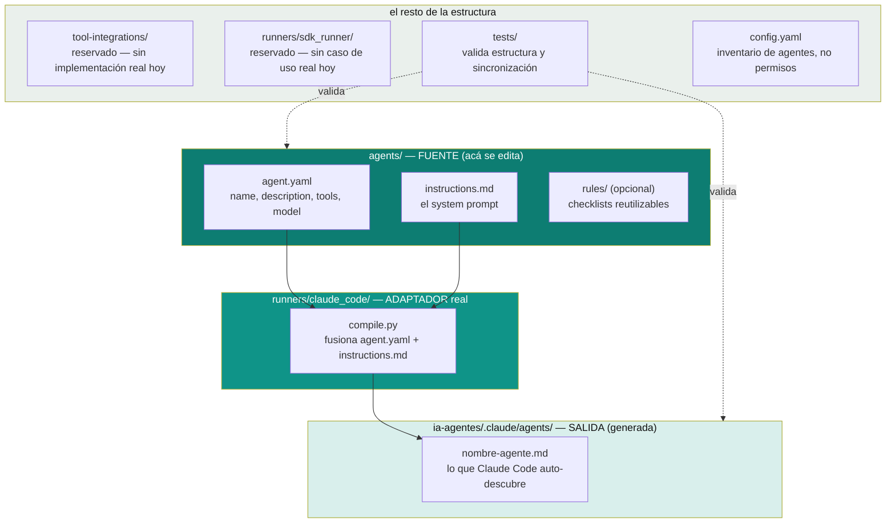

# agent-harness — fuente canónica de los agentes

Esta carpeta es la **fuente de verdad** de cada agente: se edita acá, no en `.claude/agents/*.md`. Ese archivo compilado (el que Claude Code realmente lee) se **genera** a partir de lo que hay en `agents/<nombre>/`. La separación existe por una razón concreta: Claude Code exige un único archivo `.md` por agente (frontmatter + prompt juntos), pero mantener eso como fuente directa dificulta reutilizar piezas (como el checklist de OWASP) desde otro lugar. Separar identidad del agente (acá) de cómo se empaqueta para cada runtime (`runners/`) es la misma idea de puertos y adaptadores que documentamos en [`hexagonal-architecture.md`](../../software-architectures/hexagonal-architecture.md), aplicada a "cómo se define un agente" en vez de a un microservicio.

## Mapa de carpetas — qué es cada una, en la práctica



| Carpeta | Qué es en la práctica hoy | Se edita acá? |
|---|---|---|
| `agents/<nombre>/agent.yaml` | 3-4 líneas `clave: valor` — mismo contenido que el frontmatter que ya usaba `.claude/agents/*.md`, solo que separado del prompt. | ✅ Sí — acá vive `name`, `description`, `tools`, `model`. |
| `agents/<nombre>/instructions.md` | El system prompt completo del agente — texto idéntico al que antes era el cuerpo de `.claude/agents/<nombre>.md`. | ✅ Sí — acá vive todo el criterio/reglas del agente. |
| `agents/owasp-security-reviewer/rules/owasp-top-10.md` | Checklist reutilizable, duplicado a propósito dentro de `instructions.md` (un consumidor es el prompt del agente, otro es cualquier script/linter externo que quiera leer la tabla sin parsear el prompt). | ✅ Sí, si el checklist cambia — actualizar ambos lugares. |
| `runners/claude_code/compile.py` | **Real y funcional.** Lee cada `agent.yaml` + `instructions.md` y escribe `ia-agentes/.claude/agents/<nombre>.md`. Sin dependencias externas. | ✅ Sí, si cambia la lógica de compilación (no el contenido de un agente puntual). |
| `runners/sdk_runner/` | **Reservado, sin implementar.** Documentado como "acá iría" un runner que use el Anthropic SDK directo, para el día que haga falta correr estos agentes fuera de Claude Code (ej. en CI). Hoy no hay ese caso de uso. | Solo si aparece la necesidad real. |
| `tool-integrations/` | **Reservado, sin implementar.** Herramientas compartidas (git, linter, AST) que hoy no hacen falta porque `Bash` + CLIs existentes (`git`, `gh`, `mvn`) ya alcanzan. Cuando haga falta algo más, se implementa como servidor MCP, no como script Python suelto. | Solo si aparece la necesidad real. |
| `tests/test_agents_structure.py` | **Real y funcional.** Valida que cada agente tenga lo mínimo necesario, y que lo compilado en `.claude/agents/` no esté desactualizado respecto a la fuente. Corre con `unittest` de la librería estándar. | ✅ Sí, si se agregan más validaciones. |
| `config.yaml` | Inventario legible de los 6 agentes (no es el mecanismo de permisos real — eso es `.claude/settings.json` del proyecto que use estos agentes). | ✅ Sí, al agregar/quitar un agente del catálogo. |
| `ia-agentes/.claude/agents/*.md` | **Salida generada** — no forma parte de `agent-harness/`, vive en `ia-agentes/.claude/agents/` porque es donde Claude Code necesita encontrarla. Lleva un comentario HTML marcándola como generada. | ❌ No — se regenera con `compile.py`. |

## Flujo de trabajo: agregar o modificar un agente

```bash
# 1. crear la carpeta fuente
mkdir -p agent-harness/agents/nuevo-agente
# 2. escribir agent.yaml (name, description, tools) e instructions.md (el prompt)
# 3. compilar
cd agent-harness/runners/claude_code && python3 compile.py
# 4. validar que quedó todo consistente
cd ../../tests && python3 -m unittest discover -s . -v
```

Después de esto, `ia-agentes/.claude/agents/nuevo-agente.md` ya existe y Claude Code lo descubre automáticamente la próxima vez que se abra `ia-agentes/` como raíz del proyecto.

## Por qué esta estructura y no algo más simple (o más elaborado)

Esto nació de comparar dos extremos:

- **Más simple** (solo `.claude/agents/*.md` a mano, sin `agent-harness/`): funciona perfecto si el único objetivo es usar Claude Code. Es lo que había antes, y seguía siendo válido.
- **Más elaborado** (un harness multi-runtime con `agent.yaml`, `tool-integrations/*.py` reales, un `sdk_runner` funcional, `tests/` con evals de verdad): se justifica si además hay que correr estos agentes fuera de Claude Code (SDK crudo, otro cliente, CI sin Claude Code disponible).

Se eligió el punto intermedio: **la fuente ya está organizada como si fuera multi-runtime** (separación agent.yaml/instructions.md, runners/ con dos carpetas, tests de estructura) para que agregar un segundo runner el día de mañana sea barato — pero **sin fingir** que `tool-integrations/` o `sdk_runner/` ya tienen algo real adentro. Lo que no está implementado, está documentado como pendiente y con la razón de por qué no se construyó todavía (YAGNI aplicado a la propia infraestructura de agentes).

Relacionado: [`ia-agentes/README.md`](../README.md) para el catálogo de los 6 agentes y cómo activarlos, [`clean-code/`](../../clean-code) para los principios (DRY/KISS/YAGNI) que justifican varias de las decisiones de esta carpeta, y [`software-architectures/hexagonal-architecture.md`](../../software-architectures/hexagonal-architecture.md) para la idea de puertos/adaptadores que inspira la separación fuente/runner.
