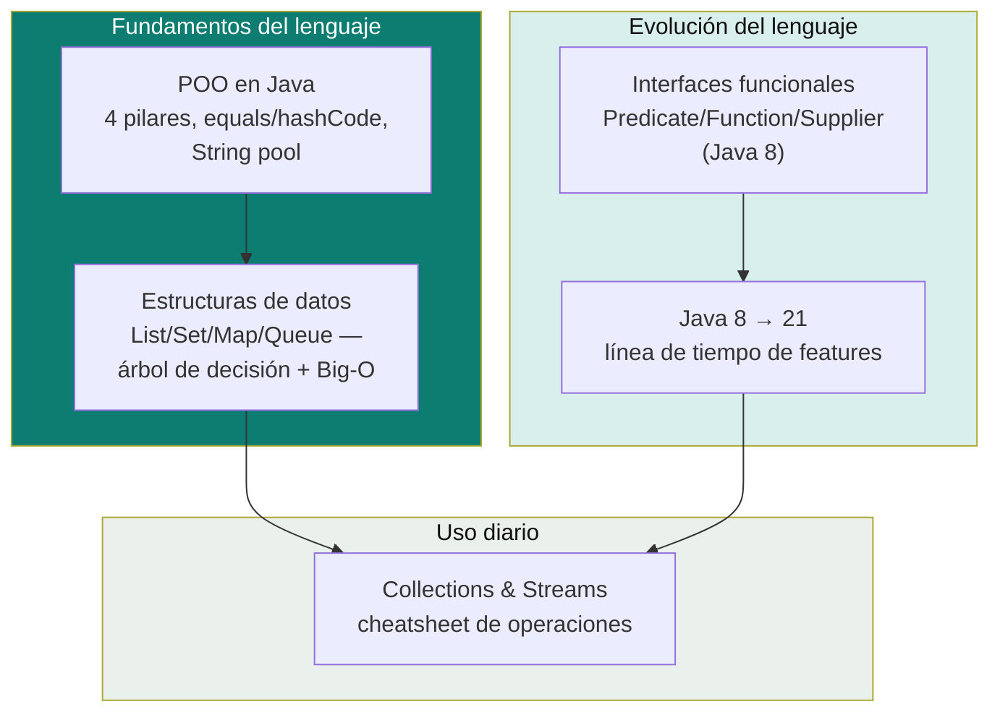

# Java Core

Píldoras de Java como lenguaje — desde los 4 pilares de POO implementados específicamente en Java, hasta cómo decidir qué estructura de datos usar y qué cambió versión a versión (8 → 21). El objetivo es tener una referencia rápida de entrevista: de lo básico (POO, colecciones) a la evolución real del lenguaje, sin tener que rastrear versión por versión de memoria.

> Diferencia con [`oop-design/`](../oop-design): ahí se documentan los conceptos de POO **agnósticos de lenguaje** (cohesión, acoplamiento, abstracción en general). Acá se documenta **cómo Java específicamente** implementa esos conceptos, más todo lo que es exclusivo del lenguaje (Collections Framework, Streams, evolución de versiones).

## Cobertura actual

| Tema | Doc | Idea central en una línea |
|---|---|---|
| **POO en Java** | [`oop-in-java.md`](oop-in-java.md) | Los 4 pilares implementados con palabras clave concretas: `private`/`abstract`/`extends`/Dynamic Binding, overriding vs overloading, clase abstracta vs interfaz, el contrato `equals()`/`hashCode()`, y por qué `String` es inmutable. |
| **Estructuras de datos** | [`data-structures-decision-guide.md`](data-structures-decision-guide.md) | El árbol de decisión (List/Set/Map/Queue) y la matriz de complejidad Big-O por implementación — la pregunta de entrevista "¿por qué esta colección y no otra?" respondida con criterio, no por costumbre. |
| **Interfaces funcionales** | [`functional-interfaces.md`](functional-interfaces.md) | El catálogo `Predicate`/`Function`/`Supplier`/`Consumer`/etc. de Java 8, method references, composición (`andThen`/`compose`), currying. |
| **Java 8 → 21** | [`java-version-evolution.md`](java-version-evolution.md) | Línea de tiempo de las LTS (8, 11, 17, 21): qué cambió y por qué en cada una — lambdas/streams, records/sealed/pattern matching, virtual threads/sequenced collections. |
| **Collections & Streams** | [`collections-and-streams.md`](collections-and-streams.md) | Cheatsheet de operaciones concretas sobre `List`/`Map`/`Stream` ya elegidos — `groupingBy`, `merge`, `computeIfAbsent`, `flatMap`, con drills cronometrados. |

## Cómo estudiar esta carpeta

1. [`oop-in-java.md`](oop-in-java.md) — si hace tiempo que no repasás los fundamentos del lenguaje en sí (no solo el paradigma agnóstico de [`oop-design/`](../oop-design)).
2. [`data-structures-decision-guide.md`](data-structures-decision-guide.md) — el árbol de decisión y las tablas Big-O, para tener el criterio de selección firme antes de ver cómo se operan.
3. [`functional-interfaces.md`](functional-interfaces.md) y [`java-version-evolution.md`](java-version-evolution.md) se leen en cualquier orden — el primero profundiza Java 8 específicamente, el segundo da el panorama completo 8→21.
4. [`collections-and-streams.md`](collections-and-streams.md) al final, como cheatsheet de consulta rápida antes de una entrevista — es el más denso en código copiable.

Relacionado: [`oop-design/`](../oop-design) para POO agnóstico de lenguaje, [`ddd/entities-vs-value-objects.md`](../ddd/entities-vs-value-objects.md) para cuándo modelar con `record` vs `class` en el dominio, [`reactive-programming/`](../reactive-programming) para `Mono`/`Flux` (el "otro" `flatMap`, distinto al de Streams), y el agente [`java-21-dev`](../ia-agentes/agent-harness/agents/java-21-dev/instructions.md) para la profundidad completa de Java 21 en código de revisión real.

## Referencias

- Bloch, J. — *Effective Java* (3rd Edition, 2018) — la referencia canónica de buenas prácticas de Java, citada en detalle en [`oop-in-java.md`](oop-in-java.md).
- Documentación oficial de Oracle — [Java Language and Virtual Machine Specifications](https://docs.oracle.com/javase/specs/).
