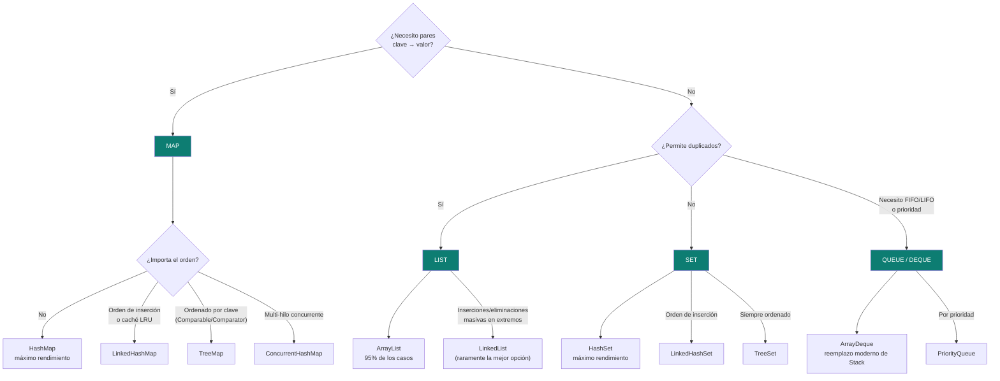

# Estructuras de datos en Java — cuál usar y por qué

La pregunta que dispara este documento: *"¿por qué usaste `ArrayList` acá y no `LinkedList`?"* — la respuesta correcta en una entrevista nunca es "porque es la que siempre uso", sino el patrón de acceso real (¿leo por índice o inserto en el medio seguido?) y su costo en notación Big-O.

## El árbol de decisión



## Arrays — la estructura nativa, antes de cualquier Collection

Un array (`int[]`, `String[]`) es la estructura indexada más básica de Java: contigua en memoria, tamaño **fijo** desde su creación (`new int[10]` siempre tiene 10 slots, nunca crece ni se achica). Acceso por índice en `O(1)`, pero salirse de rango lanza `ArrayIndexOutOfBoundsException` en runtime — el compilador no lo detecta. Todas las implementaciones de `List` con acceso rápido (`ArrayList`) están construidas **sobre** un array interno que se redimensiona por detrás cuando hace falta — de ahí que `ArrayList.add()` sea "O(1) amortizado", no O(1) estricto: la mayoría de las veces es directo, pero cada tanto dispara una copia completa a un array más grande.

## Listas (`List<E>`) — Big-O y cuándo cada una

| Implementación | `get(i)` | `add(e)` al final | `add(i, e)` en medio | `contains(e)` | Cuándo usarla |
|---|---|---|---|---|---|
| **`ArrayList`** | O(1) | O(1) amortizado | O(n) | O(n) | El default — 95% de los casos. Acceso por índice, cache-friendly (memoria contigua). |
| **`LinkedList`** | O(n) | O(1) | O(1) *(con iterador ya posicionado)* | O(n) | Rara vez la mejor opción real — solo si hay inserciones/eliminaciones masivas en los extremos y nunca se accede por índice. |
| **`CopyOnWriteArrayList`** | O(1) *(lock-free)* | O(n) *(clona el array completo)* | O(n) | O(n) | Lecturas concurrentes masivas, escrituras raras — ej. listeners de eventos registrados una vez y leídos millones de veces. |

**Por qué `LinkedList` casi nunca gana en la práctica**: cada nodo es un objeto separado en el Heap (con sus propios punteros `next`/`prev`), lo que implica más memoria por elemento y peor localidad de caché de CPU que un array contiguo — incluso en el caso "favorable" (inserción en el medio), en la práctica hay que **recorrer** la lista para llegar a esa posición (O(n)) antes de insertar (O(1)), salvo que ya se tenga un `ListIterator` posicionado ahí.

## Conjuntos (`Set<E>`) — unicidad garantizada por `equals()`/`hashCode()`

| Implementación | `add`/`contains`/`remove` | Orden de iteración | Estructura interna | Cuándo usarla |
|---|---|---|---|---|
| **`HashSet`** | O(1) | Ninguno — indeterminado, puede cambiar entre ejecuciones. | Un `HashMap<E, Object>` por debajo (el valor es un objeto centinela fijo). | Deduplicar y consultar pertenencia lo más rápido posible, sin importar el orden. |
| **`LinkedHashSet`** | O(1) | Orden de inserción, preservado. | `HashMap` + lista doblemente enlazada interna. | Cuando hace falta unicidad **y** recordar el orden en que llegaron los elementos. |
| **`TreeSet`** | O(log n) | Orden natural (`Comparable`) o `Comparator` — siempre ordenado. | Árbol Rojo-Negro (mismo motor que `TreeMap`). | Necesitás la colección siempre ordenada, o consultas de rango (`subSet`, `headSet`, `floor`, `ceiling`). |

## Mapas (`Map<K, V>`)

| Implementación | `get`/`put`/`remove` | Orden de claves | Thread-safe | Cuándo usarla |
|---|---|---|---|---|
| **`HashMap`** | O(1) | Ninguno | No | El default — máximo rendimiento clave-valor. |
| **`LinkedHashMap`** | O(1) | Inserción, o acceso (modo LRU) | No | Mantener orden de inserción, o implementar un caché LRU pasando `accessOrder=true` al constructor. |
| **`TreeMap`** | O(log n) | Ordenado por clave | No | Necesitás las claves siempre ordenadas, o navegación por rangos. |
| **`ConcurrentHashMap`** | O(1) | Ninguno | **Sí** | Alta concurrencia multi-hilo — nunca usar un `HashMap` compartido entre hilos sin sincronizar externamente. |

## Colas y Deques (`Queue<E>` / `Deque<E>`)

| Implementación | Disciplina | Cuándo usarla |
|---|---|---|
| **`ArrayDeque`** | FIFO (cola) o LIFO (pila) | El reemplazo moderno de `Stack` y de `LinkedList` como pila/cola — array circular, sin el overhead de nodos enlazados. |
| **`PriorityQueue`** | Por prioridad (min-heap por defecto) | Procesar tareas/tickets donde el de mayor prioridad siempre sale primero. |
| **`ArrayBlockingQueue`** | FIFO concurrente, con capacidad fija | Patrón productor-consumidor con un buffer acotado entre hilos. |

## Cómo funciona un `HashMap` por dentro (lo que un entrevistador senior pregunta después de la tabla)

1. **Hashing**: la JVM combina los bits altos y bajos del `hashCode()` (`h = key.hashCode() ^ (h >>> 16)`) para distribuir mejor las claves entre buckets.
2. **Asignación de bucket**: `index = (table.length - 1) & h` — una operación bitwise, posible porque la tabla siempre tiene un tamaño potencia de 2.
3. **Colisiones**: si dos claves distintas caen en el mismo bucket, se almacenan en una lista enlazada. Si un bucket supera **8 elementos** (con la tabla en al menos 64 buckets), esa lista se convierte en un **árbol Rojo-Negro** — reduciendo el peor caso de O(n) a O(log n) y mitigando ataques de denegación de servicio por colisión de hash deliberada (*HashDoS*).

## La trampa de mutabilidad — el bug silencioso más peligroso

```java
class ClienteMutable {
    private String documentoId; // mutable — sin final, con setter

    @Override public int hashCode() { return documentoId.hashCode(); }
    @Override public boolean equals(Object o) { /* compara por documentoId */ }
}

Map<ClienteMutable, Cuenta> cuentas = new HashMap<>();
ClienteMutable c = new ClienteMutable("123");
cuentas.put(c, cuenta);

c.setDocumentoId("456"); // muta el campo que participa del hashCode
cuentas.get(c); // null — busca en el bucket de "456", pero el objeto quedó guardado en el bucket de "123"
```

Si un objeto usado como clave de `HashMap`/`HashSet` muta un campo que participa en `equals()`/`hashCode()` **después** de insertarse, queda "perdido" dentro de la colección — no lanza excepción, simplemente no se vuelve a encontrar (ver [`oop-in-java.md`](oop-in-java.md) para el contrato completo `equals()`/`hashCode()`). **Regla senior**: usar siempre tipos inmutables (o `record`, ver [`java-version-evolution.md`](java-version-evolution.md)) como claves de mapas/conjuntos.

## Clases obsoletas — y qué usar en su lugar

| Obsoleta | Por qué | Alternativa |
|---|---|---|
| `Vector` | Sincroniza cada método individualmente — overhead innecesario en single-thread. | `ArrayList` (o `CopyOnWriteArrayList` si hace falta concurrencia). |
| `Hashtable` | Sincronización global pesada, no permite `null`. | `HashMap` (o `ConcurrentHashMap` si hace falta concurrencia). |
| `Stack` | Hereda de `Vector` — mismo problema de bloqueo innecesario. | `ArrayDeque`. |
| `Enumeration<E>` | API previa a Java 2, sin soporte de streams. | `Iterator<E>` / `Stream`. |

## Drills de repaso

| Tiempo | Pregunta |
|---|---|
| 4 min | "Te piden guardar IDs únicos que después necesitás recorrer siempre ordenados de menor a mayor. ¿Qué estructura elegís y por qué?" |
| 5 min | "¿Por qué `LinkedList` casi nunca es la mejor opción para una pila/cola en Java moderno, a pesar de tener inserción O(1) en los extremos?" |
| 5 min | "Explicá qué pasa si mutás un campo que participa del `hashCode()` de un objeto ya insertado como clave en un `HashMap`." |
| 4 min | "¿Cuándo conviene `ConcurrentHashMap` sobre un `HashMap` con `synchronized` manual alrededor?" |

## Referencias

- Documentación oficial de Oracle — [Java Collections Framework Overview](https://docs.oracle.com/javase/8/docs/technotes/guides/collections/overview.html).
- Goetz, B. — *Java Concurrency in Practice* (2006) — capítulo 5, colecciones concurrentes (`ConcurrentHashMap`, `CopyOnWriteArrayList`).

Relacionado: [`oop-in-java.md`](oop-in-java.md) para el contrato `equals()`/`hashCode()` que sostiene todo lo de este documento, [`collections-and-streams.md`](collections-and-streams.md) para las operaciones del día a día sobre estas estructuras (`filter`, `groupingBy`, etc.), y [`java-version-evolution.md`](java-version-evolution.md) para Sequenced Collections (Java 21), que agregó `getFirst()`/`getLast()`/`reversed()` nativos sobre varias de estas estructuras.
