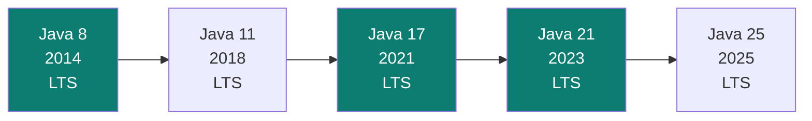

# Java 8 → 21 — línea de tiempo de las features que cambiaron cómo se escribe Java

Java cambió más entre la 8 y la 21 que en toda su historia previa — este documento es el mapa histórico de **qué cambió en cada versión y por qué**, para no confundir "esto es Java moderno" con "esto es de hace 10 años pero seguimos usándolo por costumbre". El detalle profundo de cada bloque vive en su propio documento (linkeado en cada sección) — acá va la ubicación en el tiempo y la idea central.

## Línea de tiempo — versiones LTS (Long-Term Support)



Oracle marca una release LTS cada ~2-3 años (8, 11, 17, 21, 25...) — son las versiones que de verdad importan para producción empresarial, porque reciben soporte extendido; las versiones intermedias (9, 10, 12-16, 18-20) son releases de 6 meses que casi nadie corre en producción, pero introdujeron features **en preview** que después se confirmaron en la siguiente LTS (por eso a veces se dice "Java 16" al hablar de records, aunque la mayoría los conoció recién en Java 17).

## Java 8 (2014) — la revolución funcional

El salto más grande de la historia del lenguaje: Java pasó de ser puramente imperativo a incorporar un paradigma funcional real.

| Feature | Qué cambió |
|---|---|
| **Lambdas** | Funciones como valores de primera clase — ver [`functional-interfaces.md`](functional-interfaces.md). |
| **`java.util.function`** | El catálogo `Predicate`/`Function`/`Supplier`/`Consumer`/etc. — detalle completo en [`functional-interfaces.md`](functional-interfaces.md). |
| **Stream API** | Procesamiento declarativo de colecciones (`filter`/`map`/`collect`) en vez de loops imperativos — ver [`collections-and-streams.md`](collections-and-streams.md). |
| **`Optional<T>`** | Representar explícitamente "puede no haber valor" sin recurrir a `null` — reduce `NullPointerException` en las firmas de método. |
| **Métodos `default`/`static` en interfaces** | Permitió agregar comportamiento a interfaces existentes sin romper a todos sus implementadores — ver [`oop-in-java.md`](oop-in-java.md). |
| **Nuevo `java.time`** | Reemplazó `Date`/`Calendar` (mutables, no thread-safe) por tipos inmutables (`LocalDate`, `LocalDateTime`, `Instant`). |

## Java 9-16 — el período de transición (features en preview)

No son LTS, pero sentaron las bases de lo que confirmó Java 17:

- **Java 9**: Módulos (JPMS — `module-info.java`), métodos `private` en interfaces, `var` para inferencia de tipo local llega en Java 10.
- **Java 10**: `var` (inferencia de tipo local) — **no** vuelve a Java dinámico, el tipo sigue siendo estático, solo se infiere en compilación.
- **Java 14** (preview): Records y Pattern Matching para `instanceof` aparecen por primera vez, sin confirmarse todavía.
- **Java 16**: Records se confirman como feature estable (no preview) — la mayoría de los equipos los adoptó recién con Java 17 por ser la siguiente LTS.

```java
// var (Java 10) — el tipo se infiere, sigue siendo estático y estricto
var repositorio = new AppointmentRepository(); // el compilador sabe que es AppointmentRepository, no Object
var resultado = lista.stream().filter(x -> x.activo()); // infiere Stream<X>
```

## Java 17 (2021, LTS) — tipos algebraicos y pattern matching

| Feature | Qué resuelve |
|---|---|
| **Records** (`record`) | Value Objects inmutables en una línea (`record Punto(int x, int y) {}`) — genera constructor, getters, `equals`/`hashCode`/`toString` automáticamente. Detalle de cuándo usar `record` vs `class` en [`ddd/entities-vs-value-objects.md`](../ddd/entities-vs-value-objects.md). |
| **Sealed classes/interfaces** (`sealed` + `permits`) | Jerarquías de herencia **cerradas** — declarás explícitamente qué clases pueden extender/implementar. Habilita que el compilador verifique exhaustividad en un `switch` (ver siguiente fila). |
| **Pattern Matching para `switch`** (preview en 17, confirmado en 21) | Un `switch` puede evaluar el tipo de un objeto y hacer *binding* automático, sin la verbosidad de `instanceof` + cast manual. |

```java
public sealed interface PaymentMethod permits CreditCard, PayPal, Crypto {}
public final class CreditCard implements PaymentMethod {}
public final class PayPal implements PaymentMethod {}
public final class Crypto implements PaymentMethod {}

String procesar(PaymentMethod method) {
    return switch (method) {
        case CreditCard cc -> "Procesando tarjeta: " + cc.numero();
        case PayPal pp     -> "Redirigiendo a PayPal: " + pp.email();
        case Crypto c      -> "Verificando wallet: " + c.direccion();
        // el compilador EXIGE cubrir los 3 casos — sealed + switch = exhaustividad verificada en compilación
    };
}
```

## Java 21 (2023, LTS) — concurrencia y pattern matching avanzado

La LTS más significativa desde Java 8 para el día a día de un backend — cubierta en profundidad, con ejemplos de reconciliación arquitectónica, en la skill [`stacks-java`](../ia-agentes/.claude/skills/stacks-java/SKILL.md). Resumen de las piezas clave:

| Feature (JEP) | Qué resuelve |
|---|---|
| **Virtual Threads** (JEP 444) | Hilos gestionados por la JVM (no 1:1 con el hilo del SO) — permiten escribir código bloqueante-imperativo que escala igual que código reactivo en I/O. Ver la skill `stacks-java` para la reconciliación completa con Project Reactor/WebFlux (no se combinan, son alternativas — ver también [`../frameworks/spring-boot/webflux.md`](../frameworks/spring-boot/webflux.md)). |
| **Structured Concurrency** (JEP 453, preview) | `StructuredTaskScope` — agrupa varias tareas concurrentes bajo un mismo ámbito, que se cancelan/propagan errores juntas, en vez de hilos sueltos sin relación de ciclo de vida. |
| **Record Patterns** (JEP 440) | Destructuring de un `record` directo en el `switch`/`instanceof`: `if (obj instanceof Punto(int x, int y))` — accedés a los campos sin llamar a los getters uno por uno. |
| **Pattern Matching para `switch`** (JEP 441, confirmado) | Ya no preview — incluye `case null`, guardas `when`, y exhaustividad verificada con `sealed`. |
| **Sequenced Collections** (JEP 431) | `getFirst()`/`getLast()`/`reversed()` nativos en `List`/`Deque`/`LinkedHashSet` — resuelve la inconsistencia histórica de que antes cada colección tenía su propia forma (o ninguna) de acceder a los extremos. |
| **Virtual Threads — Thread Pinning** | Un hilo virtual que ejecuta código dentro de un bloque `synchronized` (o una llamada JNI) **no puede desmontarse** del hilo de plataforma que lo sostiene mientras espera I/O — anula la ventaja de escalabilidad. Se previene reemplazando `synchronized` por `java.util.concurrent.locks.ReentrantLock`. |

```java
// Record Pattern (Java 21) — destructuring directo
record Punto(int x, int y) {}

if (obj instanceof Punto(int x, int y)) {
    System.out.println(x + y); // acceso directo, sin punto.x()/punto.y()
}

// Sequenced Collections (Java 21)
List<String> lista = new ArrayList<>(List.of("B", "C"));
lista.addFirst("A");
lista.addLast("D");
List<String> invertida = lista.reversed(); // vista, O(1) — no crea una copia
```

## Cómo decidir qué features aplican en código nuevo (2025+)

1. **`record` siempre que el objeto sea un Value Object** — no hay razón para escribir un DTO con getters/`equals`/`hashCode` a mano en código nuevo.
2. **Pattern Matching sobre `instanceof`/`switch` encadenados** — si el código ya hace varios `if (x instanceof Y)` seguidos, es candidato directo a Record Pattern.
3. **Virtual Threads vs. Reactor** es una decisión de arquitectura, no una feature que se activa "porque ya se puede" — ver la reconciliación completa en [`../frameworks/spring-boot/webflux.md`](../frameworks/spring-boot/webflux.md).
4. **`var`** solo cuando el tipo es obvio por el lado derecho de la asignación — si `var` oscurece qué tipo es la variable, mejor declarar el tipo explícito.

## Drills de repaso

| Tiempo | Pregunta |
|---|---|
| 4 min | "¿Qué diferencia hay entre una versión LTS y una que no lo es? ¿Por qué Java 17 es la referencia y no Java 14 o 16, si records ya existía ahí?" |
| 5 min | "Refactorizá un `if (obj instanceof Punto) { Punto p = (Punto) obj; ... }` usando Record Pattern de Java 21." |
| 4 min | "¿Qué es el Thread Pinning en Virtual Threads y cómo se previene?" |
| 5 min | "¿Por qué `sealed` + `switch` exhaustivo es más seguro en refactors que un `switch` con un `default` genérico?" |

## Referencias

- [OpenJDK — JEP Index](https://openjdk.org/jeps/0) — fuente primaria de cada JEP citado (444, 453, 440, 441, 431).
- Oracle — [Java Language Updates](https://docs.oracle.com/en/java/javase/21/language/java-language-changes.html) — changelog oficial por versión.

Relacionado: [`functional-interfaces.md`](functional-interfaces.md) para el detalle de Java 8, [`ddd/entities-vs-value-objects.md`](../ddd/entities-vs-value-objects.md) para cuándo usar `record` en modelado de dominio, [`data-structures-decision-guide.md`](data-structures-decision-guide.md) para Sequenced Collections en la práctica, y la skill [`stacks-java`](../ia-agentes/.claude/skills/stacks-java/SKILL.md) para la reconciliación completa Virtual Threads vs. Reactor con reglas de revisión de código.
