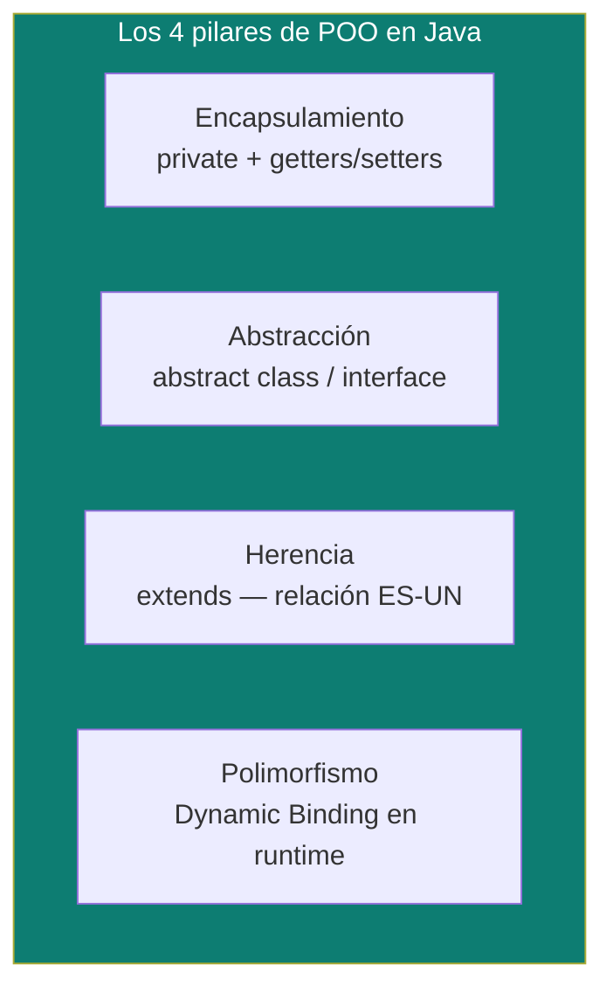

# Los 4 pilares de POO, implementados en Java

Este documento asume [`oop-design/`](../oop-design) como base conceptual agnóstica de lenguaje — acá va específicamente **cómo Java implementa** cada pilar: qué palabra clave, qué regla del compilador, qué trampa concreta.

## Los 4 pilares, en una tabla



| Pilar | Qué resuelve | Mecanismo en Java |
|---|---|---|
| **Encapsulamiento** | Ocultar el estado interno para proteger su integridad. | Atributos `private` + métodos `public` de acceso controlado (getters/setters, con validación de negocio si hace falta). |
| **Abstracción** | Modelar solo lo esencial del negocio, sin exponer el "cómo". | `abstract class` (plantilla con estado + comportamiento parcial) o `interface` (contrato de comportamiento puro). |
| **Herencia** | Reutilizar código bajo una relación **"ES-UN"** real (`CreditCardPayment` ES-UN `Payment`). | `extends` (una sola superclase — Java no permite herencia múltiple de clases) + `implements` (múltiples interfaces sí). |
| **Polimorfismo** | Una misma referencia de tipo padre invoca el comportamiento real de la instancia concreta. | *Dynamic Binding* — el método que se ejecuta se resuelve en tiempo de ejecución según el tipo real del objeto, no el tipo de la variable. |

## Por qué Java no permite herencia múltiple de clases (y sí de interfaces)

```java
// No compila — Java prohíbe extends de más de una clase
class Anfibio extends Pez, Mamifero { } // ❌

// Sí compila — una clase puede implementar cualquier cantidad de interfaces
class Pato implements Nadador, Volador { } // ✅
```

- **La razón**: evitar el *Problema del Diamante* — la ambigüedad de qué implementación heredar cuando dos superclases tienen un método con la misma firma pero cuerpos distintos.
- **El matiz real desde Java 8**: las interfaces pueden tener métodos `default` con cuerpo — así que el diamante *puede* reaparecer entre interfaces. Si dos interfaces implementadas por una misma clase declaran un `default` con la misma firma, el compilador **exige** resolver la ambigüedad explícitamente:

```java
interface A { default String saludo() { return "Hola desde A"; } }
interface B { default String saludo() { return "Hola desde B"; } }

class C implements A, B {
    @Override
    public String saludo() {
        return A.super.saludo(); // hay que elegir explícitamente cuál invocar (o escribir un cuerpo nuevo)
    }
}
```

## Sobrescritura (`@Override`) vs. Sobrecarga (overload) — la pregunta que siempre sale

| | Overriding (sobrescritura) | Overloading (sobrecarga) |
|---|---|---|
| Contexto | Herencia o implementación de interfaz — la subclase redefine un método del padre. | Misma clase (o su jerarquía) — varios métodos comparten nombre. |
| Firma | Mismo nombre, **mismos parámetros**, mismo tipo de retorno (o un subtipo — *covariant return type*). | Mismo nombre, **parámetros distintos** (cantidad, tipo u orden) — el tipo de retorno solo no alcanza para diferenciar. |
| Regla de acceso | El modificador no puede volverse **más restrictivo** en la subclase (`protected` del padre → hijo puede ser `protected` o `public`, nunca `private`). | No aplica — son métodos independientes. |
| Cuándo se resuelve | En **runtime** (polimorfismo dinámico) — depende del tipo real del objeto. | En **compile-time** (polimorfismo estático) — depende de los tipos de los argumentos en la llamada. |
| Anotación | `@Override` — le pide al compilador validar que la firma coincide exactamente con el padre; si no coincide, falla en compilación en vez de crear silenciosamente un método nuevo no relacionado. | No existe una anotación equivalente — el compilador ya distingue por la firma. |

## Clase abstracta vs. interfaz — cuándo cada una

| | `abstract class` | `interface` |
|---|---|---|
| Responde a | "¿Qué **es** esta cosa?" (identidad, plantilla de base). | "¿Qué **puede hacer** esta cosa?" (contrato de capacidad). |
| Estado (campos) | Puede tener variables de instancia con cualquier modificador de acceso. | Solo constantes — toda variable es implícitamente `public static final`. |
| Métodos con cuerpo | Sí, libremente (métodos concretos + abstractos mezclados). | Desde Java 8: `default` (heredable, sobreescribible) y `static`. Desde Java 9: `private` (para refactorizar lógica interna compartida entre los `default` de la misma interfaz). |
| Constructor | Sí (aunque no se pueda instanciar directo, la subclase lo invoca vía `super()`). | No tiene constructor. |
| Herencia | Una sola (`extends`). | Múltiples (`implements`). |
| Ejemplo de uso correcto | `abstract class Payment` con un `amount` común y un método `abstract void process()` — hay estado compartido real. | `interface Comparable<T>`, `interface Runnable` — un contrato puro, sin estado, que muchas clases no relacionadas entre sí pueden cumplir. |

## Modificadores — la tabla que hay que saber sin dudar

### De acceso

| Modificador | Visibilidad |
|---|---|
| `public` | Desde cualquier clase, de cualquier paquete. |
| `protected` | Mismo paquete + subclases en otros paquetes (vía herencia). |
| *(sin modificador — package-private)* | Solo clases del mismo paquete. |
| `private` | Solo dentro de la propia clase. |

### De comportamiento (no de acceso)

| Modificador | En variable | En método | En clase |
|---|---|---|---|
| `static` | Una sola copia compartida por toda la clase (no por instancia) — vive en el Metaspace, no en el Heap de cada objeto. | Pertenece a la clase, no a una instancia — no puede usar `this` ni acceder a miembros no estáticos. | (No aplica a nivel de clase top-level; sí a *nested classes*.) |
| `final` | Constante — obligatorio inicializarla, nunca reasignable. | Bloquea el *overriding* — ninguna subclase puede redefinirlo. | Bloquea la herencia — nadie puede extenderla (`String`, por ejemplo, es `final`). |

## El contrato `equals()`/`hashCode()` — y por qué romperlo rompe un `HashMap`

**Regla obligatoria**: si `a.equals(b)` es `true`, entonces `a.hashCode() == b.hashCode()` **debe** ser cierto también. El inverso no aplica — dos objetos con el mismo `hashCode` pueden no ser iguales (*colisión de hash*, esperada y manejada por el propio `HashMap`).

```java
public class Cliente {
    private final String documentoId; // el campo real que define identidad de negocio

    @Override
    public boolean equals(Object o) {
        if (this == o) return true;
        if (!(o instanceof Cliente other)) return false;
        return documentoId.equals(other.documentoId);
    }

    @Override
    public int hashCode() {
        return Objects.hash(documentoId); // debe usar EXACTAMENTE los mismos campos que equals()
    }
}
```

Si se sobreescribe `equals()` pero se olvida `hashCode()` (o usa campos distintos), un `HashMap`/`HashSet` calcula el hash con la implementación por defecto de `Object` (basada en la dirección de memoria) — al buscar la clave luego, el mapa mira en un bucket distinto al que se guardó originalmente, y devuelve "no encontrado" **aunque el dato esté físicamente ahí**. Es un bug silencioso, no una excepción — por eso es tan peligroso en código de producción.

> **Regla senior**: si un objeto se usa como clave de `HashMap`/`HashSet`, debe ser **inmutable** en los campos que participan de `equals()`/`hashCode()` — mutar esos campos después de insertar el objeto en la colección lo vuelve irrecuperable (ver [`data-structures-decision-guide.md`](data-structures-decision-guide.md), sección de trampas). Un `record` (ver [`java-version-evolution.md`](java-version-evolution.md)) genera ambos métodos automáticamente y de forma consistente entre sí — es la forma más segura de evitar este bug por completo.

## `String` — inmutabilidad, String Pool, y por qué importa en seguridad

- **String Pool**: cuando se crean dos literales con el mismo contenido (`String a = "x"; String b = "x";`), la JVM no duplica el objeto — ambas variables apuntan a la misma instancia dentro de una región especial del Heap. `new String("x")` sí crea una instancia nueva fuera del pool.
- **Por qué `String` es `final` e inmutable**: cualquier cambio de contenido crea una instancia nueva, nunca muta la existente. Esto tiene 3 consecuencias prácticas:
  1. **Seguridad**: si `String` fuera mutable, un valor ya validado (una URL, una ruta de archivo) podría alterarse entre el momento en que se valida y el momento en que se usa (*Time-of-Check to Time-of-Use*).
  2. **Thread-safety gratis**: un objeto inmutable se comparte entre hilos sin necesidad de `synchronized`.
  3. **Rendimiento en `HashMap`/`HashSet`**: el `hashCode()` de un `String` se calcula una sola vez (al no poder cambiar el contenido) y queda cacheado — no se recalcula en cada búsqueda.

## Checked vs. Unchecked Exceptions — la otra pregunta clásica

| | Checked | Unchecked |
|---|---|---|
| Jerarquía | Extiende `Exception` (no `RuntimeException`). | Extiende `RuntimeException`. |
| Qué representa | Una condición externa previsible que el código debe anticipar (`IOException`, `SQLException`). | Un error de programación o de uso indebido de una API (`NullPointerException`, `IllegalArgumentException`). |
| Exigencia del compilador | Obligatorio manejarla (`try/catch`) o declararla (`throws`) — si no, no compila. | El compilador no exige nada — la estrategia correcta es prevenirla con buen diseño, no capturarla sistemáticamente. |

## Drills de repaso

| Tiempo | Pregunta |
|---|---|
| 4 min | "¿Por qué Java prohíbe la herencia múltiple de clases pero permite implementar varias interfaces? ¿Qué pasa si dos interfaces implementadas comparten un método `default` con la misma firma?" |
| 4 min | "Dado un método sobrescrito, ¿qué reglas de firma y de modificador de acceso debe respetar frente al método del padre?" |
| 5 min | "Sobrescribiste `equals()` en una clase pero olvidaste `hashCode()`. ¿Qué falla exactamente al usar esa clase como clave de un `HashMap`, y por qué no lanza una excepción?" |
| 4 min | "¿Por qué `String` es inmutable, y qué relación tiene eso con que sea seguro compartir un `String` entre hilos sin sincronización?" |

## Referencias

- Bloch, J. — *Effective Java* (3rd Edition) — Item 10-14 (contrato de `equals`/`hashCode`/`toString`, `Comparable`), Item 17 (minimizar mutabilidad).
- Documentación oficial de Oracle — [The Java Tutorials: Interfaces and Inheritance](https://docs.oracle.com/javase/tutorial/java/IandI/index.html).

Relacionado: [`oop-design/`](../oop-design) para los conceptos agnósticos de lenguaje que este documento implementa en Java específicamente, [`java-version-evolution.md`](java-version-evolution.md) para cómo `record`/`sealed` cambiaron algunas de estas reglas desde Java 14+, y [`data-structures-decision-guide.md`](data-structures-decision-guide.md) para la trampa de mutabilidad en claves de `HashMap` en la práctica.
