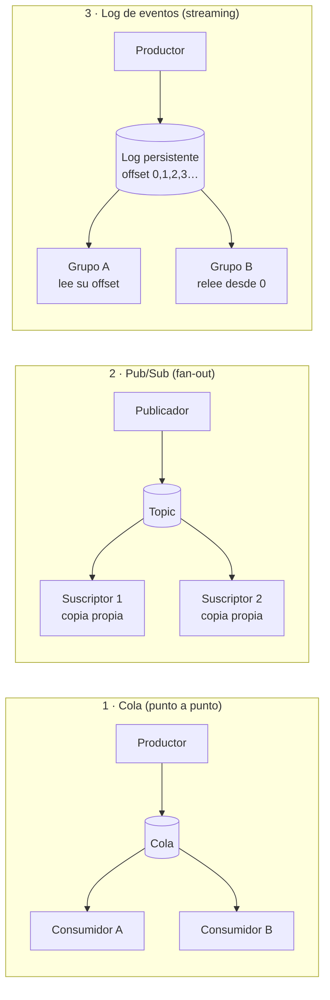
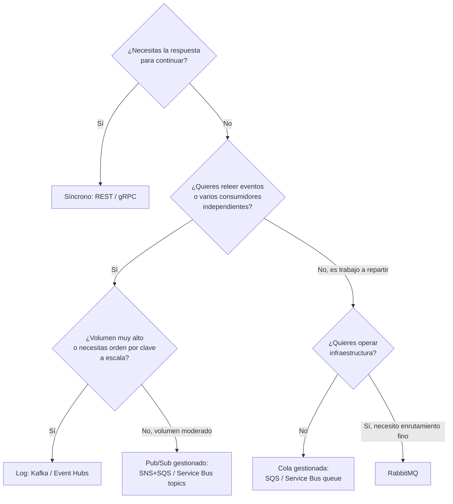

# Mensajería y Event Streaming

Cómo se comunican los sistemas de forma **asíncrona**: colas, pub/sub y streaming de eventos. Qué tecnología hay, y sobre todo **cuándo elegir una y cuándo otra**.

> Kafka tiene su propio documento a fondo: [`kafka.md`](kafka.md) (arquitectura, cluster, KRaft, topics, particiones, payload, headers, y uso en banca). Los disparadores por tiempo (Quartz: jobs programados que leen una tabla y publican a un tópico) están en [`quartz-scheduler.md`](quartz-scheduler.md). Los patrones que se apoyan en esto (Saga, Outbox, Circuit Breaker) están en [`microservices-patterns/`](../microservices-patterns).

## 🍎 Con manzanas (empieza aquí)

Tu frutería recibe pedidos de manzanas. Hay tres maneras de avisar a las demás áreas:

| Modelo | En la frutería | Tecnología típica |
|---|---|---|
| **Cola** | La fila con tickets: cada ticket lo atiende **un** cajero y se rompe | SQS, RabbitMQ, Service Bus (queue) |
| **Pub/Sub** | El dueño grita "¡llegaron manzanas!": cada área lo oye y toma nota **por su cuenta** | SNS, Service Bus (topic), Pub/Sub |
| **Log de eventos** | El libro de ventas con líneas numeradas: **nadie arranca hojas**, cada área lleva su marcador y puede releer | Kafka, Event Hubs |

**Síncrono vs asíncrono:** síncrono es llamar por teléfono y esperar a que contesten; asíncrono es dejar una nota y seguir trabajando.

Glosario completo con más manzanas: [`glosario.md`](glosario.md).

### Qué debes dominar según tu nivel

| Nivel | Debes poder explicar |
|---|---|
| 🟢 **Junior** | Qué es un mensaje, un productor y un consumidor; diferencia entre cola y pub/sub; por qué asíncrono desacopla; qué es un DLQ |
| 🟡 **Mid** | Cuándo elegir cola, pub/sub o log; at-least-once e idempotencia; orden por clave; reintentos con backoff; Outbox |
| 🔴 **Senior** | Elegir tecnología justificando volumen, orden, releer y operación; trade-offs de consistencia eventual; diseñar un flujo completo con fallas; costo y *lock-in* |

## 1. Síncrono vs asíncrono

| | Síncrono (REST, gRPC) | Asíncrono (mensajería) |
|---|---|---|
| Modelo | Petición → espero respuesta | Publico un mensaje y sigo; otro lo procesa cuando pueda |
| Acoplamiento temporal | Alto: los dos deben estar disponibles a la vez | Bajo: el consumidor puede estar caído y procesar luego |
| Latencia percibida | Inmediata (si todo va bien) | La respuesta no es inmediata |
| Picos de carga | Se propagan al servicio llamado | El broker los absorbe como un amortiguador |
| Complejidad | Menor | Mayor: consistencia eventual, duplicados, orden, trazabilidad |
| Cuándo | Necesitas la respuesta ya para continuar (consultar saldo, validar un dato) | No la necesitas ya, o varios sistemas reaccionan al mismo hecho |

Regla práctica: **consulta → síncrono; hecho que ocurrió o trabajo que puede esperar → asíncrono.** Muchos sistemas reales mezclan ambos.

## 2. Tres modelos de mensajería (la distinción clave)

| Modelo | Cómo funciona | El mensaje… | Ejemplos |
|---|---|---|---|
| **Cola (point-to-point)** | Cada mensaje lo procesa **un solo** consumidor (*competing consumers* reparten el trabajo) | Se borra al confirmarse | SQS, RabbitMQ (cola), Service Bus (queue), IBM MQ |
| **Pub/Sub** | Cada suscriptor recibe **su copia** del mensaje | Se entrega a cada suscripción y se borra | SNS, Service Bus (topic), RabbitMQ (exchange fanout), Google Pub/Sub |
| **Log de eventos (streaming)** | Los eventos se **anexan a un log persistente**; cada consumidor lleva su propio offset | **Se conserva** por tiempo o tamaño; se puede releer | Kafka, Azure Event Hubs, Redpanda, Pulsar, Kinesis |

**La diferencia que hay que poder explicar:** en una cola el mensaje es una **tarea que se consume y desaparece**; en un log el evento es un **hecho que se queda** y distintos consumidores lo leen cuando quieren, incluso años después, para reconstruir estado o reprocesar.

## 3. Mensaje: comando, evento o documento

| Tipo | Significado | Ejemplo | Destinatario |
|---|---|---|---|
| **Comando** | "Haz esto" (intención, tiene un destinatario) | `CobrarPedido` | Uno concreto |
| **Evento** | "Esto ocurrió" (hecho pasado, inmutable) | `PedidoPagado` | Quien le interese; el emisor no los conoce |
| **Documento / mensaje de datos** | Transporta datos | Extracto, lote de transacciones | Quien procese |

Nombrar eventos en pasado (`PagoAprobado`) y comandos en imperativo (`AprobarPago`) deja clara la intención.

**Event notification vs Event-carried state transfer:** el evento puede llevar solo un aviso con un id (el consumidor consulta los datos después) o llevar el estado completo (el consumidor no necesita llamar de vuelta, pero el mensaje es más grande y se acopla a su formato).

## 4. Tecnologías: comparación

| Tecnología | Tipo | Fortaleza | Cuidado | Típico en |
|---|---|---|---|---|
| **Apache Kafka** | Log distribuido | Throughput altísimo, retención, releer eventos, orden por partición, ecosistema (Connect, Streams) | Operación compleja, no es una cola de tareas con ack por mensaje, curva de aprendizaje | Banca, eventos de negocio, CDC, analítica en tiempo real |
| **RabbitMQ** | Broker de colas (AMQP) | Enrutamiento flexible (exchanges), ack por mensaje, prioridades, baja latencia, TTL, dead-letter | Menos throughput que Kafka, el mensaje se borra al consumirse | Colas de trabajo, tareas en segundo plano, integraciones |
| **IBM MQ / ActiveMQ / Artemis (JMS)** | Colas empresariales | Transaccionalidad fuerte, entrega garantizada, estándar JMS | Pesados, licenciamiento (IBM MQ) | **Banca y sistemas core heredados** |
| **Amazon SQS** | Cola gestionada | Cero operación, escala automática, DLQ integrada | Orden solo en FIFO (con límite de rendimiento), no se relee | Colas simples en AWS |
| **Amazon SNS** | Pub/Sub gestionado | Fan-out a SQS, Lambda, HTTP | Sin retención para releer | Notificaciones, fan-out (SNS + SQS) |
| **Azure Service Bus** | Cola/Topic empresarial gestionado | Sesiones (orden por clave), dead-letter, mensajes programados, transacciones, duplicados detectados | Menor throughput que Kafka | Mensajería de negocio y comandos en Azure |
| **Azure Event Hubs** | Streaming gestionado | Ingesta masiva, **endpoint compatible con Kafka**, captura a almacenamiento | Es un log, no una cola de tareas | Telemetría, eventos en Azure |
| **Amazon Kinesis** | Streaming gestionado | Streaming en AWS | Límites por shard | Eventos en AWS |
| **Google Pub/Sub** | Pub/Sub gestionado | Escala global sin operación | Orden limitado | Eventos en GCP |
| **Redis Streams** | Log ligero | Muy rápido, simple | Persistencia y escala limitadas | Casos pequeños con Redis ya presente |
| **Apache Pulsar** | Log + colas | Multi-tenant, geo-replicación, tiered storage | Menos adopción | Alternativa a Kafka |
| **NATS** | Mensajería ligera | Latencia mínima, simple | Persistencia con JetStream | IoT, comunicación interna rápida |

## 5. Cómo elegir (la parte que se pregunta)

| Si lo que necesitas es… | Elige | Por qué |
|---|---|---|
| Repartir tareas pesadas entre workers (enviar correos, generar PDFs) | SQS, RabbitMQ, Service Bus queue | Ack por mensaje, reintentos y DLQ; no hace falta releer |
| Un hecho que interesa a varios sistemas (PedidoPagado → facturación, notificación, analítica) | Kafka, o SNS+SQS / Service Bus topics | Fan-out; con Kafka cada consumidor va a su ritmo |
| Auditar, reconstruir estado, reprocesar tras un bug | **Kafka / Event Hubs** | El log se conserva y se relee |
| Millones de eventos por segundo (telemetría, clics, transacciones) | Kafka / Event Hubs | Throughput y particionado |
| Orden estricto **por entidad** (los movimientos de una cuenta) | Kafka (key = cuenta) o Service Bus con sesiones | Orden por partición / por sesión |
| Mensajes programados, TTL, prioridades, enrutamiento complejo | RabbitMQ o Service Bus | Funciones nativas |
| Integración con un core bancario o mainframe | IBM MQ / JMS | Es lo que esos sistemas ya hablan |
| No quiero administrar nada | SQS/SNS, Service Bus, Event Hubs, Pub/Sub | Servicios gestionados |
| Replicar cambios de una base de datos a otros sistemas | Kafka + Debezium (CDC) | Captura el log de transacciones de la BD |

**Criterios para justificar una elección (úsalos para responder):** volumen y latencia, necesidad de releer, garantías de orden, modelo (tarea vs hecho), complejidad operativa que puedes asumir, nube y ecosistema que ya usas, costo y equipo disponible.

**Frase de seguridad:** *"No hay mejor tecnología en abstracto: Kafka es un log de eventos y brilla con alto volumen, orden por clave y reprocesamiento; una cola como SQS o Service Bus es más simple y suficiente para repartir trabajo. Lo importante es elegir por el problema, y no usar Kafka para algo que resuelve una cola."*

## 5b. Kafka vs RabbitMQ vs cola gestionada (la pregunta clásica)

### 🍎 Con manzanas
- **RabbitMQ** es una **oficina de correos**: llega una carta, el cartero la **lleva al buzón** correcto (según reglas de reparto) y, cuando el destinatario firma de recibido, la carta **se destruye**.
- **Kafka** es el **libro de ventas**: cada hecho se anota en una línea numerada y **se queda**; cada área lleva su marcador y puede volver a leer desde donde quiera.
- **SQS / Service Bus** son una **oficina de correos que alquilas**: hace lo mismo que RabbitMQ pero no te ocupas del edificio.

### Tabla de diferencias

| Aspecto | Kafka | RabbitMQ | Cola gestionada (SQS, Service Bus) |
|---|---|---|---|
| **Modelo** | **Log distribuido**, particionado y replicado | **Broker de mensajes** (AMQP): exchange → cola → consumidor | Cola o topic gestionado |
| **Qué pasa al consumir** | El mensaje **se queda**; el consumidor solo mueve su **offset** | El mensaje **se elimina** al confirmarse (ack) | Se elimina al confirmarse o pasa por *visibility timeout* |
| **Releer / reprocesar** | **Sí**, por offset o por fecha | No (las colas clásicas); las *streams* de RabbitMQ sí | No |
| **Cómo llega el mensaje** | El consumidor **pide** (*pull*) | El broker **empuja** (*push*) con *prefetch* | Pull (SQS) / push o pull (Service Bus) |
| **Orden** | **Por partición** | Por cola, mientras haya un solo consumidor; con varios consumidores o reencolados se pierde | FIFO opcional con límites (SQS FIFO, sesiones de Service Bus) |
| **Escalar consumidores** | Hasta el **número de particiones** del topic | Añades consumidores a la cola (*competing consumers*) | Igual: añades consumidores |
| **Enrutamiento** | Simple: topic y key; el filtrado lo hace el consumidor | **Muy rico**: direct, topic, fanout y headers exchanges | Básico (filtros en topics de Service Bus) |
| **Confirmación** | Commit de **offsets** (por posición, no por mensaje) | **Ack/nack por mensaje** | Ack por mensaje |
| **Funciones por mensaje** | No hay prioridades, TTL por mensaje ni entrega retrasada nativa | Prioridades, TTL, dead-letter exchanges, entrega retrasada con plugin | DLQ, retrasos (SQS hasta 15 min), mensajes programados (Service Bus) |
| **Rendimiento** | **Muy alto** (millones de mensajes/s en un cluster) | Alto, pero menor | Alto, escalado automático |
| **Operación** | Compleja (cluster, particiones, retención) | Moderada | **Ninguna** (servicio gestionado) |
| **Ideal para** | Event streaming, CDC, auditoría, event sourcing, analítica, muchos consumidores independientes | Colas de trabajo, tareas en segundo plano, RPC, enrutamiento complejo | Colas simples y sin operar infraestructura |

### Tres preguntas para decidir
1. **¿Necesito releer o reprocesar los eventos, o tener varios consumidores independientes?** Sí → **Kafka**.
2. **¿Es trabajo que se reparte entre workers, con reglas de enrutamiento, prioridades o TTL?** Sí → **RabbitMQ** (o una cola gestionada).
3. **¿No quiero operar infraestructura?** → **SQS / Service Bus / Event Hubs** (gestionado).

### Escalera de respuesta

| 🟢 Junior | 🟡 Mid | 🔴 Senior |
|---|---|---|
| "RabbitMQ es una cola: el mensaje se consume y desaparece. Kafka es un log: los mensajes se quedan y se pueden volver a leer." | "Kafka escala con particiones y garantiza orden por partición; RabbitMQ tiene enrutamiento flexible, ack por mensaje, prioridades y TTL. Kafka el consumidor pide; RabbitMQ empuja." | "No compiten en lo mismo: Kafka para streaming de eventos con alto volumen y reprocesamiento; RabbitMQ para colas de trabajo con enrutamiento complejo. Y no uso Kafka donde una cola resuelve el problema, por el costo operativo. Hoy RabbitMQ también ofrece *streams* y Kafka no deja de necesitar idempotencia: ninguno da *exactly-once* de punta a punta." |

**Frase para cerrar:** *"Elijo por el problema: si es un hecho que varios sistemas consumen y quizá quiera releer, un log; si es trabajo que se reparte, una cola."*

Tu experiencia práctica con Kafka (clientes, Spring y Cloud Stream con Event Hubs): [`practica-kafka-ejercicios.md`](practica-kafka-ejercicios.md).

## 6. Garantías y problemas comunes (aplican a cualquier broker)

| Concepto | Qué significa |
|---|---|
| **At-most-once** | Puede perderse, nunca se duplica |
| **At-least-once** | Nunca se pierde, **puede duplicarse** (el más común) |
| **Exactly-once** | Efecto único; costoso y con límites. En la práctica: at-least-once + consumidor **idempotente** |
| **Orden** | Casi nunca global; se garantiza por partición, sesión o cola FIFO |
| **Dead Letter Queue (DLQ)** | Destino de mensajes que fallan tras N reintentos, para no bloquear el flujo |
| **Backpressure** | Cómo evita el consumidor ser saturado (pull + prefetch, límites de concurrencia) |
| **Poison message** | Mensaje que siempre falla; se aísla en la DLQ |
| **Competing consumers** | Varios consumidores leyendo la misma cola para repartir carga |

## 7. Patrones de mensajería que se preguntan

| Patrón | Para qué |
|---|---|
| **Outbox** | Publicar un evento **de forma atómica** con el cambio en la base de datos (tabla outbox + publicador o CDC) |
| **Inbox / consumidor idempotente** | Guardar el id de lo ya procesado para ignorar duplicados |
| **Saga** | Transacción de negocio entre servicios con compensaciones (coreografía por eventos u orquestación) |
| **Dead Letter + retry topics** | Reintentos escalonados (`reintento-1m`, `reintento-10m`) y destino final |
| **Request-Reply asíncrono** | Pedir algo por mensajería con un `correlationId` y un topic de respuesta |
| **Claim Check** | El mensaje lleva una referencia a un archivo grande guardado en otro lado (S3, Blob), no el archivo |
| **Event Sourcing** | El estado es la suma de eventos; el log es la fuente de verdad |
| **CQRS** | Separar escritura y lectura; los eventos actualizan la vista de lectura |
| **CDC (Change Data Capture)** | Convertir los cambios de una BD en eventos |
| **Competing consumers** | Escalar el procesamiento de una cola |

Ver [`microservices-patterns/`](../microservices-patterns) para Saga y Outbox con diagrama, y [`ddd/`](../ddd) para Domain Events y CQRS.

## 8. Dónde se ve todo junto

[`../system-design/caso-pasarela-pagos.md`](../system-design/caso-pasarela-pagos.md): una pasarela de pagos que combina API síncrona en el borde, Outbox, Kafka como log de eventos, Quartz como disparador temporal, CQRS para consultas y resiliencia hacia el banco. Es el ejemplo para practicar "cuándo elegir cada cosa". La versión con servicios gestionados de AWS, Azure y GCP (Kafka con otros nombres, schedulers y workflows) está en [`../system-design/caso-pasarela-pagos-cloud.md`](../system-design/caso-pasarela-pagos-cloud.md).

## 9. Preguntas de entrevista

1. ¿Cuál es la diferencia entre una cola y un topic? ¿Y entre un topic de Kafka y un topic de Service Bus?
2. ¿Cuándo elegirías Kafka y cuándo una cola simple?
3. ¿Cómo evitas procesar dos veces el mismo mensaje?
4. ¿Cómo garantizas el orden?
5. ¿Qué haces con un mensaje que falla siempre?
6. ¿Cómo publicas un evento y guardas en la base de datos sin que uno quede inconsistente?
7. ¿Qué es la consistencia eventual y cómo se lo explicas al negocio?
8. Un consumidor es mucho más lento que el productor. ¿Qué pasa y cómo lo resuelves?
