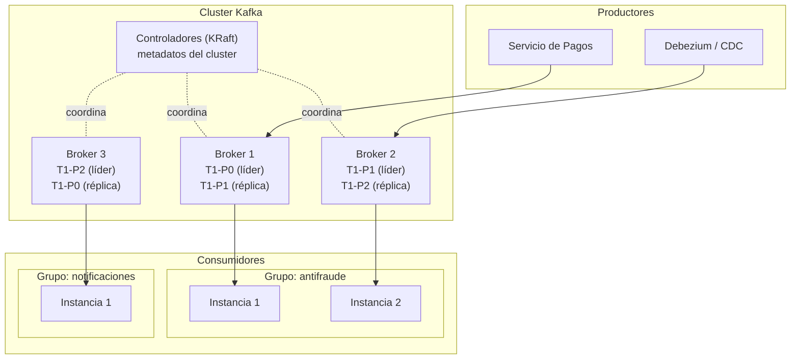
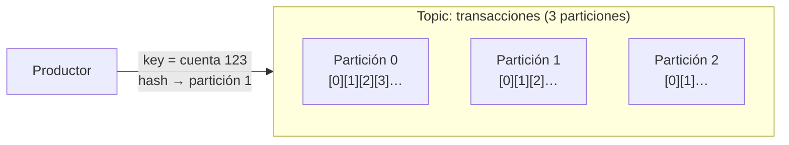
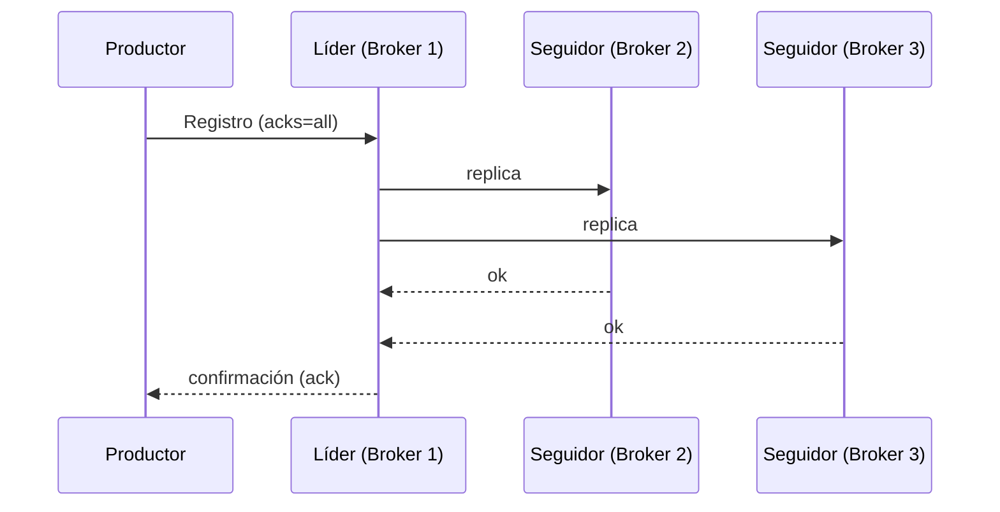
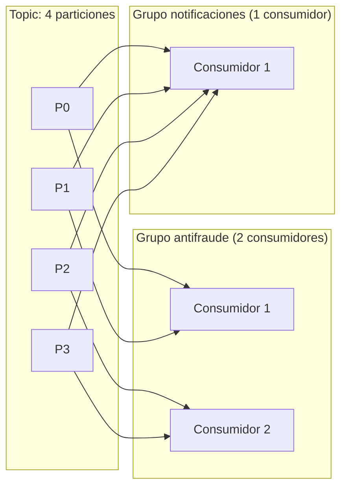
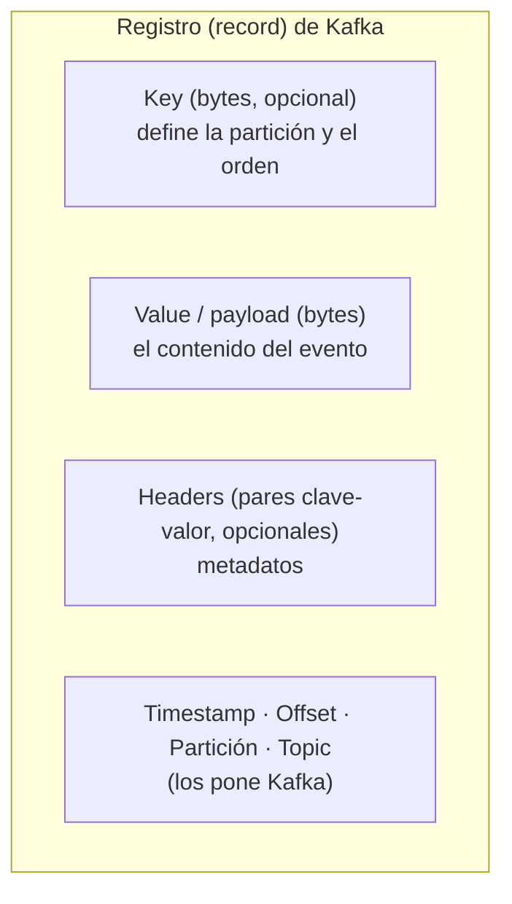
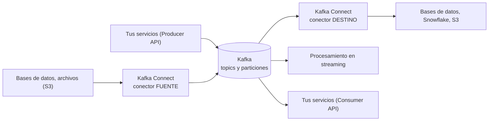

# Apache Kafka a fondo

Arquitectura, cluster, coordinación (de ZooKeeper a KRaft), topics, particiones, productores, consumidores, estructura del mensaje (payload y headers) y uso en banca.

> Contexto general y comparación con otras tecnologías: [`README.md`](README.md).

## 🍎 Kafka con manzanas (empieza aquí)

Kafka es **el libro de registro de la frutería**, hecho para que muchos lo escriban y muchos lo lean sin pisarse.

| Concepto de Kafka | En la frutería |
|---|---|
| **Topic** | Un cuaderno: "Ventas de manzanas" |
| **Partición** | Las secciones del cuaderno; el orden solo vale **dentro** de una sección |
| **Key** | El nombre del cliente: decide en qué sección se anota (así sus ventas quedan en orden) |
| **Offset** | El número de línea dentro de la sección |
| **Productor** | La caja que anota las ventas |
| **Consumer group** | Un equipo (contabilidad, bodega): cada sección la lee **uno solo** del equipo; cada equipo lleva su marcador |
| **Broker / Cluster** | Las oficinas que guardan el cuaderno; con 3 oficinas, si una se incendia, el cuaderno sigue |
| **Replicación** | Fotocopias en cada oficina; solo cuenta como anotado cuando las copias necesarias lo tienen |
| **Retención** | Cuánto tiempo se guardan las hojas antes de reciclarlas |
| **Header** | Etiquetas pegadas a la nota (quién la escribió, número de seguimiento) sin abrir su contenido |
| **KRaft** | El comité interno que decide quién lleva cada sección; antes lo hacía un jefe externo (ZooKeeper) |

**La diferencia clave con una cola:** en una cola, leer = romper el ticket. En Kafka, leer = mover **tu** marcador; la nota sigue ahí para otros equipos y para volver a leerla.

Glosario con más términos: [`glosario.md`](glosario.md).

### Qué debes dominar según tu nivel

| Nivel | Debes poder explicar |
|---|---|
| 🟢 **Junior** | Topic, partición, offset, productor, consumidor, consumer group; por qué existe Kafka; que el orden es por partición |
| 🟡 **Mid** | Elegir la key; `acks=all`, replicación e `min.insync.replicas`; commit manual; consumidor idempotente; DLT y lag; Schema Registry y compatibilidad |
| 🔴 **Senior** | Dimensionar particiones y retención; límites del exactly-once; seguridad y cumplimiento en banca; DR multi-región; KRaft vs ZooKeeper; cuándo **no** usar Kafka y compararlo con Service Bus y Event Hubs |

## 1. Qué es

Plataforma distribuida de **streaming de eventos**. Su idea central es un **log de commits distribuido, particionado y replicado**: los productores añaden registros al final, los consumidores los leen por posición (offset). Los registros **no se borran al leerse**; se conservan según la política de retención.

Para qué sirve: desacoplar servicios, mover datos entre sistemas, capturar cambios de bases de datos, procesar flujos en tiempo real y guardar un historial de hechos reproducible.

## 2. Arquitectura



### Piezas

| Pieza | Qué es |
|---|---|
| **Broker** | Un servidor Kafka. Almacena particiones y atiende a productores y consumidores |
| **Cluster** | Conjunto de brokers que trabajan juntos. Da escalabilidad (repartes particiones) y tolerancia a fallos (réplicas). Mínimo recomendable en producción: **3 brokers** |
| **Controlador (controller)** | Gestiona los metadatos del cluster: qué broker es líder de qué partición, qué topics existen, y reasigna líderes cuando un broker cae |
| **Topic** | Categoría o feed con nombre donde se publican eventos (`pagos.aprobados`) |
| **Partición** | Un topic se divide en particiones. Cada una es un log ordenado e inmutable. Es la unidad de **paralelismo y de orden** |
| **Réplica** | Copia de una partición en otro broker. Una es la **líder** (recibe lecturas y escrituras) y el resto **seguidoras** |
| **Producer** | Aplicación que publica registros |
| **Consumer / Consumer group** | Aplicación que lee. Los consumidores de un grupo se reparten las particiones |

## 3. ZooKeeper → KRaft

- **Antes (ZooKeeper):** Kafka dependía de un cluster aparte, **Apache ZooKeeper**, para guardar los metadatos, elegir al controlador y detectar brokers caídos. Dos sistemas que operar, y un límite de escala en el número de particiones.
- **Ahora (KRaft, Kafka Raft):** los metadatos viven **dentro de Kafka**, en un topic interno replicado con el protocolo de consenso **Raft**. Un quórum de controladores elige al líder y mantiene el estado. Desde **Kafka 4.0 (2025) ZooKeeper ya no existe**; solo funciona KRaft.
- **Qué responder:** *"ZooKeeper coordinaba el cluster (metadatos, elección de controlador). Kafka lo reemplazó por KRaft, un quórum de controladores basado en Raft integrado en Kafka, que simplifica la operación y escala a muchas más particiones."*
- Un quórum KRaft suele tener 3 controladores (tolera 1 caída) o 5 (tolera 2). Pueden ir en nodos dedicados o combinados con brokers (solo en entornos pequeños).

## 4. Topics y particiones



- **Offset:** número secuencial de cada registro dentro de **su partición**. Identifica una posición; no es global al topic.
- **Orden:** garantizado **solo dentro de una partición**. No hay orden entre particiones.
- **Key → partición:** por defecto `hash(key) % número_de_particiones` (murmur2). Misma key = misma partición = **orden preservado** para esa entidad. Sin key, se reparten por lotes (sticky).
- **Número de particiones:** define el **máximo paralelismo de consumo** de un grupo. Se pueden aumentar después, pero al cambiar el módulo se rompe el reparto por key histórico. Conviene estimar bien al inicio (throughput objetivo ÷ throughput por partición, y número de consumidores).
- **Hot partition:** una key muy popular satura una partición. Elegir bien la key.

### Retención y limpieza

| Config | Significado |
|---|---|
| `retention.ms` | Cuánto se conservan los registros (por defecto 7 días). Puede ser indefinido |
| `retention.bytes` | Tamaño máximo por partición |
| `cleanup.policy=delete` | Borra segmentos antiguos al vencer la retención |
| `cleanup.policy=compact` | **Log compaction:** conserva solo el último registro por key (útil para "estado actual", como una tabla) |
| Segmentos | Cada partición se guarda en archivos de segmento en disco; el borrado es por segmento |

Kafka es rápido porque escribe **secuencialmente a disco** (append-only), usa la caché de páginas del sistema operativo y transfiere con *zero-copy*.

## 5. Replicación y durabilidad



| Concepto | Detalle |
|---|---|
| **Replication factor** | Copias por partición. En producción, **3** |
| **ISR (In-Sync Replicas)** | Réplicas que están al día con el líder. Solo las del ISR pueden ser elegidas líder sin perder datos |
| **`min.insync.replicas`** | Mínimo de réplicas en ISR para aceptar una escritura con `acks=all`. Típico: 2 (con RF=3 tolera 1 caída sin parar y sin perder) |
| **`acks`** | `0` (no espera), `1` (espera al líder), `all` (espera al ISR). **Banca: `all`** |
| **`unclean.leader.election`** | Si es `true`, permite elegir líder una réplica desactualizada: **disponibilidad a costa de perder datos**. En banca, `false` |
| **Fallo de un broker** | El controlador elige un nuevo líder entre el ISR para cada partición afectada |
| **Rack awareness** | Distribuir réplicas en distintas zonas de disponibilidad |

Combinación típica "no perder datos": RF=3, `min.insync.replicas=2`, `acks=all`, `enable.idempotence=true`, `unclean.leader.election.enable=false`.

## 6. Productor

Flujo: serializa clave y valor → el **particionador** elige la partición → acumula en un **lote** (batch) → comprime → envía al líder.

| Config | Para qué |
|---|---|
| `acks` | Nivel de confirmación (ver arriba) |
| `enable.idempotence=true` | Evita duplicados por reintentos del productor (usa un id de productor y número de secuencia). Es el valor por defecto en versiones recientes |
| `retries` y `delivery.timeout.ms` | Reintentos y tiempo máximo total de entrega |
| `linger.ms` y `batch.size` | Espera un poco para juntar más registros en un lote: más throughput, algo más de latencia. **Es el trade-off latencia vs rendimiento:** lotes pequeños = menos latencia; lotes grandes = más rendimiento |
| `compression.type` | `lz4`, `zstd`, `snappy`, `gzip`: menos red y disco |
| `max.in.flight.requests.per.connection` | Peticiones simultáneas sin confirmar; con idempotencia (≤5) se mantiene el orden |
| `transactional.id` | Habilita **transacciones**: escribir en varios topics/particiones de forma atómica |

## 7. Consumidor y consumer groups



- **Cada partición la lee un solo consumidor por grupo.** Grupos distintos leen el mismo topic **de forma independiente** (cada uno con su offset). Así se hace el "pub/sub" en Kafka.
- **Más consumidores que particiones = consumidores ociosos.**
- **Offsets:** el consumidor confirma (`commit`) hasta dónde leyó; se guarda en el topic interno `__consumer_offsets`. Al reiniciar, continúa desde ahí.
- **Group coordinator:** un broker que gestiona la membresía del grupo y los offsets.
- **Rebalanceo:** al entrar o salir un consumidor (o cambiar las particiones) se reasignan particiones. Con el asignador **cooperative sticky** el impacto es menor. `group.instance.id` (membresía estática) evita rebalanceos por reinicios cortos.

| Config | Para qué |
|---|---|
| `group.id` | Identifica el grupo |
| `enable.auto.commit` | `false` en banca: confirmas **después** de procesar con éxito |
| `auto.offset.reset` | `earliest` o `latest`: dónde empezar si no hay offset guardado |
| `max.poll.records` y `max.poll.interval.ms` | Si procesas más lento que ese intervalo, el consumidor es expulsado del grupo y hay rebalanceo |
| `session.timeout.ms` y `heartbeat.interval.ms` | Detección de consumidor caído |
| `isolation.level=read_committed` | Solo lee registros de transacciones confirmadas |

**Procesamiento seguro (at-least-once):** leer → procesar → guardar resultado → `commit`. Si falla en medio, se reprocesa, por eso el procesamiento debe ser **idempotente** (por ejemplo, una tabla de eventos procesados con el `eventId`).

**Consumer lag:** `último offset de la partición − offset confirmado`. La métrica principal para saber si un consumidor se atrasa. Se alerta sobre ella.

### Manejo de errores

| Tipo de fallo | Qué hacer |
|---|---|
| Transitorio (BD caída un momento) | Reintento con backoff |
| Permanente (mensaje mal formado, regla de negocio) | **Dead Letter Topic** (`pagos.dlt`) con el error en headers, y alerta |
| Reintentos sin bloquear la partición | Topics de reintento escalonados (`pagos.retry-1m`, `pagos.retry-10m`) |
| Mensaje venenoso | Se aísla en la DLT; nunca bloquear la partición indefinidamente |

## 8. Estructura de un registro (payload, key y headers)



| Campo | Qué contiene | Notas |
|---|---|---|
| **Key** | Identificador de la entidad: `accountId`, `customerId`, `orderId` | Bytes. Decide la partición. Si es null, se reparte sin orden por entidad |
| **Value (payload)** | El evento o dato de negocio | Bytes: Kafka no sabe qué hay dentro. Lo serializas tú (Avro, Protobuf, JSON). Un valor `null` se llama *tombstone* y borra la key en un topic compactado |
| **Headers** | Metadatos: pares clave (String) → valor (bytes). Pueden repetirse | **No los uses para datos de negocio.** Sirven para enrutar, trazar y describir sin deserializar el payload |
| **Timestamp** | Momento del evento (`CreateTime`, lo pone el productor) o de añadido al log (`LogAppendTime`) | Configurable por topic |
| **Offset, partición, topic** | Posición del registro | Asignados por el broker |

Tamaño máximo por defecto: aproximadamente **1 MB** por mensaje (`message.max.bytes`). Para archivos grandes, usar el patrón **Claim Check** (guardas el archivo en S3/Blob y el mensaje lleva la referencia).

### Formatos de serialización

| Formato | Ventajas | Desventajas |
|---|---|---|
| **JSON** | Legible, fácil, sin herramientas | Pesado, sin esquema obligatorio, fácil que se rompa la compatibilidad |
| **Avro** | Compacto, esquema obligatorio, evolución controlada, estándar con Schema Registry | Binario, requiere registry |
| **Protobuf** | Compacto, rápido, esquema fuerte, multi-lenguaje | Requiere definir `.proto` |
| **JSON Schema** | JSON con validación | Más grande que binario |

**Schema Registry:** guarda los esquemas, asigna un id (el payload lleva un pequeño prefijo con ese id) y valida la **compatibilidad** (backward, forward, full) al registrar una nueva versión. Evita romper a los consumidores.

### Ejemplo de evento bancario (envelope)

```json
// topic: pagos.transferencias.v1   |   key: "ACC-000123"
{
  "eventId": "7d1c1f0e-5e62-4a9b-9a3f-1e8f6c0a2b11",
  "eventType": "TransferenciaEjecutada",
  "eventVersion": 1,
  "occurredAt": "2026-10-06T14:32:10.123Z",
  "aggregateId": "TRX-98765",
  "correlationId": "c0a8-4f2b-9d11",
  "data": {
    "cuentaOrigen": "ACC-000123",
    "cuentaDestino": "ACC-000456",
    "monto": "250.00",
    "moneda": "PEN",
    "estado": "EJECUTADA"
  }
}
```

```text
headers:
  content-type      = application/json
  event-type        = TransferenciaEjecutada
  schema-version    = 1
  correlation-id    = c0a8-4f2b-9d11
  traceparent       = 00-4bf92f3577b34da6a3ce929d0e0e4736-00f067aa0ba902b7-01
  source            = servicio-transferencias
  tenant            = pe
```

Buenas prácticas del payload:
- **Dinero como string decimal o entero en unidades menores** (centavos), nunca `float`/`double`.
- **Fechas en UTC, formato ISO-8601.**
- Incluir `eventId` (para idempotencia), `eventType`, `eventVersion` y `occurredAt`.
- **No poner datos sensibles en claro** (número de tarjeta completo, documento): tokenizar, enmascarar o cifrar el campo.
- Cambios **compatibles hacia atrás**: añadir campos opcionales, no renombrar ni quitar.
- Versionar el topic o el evento cuando el cambio sea incompatible (`...v2`).

## 9. Kafka en banca

Es donde más se usa: volumen alto, necesidad de auditoría, desacoplar sistemas antiguos del core y reaccionar en tiempo real.

| Caso de uso | Cómo se resuelve con Kafka |
|---|---|
| **Eventos de transacciones** (transferencias, pagos, retiros) | Topic por tipo de evento, key = cuenta, para orden por cuenta |
| **Detección de fraude en tiempo real** | Un grupo antifraude consume las transacciones y publica alertas; Kafka Streams o Flink para reglas con ventanas ("más de 5 transferencias en 1 minuto") |
| **Notificaciones** (SMS, push, correo) | Un grupo de notificaciones consume `TransferenciaEjecutada` sin que el servicio de pagos lo conozca |
| **Integración con el core bancario / mainframe** | CDC (Debezium) sobre la base de datos del core, o conectores desde IBM MQ, hacia topics |
| **Auditoría y trazabilidad regulatoria** | Log inmutable con retención larga; reconstruir qué pasó y cuándo |
| **Conciliación** | Comparar eventos de distintos sistemas |
| **Event sourcing / ledger** | El log de movimientos es la fuente de verdad; se derivan saldos |
| **CQRS** | Eventos actualizan vistas de lectura para consultas rápidas (saldos, historial) |
| **Analítica y reporting** | Los mismos eventos alimentan el data lake o el DWH |
| **Onboarding / KYC** | Flujo orquestado por eventos entre servicios |

### Exigencias propias de banca

- **Cero pérdida:** RF=3, `acks=all`, `min.insync.replicas=2`, idempotencia activada, `unclean.leader.election=false`, y varias zonas de disponibilidad.
- **Idempotencia en consumidores:** un cargo duplicado es un incidente. `eventId` + tabla de procesados, o llaves de idempotencia en la operación.
- **Orden por cuenta:** key = `accountId`.
- **Consistencia entre BD y Kafka:** patrón **Outbox**; nunca "guardo en BD y publico" sin transacción.
- **Seguridad:**
  - **TLS** en tránsito (y mTLS entre servicios), cifrado de disco en reposo.
  - **Autenticación:** SASL (SCRAM, OAUTHBEARER/OIDC) o mTLS.
  - **Autorización:** **ACLs** por topic y por grupo (mínimo privilegio): un servicio solo escribe o lee los topics que le tocan.
  - **Datos sensibles:** tokenización o cifrado a nivel de campo; no loguear payloads; cumplir PCI DSS y la normativa de protección de datos.
- **Retención y cumplimiento:** políticas de retención acordes a la normativa; derecho de supresión (con topics compactados y tombstones, o cifrado con claves que se destruyen: *crypto-shredding*).
- **Observabilidad:** lag por grupo, tasa de errores, tamaño de las DLT, latencia de extremo a extremo, `correlationId` y `traceparent` en headers para trazar una operación entre servicios.
- **Alta disponibilidad y DR:** cluster en 3 zonas; replicación entre regiones con MirrorMaker 2 o Cluster Linking.
- **Contratos:** Schema Registry con compatibilidad obligatoria; el esquema es un contrato entre equipos.
- **Mensajes financieros estándar:** en mensajería interbancaria se usan formatos como **ISO 20022** (XML). Puede viajar como payload, a menudo envuelto en un envelope propio.
- **Ventanas operativas:** procesos batch de cierre contra flujos continuos; reprocesar desde un offset o timestamp es una ventaja de Kafka.

> Un caso de punta a punta con Kafka, Outbox y Quartz en una pasarela de pagos: [`../system-design/caso-pasarela-pagos.md`](../system-design/caso-pasarela-pagos.md).

## 10. Exactly-once: qué es y qué no

- **Productor idempotente:** evita duplicados por reintentos del productor dentro de una partición y sesión.
- **Transacciones:** escribir en varios topics/particiones y confirmar offsets de lectura **de forma atómica** (patrón consume-transform-produce). Los consumidores con `read_committed` solo ven lo confirmado.
- **Límite:** esa garantía es **dentro de Kafka**. Si el efecto es externo (llamar a una API, escribir en una BD), necesitas **idempotencia propia**. Por eso en la práctica: *at-least-once + consumidor idempotente*.

## 11. Ecosistema


> Dibujo de la arquitectura con **ZooKeeper (la versión clásica)** y su equivalente **actual con KRaft**: [`cheat-sheet.md` sección 6](../entrevistas/cheat-sheet.md#c6).

**Dos formas de conectarte a Kafka:** con una **API propia** (tu servicio usa Producer y Consumer) o con **Kafka Connect**, que te permite **descargar conectores ya hechos** (MySQL, PostgreSQL, Snowflake, S3...) y registrarlos con un archivo de configuración JSON. Hay conectores **fuente** (meten datos a Kafka) y **destino** (sacan datos de Kafka).


| Pieza | Para qué |
|---|---|
| **Kafka Connect** | Mueve datos entre Kafka y sistemas externos con conectores (JDBC, S3, Elasticsearch, Debezium CDC) |
| **Kafka Streams** | Librería Java para procesar streams: filtros, agregaciones, joins, ventanas, estado local |
| **ksqlDB / Flink** | Procesamiento con SQL o motor de streaming |
| **Schema Registry** | Esquemas y compatibilidad |
| **MirrorMaker 2 / Cluster Linking** | Replicación entre clusters (DR, multi-región) |
| **Servicios gestionados** | Confluent Cloud, Amazon MSK, Azure Event Hubs (protocolo Kafka), Aiven |

## 12. Con Java y Spring

```java
// Productor
@Service
class TransferenciaPublisher {
    private final KafkaTemplate<String, TransferenciaEjecutada> kafka;

    void publicar(TransferenciaEjecutada evento) {
        ProducerRecord<String, TransferenciaEjecutada> record =
            new ProducerRecord<>("pagos.transferencias.v1", evento.cuentaOrigen(), evento);
        record.headers().add("correlation-id", evento.correlationId().getBytes(UTF_8));
        kafka.send(record);
    }
}

// Consumidor
@KafkaListener(topics = "pagos.transferencias.v1", groupId = "antifraude")
void procesar(TransferenciaEjecutada evento, Acknowledgment ack) {
    if (procesados.yaProcesado(evento.eventId())) { ack.acknowledge(); return; }  // idempotencia
    antifraude.evaluar(evento);
    procesados.marcar(evento.eventId());
    ack.acknowledge();   // commit manual después de procesar
}
```

Configuración recomendada: `AckMode.MANUAL`, `DefaultErrorHandler` con `ExponentialBackOff` y `DeadLetterPublishingRecoverer` para la DLT, y `ErrorHandlingDeserializer` para que un mensaje corrupto no bloquee el consumidor.

## 13. Cuándo NO usar Kafka

- Cola de tareas pequeña con ack por mensaje, prioridades o mensajes programados: **RabbitMQ / SQS / Service Bus**.
- Petición-respuesta inmediata: REST o gRPC.
- Volumen bajo y equipo sin capacidad de operar un cluster: un servicio gestionado.
- Necesitas el orden **global** estricto: Kafka solo ordena por partición.

## 14. Preguntas de entrevista (con respuesta corta)

| Pregunta | Respuesta |
|---|---|
| ¿Qué es un cluster Kafka? | Un conjunto de brokers (mínimo 3 en producción) que reparten las particiones y las replican para escalar y tolerar fallos |
| ¿Para qué sirve ZooKeeper y qué lo reemplazó? | Coordinaba metadatos y elección de controlador. Lo reemplazó **KRaft**, un quórum de controladores con Raft dentro de Kafka; en Kafka 4.0 ZooKeeper desapareció |
| ¿Qué es una partición? | Un log ordenado e inmutable de un topic; unidad de paralelismo y de orden |
| ¿Cómo se garantiza el orden? | Solo dentro de una partición; se usa una key (la cuenta, el pedido) para que sus eventos vayan a la misma partición |
| ¿Qué es un consumer group? | Consumidores que se reparten las particiones de un topic; grupos distintos leen el mismo topic por separado |
| ¿Qué pasa si hay más consumidores que particiones? | Los sobrantes quedan ociosos |
| ¿Qué lleva un mensaje? | Key, value (payload), headers, timestamp, y offset/partición que añade Kafka |
| ¿Para qué sirven los headers? | Metadatos (correlationId, tipo de evento, versión del esquema, traza) para enrutar y observar sin deserializar el payload |
| ¿Cómo evito perder mensajes? | `acks=all`, RF=3, `min.insync.replicas=2`, idempotencia, y commit manual en el consumidor |
| ¿Cómo evito duplicados? | Productor idempotente más consumidor idempotente (`eventId`) |
| ¿Qué es el lag? | Mensajes pendientes por consumir en un grupo; la métrica principal |
| ¿Qué es log compaction? | Conserva solo el último valor por key; modela estado actual |
| ¿Qué es un offset? | La posición de un registro en su partición |
| ¿Cómo manejo un mensaje que siempre falla? | Reintentos con backoff y luego Dead Letter Topic con alerta |
| ¿Cómo evolucionas un evento sin romper consumidores? | Schema Registry con compatibilidad, añadir campos opcionales, versionar cuando no sea compatible |
| ¿Por qué Kafka es tan rápido? | Escritura secuencial, caché de páginas, zero-copy, lotes y compresión |
| ¿Cómo aseguras Kafka en banca? | TLS/mTLS, SASL, ACLs por topic y grupo, cifrado en reposo, tokenización de datos sensibles, auditoría |

## Referencias

- [Documentación oficial de Apache Kafka](https://kafka.apache.org/documentation/)
- [Apache Kafka 4.0: ZooKeeper-free](https://kafka.apache.org/blog) (anuncio de la versión)
- Narkhede, Shapira, Palino — *Kafka: The Definitive Guide* (O'Reilly)
- [Confluent Developer](https://developer.confluent.io/)
