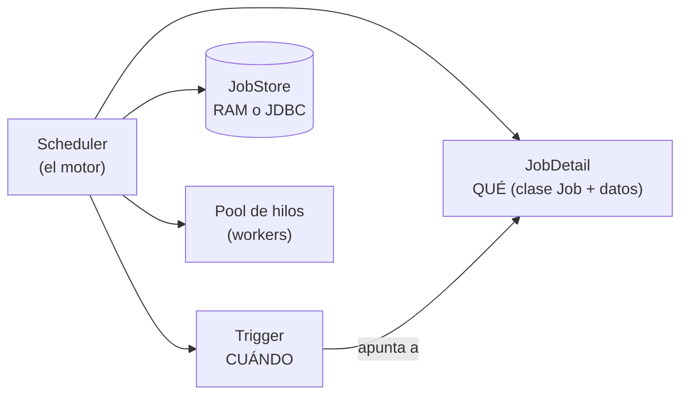
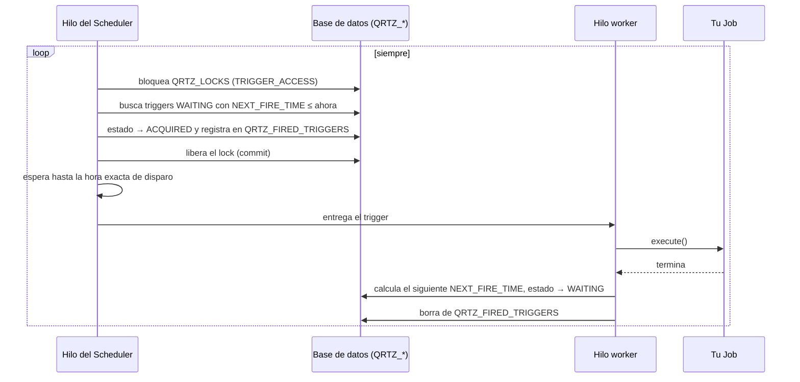
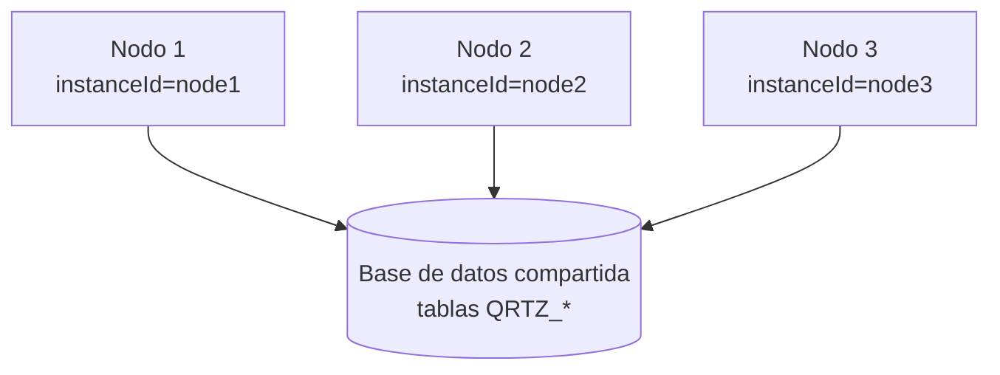
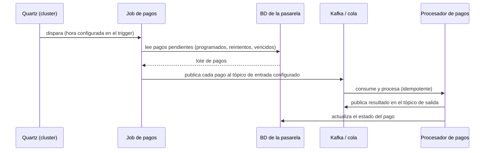

# Quartz Scheduler — disparadores programados con tabla en base de datos

Cómo funciona Quartz por debajo, cómo se usó en una pasarela de pagos (jobs que leen una tabla y publican a tópicos), qué patrones hay detrás y cuándo elegirlo frente a otras opciones.

> Nombre correcto: **Quartz** (`org.quartz`), una librería Java de *job scheduling*. No confundir con **Quarkus**, otro framework Java, que tiene una extensión (`quarkus-quartz`) que integra Quartz. Con Spring Boot se integra con `spring-boot-starter-quartz`.
>
> Relacionado: [`README.md`](README.md) (mensajería y cuándo elegir cada tecnología), [`kafka.md`](kafka.md), [`../microservices-patterns/`](../microservices-patterns) (Outbox, Saga), [`../ddd/cqrs.md`](../ddd/cqrs.md).

## 🍎 Quartz con manzanas (empieza aquí)

Quartz es **la agenda de alarmas de la frutería, guardada en un cuaderno compartido** (la base de datos).

| Concepto de Quartz | En la frutería |
|---|---|
| **Job** | La tarea: "cobrar la suscripción semanal de manzanas" |
| **Trigger** | La alarma: "el día 5 a las 8:00" |
| **Scheduler** | El asistente que revisa la agenda y avisa cuando suena una alarma |
| **JobStore en base de datos** | La agenda escrita en un cuaderno: si se apaga la luz, **no se pierde** |
| **Tablas `QRTZ_*`** | Las columnas del cuaderno: tarea, próxima hora, estado |
| **Cluster** | Varios asistentes leen **el mismo cuaderno**; el primero que **tacha** la tarea es quien la hace |
| **Misfire** | La tienda estuvo cerrada y la alarma sonó sin nadie: al abrir, se hace **una vez** y se sigue |
| **Polling Publisher** | La tarea consiste en repasar la lista de pedidos pendientes y dejar el aviso en el cuaderno compartido (el broker) |

**Por qué existe frente a un simple `@Scheduled`:** con `@Scheduled`, si abres dos tiendas con el mismo cartel, **las dos** cobran. Quartz tiene una sola agenda en el cuaderno y reparte.

Glosario: [`glosario.md`](glosario.md).

### Qué debes dominar según tu nivel

| Nivel | Debes poder explicar |
|---|---|
| 🟢 **Junior** | Qué es un job y un trigger; qué es un cron; por qué no basta un `@Scheduled` con varias instancias |
| 🟡 **Mid** | JDBC JobStore y las tablas `QRTZ_*`; cluster y quién ejecuta qué; misfire; `@DisallowConcurrentExecution`; jobs idempotentes |
| 🔴 **Senior** | Locks de BD como cuello de botella; polling vs un disparo por pago; failover con `requestsRecovery`; alternativas gestionadas (Scheduler, Service Bus, Workflows) y cuándo migrar |

## 1. Qué es y qué problema resuelve

Ejecutar **trabajo en un momento o con una frecuencia determinada**: "cada día a las 02:00", "cada 5 minutos", "el 5 de cada mes", "dentro de 30 minutos". A diferencia de una cola (el trabajo llega por un mensaje), aquí **el disparador es el tiempo**.

Lo que lo distingue de un simple `@Scheduled` o un `cron` del sistema operativo:

| Capacidad | Quartz |
|---|---|
| **Persistencia** de los jobs y triggers en base de datos | Sí (JDBC JobStore): sobreviven a reinicios |
| **Clustering** (varios nodos sin ejecutar dos veces el mismo job) | Sí, coordinado mediante la base de datos |
| **Misfire handling** (qué hacer si se pasó la hora y no se ejecutó) | Sí, configurable por trigger |
| **Programación dinámica** en tiempo de ejecución (crear, pausar, reprogramar triggers sin redesplegar) | Sí, con la API del `Scheduler` |
| Expresiones **cron** completas, calendarios (feriados), triggers de intervalo | Sí |
| Listeners, datos por job (`JobDataMap`), reintento tras caída (`requestsRecovery`) | Sí |

## 2. Conceptos



| Concepto | Qué es |
|---|---|
| **Job** | Interfaz con un método `execute(JobExecutionContext)`: el trabajo a hacer |
| **JobDetail** | Definición del job: su clase, nombre, grupo, `JobDataMap` (parámetros) y flags (durable, requestsRecovery) |
| **Trigger** | **Cuándo** se ejecuta un job. Un job puede tener varios triggers |
| **SimpleTrigger** | Una vez, o N veces con un intervalo fijo |
| **CronTrigger** | Expresión cron (`0 0/5 * * * ?`: cada 5 minutos). Incluye segundos, y soporta "último día del mes", "primer lunes", etc. |
| **CalendarIntervalTrigger / DailyTimeIntervalTrigger** | Cada N meses/días; ventanas horarias dentro del día |
| **Calendar** | Excluye fechas (feriados, fines de semana) |
| **JobStore** | Dónde se guarda el estado. **`RAMJobStore`** (memoria, se pierde al reiniciar) o **`JDBCJobStore`** (base de datos) |
| **Scheduler** | El motor: un hilo que busca triggers vencidos y los entrega a un pool de hilos |
| **Listeners** | `JobListener`, `TriggerListener`, `SchedulerListener`: para auditar, medir o vetar |

## 3. Por debajo: la tabla y cómo se dispara un trigger

Con el `JDBCJobStore`, Quartz guarda su estado en tablas con prefijo `QRTZ_` (el script de creación viene con la librería; en Spring Boot se puede inicializar con `spring.quartz.jdbc.initialize-schema`).

| Tabla | Para qué |
|---|---|
| `QRTZ_JOB_DETAILS` | Definición de cada job (clase, grupo, durable, datos serializados) |
| `QRTZ_TRIGGERS` | **Una fila por trigger**: `NEXT_FIRE_TIME`, `PREV_FIRE_TIME`, `TRIGGER_STATE`, `MISFIRE_INSTR`, prioridad |
| `QRTZ_CRON_TRIGGERS` | La expresión cron y la zona horaria de los triggers de tipo cron |
| `QRTZ_SIMPLE_TRIGGERS` | Repeticiones e intervalo de los simples |
| `QRTZ_FIRED_TRIGGERS` | Triggers **en ejecución ahora** y en qué nodo (clave para recuperar tras una caída) |
| `QRTZ_SCHEDULER_STATE` | Los nodos del cluster y su último *check-in* |
| `QRTZ_LOCKS` | Filas que se **bloquean** (`SELECT ... FOR UPDATE`) para serializar el acceso entre nodos |
| `QRTZ_CALENDARS`, `QRTZ_PAUSED_TRIGGER_GRPS`, `QRTZ_BLOB_TRIGGERS` | Calendarios, grupos pausados, triggers personalizados |

**Estados del trigger** (`TRIGGER_STATE`): `WAITING` (esperando su hora) → `ACQUIRED` (un nodo lo reclamó) → `EXECUTING` → de vuelta a `WAITING` con el nuevo `NEXT_FIRE_TIME`, o `COMPLETE` cuando ya no tiene más disparos. También `PAUSED`, `BLOCKED` (por `@DisallowConcurrentExecution`) y `ERROR`.



Lo importante: **el "reloj" es una fila de la tabla (`NEXT_FIRE_TIME`) que un hilo consulta, y el candado es un `SELECT ... FOR UPDATE` en la base de datos.** No hay un servicio coordinador aparte: la base de datos compartida es el coordinador.

## 4. Clustering



- Todos los nodos apuntan **a la misma base de datos** y con la misma configuración (`isClustered=true`).
- Cada trigger lo dispara **un solo nodo**: el primero que consigue el lock y lo marca `ACQUIRED`. Con mucha carga, el reparto se vuelve casi aleatorio; con poca carga, tiende a ejecutarlo siempre el mismo nodo (**no es un balanceo exacto**).
- **Failover:** cada nodo hace *check-in* periódico en `QRTZ_SCHEDULER_STATE` (`clusterCheckinInterval`, por ejemplo 20 s). Si un nodo deja de hacerlo, los demás lo detectan y miran `QRTZ_FIRED_TRIGGERS`: los jobs con `requestsRecovery=true` **se vuelven a ejecutar** en un nodo vivo; los demás esperan a su siguiente disparo.
- **Los relojes de los servidores deben estar sincronizados** (NTP; la documentación pide diferencia menor a 1 segundo). Si no, hay comportamiento errático.
- `instanceId=AUTO` genera un id único por nodo.
- **Límites:** el cluster escala el **número de nodos que pueden tomar trabajo**, pero todo pasa por los locks de una sola base de datos. Para miles de disparos por segundo se vuelve un cuello de botella.

Configuración típica en Spring Boot:

```yaml
spring:
  quartz:
    job-store-type: jdbc
    jdbc:
      initialize-schema: never          # el esquema lo crea Flyway/Liquibase
    properties:
      org.quartz.scheduler.instanceId: AUTO
      org.quartz.jobStore.isClustered: true
      org.quartz.jobStore.clusterCheckinInterval: 20000
      org.quartz.jobStore.misfireThreshold: 60000
      org.quartz.threadPool.threadCount: 10
```

## 5. Misfire: cuando se pasó la hora

Un *misfire* ocurre cuando un trigger **no se pudo ejecutar a su hora**: el nodo estaba caído, no había hilos libres o el sistema estaba saturado. Quartz revisa los triggers cuyo `NEXT_FIRE_TIME` es anterior a `ahora − misfireThreshold` (60 s por defecto) y aplica la **política de misfire** del trigger:

| Política (ejemplos en Cron) | Qué hace |
|---|---|
| `FIRE_ONCE_NOW` | Ejecuta **una vez ahora** y sigue con el calendario |
| `DO_NOTHING` | Ignora lo perdido y espera el siguiente disparo |
| `IGNORE_MISFIRE_POLICY` | Ejecuta todos los disparos perdidos (cuidado con las avalanchas) |
| `SMART_POLICY` | Valor por defecto: Quartz decide según el tipo de trigger |

**Pregunta de negocio que hay que hacerse:** si el cobro de las 02:00 no se ejecutó porque el sistema estaba caído, ¿al volver quieres ejecutarlo (una vez) o saltarlo? En pagos casi siempre quieres **ejecutarlo una vez** (`FIRE_ONCE_NOW`), no cien veces.

## 6. El caso de la pasarela de pagos: qué patrón es

Lo que se recuerda: Quartz dispara a una hora, el job **lee una tabla** de pendientes o de configuración (tópico de entrada y tópico de salida), y **publica a un tópico** para que otro componente procese. Esto es lo que se pudo montar (una reconstrucción razonable, no el diseño exacto de ese proyecto):



**Para qué sirve en una pasarela de pagos:** pagos programados o recurrentes (débito el día 5), **reintentos** de cobros fallidos, vencimiento de pagos pendientes, conciliación, cortes y ventanas horarias del banco, envío de archivos por lotes.

### Los patrones que contiene

| Patrón | Dónde se ve |
|---|---|
| **Job Scheduler / Timer-driven trigger** (disparo temporal) | Quartz: el tiempo, no un mensaje, inicia el flujo |
| **Polling Publisher** (Chris Richardson) | El job **consulta periódicamente la tabla** y publica al broker lo que encuentra. Es el mismo mecanismo del **relay del patrón Transactional Outbox** (ver [`../microservices-patterns/`](../microservices-patterns)) |
| **Transactional Outbox** (si la tabla es de eventos pendientes) | Se guarda el dato y el evento en la misma transacción; el job de Quartz es el publicador |
| **Command** (GoF) | Cada `JobDetail` encapsula una acción como objeto, con sus parámetros en el `JobDataMap` |
| **Template Method / Strategy** | La interfaz `Job` define el esqueleto de ejecución; tú pones el comportamiento |
| **Observer** | Los `JobListener` y `TriggerListener` |
| **Builder y Factory** | La API fluida `JobBuilder`, `TriggerBuilder` y `SchedulerFactory` |
| **Competing consumers por bloqueo de BD** | En el cluster, los nodos compiten por el lock de la fila y solo uno dispara cada trigger |
| **Configuración por tabla (data-driven)** | Los tópicos de entrada y salida, la hora y los parámetros viven en tablas y no en código: se cambia el comportamiento sin redesplegar |
| **Orquestación basada en tiempo / timeout de Saga** | Cuando el job expira pagos o dispara un paso compensatorio si no llegó una respuesta a tiempo |

**Cómo decirlo en una frase en la entrevista:** *"Usamos Quartz como disparador temporal con persistencia en base de datos y clustering. El job leía los pagos pendientes de una tabla y los publicaba al tópico configurado, es decir, un **Polling Publisher**: la misma idea del relay de un Outbox, pero activado por tiempo. Los consumidores eran idempotentes porque, al ser at-least-once, un job podía ejecutarse dos veces."*

> Lo que conviene que contrastes con tu recuerdo del proyecto: si el job publicaba directo a Kafka o a una cola (por ejemplo IBM MQ), si había tabla de configuración por tópico, y cómo evitaban duplicados. Si no lo recuerdas con certeza, cuenta lo que sí recuerdas y no inventes el resto.

> **System design completo de este caso** (arquitectura, modelo de datos, estados del pago, flujos, fallas y escala): [`../system-design/caso-pasarela-pagos.md`](../system-design/caso-pasarela-pagos.md).

## 7. Problemas reales y cómo se manejan

| Problema | Solución |
|---|---|
| El job se ejecuta **dos veces** (failover con `requestsRecovery`, reintento, misfire) | Job **idempotente**: llave de idempotencia por pago, estado en la tabla (`PENDIENTE → EN_PROCESO → ENVIADO`), restricción única |
| Dos ejecuciones del mismo job **solapadas** (la anterior no terminó) | `@DisallowConcurrentExecution` (Quartz no lanza una segunda mientras la primera corre, por `JobKey`) |
| Dos nodos leen **las mismas filas** de la tabla de pendientes | Reclamar las filas con `UPDATE ... SET estado='EN_PROCESO' WHERE estado='PENDIENTE'`, o `SELECT ... FOR UPDATE SKIP LOCKED` (PostgreSQL, Oracle, MySQL 8) para que cada nodo tome un lote distinto |
| Un job lee **millones de filas** de golpe | Procesar por lotes (paginación por cursor), commits parciales |
| El job se queda **colgado** | Timeouts, monitoreo de `QRTZ_FIRED_TRIGGERS` antiguos, alerta si un job no corre en su ventana |
| El job publica y **cae antes de actualizar el estado** | Publicar de forma at-least-once y consumidor idempotente; o usar Outbox |
| Datos del `JobDataMap` **serializados en BD** que cambian de clase | Guardar solo tipos simples (ids, strings, JSON) y no objetos serializados |
| **Zonas horarias y horario de verano** | Definir la zona horaria en el `CronTrigger`; probar los cambios de hora |
| Reprogramar **sin redesplegar** | `scheduler.rescheduleJob(...)` con un nuevo trigger; la fuente de verdad puede ser una tabla de configuración propia |
| Observabilidad | `JobListener` con métricas (duración, errores), logs con `correlationId`, alerta de misfires |

## 8. Ejemplo con Spring Boot

```java
@DisallowConcurrentExecution
public class PagosProgramadosJob extends QuartzJobBean {

    private final PagoRepository pagos;
    private final PagoPublisher publisher;

    // Spring inyecta los beans en el job (SpringBeanJobFactory)
    PagosProgramadosJob(PagoRepository pagos, PagoPublisher publisher) { ... }

    @Override
    protected void executeInternal(JobExecutionContext ctx) {
        String topico = ctx.getMergedJobDataMap().getString("topicoSalida");
        List<Pago> lote = pagos.reclamarPendientes(100);      // UPDATE ... EN_PROCESO (SKIP LOCKED)
        lote.forEach(p -> publisher.publicar(topico, p));     // el consumidor es idempotente
    }
}

@Configuration
class QuartzConfig {
    @Bean JobDetail pagosJobDetail() {
        return JobBuilder.newJob(PagosProgramadosJob.class)
            .withIdentity("pagos-programados", "pasarela")
            .usingJobData("topicoSalida", "pagos.programados.v1")
            .requestRecovery(true)
            .storeDurably()
            .build();
    }

    @Bean Trigger pagosTrigger(JobDetail pagosJobDetail) {
        return TriggerBuilder.newTrigger()
            .forJob(pagosJobDetail)
            .withIdentity("pagos-cada-5-min", "pasarela")
            .withSchedule(CronScheduleBuilder.cronSchedule("0 0/5 * * * ?")
                .inTimeZone(TimeZone.getTimeZone("America/Lima"))
                .withMisfireHandlingInstructionFireAndProceed())   // equivale a FIRE_ONCE_NOW
            .build();
    }
}
```

## 9. Quartz frente a las alternativas (cuándo elegir cada una)

| Opción | Cuándo | Limitación |
|---|---|---|
| **`@Scheduled` de Spring** | Tareas simples en una sola instancia | Sin persistencia ni misfire; en varias instancias **se ejecuta en todas** |
| **`@Scheduled` + ShedLock** | Evitar la doble ejecución con un lock en BD, sin la complejidad de Quartz | No persiste triggers ni permite programación dinámica rica |
| **Quartz (JDBC, cluster)** | Triggers persistentes, dinámicos, con misfire y clustering | Acoplado a una BD, con límite de escala por contención de locks |
| **db-scheduler** (librería ligera) | Alternativa más simple basada en una tabla | Menos funciones que Quartz |
| **Spring Batch** | Procesamiento por lotes con chunks, reinicio, estado de ejecución | No programa; se combina con Quartz o un cron |
| **Kubernetes CronJob** | Un contenedor por ejecución, sin estado | Granularidad de un minuto, sin lógica de negocio dinámica |
| **Azure Functions (Timer trigger), Logic Apps, Durable Functions (timers)** | Serverless en Azure | Costos y modelo de ejecución propios |
| **AWS EventBridge Scheduler** | Serverless en AWS | |
| **Azure Service Bus: mensajes programados** (`ScheduledEnqueueTimeUtc`) | "Entrega este mensaje en 30 minutos" sin tabla ni job | Es por mensaje, no una expresión cron recurrente |
| **SQS: delay** | Retrasar un mensaje (hasta 15 minutos) | Límite corto |
| **Motores de workflow** (Temporal, Camunda, Durable Functions) | Procesos de larga duración con timers, reintentos y estado | Más infraestructura |
| **Kafka** | Kafka **no tiene entrega retrasada nativa**: se simula con topics de reintento escalonados o un scheduler externo | |

> Qué reemplaza a Quartz en AWS, Azure y GCP, y cómo se rediseña la pasarela con servicios gestionados: [`../system-design/caso-pasarela-pagos-cloud.md`](../system-design/caso-pasarela-pagos-cloud.md).

**Regla:** si es "ejecutar este proceso cada cierto tiempo" → un scheduler (Quartz, CronJob, Timer trigger). Si es "entregar este mensaje más tarde" → mensajes programados del broker. Si es "un flujo largo con esperas y reintentos" → motor de workflow.

**Conexión con Azure (la empresa Arkano):** el equivalente natural para algo nuevo en Azure sería una **Azure Function con Timer trigger**, **Service Bus con mensajes programados** o **Durable Functions**; Quartz se vería más en una aplicación Java desplegada en AKS o App Service que ya tenga base de datos.

## 10. CQRS y Quartz: la relación

Si el job lee una tabla de pendientes y publica a un tópico, y otro componente actualiza el estado y una vista de lectura, ya estás tocando **CQRS**: el lado de comandos (cambios de estado de los pagos) y el de lectura (consultas de estado). Detalle en [`../ddd/cqrs.md`](../ddd/cqrs.md).

## 11. Preguntas de entrevista

| Pregunta | Respuesta corta |
|---|---|
| ¿Qué es Quartz y por qué no `@Scheduled`? | Scheduler Java con persistencia en BD, clustering, misfire y programación dinámica. `@Scheduled` es simple, sin persistencia, y en varias instancias se ejecuta en todas |
| ¿Cómo funciona por debajo? | Un hilo consulta la tabla `QRTZ_TRIGGERS` por los triggers con `NEXT_FIRE_TIME` vencido, los reclama bajo un lock de BD, los pasa a un pool de hilos y recalcula la siguiente hora |
| ¿Cómo evita que dos nodos ejecuten el mismo job? | Lock de fila en la BD (`SELECT FOR UPDATE` sobre `QRTZ_LOCKS`); el primer nodo que reclama el trigger lo dispara |
| ¿Qué pasa si un nodo cae mientras ejecuta un job? | Los otros nodos lo detectan por el check-in; si el job tiene `requestsRecovery`, se vuelve a ejecutar |
| ¿Qué es un misfire? | Un disparo que no ocurrió a su hora; se resuelve con la política configurada (ejecutar una vez, ignorar, etc.) |
| ¿Cómo garantizas que un pago no se procese dos veces? | Idempotencia: estado en la tabla, llave de idempotencia y consumidor idempotente. Quartz da *at-least-once* |
| ¿Qué patrón es "un job que lee una tabla y publica a un tópico"? | Polling Publisher (el relay de un Outbox) activado por tiempo |
| ¿Qué límite tiene el cluster de Quartz? | Todo pasa por los locks de una base de datos y exige relojes sincronizados; no escala a miles de disparos por segundo |
| ¿Qué usarías en Azure? | Functions con Timer trigger, Service Bus con mensajes programados o Durable Functions, según el caso |

## Referencias

- [Quartz: clustering con JDBC JobStore](https://www.quartz-scheduler.org/documentation/quartz-2.3.0/configuration/ConfigJDBCJobStoreClustering.html)
- [Quartz Scheduler: documentación](https://www.quartz-scheduler.org/documentation/)
- Richardson, C. — *Microservices Patterns*: Polling Publisher y Transactional Outbox ([microservices.io](https://microservices.io/patterns/data/polling-publisher.html))
- [Spring Boot: Quartz Scheduler](https://docs.spring.io/spring-boot/reference/io/quartz.html)
