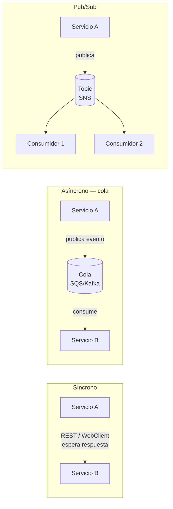
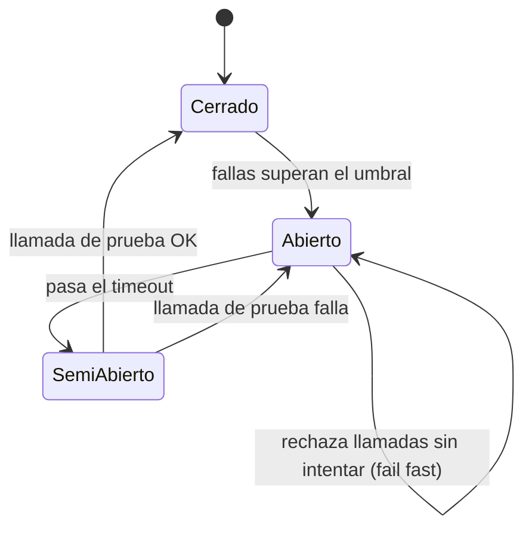
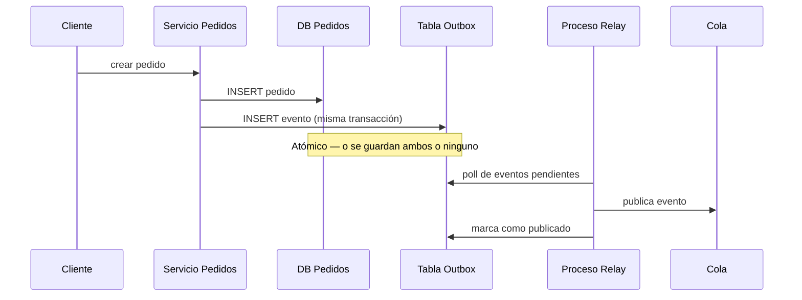
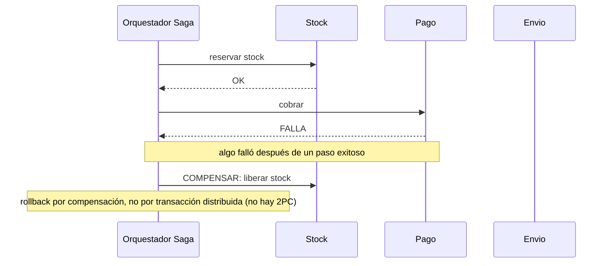
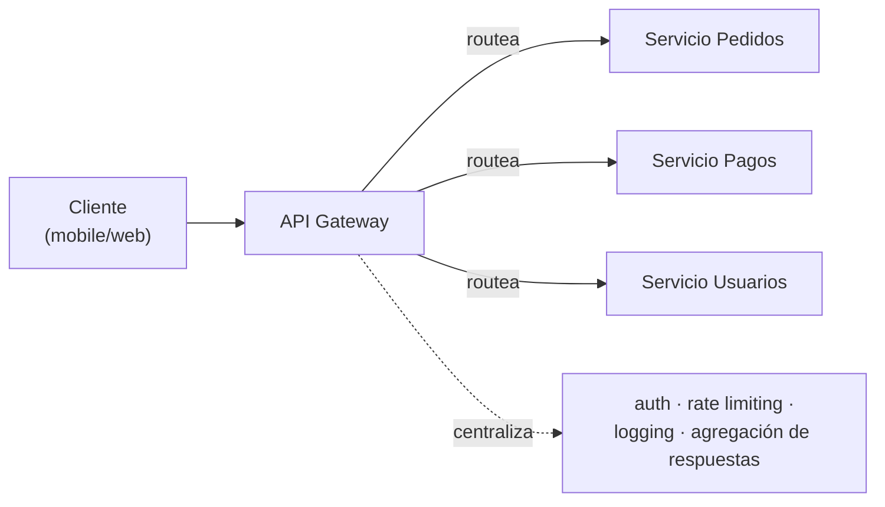
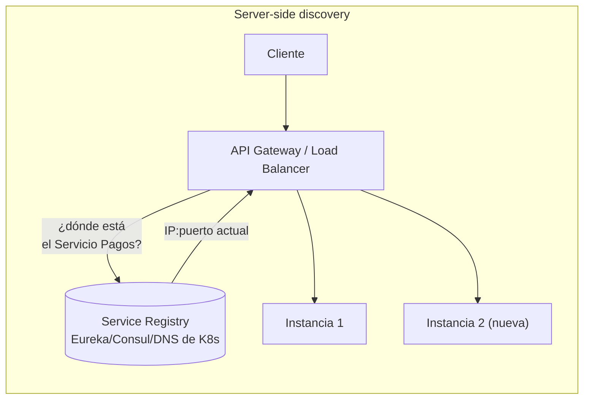
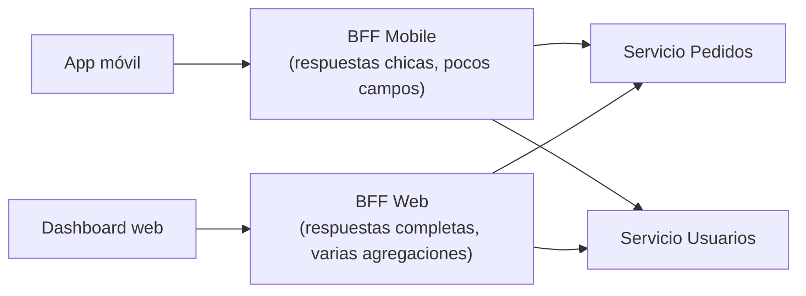
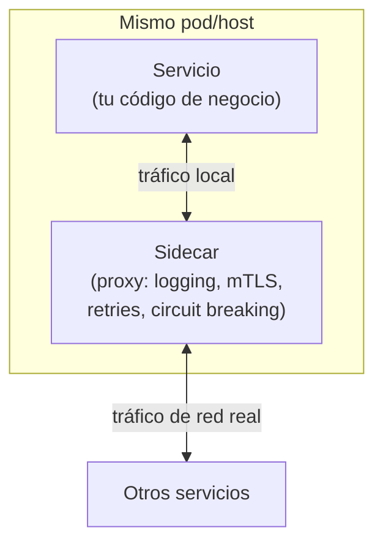
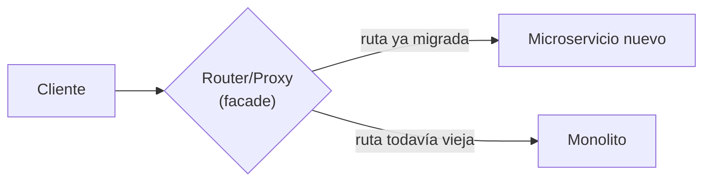

# Patrones de Arquitectura de Microservicios

Comunicación entre servicios, resiliencia, consistencia de datos y seguridad — lo que se evalúa cuando se pide justificar decisiones de arquitectura de microservicios, más allá de escribir el código de un servicio individual.

## 1. Comunicación entre microservicios

| Patrón | Cuándo | Trade-off |
|---|---|---|
| **Síncrono (REST/WebClient)** | El caller necesita la respuesta ya para continuar (ej: validar disponibilidad antes de confirmar una compra). | Acopla temporalmente a ambos servicios — si el otro cae, la request falla. |
| **Asíncrono (colas — SQS/Kafka)** | El caller no necesita la respuesta inmediata, o el proceso puede tardar (ej: enviar notificación, generar reporte). | Desacopla disponibilidad, pero suma complejidad (consistencia eventual, dead-letter queues). |
| **Pub/Sub (SNS/eventos de dominio)** | Un evento le interesa a varios consumidores sin que el emisor los conozca (ej: "PedidoConfirmado" → notificación + facturación + analítica). | El emisor no controla si todos los consumidores procesaron bien — necesita monitoreo. |

## 2. Resiliencia

*Circuit Breaker: los tres estados que hay que saber explicar.*

- **Circuit Breaker** (Resilience4j) — si un servicio downstream falla repetidamente, se cortan las llamadas por un tiempo (estado *Abierto*) en vez de seguir intentando y degradar todo el sistema.
- **Timeout + Retry con backoff** — nunca retry inmediato en loop; backoff exponencial + límite de intentos.
- **Bulkhead** — aislar pools de recursos (threads/conexiones) por dependencia, para que una lenta no agote los recursos de las demás.
- **Idempotencia** — un endpoint que puede recibir el mismo request dos veces (por retry del cliente o de una cola) debe producir el mismo resultado sin duplicar efectos. Se logra con una clave de idempotencia (`Idempotency-Key` header, o un ID de negocio único) chequeada antes de procesar.
- **Dead Letter Queue (DLQ)** — mensajes que fallan repetidamente en una cola van a una cola aparte para inspección manual, en vez de bloquear o perderse.

## 3. Consistencia de datos entre servicios

*Outbox pattern: cómo publicar un evento sin perderlo ni duplicarlo.*

*Saga: si un paso falla, no se hace rollback de base de datos — se ejecuta el paso inverso explícito del paso anterior.*

- **Saga pattern** — una transacción de negocio que cruza varios servicios se modela como una secuencia de pasos locales, cada uno con su "compensación" si algo falla después (ej: reservar stock → cobrar → si falla el cobro, liberar el stock). Puede ser **orquestada** (un coordinador central dice qué sigue) o **coreografiada** (cada servicio reacciona a eventos del anterior, sin coordinador) — orquestada es más fácil de seguir/debuggear; coreografiada es más desacoplada pero más difícil de rastrear "qué pasó" ante un bug.
- **Outbox pattern** — para publicar un evento de forma consistente con un cambio en la base de datos: se guarda el evento en una tabla "outbox" dentro de la misma transacción SQL, y un proceso aparte lo publica a la cola. Evita el problema de "guardé en DB pero no llegué a publicar el evento" (o viceversa).
- **Consistencia eventual** — aceptar que, tras un evento, otros servicios se actualizan "poco después" y no instantáneamente — es el trade-off central de ir event-driven en vez de una transacción distribuida (2PC, poco usada hoy por su costo operativo).

## 4. Patrones de acceso y despliegue — el resto del catálogo típico de entrevista

Cinco patrones que completan el catálogo clásico de "12 patrones de microservicios para entrevista de system design" — cada uno con su diagrama, para reconocerlo rápido.

### API Gateway

Un único punto de entrada para todos los clientes — centraliza lo que si no habría que repetir en cada servicio (auth, rate limiting, logging). El cliente nunca le habla directo a un microservicio.

### Service Discovery

Cada instancia se **registra sola** al arrancar (y se da de baja al caer) — nadie hardcodea una IP. El gateway/load balancer pregunta al registry "¿dónde está esto ahora?" en cada request. Sin esto, escalar horizontalmente (agregar instancias) requeriría reconfigurar manualmente a todo el que le habla a ese servicio.

### Load Balancing

Reparte tráfico entre instancias de un mismo servicio — algoritmos típicos: *round-robin* (una tras otra, por turno), *least connections* (a la que tiene menos carga activa), *IP hash* (mismo cliente siempre a la misma instancia, útil si hay estado de sesión local). En AWS es `ALB`/`NLB` (ver [`cloud-aws/`](../cloud-aws)) — acá el concepto es agnóstico de proveedor.

### Backends for Frontends (BFF)

Un API Gateway genérico termina siendo un compromiso incómodo entre lo que necesita un mobile (poco payload, pocas llamadas) y un dashboard web (mucho detalle). BFF resuelve esto con **un backend de agregación por tipo de cliente**, en vez de forzar una sola API a servir a todos igual.

### Sidecar

Un contenedor auxiliar corre **al lado** del servicio (mismo pod en K8s) manejando lo transversal (logging, mTLS, retries, circuit breaking) sin que el código de negocio lo implemente. Es la base de un *service mesh* (Istio, Linkerd) — todos los sidecars forman la malla de comunicación segura entre servicios.

### Strangler Fig

Migrar un monolito a microservicios **ruta por ruta**, detrás de un router que decide a cuál va cada request — nunca "reescribir todo y cortar el cable" de una vez. Con el tiempo, cada vez más rutas van al lado nuevo hasta que el monolito queda sin tráfico y se apaga. Es el mismo principio que ya se menciona en [`frameworks/spring-boot/webflux-advanced.md`](../frameworks/spring-boot/webflux-advanced.md) para refactors sin frenar el negocio.

## 5. API-first

- El contrato (OpenAPI/Swagger) se define **antes** de implementar — permite que frontend/otros equipos avancen en paralelo contra un mock del contrato.
- Versionado de API: `/v1/...` en el path (más simple de debuggear y cachear) vs versionado por header.
- Contratos explícitos de error (`ErrorResponse` con código, mensaje, detalle) — nunca devolver stack traces ni mensajes internos al cliente.

## 6. Seguridad (OWASP Top 10)

| Riesgo | Mitigación típica en un microservicio Java |
|---|---|
| Inyección (SQL) | Queries parametrizadas / ORM con bind params, nunca concatenar strings en SQL. |
| Autenticación/autorización rota | JWT validado en el gateway o filtro, scopes/roles verificados por endpoint, nunca confiar en un header sin validar firma. |
| Exposición de datos sensibles | HTTPS siempre, no loggear datos sensibles, encriptar en reposo si aplica. |
| Configuración de seguridad incorrecta | Secrets en un vault (ej. AWS Secrets Manager), no en `application.properties`; CORS restrictivo, no `*` en producción. |
| Validación de entrada insuficiente | Bean Validation (`@Valid`, `@NotNull`, `@Pattern`) en los DTOs de entrada del adaptador REST. |

## 7. Cómo justificar decisiones de arquitectura (trade-offs)

Estructura útil para responder este tipo de preguntas, sea en un ADR, un diseño o una entrevista:

1. Nombrar 2-3 opciones reales (no una sola "correcta").
2. Compararlas en una tabla mental: complejidad de setup, performance, debugabilidad, curva de adopción del equipo.
3. Concluir con el contexto: "para este caso, con este volumen/equipo/plazo, elijo X porque...".

Ejemplos de preguntas que calzan en este formato:
- REST vs gRPC vs eventos (colas) para comunicación entre dos servicios.
- SQL vs NoSQL para un dominio dado.
- Monolito modular vs microservicios para un equipo chico — microservicios prematuros son un costo, no una ventaja, si el equipo es chico y el dominio no está bien delimitado todavía.

## Drills de repaso (para responder en voz alta, cronometrado)

| Tiempo | Pregunta |
|---|---|
| 4 min | "Dos microservicios necesitan que un cambio en uno dispare una acción en el otro. ¿Síncrono o asíncrono? Justificá con un ejemplo." |
| 5 min | "¿Cómo evitás procesar un pago duplicado si el cliente reintenta la misma request por timeout?" (idempotencia) |
| 5 min | "Un servicio downstream empieza a responder lento y satura tus threads. ¿Qué patrón aplicás?" (circuit breaker / bulkhead / timeout) |
| 6 min | "Necesitás que, al confirmar un pedido, se dispare una notificación sin bloquear la respuesta al usuario. Diseñá el flujo." |
| 5 min | "¿Cuándo NO usarías microservicios?" |
| 6 min | "Explicá el outbox pattern como si hablaras con alguien de Producto." |
| 5 min | "¿Cómo hace un load balancer para saber a qué instancia mandar tráfico si escalaste de 2 a 5 instancias hace 10 segundos?" (service discovery) |
| 5 min | "Una app mobile y un dashboard web consumen el mismo dominio, pero el mobile se queja de payloads gigantes. ¿Qué patrón aplicás?" (BFF) |
| 6 min | "Migrá (en palabras) un endpoint de un monolito a un microservicio nuevo, sin downtime, ruta por ruta." (strangler fig) |

Relacionado: [`hexagonal-architecture.md`](../software-architectures/hexagonal-architecture.md) para la estructura interna de cada servicio, [`frameworks/spring-boot/webflux.md`](../frameworks/spring-boot/webflux.md) para cómo se implementa la comunicación no bloqueante, [`cloud-aws/`](../cloud-aws) para los servicios AWS que sostienen estos patrones (SQS, SNS, DynamoDB, API Gateway, ALB), y [`ddd/cqrs.md`](../ddd/cqrs.md) para CQRS en profundidad (acá solo se cubren los patrones de comunicación/resiliencia/despliegue, CQRS es modelado de dominio).

## Referencias

- Richardson, C. — *Microservices Patterns* (2018) — fuente principal de los patrones de resiliencia, saga y outbox documentados acá.
- [microservices.io](https://microservices.io/patterns/microservices.html) (del mismo autor) — catálogo completo de patrones, organizado por categoría (colaboración, comunicación, datos, API/discovery, testing, resiliencia, seguridad, observabilidad, UI, despliegue) — la sección 4 de este documento cubre el subconjunto que más se repite en entrevistas de system design.
