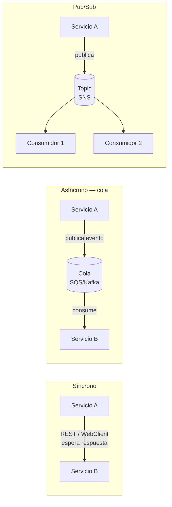
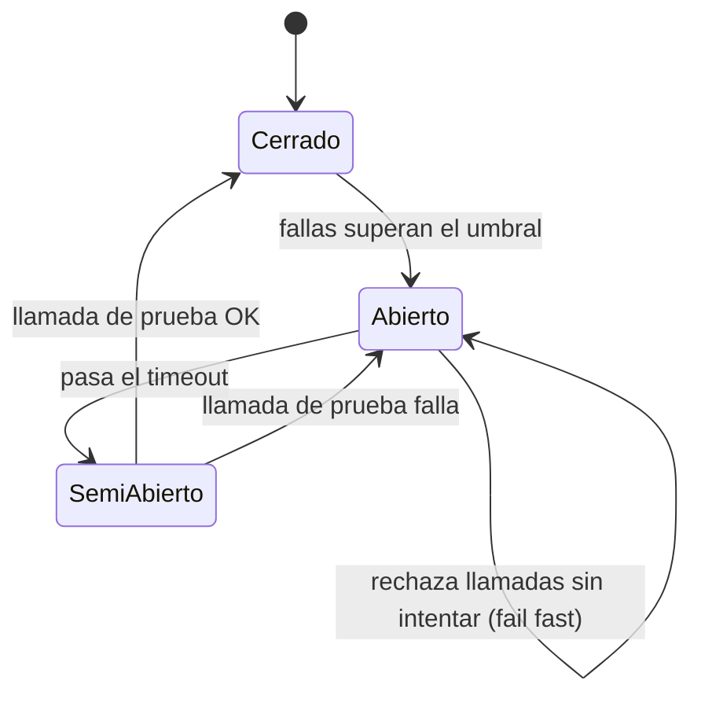
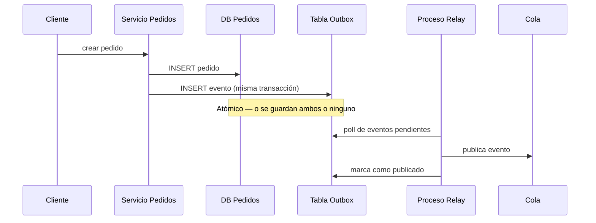

# Patrones de Arquitectura de Microservicios

Comunicación entre servicios, resiliencia, consistencia de datos y seguridad — lo que se evalúa cuando se pide justificar decisiones de arquitectura de microservicios, más allá de escribir el código de un servicio individual.

## 1. Comunicación entre microservicios

| Patrón | Cuándo | Trade-off |
|---|---|---|
| **Síncrono (REST/WebClient)** | El caller necesita la respuesta ya para continuar (ej: validar disponibilidad antes de confirmar una compra). | Acopla temporalmente a ambos servicios — si el otro cae, la request falla. |
| **Asíncrono (colas — SQS/Kafka)** | El caller no necesita la respuesta inmediata, o el proceso puede tardar (ej: enviar notificación, generar reporte). | Desacopla disponibilidad, pero suma complejidad (consistencia eventual, dead-letter queues). |
| **Pub/Sub (SNS/eventos de dominio)** | Un evento le interesa a varios consumidores sin que el emisor los conozca (ej: "PedidoConfirmado" → notificación + facturación + analítica). | El emisor no controla si todos los consumidores procesaron bien — necesita monitoreo. |

## 2. Resiliencia

*Circuit Breaker: los tres estados que hay que saber explicar.*

- **Circuit Breaker** (Resilience4j) — si un servicio downstream falla repetidamente, se cortan las llamadas por un tiempo (estado *Abierto*) en vez de seguir intentando y degradar todo el sistema.
- **Timeout + Retry con backoff** — nunca retry inmediato en loop; backoff exponencial + límite de intentos.
- **Bulkhead** — aislar pools de recursos (threads/conexiones) por dependencia, para que una lenta no agote los recursos de las demás.
- **Idempotencia** — un endpoint que puede recibir el mismo request dos veces (por retry del cliente o de una cola) debe producir el mismo resultado sin duplicar efectos. Se logra con una clave de idempotencia (`Idempotency-Key` header, o un ID de negocio único) chequeada antes de procesar.
- **Dead Letter Queue (DLQ)** — mensajes que fallan repetidamente en una cola van a una cola aparte para inspección manual, en vez de bloquear o perderse.

## 3. Consistencia de datos entre servicios

*Outbox pattern: cómo publicar un evento sin perderlo ni duplicarlo.*

- **Saga pattern** — una transacción de negocio que cruza varios servicios se modela como una secuencia de pasos locales, cada uno con su "compensación" si algo falla después (ej: reservar stock → cobrar → si falla el cobro, liberar el stock).
- **Outbox pattern** — para publicar un evento de forma consistente con un cambio en la base de datos: se guarda el evento en una tabla "outbox" dentro de la misma transacción SQL, y un proceso aparte lo publica a la cola. Evita el problema de "guardé en DB pero no llegué a publicar el evento" (o viceversa).
- **Consistencia eventual** — aceptar que, tras un evento, otros servicios se actualizan "poco después" y no instantáneamente — es el trade-off central de ir event-driven en vez de una transacción distribuida (2PC, poco usada hoy por su costo operativo).

## 4. API-first

- El contrato (OpenAPI/Swagger) se define **antes** de implementar — permite que frontend/otros equipos avancen en paralelo contra un mock del contrato.
- Versionado de API: `/v1/...` en el path (más simple de debuggear y cachear) vs versionado por header.
- Contratos explícitos de error (`ErrorResponse` con código, mensaje, detalle) — nunca devolver stack traces ni mensajes internos al cliente.

## 5. Seguridad (OWASP Top 10)

| Riesgo | Mitigación típica en un microservicio Java |
|---|---|
| Inyección (SQL) | Queries parametrizadas / ORM con bind params, nunca concatenar strings en SQL. |
| Autenticación/autorización rota | JWT validado en el gateway o filtro, scopes/roles verificados por endpoint, nunca confiar en un header sin validar firma. |
| Exposición de datos sensibles | HTTPS siempre, no loggear datos sensibles, encriptar en reposo si aplica. |
| Configuración de seguridad incorrecta | Secrets en un vault (ej. AWS Secrets Manager), no en `application.properties`; CORS restrictivo, no `*` en producción. |
| Validación de entrada insuficiente | Bean Validation (`@Valid`, `@NotNull`, `@Pattern`) en los DTOs de entrada del adaptador REST. |

## 6. Cómo justificar decisiones de arquitectura (trade-offs)

Estructura útil para responder este tipo de preguntas, sea en un ADR, un diseño o una entrevista:

1. Nombrar 2-3 opciones reales (no una sola "correcta").
2. Compararlas en una tabla mental: complejidad de setup, performance, debugabilidad, curva de adopción del equipo.
3. Concluir con el contexto: "para este caso, con este volumen/equipo/plazo, elijo X porque...".

Ejemplos de preguntas que calzan en este formato:
- REST vs gRPC vs eventos (colas) para comunicación entre dos servicios.
- SQL vs NoSQL para un dominio dado.
- Monolito modular vs microservicios para un equipo chico — microservicios prematuros son un costo, no una ventaja, si el equipo es chico y el dominio no está bien delimitado todavía.

## Drills de repaso (para responder en voz alta, cronometrado)

| Tiempo | Pregunta |
|---|---|
| 4 min | "Dos microservicios necesitan que un cambio en uno dispare una acción en el otro. ¿Síncrono o asíncrono? Justificá con un ejemplo." |
| 5 min | "¿Cómo evitás procesar un pago duplicado si el cliente reintenta la misma request por timeout?" (idempotencia) |
| 5 min | "Un servicio downstream empieza a responder lento y satura tus threads. ¿Qué patrón aplicás?" (circuit breaker / bulkhead / timeout) |
| 6 min | "Necesitás que, al confirmar un pedido, se dispare una notificación sin bloquear la respuesta al usuario. Diseñá el flujo." |
| 5 min | "¿Cuándo NO usarías microservicios?" |
| 6 min | "Explicá el outbox pattern como si hablaras con alguien de Producto." |

Relacionado: [`hexagonal-architecture.md`](../software-architectures/hexagonal-architecture.md) para la estructura interna de cada servicio, [`reactive-programming/`](../reactive-programming) para cómo se implementa la comunicación no bloqueante, y [`cloud-aws/`](../cloud-aws) para los servicios AWS que sostienen estos patrones (SQS, SNS, DynamoDB).

## Referencias

- Richardson, C. — *Microservices Patterns* (2018) — fuente principal de los patrones de resiliencia, saga y outbox documentados acá.
- [microservices.io](https://microservices.io/patterns/index.html) (del mismo autor) — catálogo online de referencia rápida.
