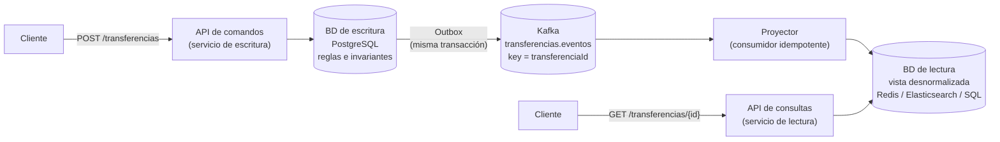
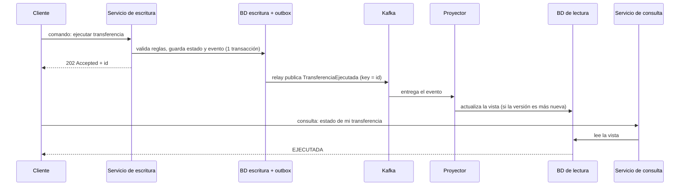
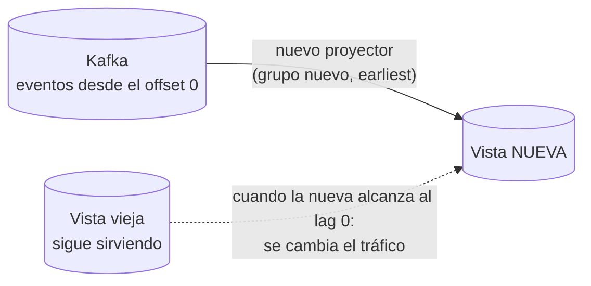

# CQRS en microservicios (con Kafka)

**CQRS** (*Command Query Responsibility Segregation*): **separar quién cambia los datos de quién los consulta**, cada uno con su propio modelo, y mantenerlos sincronizados con **eventos**. Aquí se ve como **patrón de microservicios**, con Kafka como pegamento.

> Esta página es la versión de **arquitectura de microservicios**. El CQRS como **modelado de dominio** (puertos, agregados, niveles de separación en el mismo servicio) está en [`../ddd/cqrs.md`](../ddd/cqrs.md). Relacionado: [`README.md`](README.md) (Outbox, Saga, resiliencia) · [`../messaging-streaming/kafka.md`](../messaging-streaming/kafka.md) · [`../system-design/caso-transferencias-asincronas.md`](../system-design/caso-transferencias-asincronas.md).

## 🍎 Con manzanas (empieza aquí)

En la frutería tienes dos cosas distintas:
- **El libro de ventas** (escribir): cada venta se anota con cuidado, con todas las reglas (no vender más de lo que hay, no cobrar dos veces). Es lento y estricto porque **no se puede equivocar**.
- **La pizarra de resumen** (consultar): "hoy vendimos 120 manzanas, el pedido de Ana está **despachado**". Es **rápida y fácil de leer**, y la actualiza un empleado **cada vez que se anota algo en el libro**.

Si todos los clientes preguntaran "¿cómo va mi pedido?" **leyendo el libro de ventas**, la caja se atascaría. Con la pizarra, preguntan sin estorbar a quien está vendiendo. **Eso es CQRS.** El truco: la pizarra puede ir **un segundo detrás** del libro (**consistencia eventual**).

| Pieza | En la frutería |
|---|---|
| **Comando** (*command*) | "Registra esta venta" (cambia algo) |
| **Consulta** (*query*) | "¿Cómo va mi pedido?" (solo lee) |
| **Modelo de escritura** | El libro de ventas, con todas las reglas |
| **Modelo de lectura** (*vista*) | La pizarra de resumen |
| **Evento en Kafka** | La nota "se vendió X" que le avisa a quien actualiza la pizarra |
| **Proyector** | El empleado que actualiza la pizarra cuando llega la nota |
| **Consistencia eventual** | La pizarra se actualiza un instante después |

### Qué debes dominar según tu nivel

| Nivel | Debes poder explicar |
|---|---|
| 🟢 **Junior** | Qué es un comando y qué es una consulta; por qué separar escribir de leer; el ejemplo de la pizarra |
| 🟡 **Mid** | El flujo con Kafka (comando → BD → evento → proyector → vista); consistencia eventual; idempotencia del proyector; cuándo sí y cuándo no |
| 🔴 **Senior** | Orden y duplicados en el proyector, reconstruir vistas con *replay*, *read-your-writes*, Outbox, evolución de esquemas, CQRS sin y con Event Sourcing, costo operativo |

## 1. El problema que resuelve

| Síntoma | Por qué pasa | Cómo ayuda CQRS |
|---|---|---|
| Las consultas **frenan** las escrituras | Leer y escribir compiten por la misma tabla y los mismos índices | Cada lado en su propia base, escalado por separado |
| Una pantalla necesita **datos de 4 servicios** | Hay que hacer 4 llamadas y unir (*join*) al vuelo | Una **vista ya armada** con todo junto |
| El modelo de escritura es **complejo** (reglas, agregados) y la lectura solo quiere **4 campos** | Un solo modelo no sirve bien a los dos | Modelo plano y rápido para leer |
| Hay **muchísimas más lecturas que escrituras** | Escalar la base entera es caro | Escalar solo la vista de lectura (réplicas, caché, búsqueda) |
| Necesitas **búsqueda o agregaciones** que la BD transaccional no hace bien | PostgreSQL no es un buscador | La vista vive en Elasticsearch, Azure AI Search o similar |

## 2. Arquitectura con Kafka



**Cómo contarlo:** "El **comando** pasa por el servicio de escritura, que valida las reglas y guarda en su base de datos; con **Outbox** publica un **evento** en Kafka. Un **proyector** consume ese evento y **actualiza una vista** pensada para consultar, en la base que mejor encaje. Las **consultas** leen solo de esa vista. La vista va un instante detrás: es **consistencia eventual**."

### El mismo flujo, paso a paso



## 3. Las reglas de oro del proyector (donde se rompe CQRS)

El proyector es un **consumidor de Kafka**, así que hereda todos sus problemas: la entrega es *at-least-once*, pueden llegar **duplicados** y el orden solo vale **por partición**.

| Problema | Qué pasa | Solución |
|---|---|---|
| **Duplicados** | El mismo evento llega 2 veces | **Idempotente**: aplicar el mismo evento dos veces deja la misma vista |
| **Desorden** | Un evento viejo llega después de uno nuevo y pisa el estado | **`key = id de la entidad`** (orden por partición) y **número de versión** en el evento; solo se aplica si es mayor |
| **Pérdida** | El evento no llega a Kafka | **Outbox** en el lado de escritura |
| **Vista corrupta o nueva** | Cambió el diseño de la vista o hubo un bug | **Reconstruir**: releer los eventos desde el principio (*replay*) |
| **Evento que siempre falla** | Bloquea al proyector | Reintentos y **DLQ** con alerta |
| **Esquema cambió** | El evento nuevo rompe al proyector | Schema Registry y cambios compatibles |

**La técnica clave (upsert con versión)**, para ser a la vez idempotente y a prueba de desorden:

```sql
INSERT INTO vista_transferencia (id, estado, monto, version)
VALUES (:id, :estado, :monto, :version)
ON CONFLICT (id) DO UPDATE
   SET estado = EXCLUDED.estado, monto = EXCLUDED.monto, version = EXCLUDED.version
 WHERE vista_transferencia.version < EXCLUDED.version;   -- ignora duplicados y eventos viejos
```

```java
// Quarkus + SmallRye (proyector)
@Incoming("transferencias-eventos")
@Blocking
@Transactional
public void proyectar(TransferenciaEvento e) {
    vistaRepo.upsertSiEsMasNuevo(e.id(), e.estado(), e.monto(), e.version());
}
// Spring: @KafkaListener(topics = "transferencias.eventos", groupId = "vista-transferencias")
```

### Reconstruir una vista (replay)



Para poder releer necesitas **retención suficiente** o un topic **compactado** (ojo: Azure Event Hubs **no implementa compactación**; ver [`../messaging-streaming/kafka.md`](../messaging-streaming/kafka.md)). Por eso el **log de eventos** es una de las mayores ventajas de Kafka frente a una cola.

## 4. El costo real: consistencia eventual y *read-your-writes*

**El problema típico:** el usuario hace una transferencia, la pantalla se recarga y **todavía no aparece** (la vista va un instante atrás).

| Estrategia | Cómo |
|---|---|
| **Devolver el resultado en el comando** | La respuesta ya trae el estado y el id; la pantalla lo muestra sin consultar |
| **UI optimista** | La interfaz muestra el cambio al instante y se corrige si hace falta |
| **Token de versión** | El cliente envía la versión que espera; la consulta espera o reintenta hasta que la vista la alcance |
| **Leer del modelo de escritura** un rato | Para esa entidad recién modificada, consultar la BD de escritura |
| **Aviso en tiempo real** | Notificar a la UI cuando la vista se actualice (WebSocket, Web PubSub, Redis pub/sub) |

> **Tu proyecto lo hacía a medias:** en tus servicios de transferencias, la bandeja del usuario era una **vista** y el aviso por **Redis pub/sub** era justo la estrategia de "notificar a la UI cuando cambia el estado". Es CQRS aplicado sin nombrarlo. Ver [`../system-design/caso-transferencias-asincronas.md`](../system-design/caso-transferencias-asincronas.md).

## 5. Variantes y relaciones

| Variante | Qué es | Cuándo |
|---|---|---|
| **Nivel 1: mismo servicio y BD, casos de uso separados** | Solo se separa el código (ver [`../ddd/cqrs.md`](../ddd/cqrs.md)) | **Empieza aquí**: casi siempre alcanza |
| **Nivel 2: vista o tabla de lectura en la misma BD** | Se actualiza en la misma transacción | Consultas costosas, sin dos bases |
| **Nivel 3: BD distintas + Kafka** | Lo de esta página | Carga de lectura muy alta, o un motor distinto (búsqueda) |
| **CQRS + Event Sourcing** | El estado **es** la suma de eventos; las vistas se derivan de ellos | Auditoría fuerte, reconstrucción histórica; **añade mucha complejidad** |
| **API Composition** (alternativa) | Un servicio llama a varios y une los datos **al vuelo**, sin vista propia | Pocas consultas o datos que cambian poco; evita duplicar datos |

**CQRS no implica Event Sourcing** (se combinan bien, pero son independientes) y **no es lo mismo que "un DTO distinto"**.

## 6. ¿Cuándo sí y cuándo no?

| ✅ Sí, cuando... | ❌ No, cuando... |
|---|---|
| Lecturas **mucho más frecuentes** que escrituras | Es un **CRUD simple** |
| Las consultas necesitan datos de **varios servicios** | El equipo no puede asumir la **consistencia eventual** |
| La consulta necesita **otro motor** (búsqueda, agregaciones) | Hay un solo servicio y poca carga |
| El modelo de escritura es **complejo** y el de lectura **plano** | Se necesita **leer siempre lo último que se escribió** sin excepciones |
| Quieres **escalar la lectura por separado** | No hay quien opere Kafka y los proyectores |

**Costos:** más piezas (proyector, segunda base), datos **duplicados**, consistencia eventual, y hay que **monitorear el lag del proyector**. La regla: **empezar en el nivel 1 y subir solo con evidencia** (YAGNI).

## 7. En la nube (Azure primero)

| Pieza | **Azure** | AWS | GCP |
|---|---|---|---|
| BD de escritura | Azure SQL / PostgreSQL / **Cosmos DB** | Aurora PostgreSQL / DynamoDB | Cloud SQL / Spanner |
| Eventos | **Event Hubs** (log releíble) o Service Bus | MSK / Kinesis / SNS+SQS | Pub/Sub / Kafka gestionado |
| Publicar sin perder (Outbox/CDC) | Relay propio o **Cosmos DB change feed** | DynamoDB Streams / DMS | Datastream / change streams de Spanner |
| Proyector | **Functions** con trigger de Event Hubs, o Container Apps | Lambda / ECS | Cloud Run |
| BD de lectura | **Cosmos DB**, **Azure AI Search**, **Azure Cache for Redis**, réplica de Azure SQL | DynamoDB, OpenSearch, ElastiCache | Firestore, BigQuery, Memorystore |
| Aviso a la UI | **Web PubSub / SignalR** | AppSync / API Gateway WebSocket | Firebase / Pub/Sub |
| Monitorear el lag | **Application Insights** / métricas de Event Hubs | CloudWatch | Cloud Monitoring |

> Los nombres de servicios cambian: confírmalos antes de citarlos. Más equivalencias entre nubes: [`../system-design/caso-pasarela-pagos-cloud.md`](../system-design/caso-pasarela-pagos-cloud.md).

## 8. Cómo se ve en hexagonal y en pruebas

- **Hexagonal:** el servicio de escritura tiene **puertos de entrada de comandos** (`EjecutarTransferenciaUseCase`) y **puertos de salida** (repositorio, publicador de eventos con Outbox). El servicio de consulta tiene **puertos de entrada de consultas** (`ConsultarEstadoQuery`) y su repositorio de **vista**. El proyector es un **adaptador de entrada** (Kafka) que llama a un caso de uso "actualizar vista". Ver [`../software-architectures/hexagonal-architecture.md`](../software-architectures/hexagonal-architecture.md).
- **Pruebas:** el **proyector** se prueba con eventos duplicados y desordenados (que la vista quede igual), con `InMemoryConnector` (SmallRye) o Testcontainers de Kafka y PostgreSQL ([`../tdd/junit5-mockito.md`](../tdd/junit5-mockito.md)).

## 9. Cómo contarlo en la entrevista (60 segundos)

> "CQRS separa los **comandos**, que cambian el estado y protegen las reglas de negocio, de las **consultas**, que solo leen de una **vista** pensada para eso. Con Kafka, el servicio de escritura guarda y publica un evento con **Outbox**, y un **proyector** actualiza la vista. Lo que hay que cuidar es que el proyector sea **idempotente y tolere el desorden**, usando la entidad como key y una **versión** para aplicar solo lo más nuevo, y aceptar la **consistencia eventual**: por ejemplo, devolviendo el resultado en la respuesta del comando. Empezaría separando casos de uso en el mismo servicio y solo pasaría a bases distintas si la carga de lectura lo justifica."

### Escalera de respuesta

| Pregunta | 🟢 Junior | 🟡 Mid | 🔴 Senior |
|---|---|---|---|
| **¿Qué es CQRS?** | "Separar quién escribe de quién consulta, para que cada uno sea más rápido." | "Un modelo para comandos y otro para consultas; con Kafka, los eventos actualizan la vista de lectura." | "Es un compromiso: gano escala de lectura y modelos adecuados, pago consistencia eventual y más piezas; empiezo simple y subo con evidencia." |
| **¿Cómo mantienes sincronizada la vista?** | "Con eventos." | "El servicio publica con Outbox y un proyector idempotente actualiza la vista." | "Key por entidad, versión para ignorar duplicados y desorden, DLQ, y reconstrucción por *replay*." |
| **¿Qué pasa si el usuario consulta justo después de escribir?** | "Puede no ver el cambio todavía." | "Devuelvo el estado en el comando o uso UI optimista." | "Token de versión o leer del modelo de escritura un rato; y monitoreo el lag del proyector." |
| **¿CQRS es lo mismo que Event Sourcing?** | "No." | "No: se combinan bien, pero CQRS no lo exige." | "Event Sourcing añade auditoría y reconstrucción, a costa de mucha complejidad; no lo uso salvo que haya una razón fuerte." |
| **¿Cuándo no lo usarías?** | "En un CRUD simple." | "Cuando no se tolera consistencia eventual." | "Y cuando el equipo no puede operar la segunda base y el proyector: el costo supera el beneficio." |

## 10. Preguntas de revisión

| Tiempo | Pregunta |
|---|---|
| 4 min | "Tu pantalla de órdenes es lenta porque consulta 4 servicios. ¿Qué patrón aplicas y cómo lo mantienes actualizado?" |
| 5 min | "Un evento viejo llega después de uno nuevo y deja la vista con un estado incorrecto. ¿Cómo lo evitas?" |
| 5 min | "Cambió el diseño de la vista. ¿Cómo la reconstruyes sin parar el servicio?" |
| 4 min | "¿Por qué el usuario no ve su cambio recién guardado y qué haces?" |
| 5 min | "CQRS vs API Composition: ¿cuándo cada uno?" |

## Referencias

- Richardson, C. — *Microservices Patterns*: [CQRS](https://microservices.io/patterns/data/cqrs.html) y [API Composition](https://microservices.io/patterns/data/api-composition.html).
- Young, G. — origen del término CQRS.
- [Martin Fowler — CQRS](https://martinfowler.com/bliki/CQRS.html).
