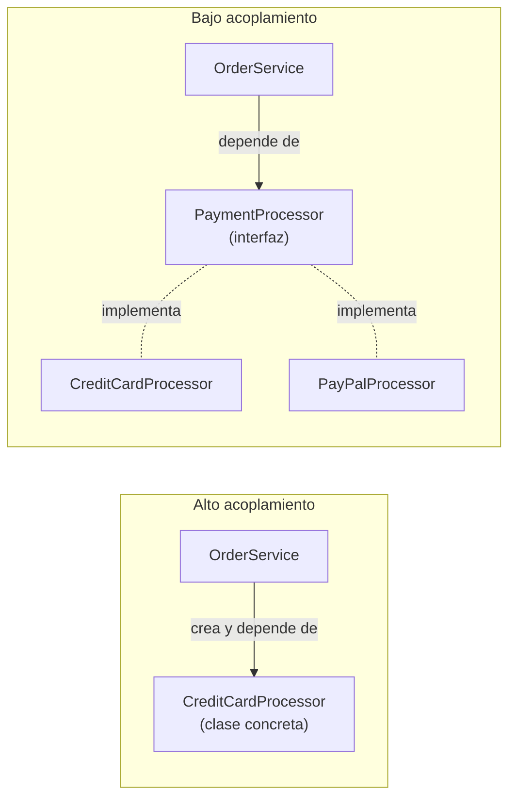
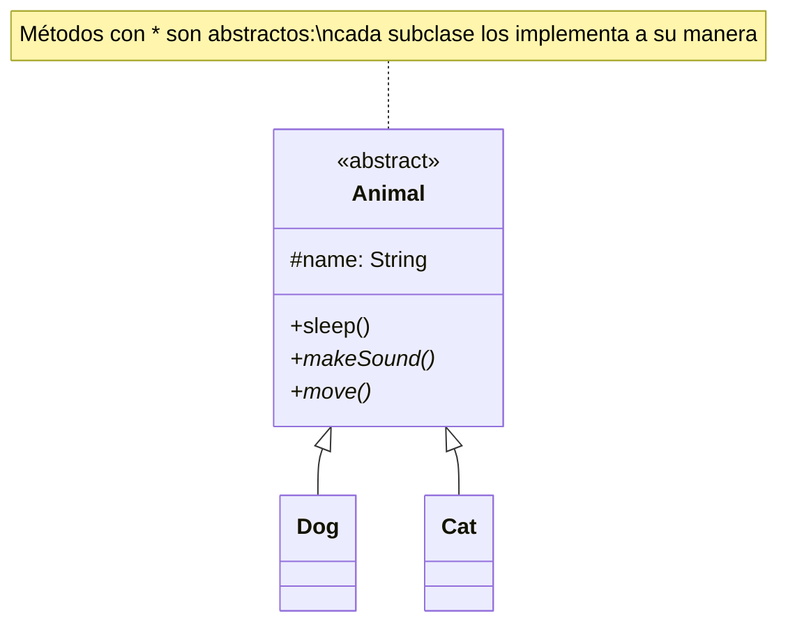
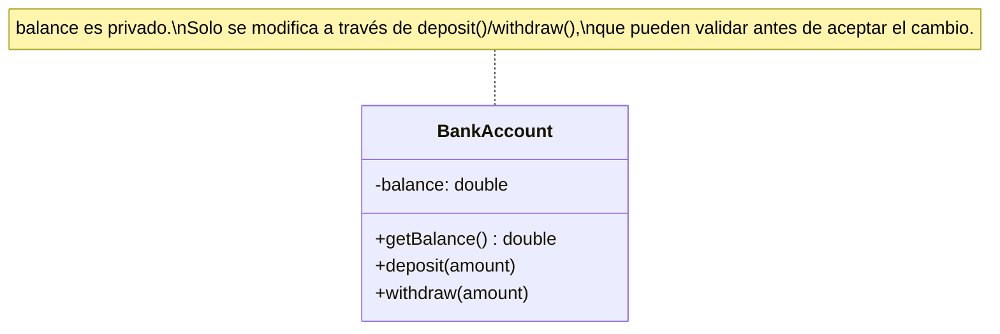
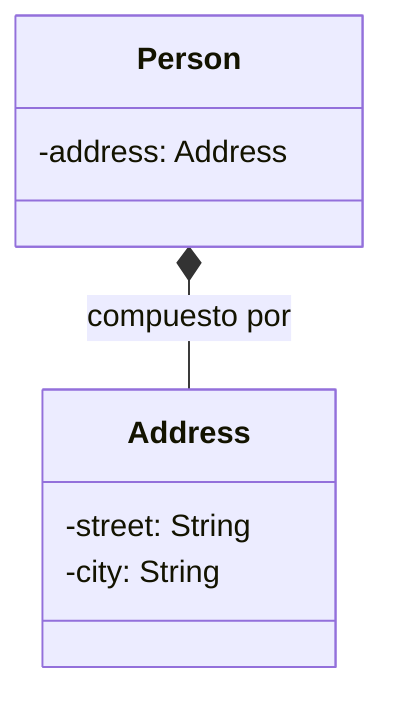
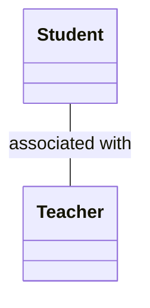
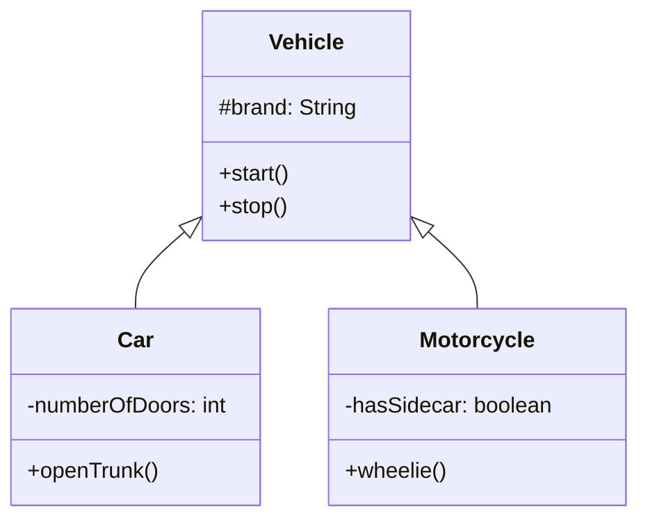
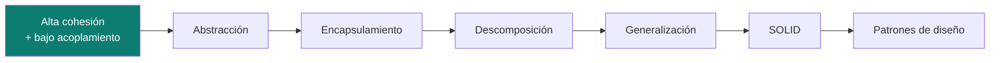

# Fundamentos de Programación Orientada a Objetos (OOP)

Los pilares y principios de diseño orientado a objetos, en abstracto — aplican igual en Java, Python, TypeScript o cualquier lenguaje con clases. La notación UML de las relaciones (herencia, asociación, agregación, composición) está en [`uml/`](../uml); acá el foco es el *concepto*, no la sintaxis de un lenguaje puntual.

## Cohesión y acoplamiento — la regla de oro

> 🧠 **Píldora:** buscar **alta cohesión** (una clase, un propósito) y **bajo acoplamiento** (depender de abstracciones, no de implementaciones concretas).

| Cohesión | Acoplamiento | Resultado |
|---|---|---|
| Alta ✅ | Bajo ✅ | **Ideal** — clases bien diseñadas |
| Alta ✅ | Alto ❌ | Bueno, pero difícil de cambiar |
| Baja ❌ | Bajo ✅ | Flexible, pero difícil de entender |
| Baja ❌ | Alto ❌ | **Peor** — código difícil de mantener |

**Cohesión** mide qué tan relacionadas están las responsabilidades dentro de una clase. Una clase con métodos que no tienen relación entre sí (enviar email, calcular impuestos, formatear fechas) tiene baja cohesión — son responsabilidades que deberían vivir en clases separadas.

**Acoplamiento** mide cuánto depende una clase de los detalles internos de otra. Depender de una **interfaz** en vez de una clase concreta es la forma más directa de bajar el acoplamiento — permite cambiar la implementación sin tocar al que la usa (la base de Dependency Inversion, ver [`solid-principles/`](../solid-principles)).

## Abstracción

Ocultar los detalles de implementación y exponer solo lo esencial. Se logra con **clases abstractas** (contrato + implementación parcial compartida) o **interfaces** (contrato puro).

| | Clase abstracta | Interfaz |
|---|---|---|
| Métodos concretos | Sí | Solo con implementación por defecto (según el lenguaje) |
| Variables de instancia | Sí | No (solo constantes) |
| Herencia múltiple | No | Sí (una clase puede implementar varias) |

> 🧠 **Píldora — cuándo usar cada una:** clase abstracta cuando las clases hijas comparten una relación **"es-un"** fuerte y código en común. Interfaz cuando el contrato lo pueden cumplir clases sin relación entre sí (relación **"puede-hacer"**).

## Encapsulamiento

Ocultar el estado interno de una clase y controlar el acceso a través de métodos públicos, en vez de exponer los atributos directamente.

- Acceso controlado permite **validar** antes de aceptar un cambio (`withdraw` rechaza un monto mayor al balance).
- Devolver una **copia defensiva** de una colección interna evita que quien la recibe la modifique por fuera de la clase.
- No todo necesita un setter — si un atributo no debería cambiar después de creado, alcanza con el getter.

## Descomposición y separación de responsabilidades

Dividir un problema complejo en partes más chicas y manejables, cada una con una responsabilidad clara — en vez de una clase monolítica que hace de todo.

> 🧠 **Píldora — el ejemplo del supermercado:** un supermercado tiene secciones separadas (carnicería, panadería, cajas) en vez de que una sola persona haga todo. Cada sección se enfoca en su tarea; el sistema completo funciona mejor por esa separación. Lo mismo aplica a clases: separar `Camera` de `Phone` en vez de una clase `SmartDevice` que hace ambas cosas permite cambiar una sin afectar la otra.

## Asociación

La relación más general entre dos clases — se conocen y colaboran, sin que una sea dueña de la otra.

- Puede ser bidireccional (ambas clases se conocen) o unidireccional.
- Es **débil**: no hay dependencia de ciclo de vida — un `Student` sigue existiendo si el `Teacher` deja de existir.
- Ver [`uml/`](../uml) para la diferencia con agregación y composición, que son casos especiales de asociación.

## Generalización (herencia)

Extraer características comunes de varias clases relacionadas hacia una superclase — el proceso inverso a la especialización.

- Las subclases heredan comportamiento común y agregan (o sobrescriben) lo específico.
- Habilita **polimorfismo**: tratar `Car` y `Motorcycle` de forma uniforme a través del tipo `Vehicle`.
- Riesgo a vigilar: si una subclase tiene que "romper" el contrato heredado (lanzar una excepción en un método que no le aplica), viola Liskov Substitution — ver [`solid-principles/`](../solid-principles).

## Cómo se conecta todo

Estos fundamentos son la base sobre la que se construyen [`solid-principles/`](../solid-principles) (reglas más concretas) y [`design-pattern/`](../design-pattern) (soluciones ya probadas a problemas recurrentes de diseño).

## Referencias

- Booch, G. et al. — *Object-Oriented Analysis and Design with Applications* (3ra ed.) — origen de cohesión/acoplamiento y los pilares de OOP como se documentan acá.
- Meyer, B. — *Object-Oriented Software Construction* — formalización de encapsulamiento y abstracción como principios de diseño, no solo de sintaxis.
