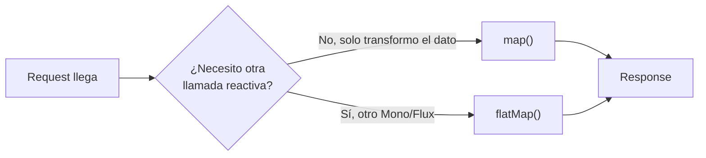

# Programación Reactiva (Java / Spring WebFlux)

Apuntes de repaso sobre Project Reactor y Spring WebFlux — la parte que más rápido se oxida si no se usa seguido, porque las decisiones (`map` vs `flatMap`, qué operador de error usar) dependen de reconocer el patrón, no de memoria pura.

## Idea central



El objetivo de todo el paradigma es **no bloquear el event loop**. Un solo `.block()`, o una llamada JPA/JDBC clásica dentro de un pipeline reactivo, anula la ventaja de usar WebFlux.

## Mono vs Flux

- **`Mono<T>`** — 0 o 1 elemento. Un `findById`, el resultado de un `POST`, una respuesta de otro servicio.
- **`Flux<T>`** — 0..N elementos. Un `findAll`, un stream de eventos, una lista paginada.

## map vs flatMap — la pregunta más frecuente

| Operador | Cuándo | Firma mental |
|---|---|---|
| `map` | Transformación **síncrona** pura, sin I/O. Cambiás el tipo o el valor, nada más. | `T -> R` |
| `flatMap` | La transformación **devuelve otro Mono/Flux** — otra llamada reactiva (otro servicio, otra query R2DBC). | `T -> Mono<R>` |
| `flatMapMany` | Desde un `Mono`, expandís a `Flux` (ej: traés una orden y devolvés sus líneas). | `T -> Flux<R>` |
| `concatMap` | Como `flatMap` pero preserva el orden de emisión — más lento, útil cuando el orden importa (auditoría, pagos). | `T -> Mono<R>` ordenado |

> **Señal de alarma:** un `Mono` anidado dentro de un `map` (`map(x -> otroServicio.buscar(x))`, que da `Mono<Mono<R>>`) siempre debía ser `flatMap`. Es el error más común y el más fácil de detectar en un code review.

```java
// map: transformación pura, sin llamada externa
Mono<OrderResponse> response = order
    .map(o -> new OrderResponse(o.id(), o.status()));

// flatMap: encadena otra llamada reactiva
Mono<InventoryData> inventory = inventoryPort.check(sku)   // ya es Mono<InventoryData>
    .flatMap(data -> pricingService.calculate(data));       // calculate() devuelve Mono<Price>
```

## Manejo de errores — cheat sheet

| Operador | Uso |
|---|---|
| `onErrorResume` | Recuperar con un valor/flujo alternativo (ej: fallback a caché si el servicio externo falla). |
| `onErrorMap` | Traducir una excepción de infraestructura (timeout, `IOException`) a una excepción de dominio (`ServiceUnavailableException`). |
| `onErrorReturn` | Devolver un valor fijo ante error. Con cuidado: nunca sin loggear antes, o se traga el error silenciosamente. |
| `retryWhen(Retry.backoff(...))` | Reintentar llamadas externas inestables con backoff exponencial — el caso típico de un `WebClient` hacia otro microservicio. |
| `doOnError` | Side-effect (logging) sin alterar el flujo — no "consume" el error. |

```java
inventoryPort.check(sku)
    .retryWhen(Retry.backoff(3, Duration.ofMillis(200)))
    .onErrorMap(WebClientResponseException.class,
        ex -> new ServiceUnavailableException("Inventario no disponible", ex))
    .doOnError(ex -> log.error("Fallo consultando inventario: {}", sku, ex));
```

## Otros puntos frecuentes

- **Cold vs hot:** un `Flux` cold empieza a emitir recién cuando alguien se suscribe (cada suscriptor recibe su propia secuencia); un hot flux emite independientemente de si hay suscriptores (ej: eventos de un sensor).
- **R2DBC vs JPA:** JPA/JDBC es bloqueante — usarlo dentro de un pipeline reactivo bloquea el event loop de Netty. R2DBC es el driver no bloqueante para SQL.
- **`WebClient` vs `RestTemplate`:** `RestTemplate` está deprecado y es bloqueante. `WebClient` es el cliente reactivo estándar.
- **`Schedulers.boundedElastic()`:** único caso válido para envolver una llamada legada bloqueante que no se puede evitar — nunca como solución por defecto.

## Testing reactivo

Nunca `.block()` en un test de un flujo real de producción — se usa `StepVerifier`:

```java
StepVerifier.create(useCase.process(request))
    .expectNextMatches(r -> r.status() == OrderStatus.CONFIRMED)
    .verifyComplete();

StepVerifier.create(useCase.process(invalidRequest))
    .expectError(ServiceUnavailableException.class)
    .verify();
```

## Java 21 aplicado a este contexto

- **`record`** para DTOs y value objects inmutables que viajan por los flujos reactivos: `record InventoryData(String sku, int stock) {}`.
- **Pattern matching switch** para traducir estados/excepciones a respuestas sin cadenas de `if/instanceof`.
- **`toList()`** en vez de `.collect(Collectors.toList())` cuando se combina con streams síncronos dentro de un `map`.

## Drills de repaso (5–10 min, cronometrados)

| Tiempo | Ejercicio |
|---|---|
| 8 min | Dado un `Flux<Cliente>`, filtrá por una condición, mapealos a un DTO con `record`, y devolvé un `Flux<ClienteDto>` ordenado. |
| 10 min | Implementá un endpoint reactivo que valide el input, llame a un `WebClient` mockeado, y si falla devuelva un error de dominio vía `onErrorMap` + `@ControllerAdvice`. |
| 7 min | Explicá en voz alta, con un ejemplo de cada uno, la diferencia entre `map` y `flatMap` — como si se lo explicaras a alguien no técnico. |
| 8 min | Test con `StepVerifier` que verifique que un `Mono` propaga una excepción de dominio cuando el `WebClient` simulado falla. |

Relacionado: [`hexagonal-architecture/`](../hexagonal-architecture) para dónde encaja este código dentro de la arquitectura, y [`microservices-patterns/`](../microservices-patterns) para cómo se combina con resiliencia entre servicios.
