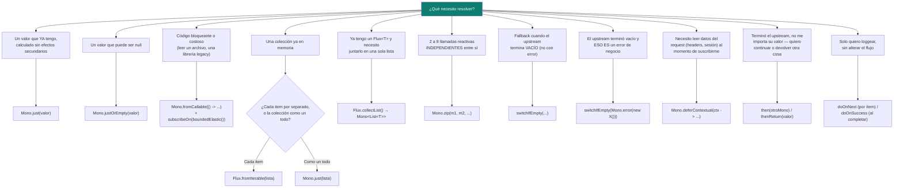

# Operadores de Reactor — qué usar según el escenario (guía de decisión)

Este documento no es "sintaxis de Reactor" — es "tengo este problema concreto, ¿qué operador lo resuelve y por qué ese y no otro". [`README.md`](README.md) ya cubre `map`/`flatMap`/manejo de errores; acá va el resto del catálogo que aparece todos los días en un backend reactivo real: creación, combinación, secuenciación, side-effects de logging y propagación de contexto. La frecuencia de uso de cada operador (columna "qué tan común es") viene de auditar microservicios reactivos reales en producción — no es una lista teórica.

## Mapa mental — de "tengo esto" a "el operador es este"



## `Mono.just(x)` vs `Mono.fromCallable(() -> x)` — la trampa que hay que entender primero

```java
// ❌ Mono.just evalúa el argumento YA, en el momento en que se arma el pipeline —
// antes de que exista un suscriptor, y en el hilo que está construyendo la cadena.
Mono<byte[]> peligroso = Mono.just(Files.readAllBytes(path)); // ¡ya leyó el archivo acá!

// ✅ Mono.fromCallable difiere la ejecución hasta que alguien se suscribe.
Mono<byte[]> correcto = Mono.fromCallable(() -> Files.readAllBytes(path))
    .subscribeOn(Schedulers.boundedElastic()); // + corre en un hilo aparte, no bloquea el event loop de Netty
```

| | `Mono.just(x)` | `Mono.fromCallable(() -> x)` |
|---|---|---|
| Cuándo se ejecuta `x` | Inmediatamente, al declarar el `Mono`. | Recién cuando alguien se suscribe. |
| Para qué sirve | Envolver un valor **ya calculado**, sin costo ni efectos secundarios. | Diferir una operación con costo real (I/O bloqueante, algo que puede lanzar excepción checked) hasta que haga falta. |
| Qué tan común es | Muy alto — el caso general para envolver DTOs/valores. | Alto — 22 usos en un catálogo real de microservicios auditado; típico en adaptadores que envuelven una librería/lectura no reactiva. |

**Regla práctica**: si lo que va adentro de `Mono.just(...)` es una llamada a método (no un valor ya calculado) que bloquea o tiene costo, es `Mono.fromCallable`, no `Mono.just`.

## `Flux.fromIterable` vs `Mono.just(lista)` — y su inverso, `collectList()`

`Mono` no tiene `fromIterable` — representa 0 o 1 elemento, nunca "cada ítem de una lista por separado". Las dos formas reales de partir de una colección, y cómo volver atrás:

```java
List<String> lineas = List.of("linea1", "linea2", "linea3");

// Flux.fromIterable — emite CADA elemento como un item separado del stream
Flux<String> porLinea = Flux.fromIterable(lineas);

// Mono.just — envuelve la LISTA COMPLETA como un solo valor emitido
Mono<List<String>> comoUnBloque = Mono.just(lineas);

// collectList() — el camino INVERSO: de Flux<T> a Mono<List<T>>
Flux<Categoria> categorias = categoriaPort.findAll(); // Flux<T>
Mono<List<Categoria>> todasJuntas = categorias.collectList(); // Mono<List<T>>

// flatMapMany(Flux::fromIterable) — el inverso de collectList: de Mono<List<T>> otra vez a Flux<T>
Mono<List<Categoria>> cacheadas = cachePort.getCategoriasCacheadas(); // Mono<List<T>>
Flux<Categoria> porCategoria = cacheadas.flatMapMany(Flux::fromIterable);
```

**Cómo decidir**: ¿el consumidor necesita procesar **elemento por elemento** de forma reactiva (filtrar, mapear, aplicar backpressure)? → `Flux`. ¿Necesita "la colección completa" como un único resultado? → `Mono<List<T>>`. Y **cómo saltar de uno a otro** es tan importante como elegir el inicial: `collectList()` junta un `Flux` en un `Mono<List<T>>` (típico antes de guardarlo entero en caché o devolverlo como response); `flatMapMany(Flux::fromIterable)` lo vuelve a abrir en `Flux` (típico al leer esa misma lista cacheada y necesitar procesarla ítem por ítem otra vez).

```java
// Escenario real: leer categorías desde un servicio (Flux), guardarlas todas juntas en caché (necesita Mono<List>)
Mono<List<Categoria>> guardarEnCache = categoriaPort.findAll()
    .collectList()
    .flatMap(lista -> cachePort.save(sessionId, lista).thenReturn(lista));
```

## `Mono.zip` — combinar llamadas independientes que corren en paralelo

`Mono.zip` se suscribe a **todos** los `Mono` al mismo tiempo, espera a que **todos** emitan, y devuelve el resultado combinado en una `Tuple2`..`Tuple8` (o con una función combinadora).

```java
Mono<Appointment> appointment = appointmentPort.findById(id);
Mono<Patient> patient = patientPort.findById(patientId);
Mono<Practitioner> practitioner = practitionerPort.findById(practitionerId);

Mono<AppointmentDetail> detalle = Mono.zip(appointment, patient, practitioner,
    (a, p, pr) -> new AppointmentDetail(a, p, pr));
```

**Por qué importa que corran en paralelo**: encadenar con `flatMap` en vez de `zip` (`appointment.flatMap(a -> patient)...`) hace que cada llamada espere a la anterior — secuencial, aunque no dependan entre sí. `zip` dispara las tres de una, y el tiempo total es el de la **más lenta**, no la suma.

**La trampa**: si **cualquiera** de los Monos combinados termina vacío, el `zip` completo termina vacío, sin combinar nada. Si un dato es opcional, resolvelo **antes** del `zip` con `defaultIfEmpty(...)` sobre ese Mono puntual — no después. `zipWith` es la variante de instancia para combinar exactamente dos.

## `switchIfEmpty` — dos usos reales, no solo uno

El uso más citado en tutoriales es "fallback a otra fuente" — pero en código de producción real, el uso **más frecuente** es distinto: convertir una ausencia en un **error de negocio explícito**.

```java
// Uso 1 — fallback a otra fuente reactiva (caché → base de datos)
Mono<Patient> patient = cachePort.findById(id)
    .switchIfEmpty(dbPort.findById(id));

// Uso 2 (el más común en la práctica) — "vacío" ES un error, convertilo ya
Mono<Company> company = companyPort.getById(companyId)
    .switchIfEmpty(Mono.error(new CompanyNotFoundException(companyId)));
```

| | `switchIfEmpty(otroPublisher)` | `switchIfEmpty(Mono.error(new X()))` | `defaultIfEmpty(valorFijo)` |
|---|---|---|---|
| Qué representa el vacío | Un caso normal — hay otra fuente válida a donde ir. | Un caso **inválido** de negocio — la ausencia misma es el error. | Un caso normal — el valor por defecto ya alcanza, sin llamar a nada más. |
| El "fallback" es | Otra fuente reactiva (otra llamada). | Un error explícito, en el punto exacto donde se detectó la ausencia. | Un valor constante, sin disparar ninguna llamada nueva. |

**Con logging + fallback lazy, combinalo con `Mono.defer`** (ver siguiente sección) cuando el fallback necesita ejecutar un side-effect antes de devolver el valor:

```java
.switchIfEmpty(Mono.defer(() -> {
    log.info("Sin resultados — se continúa con valor por defecto");
    return Mono.just(valorPorDefecto);
}))
```

## `Mono.defer` y `Mono.deferContextual` — construir recién al suscribirse (y leer el contexto del request)

`Mono.just(x)` evalúa `x` una sola vez, al construir el pipeline. `Mono.defer` construye un `Mono` **nuevo por cada suscripción** — imprescindible cuando el valor depende del momento real de ejecución, o cuando armar el fallback tiene un side-effect (como el `log.info` de arriba) que no debe dispararse antes de que haga falta.

```java
// con just — Instant.now() se calcula UNA vez, al declarar el pipeline
Mono<Instant> horaFija = Mono.just(Instant.now());

// con defer — cada suscriptor dispara su propio Instant.now(), en su momento real
Mono<Instant> horaReal = Mono.defer(() -> Mono.just(Instant.now()));
```

**`Mono.deferContextual`** es la variante que además te da acceso al **Reactor `ContextView`** — el mecanismo con el que Reactor propaga datos "por request" (headers, correlation ID, sesión) a través de una cadena reactiva que puede saltar entre hilos del event loop. Un `ThreadLocal` clásico **no sirve** en reactivo: nada garantiza que el mismo hilo siga ejecutando la continuación de la cadena después de un punto asíncrono. El `Context` de Reactor viaja *con la suscripción*, no con el hilo.

```java
public Mono<Company> getCompanyInfo(String companyId) {
    return Mono.deferContextual(contextView -> {
        var headers = new HttpRequestHeaders(contextView); // datos puestos en el Context más arriba en la cadena
        return companyClient.getCompany(headers.xGuid(), headers.xSession(), companyId);
    });
}
```

**Regla práctica**: si una firma de método necesita headers/trace-id/datos de sesión y la alternativa es agregar esos parámetros a **todas** las firmas de la cadena de llamadas, `deferContextual` + `Context` es la forma idiomática de Reactor de evitar ese "parameter drilling" — el equivalente reactivo a un `ThreadLocal`, pero que sí sobrevive a los cambios de hilo.

## `then()` / `thenReturn()` — descartar el valor y continuar

Se usan cuando el resultado del `Mono`/`Flux` anterior **no importa** — solo importa que haya terminado (side-effect ya ejecutado), y hay que continuar con otra cosa.

```java
// then(otroMono) — ignora lo que emitió repository.save(...), continúa con otro Mono
Mono<Boolean> resultado = repository.save(entidad)
    .then(Mono.just(Boolean.TRUE));

// thenReturn(valor) — azúcar sintáctico exacto de then(Mono.just(valor))
Mono<Boolean> resultadoIgual = repository.save(entidad)
    .thenReturn(Boolean.TRUE);

// then(Mono.error(...)) — patrón real: compensar y DESPUÉS seguir propagando el error
webClient.call(request)
    .onErrorResume(error -> compensarOrdenFallida(orderId) // ejecuta la compensación...
        .then(Mono.error(new OrderFailedException(error.getMessage())))); // ...y vuelve a fallar hacia el caller
```

| | `then()` | `thenReturn(x)` |
|---|---|---|
| Qué recibe | Otro `Mono`/`Flux` a continuar. | Un valor fijo, ya calculado. |
| Equivalencia | `then(Mono.just(x))` | Azúcar sintáctico de lo anterior. |
| Cuándo preferir cada uno | Cuando lo siguiente es otra operación reactiva (otra llamada, otro save). | Cuando ya no hay nada más que hacer, solo devolver un valor fijo. |

## `doOnNext` / `doOnSuccess` / `doOnError` — side-effects sin alterar el flujo

Ninguno de estos modifica el valor que fluye por el pipeline — son puntos de observación, típicamente para logging.

| Operador | Cuándo se dispara | Uso típico |
|---|---|---|
| `doOnNext` | Por **cada** elemento emitido (en un `Flux`, una vez por ítem; en un `Mono`, una vez si emite valor). | Log de debug del valor recién recibido, en medio de la cadena. |
| `doOnSuccess` | Una sola vez, al completar exitosamente — con el valor si el `Mono` emitió uno, o con `null` si completó vacío. | Log de "operación X finalizada con éxito", casi siempre al final de la cadena de un adaptador. |
| `doOnError` | Cuando el flujo termina con una excepción. | Log del error, antes de que `onErrorMap`/`onErrorResume` lo transformen o recuperen (ver [`README.md`](README.md)). |

```java
return companyClient.getCompany(companyId)
    .doOnNext(response -> log.debug("Respuesta cruda recibida: {}", response)) // por cada valor, útil para debug
    .switchIfEmpty(Mono.error(new CompanyNotFoundException(companyId)))
    .doOnSuccess(company -> log.info("<-- getCompany finalizado exitosamente para {}", companyId)) // una vez, al completar
    .doOnError(ex -> log.error("Fallo consultando company {}: {}", companyId, ex.getMessage()));
```

**Cuidado**: son para *observar*, no para decidir. Si dentro de un `doOnNext` empezás a mutar un objeto compartido o a tomar decisiones de negocio, esa lógica debería ser un `map`/`flatMap` explícito — un `doOnNext` que muta silenciosamente algo es una señal de alarma en code review, porque un lector espera que solo loggee.

## `Mono.justOrEmpty` — envolver algo que puede ser `null`

```java
public Mono<String> toJson(@Nullable Object objeto) {
    return Mono.justOrEmpty(objeto) // si objeto es null, el Mono completa vacío — no lanza NPE
        .switchIfEmpty(Mono.error(new JsonNullObjectException()))
        .map(jsonMapper::writeValueAsString);
}
```

`Mono.just(null)` lanza `NullPointerException` inmediatamente — Reactor prohíbe explícitamente valores `null` en el flujo (es una decisión de diseño de la especificación Reactive Streams). `Mono.justOrEmpty(x)` es la forma segura de partir de un valor que **puede** ser `null`: si lo es, el `Mono` simplemente completa vacío, listo para encadenar con `switchIfEmpty`/`defaultIfEmpty`.

## Tabla resumen — todo el catálogo, con qué tan común es en la práctica

| Operador | Para qué sirve | Qué tan común es (auditado en microservicios reales) |
|---|---|---|
| `doOnSuccess` / `doOnNext` | Logging sin alterar el flujo. | **Muy alto** — el más usado de todos; casi todo adaptador de salida lo tiene. |
| `switchIfEmpty` | Fallback ante vacío — a otra fuente, o a un error explícito. | **Muy alto** — el segundo más usado; sobre todo como `switchIfEmpty(Mono.error(...))`. |
| `Mono.defer` / `Mono.deferContextual` | Diferir construcción hasta la suscripción; leer el `Context` de Reactor (headers/sesión). | **Alto** — `deferContextual` es el patrón estándar para propagar datos de request sin `ThreadLocal`. |
| `Mono.fromCallable` | Diferir código bloqueante/costoso hasta la suscripción. | **Alto** — en cualquier adaptador que envuelve algo no-reactivo. |
| `onErrorMap` | Traducir una excepción de infraestructura a una de dominio. | **Alto**. |
| `then()` / `thenReturn()` | Descartar el valor anterior y continuar/devolver otra cosa. | **Alto** — muy común tras un `save()` cuyo resultado no importa. |
| `collectList()` | `Flux<T>` → `Mono<List<T>>`. | **Medio-alto** — antes de guardar/devolver una colección completa. |
| `Mono.justOrEmpty` | Envolver un valor potencialmente `null` sin `NullPointerException`. | **Medio**. |
| `Flux.fromIterable` | `List<T>`/`Iterable<T>` → `Flux<T>`, emitiendo cada elemento. | **Medio**. |
| `flatMapMany(Flux::fromIterable)` | `Mono<List<T>>` → `Flux<T>` — el inverso de `collectList()`. | **Medio**. |
| `defaultIfEmpty` | Fallback a un valor fijo (no otra llamada) ante vacío. | **Medio**. |
| `Mono.zip` | Combinar 2-8 Monos independientes en paralelo. | **Medio** — menos común de lo esperado; muchos casos "paralelos" en la práctica en realidad tienen una dependencia y usan `flatMap`. |
| `onErrorResume` / `retryWhen` / `onErrorReturn` | Recuperación de errores (ver [`README.md`](README.md) para el detalle completo). | **Bajo-medio** en frecuencia absoluta, pero crítico donde aparece (llamadas a servicios externos inestables). |

## Drills de repaso

| Tiempo | Ejercicio |
|---|---|
| 5 min | Explicá por qué `Mono.just(repositorioLegacy.buscarBloqueante(id))` es un bug de diseño, y cómo se arregla. |
| 6 min | Dado un `Mono<Company>` que puede venir vacío de un `WebClient`, escribí la versión que convierte ese vacío en `CompanyNotFoundException` — nombrá el operador exacto. |
| 6 min | ¿Por qué un `ThreadLocal` no sirve para propagar un `x-request-id` a través de una cadena reactiva? ¿Qué operador de Reactor lo resuelve y cómo? |
| 5 min | Tenés un `Flux<Categoria>` que necesitás guardar completo en una sola clave de Redis. ¿Qué operador usás para convertirlo en `Mono<List<Categoria>>`? ¿Y cómo volvés de esa lista cacheada a `Flux<Categoria>` más tarde? |
| 4 min | ¿Cuándo usarías `thenReturn(valor)` en vez de `map(x -> valor)` después de un `save()`? |
| 5 min | Explicá la diferencia entre `doOnNext` y `doOnSuccess` en un `Mono` — ¿en qué casos se disparan distinto? |

## Referencias

- [Project Reactor — Reference Documentation, sección "Producing"](https://projectreactor.io/docs/core/release/reference/#which-operator) — árbol de decisión oficial "which operator do I need?".
- [Project Reactor — Adding a Context to a Reactive Sequence](https://projectreactor.io/docs/core/release/reference/#context) — la especificación completa de `Context`/`deferContextual`, la alternativa reactiva a `ThreadLocal`.
- [Reactor — Javadoc de `Mono`](https://projectreactor.io/docs/core/release/api/reactor/core/publisher/Mono.html) y [`Flux`](https://projectreactor.io/docs/core/release/api/reactor/core/publisher/Flux.html) — firma exacta de cada operador citado.

Relacionado: [`README.md`](README.md) para `map`/`flatMap` y manejo de errores (`onErrorResume`/`onErrorMap`/`retryWhen`), y [`../frameworks/spring-boot/webflux.md`](../frameworks/spring-boot/webflux.md) para cómo esto se cablea dentro de un controller/`WebClient` de Spring Boot real.
