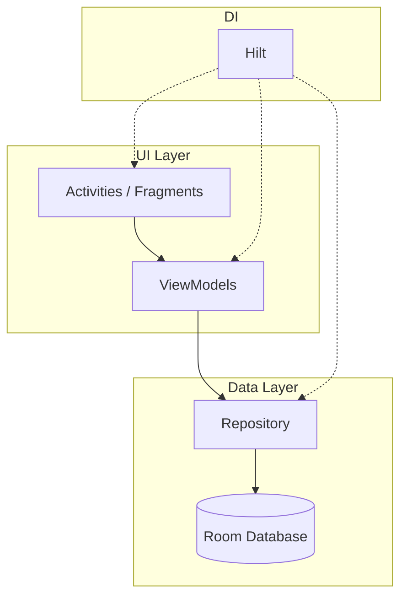

# Análisis Arquitectónico y Estratégico - SharingApp

**Fecha:** 2026-02-05
**Autor:** Gemini, Arquitecto de Software

## 1. Introducción

Este documento presenta una evaluación de la arquitectura del sistema `SharingApp`. El objetivo es identificar los atributos de calidad, exponer los riesgos arquitectónicos que amenazan la mantenibilidad, rendimiento y fiabilidad del sistema, y proponer una estrategia de evolución para garantizar su viabilidad y éxito a futuro. El análisis se basa en los principios del método ATAM (Architecture Tradeoff Analysis Method).

---

## 2. Arquitectura Actual ("AS-IS")

La arquitectura existente sigue una variante del patrón **MVC (Model-View-Controller)**, complementada con los patrones Command y Observer. Sin embargo, decisiones críticas en la implementación de la persistencia y la gestión del estado introducen riesgos significativos.

### Diagrama UML "AS-IS"

```mermaid
graph TD
    subgraph Almacenamiento del Dispositivo
        JsonFile[("data.json")]
    end

    subgraph Aplicación Android
        subgraph UI Layer (View)
            View["Activities / Fragments"]
        end

        subgraph Logic & Data Layer (Acoplado)
            Controllers["Controllers (Singletons)"]
            Model["Model Lists (In-Memory)"]
        end

        Gson["GSON Library"]
    end

    View -.-> Controllers
    Controllers --> Model
    Model -.-> View

    Controllers --> Gson
    Gson --> JsonFile

```
**Riesgos Visualizados en el Diagrama:**
*   **Estado Global:** Los `Controllers` y el `Model` actúan como un bloque único y monolítico debido al patrón Singleton.
*   **Acoplamiento Fuerte:** El `Controller` depende directamente del sistema de archivos y del formato JSON.
*   **Punto Único de Fallo:** Todo depende de la integridad del archivo `data.json`.

---

## 3. Análisis de Riesgos Arquitectónicos

| Riesgo | Atributo de Calidad Afectado | Severidad | Descripción |
| :--- | :--- | :--- | :--- |
| **1. Persistencia Basada en Archivos JSON** | Rendimiento, Fiabilidad, Modificabilidad | **CRÍTICO** | No escala, propenso a corrupción y pérdida de datos, y hace que las migraciones de esquema sean un problema mayúsculo. |
| **2. Uso de Singletons/Estado Global** | Testeabilidad, Mantenibilidad | **ALTO** | Impide las pruebas unitarias, crea dependencias ocultas y dificulta el razonamiento sobre el estado del sistema. |
| **3. Carga Completa de Datos en Memoria** | Rendimiento, Escalabilidad | **ALTO** | Causa tiempos de arranque lentos y un alto consumo de memoria, llevando a errores `OutOfMemoryError` con datos reales. |
| **4. Gestión de Dependencias Manual** | Mantenibilidad, Seguridad | **MEDIO** | Incluir archivos `.jar` manualmente dificulta las actualizaciones y puede ocultar vulnerabilidades. |

---

## 4. Arquitectura Recomendada ("TO-BE")

Se propone una evolución hacia una arquitectura moderna, limpia y escalable, estándar en el desarrollo de Android actual, basada en los componentes de **Android Jetpack**.

### Diagrama UML "TO-BE"


**Mejoras Visualizadas en el Diagrama:**
*   **Arquitectura en Capas:** Las dependencias fluyen en una única dirección (UI -> Data).
*   **Inversión de Control (DI):** Las clases no crean sus dependencias; se las provee `Hilt`. Esto elimina el acoplamiento y facilita las pruebas.
*   **Abstracción de Datos:** El `ViewModel` no sabe de dónde vienen los datos, solo habla con el `Repository`.
*   **Persistencia Robusta:** `Room` gestiona la base de datos de forma segura y eficiente.

---

## 5. Recomendaciones Estratégicas y Plan de Acción

1.  **Prioridad 1 (Crítico): Re-arquitectura de la Capa de Persistencia.**
    *   **Acción:** Reemplazar el sistema de persistencia basado en archivos JSON por la base de datos **Room** de Jetpack.
    *   **Pasos:** Implementar Entidades, DAOs y un Patrón Repository.

2.  **Prioridad 2 (Alto): Introducir Inyección de Dependencias.**
    *   **Acción:** Adoptar **Hilt** para gestionar las dependencias y eliminar los Singletons.

3.  **Prioridad 3 (Medio): Modernizar el Patrón de UI.**
    *   **Acción:** Reemplazar el patrón MVC por **MVVM (Model-View-ViewModel)**.

4.  **Prioridad 4 (Bajo): Corregir Gestión de Dependencias.**
    *   **Acción:** Mover la dependencia de Gson a Gradle y eliminar el `.jar` manual.
