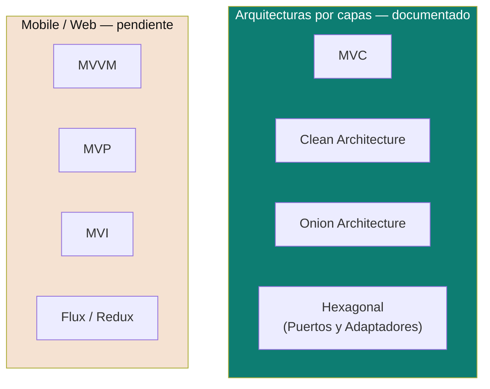
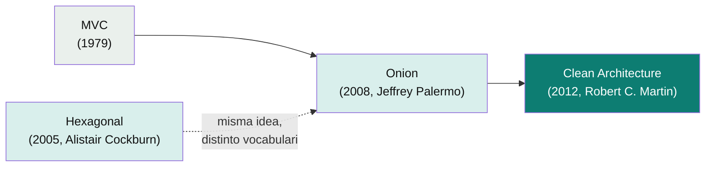

# Arquitecturas de Software

Píldoras comparativas de los estilos de arquitectura más habituales a nivel de aplicación (cómo se organizan las capas dentro de un servicio), agrupados en un solo lugar para poder compararlos rápido.

> Diferencia con otras carpetas del repo: acá se compara **cómo se organiza el código dentro de una aplicación** (capas, dependencias entre ellas). Para cómo se comunican varias aplicaciones entre sí, ver [`microservices-patterns/`](../microservices-patterns). Para cómo escalar la infraestructura completa, ver [`system-design/`](../system-design).

> **Empezá acá:** [`decisiones-de-arquitectura.md`](decisiones-de-arquitectura.md) — qué es un *trade-off*, cómo decidir entre opciones y cómo dejarlo escrito en un ADR. Es la habilidad que hace útil todo lo demás de esta carpeta.

## Cobertura actual

| Arquitectura | Doc | Idea central en una línea |
|---|---|---|
| **MVC** | [`mvc.md`](mvc.md) | Separa datos (Model), presentación (View) y orquestación (Controller) — la más simple, la base de la que derivan las demás. |
| **Clean Architecture** | [`clean-architecture.md`](clean-architecture.md) | Círculos concéntricos de dependencia: todo apunta hacia el dominio, nunca al revés (Dependency Rule). |
| **Onion Architecture** | [`onion-architecture.md`](onion-architecture.md) | Precursora directa de Clean — el dominio en el centro, la infraestructura en el anillo externo, nada de acceso directo entre anillos no adyacentes. |
| **Hexagonal (Puertos y Adaptadores)** | [`hexagonal-architecture.md`](hexagonal-architecture.md) | Mismo principio que Onion/Clean (dominio aislado), pero expresado como puertos (interfaces) y adaptadores intercambiables — la que se usa como referencia base en este repo. |
| Mobile — MVVM/MVP/MVI | ⏳ Pendiente de documentar | Cómo estos mismos principios (separar UI de lógica de negocio) se aplican en Android/iOS. |
| Web frontend — Flux/Redux | ⏳ Pendiente de documentar | Flujo unidireccional de datos en SPAs — el mismo problema de "quién puede mutar qué" resuelto para el frontend. |

## Por qué existen tantas variantes del mismo problema

Todas responden a la misma pregunta: **¿cómo evito que la lógica de negocio dependa de detalles técnicos (framework, base de datos, UI) que cambian más seguido que las reglas del negocio?**

La progresión histórica es MVC → Onion → Clean → Hexagonal — cada una es una vuelta de tuerca más estricta sobre la misma idea (aislar el dominio), no una alternativa completamente distinta. En una entrevista, nombrar esa relación (en vez de tratarlas como cosas separadas) es la señal de seniority.

> Nota de fechas: Hexagonal (2005) es en realidad anterior a Onion (2008) y Clean (2012) — la flecha punteada indica "inspiró/converge con", no orden cronológico estricto. Las tres — Hexagonal, Onion, Clean — se consideran hoy variantes intercambiables del mismo principio (a veces agrupadas como "Ports & Adapters" en sentido amplio).

## Cómo comparar rápido: la pregunta que hay que poder responder

Para cualquiera de estas arquitecturas, un entrevistador senior espera que puedas señalar, sin dudar:

1. **¿Dónde vive la regla de negocio?** (siempre: en el centro, sin imports de framework)
2. **¿Qué dirección tienen las dependencias?** (siempre: hacia adentro/hacia el dominio, nunca al revés)
3. **¿Cómo se prueba el dominio sin levantar infraestructura?** (siempre: con `new` directo, sin mocks de Spring/JPA/HTTP)
4. **¿Qué es intercambiable sin tocar el dominio?** (base de datos, framework web, proveedor de mensajería — todo lo que vive en el anillo externo)

Si podés responder esas 4 preguntas para MVC, Onion, Clean y Hexagonal, ya sabés distinguirlas en la entrevista aunque los nombres se presten a confusión.

Relacionado: [`solid-principles/`](../solid-principles) — el Dependency Inversion Principle es, en el fondo, la regla formal detrás de "las dependencias apuntan hacia el dominio" que comparten todas estas arquitecturas.

## Referencias

Cada doc individual (`mvc.md`, `clean-architecture.md`, `onion-architecture.md`, `hexagonal-architecture.md`) cita su fuente primaria al final. Como panorama general: Fowler, M. — [*PatternsOfEnterpriseApplicationArchitecture*](https://martinfowler.com/eaaCatalog/) y su blog en [martinfowler.com](https://martinfowler.com/architecture/) comparan varias de estas variantes entre sí.
