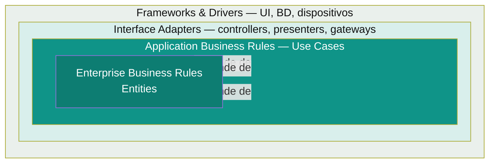

# Clean Architecture

Propuesta por Robert C. Martin ("Uncle Bob", 2012), formaliza y le pone nombre estándar a la misma idea de Onion/Hexagonal: el dominio en el centro, las dependencias siempre apuntando hacia adentro — pero agrega un mecanismo explícito para que las capas internas se comuniquen con las externas sin romper esa regla: los **Boundaries** (interfaces).

## El patrón, en un diagrama



- **Entities (centro)** — reglas de negocio más generales de la empresa, las que menos cambian.
- **Use Cases** — reglas de negocio específicas de la aplicación; orquestan entities para cumplir un caso de uso concreto.
- **Interface Adapters** — traducen datos entre el formato que le conviene a Use Cases/Entities y el formato que le conviene a un framework externo (controllers REST, presenters, gateways de persistencia).
- **Frameworks & Drivers (anillo externo)** — Spring, la base de datos, el driver HTTP — el detalle técnico, intercambiable.

**La "Dependency Rule":** el código fuente de las dependencias solo puede apuntar hacia adentro. Nada en un círculo interno puede saber nada sobre algo en un círculo externo — ni siquiera el nombre de un framework.

### El mecanismo clave: Boundaries (puerto = interfaz que cruza el límite)

Cuando el flujo de control necesita ir de adentro hacia afuera (ej: un Use Case necesita guardar datos, que vive en infraestructura), Clean Architecture usa el mismo truco que Hexagonal: el círculo interno define una **interfaz** (el "boundary"), y el círculo externo la implementa. El flujo de control cruza hacia afuera, pero la dependencia de código sigue apuntando hacia adentro.

## Ejemplo mínimo

```java
// Entity (centro)
record Order(String id, BigDecimal total, boolean paid) {}

// Use Case — define el boundary (interfaz) que necesita, no la implementación
interface PaymentGateway { boolean charge(Order order); } // boundary hacia afuera

class PayOrderUseCase {
    private final PaymentGateway paymentGateway; // depende de la interfaz, no de Stripe/PayPal
    PayOrderUseCase(PaymentGateway paymentGateway) { this.paymentGateway = paymentGateway; }

    Order execute(Order order) {
        boolean success = paymentGateway.charge(order);
        return new Order(order.id(), order.total(), success);
    }
}

// Interface Adapter / Frameworks & Drivers — implementa el boundary
class StripePaymentGateway implements PaymentGateway {
    public boolean charge(Order order) { /* llamada real a Stripe */ return true; }
}
```

`PayOrderUseCase` nunca importa nada de Stripe. Cambiar de proveedor de pagos (Stripe → PayPal) es escribir una nueva implementación de `PaymentGateway` — cero cambios en el Use Case ni en la Entity.

👉 **Cuándo usarlo:** igual que Onion/Hexagonal — sistemas donde el dominio va a vivir más tiempo que la tecnología elegida hoy (framework, BD, proveedor externo), y donde testear las reglas de negocio sin levantar infraestructura es un requisito real, no un nice-to-have.

## Diferencia práctica con Onion/Hexagonal (si la preguntan)

Prácticamente ninguna a nivel de resultado — las tres imponen la misma Dependency Rule. Clean Architecture es la que más vocabulario estandarizó (Entities, Use Cases, Interface Adapters, boundaries) y por eso es la que más se cita en entrevistas, pero en código Java real terminás con la misma estructura `domain/application/infrastructure` que [`hexagonal-architecture.md`](hexagonal-architecture.md) documenta en este repo.

Volver a [`README.md`](README.md) del índice de arquitecturas.

## Referencias

- Martin, R. C. — [*The Clean Architecture*](https://blog.cleancoder.com/uncle-bob/2012/08/13/the-clean-architecture.html) (2012), post original en su blog, y *Clean Architecture: A Craftsman's Guide to Software Structure and Design* (2017), donde lo desarrolla en libro.
