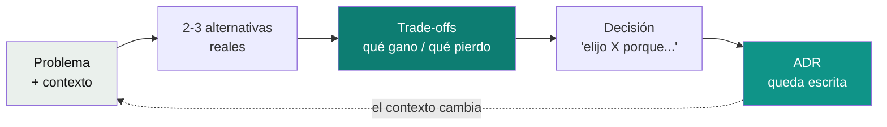

# Pensar como arquitecto — trade-offs y ADRs

Las otras píldoras de esta carpeta enseñan **qué** arquitecturas existen. Esta enseña **cómo se decide** entre ellas (y entre cualquier par de opciones técnicas). Es la habilidad que separa a un developer que conoce patrones de un arquitecto que sabe cuándo usarlos.

> Si te quedás con una sola frase: **un arquitecto no elige la mejor opción, elige la que mejor encaja con este contexto, y deja escrito qué sacrificó y por qué.**



---

## 1. Trade-off

### Con manzanas

Tenés que ir al trabajo todos los días. Opciones:

| | Auto | Bus |
|---|---|---|
| Rapidez | ✅ 20 min | ❌ 45 min |
| Costo | ❌ nafta + estacionamiento | ✅ barato |
| Flexibilidad | ✅ salís cuando querés | ❌ horario fijo |
| Estrés | ❌ manejar en el tráfico | ✅ leés en el camino |

**No hay opción perfecta.** Ganar en una columna implica perder en otra. Eso es un *trade-off*: **un intercambio, cedo algo para ganar otra cosa**.

Y la respuesta correcta **depende del contexto**: si ganás bien y valorás el tiempo, auto; si estás ahorrando, bus. Nadie diría que el bus es "mejor" en abstracto.

### En software

Es exactamente lo mismo:

| Decisión | Gano | Pierdo |
|---|---|---|
| Microservicios en vez de monolito | Despliegue y escalado independientes | Simplicidad: red, consistencia, observabilidad |
| Eventos (async) en vez de REST (sync) | Desacoplamiento, tolerancia a caídas | Consistencia inmediata, facilidad de debug |
| NoSQL en vez de SQL | Escala horizontal, esquema flexible | Transacciones ACID, joins |
| Cache | Velocidad | Datos potencialmente desactualizados |
| WebFlux en vez de MVC | Menos hilos con mucha I/O | Curva de aprendizaje, debugging más difícil |

### Las 5 tensiones que se repiten siempre

Casi todo trade-off de arquitectura es una de estas:

1. **Consistencia ↔ Disponibilidad** (CAP): ¿dato siempre exacto o sistema siempre respondiendo? Ver [`system-design/02-databases-sql-vs-nosql.md`](../system-design/02-databases-sql-vs-nosql.md).
2. **Simplicidad ↔ Flexibilidad**: ¿lo más simple que funciona hoy o preparado para cambios futuros? (YAGNI, ver [`clean-code/`](../clean-code)).
3. **Velocidad de entrega ↔ Calidad / deuda técnica**: ¿sale hoy o sale bien?
4. **Costo ↔ Rendimiento**: ¿más máquinas o más optimización?
5. **Acoplamiento ↔ Autonomía**: ¿servicios que se llaman directo o que se comunican por eventos?

### La fórmula para decirlo en voz alta

> "Tengo **A** y **B**. A me da ___ pero me cuesta ___. B me da ___ pero me cuesta ___. **Para este contexto** ([volumen / tamaño del equipo / plazo / presupuesto]) **elijo A**, acepto perder ___, y **cambiaría a B si** ___."

La última parte ("cambiaría a B si...") es la que más suma: muestra que la decisión no es dogma, es contexto.

### Errores comunes

- **Una sola opción** ("uso Kafka"). Sin alternativa no hay decisión, hay costumbre.
- **Alternativa de relleno** ("A es buena y B es mala"). Si B no tiene ninguna ventaja real, no es una alternativa.
- **"Depende" sin terminar la frase.** "Depende" solo vale si decís de qué depende y qué elegís en este caso.
- **Elegir por moda** ("microservicios porque es lo moderno").

---

## 2. ADR (Architecture Decision Record)

### Con manzanas

Elegiste el bus. Seis meses después alguien de tu familia pregunta: *"¿por qué no usás el auto?"*. Ya no te acordás bien. Si hubieras anotado en una libreta *"marzo: elijo bus porque estoy ahorrando para el depto; si me aumentan el sueldo, lo reviso"*, la respuesta estaría ahí, y además sabrías **cuándo** reconsiderarla.

**Un ADR es esa nota de libreta, para una decisión de arquitectura.**

### Qué es

Un documento **corto** (una página) que registra **una** decisión importante: el contexto, las opciones, la elegida y sus consecuencias. No es un documento de diseño detallado: es la **trazabilidad del porqué**, para que el equipo dentro de 6 meses no tenga que adivinar ni preguntarte.

### Cuándo escribir uno

Cuando la decisión:
- es **cara de revertir** (base de datos, sync vs async, cómo se dividen los servicios);
- afecta a **más de un equipo o servicio**;
- alguien la va a **cuestionar** después ("¿por qué no usamos X?").

No hace falta ADR para el nombre de una variable ni para una librería de utilidades.

### Plantilla (formato Michael Nygard, el más usado)

```markdown
# ADR-0003: Comunicación síncrona entre Mascotas y Adoptantes

- Estado: Aceptado            ← Propuesto | Aceptado | Reemplazado por ADR-00XX | Obsoleto
- Fecha: 2026-09-24

## Contexto
Para iniciar una adopción, Mascotas necesita saber si el adoptante existe.
Equipo de 3 devs, volumen bajo (~100 adopciones/día), sin broker en la infraestructura.

## Opciones consideradas
1. REST síncrono con WebClient: simple, respuesta inmediata; acopla en el tiempo (si Adoptantes cae, no se adopta).
2. Eventos (SQS/Kafka): desacoplado, tolera caídas; consistencia eventual, más infraestructura.

## Decisión
Opción 1, con timeout de 2s, retry con backoff y circuit breaker.

## Consecuencias
+ Simple de construir, testear y operar con el equipo actual.
− Si Adoptantes cae, las adopciones fallan (503) hasta que vuelva.
→ Revisar si aparecen otros consumidores de "mascota adoptada" o si el volumen crece 10x.
```

### Dónde viven

En el mismo repo del servicio, versionados con el código:

```text
docs/adr/
├── 0001-arquitectura-hexagonal.md
├── 0002-postgres-con-r2dbc.md
└── 0003-comunicacion-sync-mascotas-adoptantes.md
```

Numerados, **nunca se borran ni se reescriben**: si una decisión cambia, se escribe un ADR nuevo y el viejo pasa a "Reemplazado por ADR-00XX". El historial de por qué cambiaron las cosas es parte del valor.

### Por qué le importa a un Tech Lead / arquitecto

- **Onboarding:** alguien nuevo entiende en 10 minutos por qué el sistema es como es.
- **Evita repetir discusiones:** "ya lo evaluamos, está en el ADR-0005".
- **Hace visible la deuda aceptada a propósito:** "sabemos que esto no escala más allá de X, lo decidimos así por Y".
- **Muestra criterio en una entrevista:** "lo documenté como ADR" es una respuesta de seniority casi automática.

---

## 3. Píldoras relacionadas (vocabulario de arquitecto)

| Término | En una línea | Con manzanas |
|---|---|---|
| **Atributos de calidad** (NFRs) | Lo que el sistema debe *ser* además de lo que debe *hacer*: disponibilidad, latencia, seguridad, costo, mantenibilidad. | No es solo "que me lleve al trabajo", también "que llegue a tiempo y no me funda". |
| **Decisión de una vía vs dos vías** (Bezos) | Las irreversibles se piensan mucho (y llevan ADR); las reversibles se deciden rápido. | Comprar una casa vs probar un restaurante. |
| **Último momento responsable** | No decidir antes de tener la información necesaria, pero tampoco después de que bloquee al equipo. | No comprás el pasaje de las vacaciones en enero si no sabés las fechas, pero tampoco la noche antes. |
| **Deuda técnica consciente** | Atajo tomado a propósito, anotado y con plan para pagarlo. | Pagar con tarjeta sabiendo cuándo vas a cubrirla. |
| **Reversibilidad por diseño** | Arquitectura que abarata cambiar de opinión (ej. hexagonal: cambiar la base de datos = un adapter nuevo). | Alquilar antes de comprar. |

---

## 4. Cómo practicarlo

1. Tomá cualquier decisión de las tablas de [`microservices-patterns/`](../microservices-patterns) o [`system-design/`](../system-design) y decila en voz alta con **la fórmula** de la sección 1. En 1 minuto.
2. Escribí un ADR de una decisión real de tu trabajo actual o pasado. Una página como máximo.
3. En cada simulacro de entrevista, 2-3 decisiones con este formato (ver el protocolo en [`entrevistas/kaizen/`](../entrevistas/kaizen), paso 3).

## Referencias

- Nygard, M. — *Documenting Architecture Decisions* (2011), el post original que propuso los ADRs.
- [adr.github.io](https://adr.github.io/): plantillas y herramientas de la comunidad.
- Richards, M. & Ford, N. — *Fundamentals of Software Architecture* (2020): "todo en arquitectura es un trade-off" es su primera ley.
- Ford, N. et al. — *Software Architecture: The Hard Parts* (2021): análisis de trade-offs en sistemas distribuidos.
