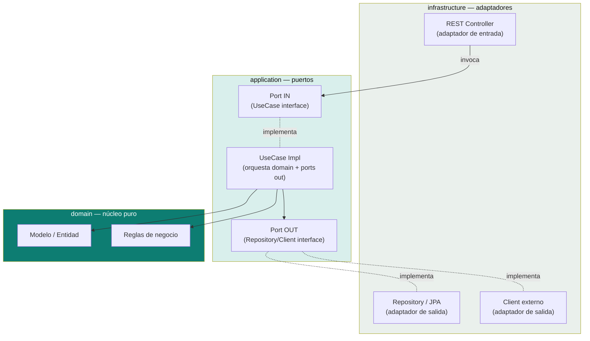

# Arquitectura Hexagonal (Puertos y Adaptadores)

Patrón de puertos y adaptadores, ilustrado con los dominios que respaldaron esta documentación (código de referencia fuera de este repo, ver nota al final).

> Comparación con otras arquitecturas por capas (MVC, Clean, Onion) en el [índice de esta carpeta](README.md).

## El patrón, en un diagrama



**Regla central:** `domain` no conoce nada de `application` ni de `infrastructure`. Los adaptadores nunca se referencian directo entre sí — siempre a través de un puerto (interfaz).

## Dominios de referencia

Casos reales que ilustran el patrón, cuyo código completo vive fuera de este repo (ver nota al final):

| Dominio | Stack | Qué muestra |
|---|---|---|
| Pedidos de café, pagos con tarjeta | Spring Boot, Java puro | Capas application/domain/infrastructure básicas — Order, Payment, CreditCard, CoffeeMachine. |
| Reserva de vuelos + clima | Java puro | **Tres implementaciones paralelas** del mismo dominio (`domainmodel`, `transactionscript`, `webadapter`) — útil para comparar estilos de arquitectura lado a lado. |
| Registro de usuarios con JWT | Spring Boot, H2 | Autenticación, DTOs y mappers en un microservicio completo. |
| Pedidos de café con IA | Spring Boot 3, Docker, PostgreSQL, MapStruct, Swagger | El más completo end-to-end (contenedores + BD real). Caso de estudio sobre uso de IA (Copilot/Gemini) durante el desarrollo en [`ia-agentes/case-study-coffee-shop-ia.md`](../ia-agentes/case-study-coffee-shop-ia.md). |

## Convención de paquetes de referencia

La misma que se repite en los proyectos más recientes de esta carpeta (y la que conviene seguir en cualquier microservicio nuevo):

```
src/main/java/com/<empresa>/<servicio>/
├── domain/
│   ├── model/          entidades y value objects — sin dependencias de framework
│   └── service/         reglas de negocio puras — sin I/O, sin anotaciones de Spring
├── application/
│   ├── port/in/          interfaces de casos de uso (ej. RegisterUserUseCase)
│   ├── port/out/         interfaces que el caso de uso necesita (ej. UserRepositoryPort)
│   ├── usecase/          RegisterUserUseCaseImpl — orquesta domain + ports out
│   └── exception/        excepciones de negocio
└── infrastructure/
    ├── rest/              controller + DTOs + manejador global de excepciones
    ├── persistence/       adaptador de salida — implementa port/out con JPA/R2DBC
    └── client/             adaptador de salida — implementa port/out con WebClient/RestClient
```

Naming: `XxxUseCase` (interfaz, port in) → `XxxUseCaseImpl` (application/usecase). `XxxPort` (interfaz, port out) → `XxxAdapter` (infrastructure).

Para cómo estos microservicios se comunican entre sí en un sistema más grande (eventos, colas, resiliencia), ver [`microservices-patterns/`](../microservices-patterns). Para la versión reactiva de esta misma arquitectura (WebFlux + R2DBC en vez de JPA bloqueante), ver [`reactive-programming/`](../reactive-programming).

> El código completo de los proyectos que ilustran esta tabla no se versiona en este repo (que es solo documentación) — queda en una carpeta local aparte, pendiente de reorganizar en sus propios repos.

## Referencias

- Cockburn, A. — [*Hexagonal Architecture*](https://alistair.cockburn.us/hexagonal-architecture/) (2005), artículo original donde se propuso el patrón de puertos y adaptadores.
