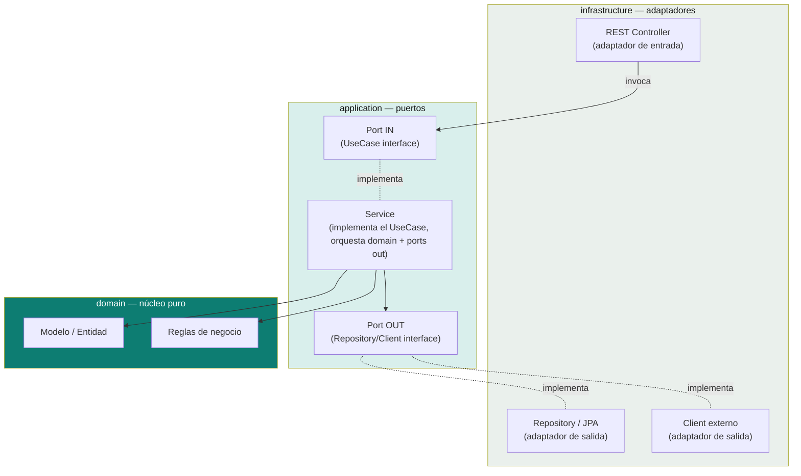

# Arquitectura Hexagonal (Puertos y Adaptadores)

Patrón de puertos y adaptadores, ilustrado con los dominios que respaldaron esta documentación (código de referencia fuera de este repo, ver nota al final).

> Comparación con otras arquitecturas por capas (MVC, Clean, Onion) en el [índice de esta carpeta](README.md).

## El patrón, en un diagrama



**Regla central:** `domain` no conoce nada de `application` ni de `infrastructure`. Los adaptadores nunca se referencian directo entre sí — siempre a través de un puerto (interfaz).

## Dominios de referencia

Casos reales que ilustran el patrón, cuyo código completo vive fuera de este repo (ver nota al final):

| Dominio | Stack | Qué muestra |
|---|---|---|
| Pedidos de café, pagos con tarjeta | Spring Boot, Java puro | Capas application/domain/infrastructure básicas — Order, Payment, CreditCard, CoffeeMachine. |
| Reserva de vuelos + clima | Java puro | **Tres implementaciones paralelas** del mismo dominio (`domainmodel`, `transactionscript`, `webadapter`) — útil para comparar estilos de arquitectura lado a lado. |
| Registro de usuarios con JWT | Spring Boot, H2 | Autenticación, DTOs y mappers en un microservicio completo. |
| Pedidos de café con IA | Spring Boot 3, Docker, PostgreSQL, MapStruct, Swagger | El más completo end-to-end (contenedores + BD real). Caso de estudio sobre uso de IA (Copilot/Gemini) durante el desarrollo en [`ia-agentes/case-study-coffee-shop-ia.md`](../ia-agentes/case-study-coffee-shop-ia.md). |

## Convención de paquetes de referencia

Alineada con `buckpal` (proyecto de referencia de *Get Your Hands Dirty on
Clean Architecture*, Tom Hombergs — github.com/thombergs/buckpal), validada
end-to-end en un caso real (dominio de citas médicas, Spring WebFlux, ver
agente `hexagonal-architect` en `ia-agentes/`):

```
src/main/java/com/<empresa>/<servicio>/
├── domain/
│   └── <agregado>/        entidades, value objects y excepciones de dominio —
│                            sin dependencias de framework, sin I/O.
│                            (la subcarpeta por agregado se omite si el bounded
│                             context tiene uno solo)
├── application/
│   ├── port/in/            interfaces de casos de uso (ej. RegisterUserUseCase)
│   │                        + su Command (record, no interfaz)
│   ├── port/out/           interfaces que el caso de uso necesita (ej. UserRepositoryPort)
│   └── service/             RegisterUserService implements RegisterUserUseCase —
│                             orquesta domain + ports out
└── infrastructure/
    ├── adapter/
    │   ├── in/web/           controller (naming Spring estándar, sin sufijo "Adapter")
    │   │                      + DTOs (@Valid) + manejador global de errores (ProblemDetail/RFC 7807)
    │   └── out/
    │       ├── persistence/   implementa port/out con JPA/R2DBC — sufijo "Adapter"
    │       │   ├── entity/     (ej. UserPersistenceAdapter). entity/ = clases de persistencia
    │       │   └── mapper/     (@Table/@Document), distintas del modelo de dominio; mapper/ traduce
    │       │                   Entity↔Domain. No aplica con un adapter in-memory.
    │       └── client/         implementa port/out con WebClient/RestClient — sufijo "Adapter"
    └── config/                @Configuration/@Bean de infraestructura: OpenAPI (springdoc),
                                @ConfigurationProperties, CORS, R2DBC, etc.
```

OpenAPI (`springdoc-openapi-starter-webflux-ui`) y `application.yml` (no
`.properties`) se agregan desde el arranque del proyecto, no como mejora
posterior.

Naming: `XxxUseCase` (interfaz, port in) → `XxxService` (application/service,
NO `XxxUseCaseImpl`). `XxxPort` (interfaz, port out) → `XxxPersistenceAdapter`/
`XxxClientAdapter` (infrastructure, con sufijo "Adapter"); el controller web no
lleva ese sufijo.

**Matiz importante:** el artículo original de Cockburn no define "caso de uso"
como bloque arquitectónico obligatorio — solo lo menciona como técnica de
*especificación* funcional contra la interfaz del hexágono. El nombre
`XxxUseCase` para las interfaces de `port/in` es una convención tomada de la
síntesis práctica de `buckpal` (que a su vez la toma de Clean Architecture,
Robert Martin), no de la definición original del patrón — es la que seguimos
por ser la más citada y probada, no la única "correcta".

**Excepciones**: una excepción que representa un hecho de negocio (ej. "esta
entidad no existe", una transición de estado inválida) va en `domain`, no en
`application` — no es un detalle de cableado de la aplicación.

**Command vs. interfaz**: un Command no es una interfaz — es un `record`
inmutable con validación estructural en su compact constructor
(*self-validating value object*, Vaughn Vernon). Regla general: interfaz =
comportamiento con implementaciones intercambiables (los puertos);
record/clase = datos que viajan a través de esos contratos.

Para cómo estos microservicios se comunican entre sí en un sistema más grande (eventos, colas, resiliencia), ver [`microservices-patterns/`](../microservices-patterns). Para la versión reactiva de esta misma arquitectura (WebFlux + R2DBC en vez de JPA bloqueante), ver [`reactive-programming/`](../reactive-programming).

> El código completo de los proyectos que ilustran esta tabla no se versiona en este repo (que es solo documentación) — queda en una carpeta local aparte, pendiente de reorganizar en sus propios repos.

## Referencias

- Cockburn, A. — [*Hexagonal Architecture*](https://alistair.cockburn.us/hexagonal-architecture/) (2005), artículo original donde se propuso el patrón de puertos y adaptadores.
- Hombergs, T. — *Get Your Hands Dirty on Clean Architecture*, y su proyecto de referencia [`buckpal`](https://github.com/thombergs/buckpal) — la implementación práctica de Hexagonal en Spring más citada; de ahí la convención `application/port/in|out` + `application/service` + sufijo `Adapter` en los adaptadores de salida.
- Vernon, V. — *Implementing Domain-Driven Design* (IDDD) — patrón de *self-validating value objects*.
- Documentación oficial de Spring Framework — [Dependency Injection](https://docs.spring.io/spring-framework/reference/core/beans/dependencies/factory-collaborators.html) — constructor injection preferido sobre field/setter injection con `@Autowired`.
