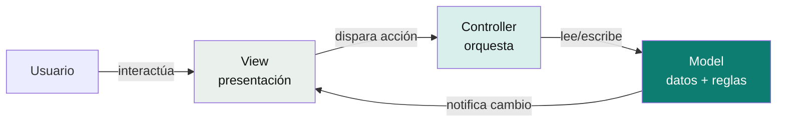

# MVC (Model-View-Controller)

La arquitectura más antigua y difundida de las cuatro. Separa una aplicación en tres responsabilidades para que un cambio en una no obligue a tocar las otras.

## El patrón, en un diagrama



- **Model** — los datos y las reglas de negocio. En un backend típico: entidades, servicios de dominio, acceso a base de datos.
- **View** — lo que ve el usuario. En un backend REST, la "view" es el JSON de respuesta (o un template server-side en apps tradicionales).
- **Controller** — recibe la petición, decide qué hacer, llama al Model, y arma la respuesta a través de la View.

## Ejemplo mínimo (Spring MVC)

```java
@RestController
class OrderController {
    private final OrderService orderService; // "Model" en sentido amplio

    @GetMapping("/orders/{id}")
    OrderResponse getOrder(@PathVariable String id) {
        Order order = orderService.findById(id); // Model
        return OrderResponse.from(order);         // "View" = el DTO serializado
    }
}
```

## El problema que MVC no resuelve (y que Onion/Clean/Hexagonal sí)

En la práctica, "Model" termina siendo una bolsa donde entra todo: entidades JPA, lógica de negocio, y a veces hasta acceso directo a la base de datos — todo mezclado y con anotaciones de framework (`@Entity`, `@Table`) metidas en la misma clase que debería tener solo reglas de negocio. MVC no dice nada sobre **dirección de dependencias** — el Model puede terminar dependiendo de JPA/Hibernate sin que el patrón lo prohíba.

Esa es exactamente la grieta que las arquitecturas por capas concéntricas (Onion, Clean, Hexagonal) vienen a tapar: fuerzan que el dominio no dependa de nada técnico, cosa que MVC deja como buena práctica opcional, no como regla estructural.

👉 **Cuándo usarlo:** aplicaciones simples, CRUDs sin lógica de negocio compleja, o cuando el framework ya te da MVC gratis (Spring MVC, Rails, Django) y agregar más capas sería sobre-ingeniería. Para un dominio con reglas de negocio no triviales que necesitan sobrevivir a cambios de framework/BD, conviene ir directo a Hexagonal/Clean.

Volver a [`README.md`](README.md) del índice de arquitecturas.

## Referencias

- Reenskaug, T. — concepción original de MVC en Smalltalk-80 (Xerox PARC, 1979).
- [Spring Framework — Web MVC Reference](https://docs.spring.io/spring-framework/reference/web/webmvc.html) — implementación de referencia usada en los ejemplos.
