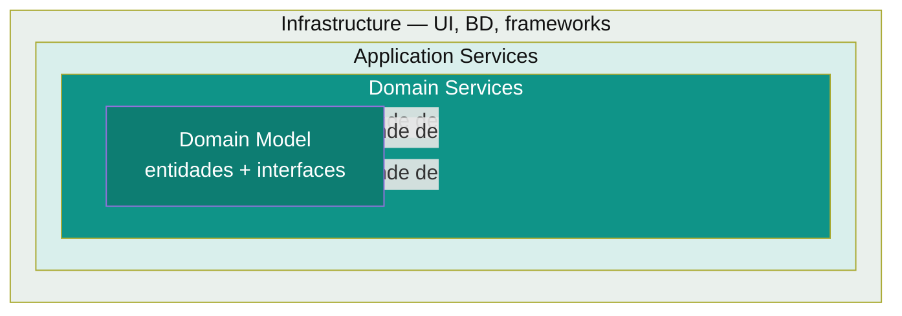

# Onion Architecture

Propuesta por Jeffrey Palermo (2008) como respuesta directa al problema de MVC: el dominio queda en el centro de anillos concéntricos, y **las dependencias solo pueden apuntar hacia adentro**. Es la precursora directa de Clean Architecture.

## El patrón, en un diagrama



- **Domain Model (centro)** — entidades y las interfaces que el dominio necesita (ej: `OrderRepository` como interfaz, no como implementación). No importa nada de fuera.
- **Domain Services** — lógica de negocio que opera sobre el Domain Model, todavía sin tocar infraestructura.
- **Application Services** — casos de uso, coordina domain services para cumplir una operación completa.
- **Infrastructure (anillo externo)** — UI, base de datos, frameworks, librerías externas. Implementa las interfaces que el dominio definió.

**La regla que le da el nombre:** un anillo solo puede depender del anillo inmediatamente interior (o de cualquier anillo más interior), nunca al revés. La base de datos no le "dicta" nada al dominio — es el dominio quien define la interfaz (`OrderRepository`) y la infraestructura quien la implementa (`JpaOrderRepository`).

## Ejemplo mínimo

```java
// Domain Model (centro) — define la interfaz, no la implementación
interface OrderRepository { Order findById(String id); }
record Order(String id, BigDecimal total) {}

// Domain Service — lógica pura sobre el modelo
class DiscountService {
    BigDecimal applyLoyaltyDiscount(Order order) { return order.total().multiply(BigDecimal.valueOf(0.9)); }
}

// Infrastructure (anillo externo) — implementa la interfaz del dominio
class JpaOrderRepository implements OrderRepository {
    public Order findById(String id) { /* consulta JPA real */ return new Order(id, BigDecimal.TEN); }
}
```

Notar que `DiscountService` y `Order` no importan nada de JPA, Spring, ni de `JpaOrderRepository` — es `JpaOrderRepository` quien depende de la interfaz `OrderRepository` definida en el dominio. Esto es el **Dependency Inversion Principle** aplicado a nivel arquitectónico.

👉 **Cuándo usarlo:** el mismo caso que Clean/Hexagonal — dominio con reglas de negocio no triviales, que necesita ser testeable sin levantar base de datos ni framework, y donde infraestructura (BD, mensajería, proveedor de pagos) puede cambiar sin tocar el negocio. En la práctica, Onion, Clean y Hexagonal se usan como sinónimos funcionales — la diferencia es más de vocabulario y énfasis que de resultado final.

## Onion vs Hexagonal — la diferencia real (si la preguntan)

Son la misma idea con distinto lenguaje: Onion habla de "anillos" y "Domain/Application/Infrastructure Services"; Hexagonal habla de "puertos y adaptadores". En este repo, [`hexagonal-architecture.md`](hexagonal-architecture.md) es la que se usa en la práctica (con la convención de paquetes `domain/application/infrastructure`), que en el fondo ya es una implementación de Onion con nomenclatura de puertos/adaptadores.

Volver a [`README.md`](README.md) del índice de arquitecturas.

## Referencias

- Palermo, J. — [*The Onion Architecture*](https://jeffreypalermo.com/2008/07/the-onion-architecture-part-1/) (2008), serie original de blog posts donde se propuso el patrón.
