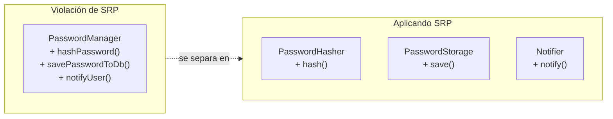
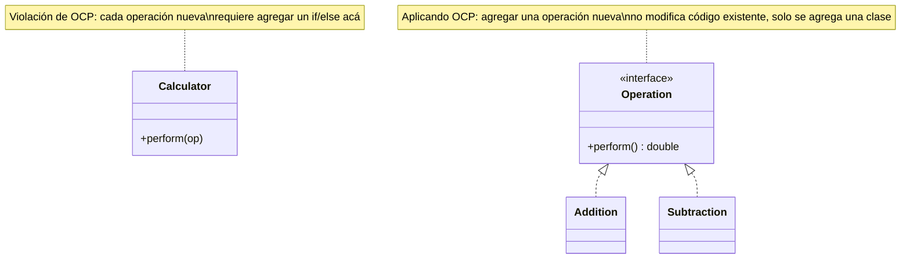
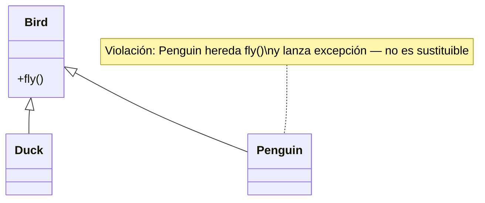
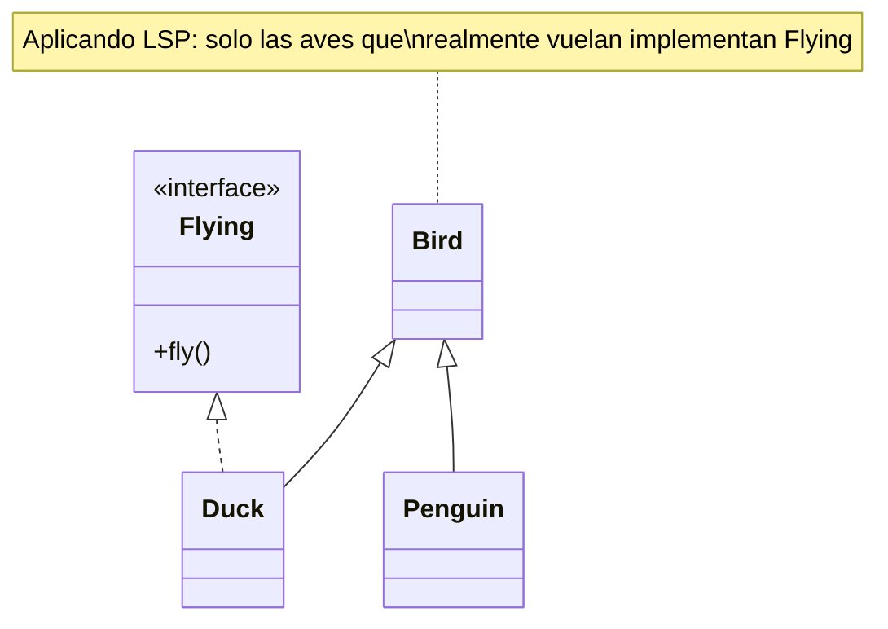
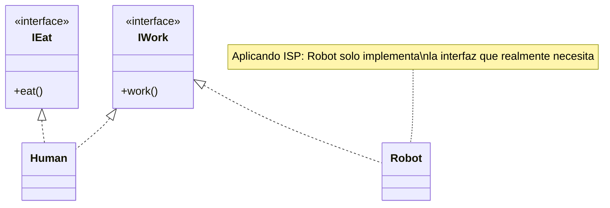
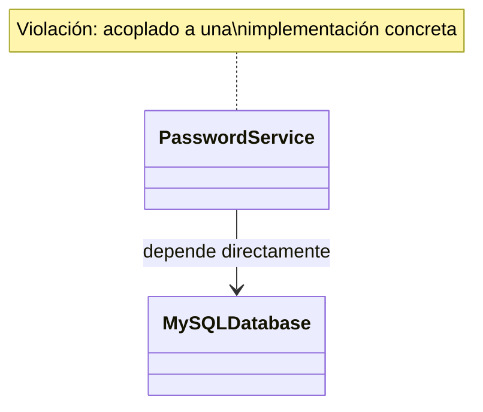
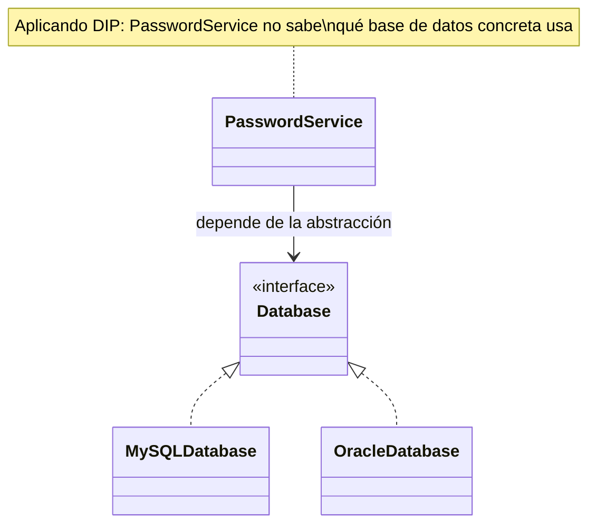

# SOLID Principles

Los cinco principios SOLID de diseño orientado a objetos, cada uno con un diagrama "violación vs aplicado" — agnóstico de lenguaje, aunque los ejemplos usan sintaxis Java por ser la más común en la industria.

## ¿Qué es SOLID?

SOLID es un acrónimo mnemotécnico de cinco principios de diseño pensados para que el software sea más entendible, flexible y mantenible.

## 1. Single Responsibility Principle (SRP)

> "A class should have one and only one reason to change."

Una clase debe tener una sola responsabilidad. Si tiene más de una, esas responsabilidades quedan acopladas: un cambio en una puede forzar un cambio en la otra.

> 🧠 **Píldora:** si para describir la clase necesitás decir "y" ("hashea la contraseña **y** la guarda **y** notifica"), viola SRP.



## 2. Open/Closed Principle (OCP)

> "Software entities should be open for extension, but closed for modification."

> 🧠 **Píldora:** si agregar un caso nuevo te obliga a tocar un `if/else` o `switch` ya existente, viola OCP — la extensión debería ser una clase nueva, no una edición.



## 3. Liskov Substitution Principle (LSP)

> "Subtypes must be substitutable for their base types."

Las clases hijas deben poder usarse donde se espera la clase padre, sin causar errores.

> 🧠 **Píldora:** si una subclase tiene que lanzar `UnsupportedOperationException` en un método heredado, viola LSP — está mintiendo sobre lo que "es".





## 4. Interface Segregation Principle (ISP)

> "No client should be forced to depend on interfaces it does not use."

Es mejor tener varias interfaces chicas y específicas que una sola interfaz grande de propósito general.

> 🧠 **Píldora:** si un método de una interfaz implementada queda vacío o lanza una excepción de "no soportado", viola ISP — la interfaz es más grande de lo que ese cliente necesita.

```mermaid
classDiagram
    class IWorker {
        <<interface>>
        +work()
        +eat()
    }
    class Robot
    IWorker <|.. Robot
    note for IWorker "Interfaz \"gorda\" — mezcla dos responsabilidades"
    note for Robot "Violación: Robot está forzado a implementar\neat(), que no le corresponde"
```



## 5. Dependency Inversion Principle (DIP)

> "High-level modules should not depend on low-level modules. Both should depend on abstractions."
> "Abstractions should not depend on details. Details should depend on abstractions."

> 🧠 **Píldora:** si una clase de alto nivel instancia (`new`) una implementación concreta de bajo nivel en vez de recibir una interfaz, viola DIP.





Relacionado: [`design-pattern/`](../design-pattern) — muchos patrones GoF son aplicaciones directas de estos principios (Strategy/Factory Method → OCP, Adapter → DIP). [`clean-code/`](../clean-code) — DRY, KISS, YAGNI y checklist de code review, los principios "chicos" que complementan a SOLID.

## Referencias

- Martin, R. C. — *Agile Software Development, Principles, Patterns, and Practices* (2002) y *Clean Architecture* (2017) — origen y formalización de los 5 principios SOLID.
