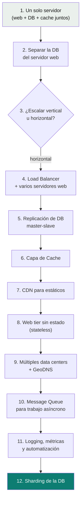
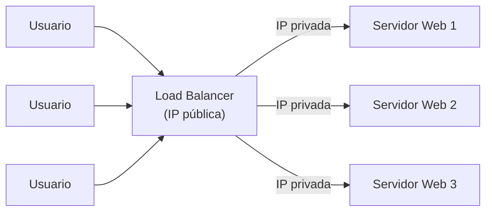
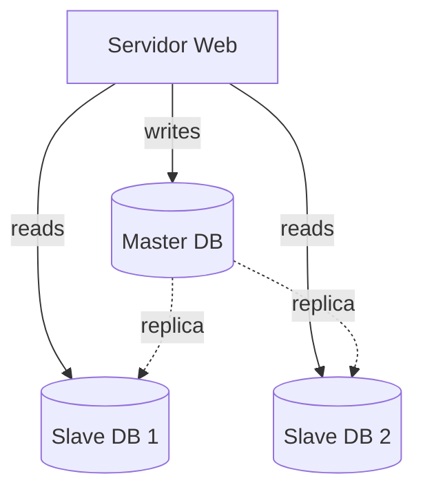
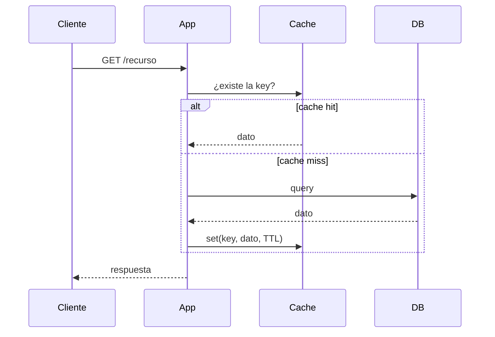
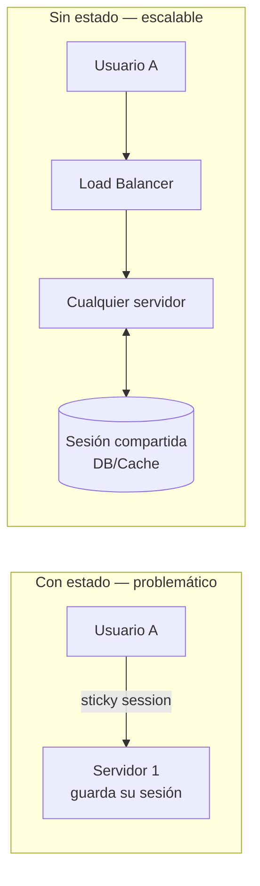
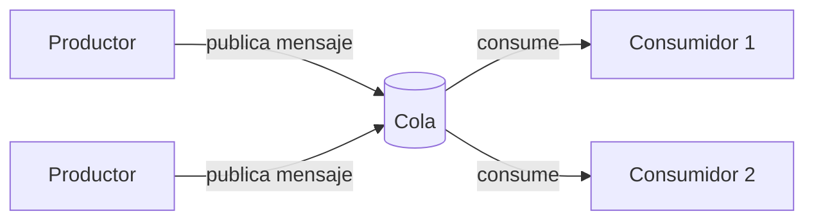
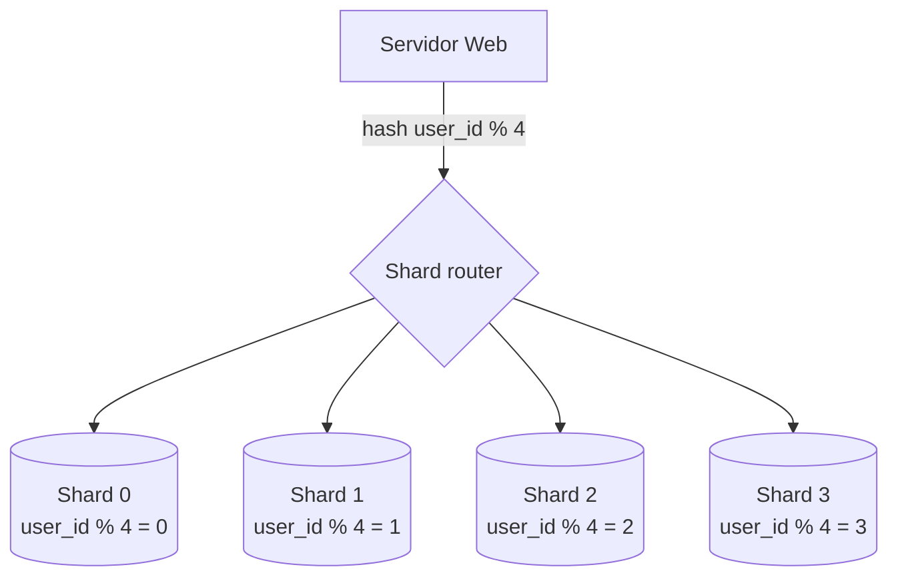

# Escalar de 0 a millones de usuarios

Cómo evoluciona la arquitectura de un sistema a medida que crece de un solo usuario a millones — cada etapa resuelve el cuello de botella que dejó la anterior. Es la progresión clásica de entrevista de system design.

## La evolución completa, en un diagrama

## 1–2. Un servidor → separar la base de datos

Todo arranca en un solo servidor (web + DB + cache). El primer paso de escalado casi siempre es separar el **tier web** (tráfico) del **tier de datos** (base de datos), para poder escalar cada uno de forma independiente.

> 🧠 **Píldora — SQL vs NoSQL, la decisión rápida:**
> - **SQL** (MySQL, PostgreSQL, Oracle) — datos estructurados con relaciones claras, necesitás `JOIN`s, consistencia fuerte.
> - **NoSQL** (DynamoDB, Cassandra, MongoDB, Neo4j) — necesitás latencia muy baja, datos no estructurados/semi-estructurados, volumen masivo, o el modelo es clave-valor/grafo/documento.

## 3. Vertical vs horizontal scaling

| | Vertical ("scale up") | Horizontal ("scale out") |
|---|---|---|
| Cómo | Más CPU/RAM/disco al mismo servidor | Más servidores |
| Simplicidad | Más simple, sin cambios de arquitectura | Requiere load balancer, estado compartido |
| Límite | Tiene techo de hardware | Escala prácticamente sin límite |
| Riesgo | Single point of failure | Redundancia natural |

> 🧠 **Píldora:** vertical scaling es la respuesta correcta para un problema chico o de corto plazo; horizontal scaling es la que sostiene "millones de usuarios" — es la que se espera que defiendas en una entrevista.

## 4. Load Balancer

Los usuarios solo conocen la IP pública del load balancer; los servidores web quedan en una red privada, inalcanzables directamente desde internet. Resuelve: failover, disponibilidad, y picos de tráfico repartidos entre varios servidores.

## 5. Replicación de base de datos (master-slave)

- **Master:** todos los `INSERT`/`UPDATE`/`DELETE`.
- **Slaves:** todos los `SELECT` — se pueden agregar tantos como haga falta para repartir la carga de lectura.
- **Failover:** si un slave cae, se redirigen sus lecturas al master temporalmente. Si el master cae, se **promueve** un slave a nuevo master.

> 🧠 **Píldora:** la mayoría de los sistemas leen mucho más de lo que escriben — por eso escalar lecturas (más slaves) resuelve el 80% de la carga antes de tocar el master.

## 6. Cache (read-through)

- Usar cache cuando el dato se **lee mucho** y se **modifica poco**.
- Definí una política de expiración (TTL): muy corta = recargás la DB seguido; muy larga = servís datos desatualizados.
- Eviction policy más común: **LRU** (Least Recently Used). También existen LFU y FIFO.
- Nunca un solo servidor de cache — es un single point of failure, hace falta distribuirlo.

## 7. CDN para contenido estático

Red de servidores geográficamente distribuidos que cachean assets estáticos (imágenes, video, CSS, JS) cerca del usuario.

- Si el CDN no tiene el archivo, lo pide al origen (tu servidor o S3), lo cachea con un TTL, y lo sirve desde ahí en los siguientes requests.
- Invalidar contenido: vía API del proveedor, o con **versionado de objetos** (`logo.png?v=2`) — más simple y más usado en la práctica.

## 8. Web tier sin estado (stateless)

Sacar el estado de sesión del servidor web y guardarlo en un store compartido (DB, NoSQL o cache) permite que **cualquier** servidor atienda a **cualquier** usuario — sin eso, hacen falta "sticky sessions" que complican el auto-scaling y el manejo de fallas.

## 9. Múltiples data centers

Se usa **GeoDNS** para enrutar al usuario al data center más cercano. En operación normal se reparte tráfico entre data centers (ej. 50% US-East / 50% US-West); si uno cae, todo el tráfico se redirige al que sigue sano.

Desafíos: sincronizar datos entre data centers, manejar el caso de que el dato no esté replicado todavía en el destino del failover, y poder testear/desplegar de forma consistente en todas las ubicaciones.

## 10. Message Queue

Desacopla al productor del consumidor: el productor publica un mensaje aunque el consumidor esté caído; el consumidor procesa cuando puede, aunque el productor ya no esté activo. Productor y consumidor **escalan de forma independiente**. Caso típico: procesar imágenes subidas por el usuario de forma asíncrona en vez de bloquear el request.

## 11. Logging, métricas y automatización

- **Logging:** por servidor, o agregado en un servicio centralizado para poder correlacionar errores entre servicios.
- **Métricas:** a nivel host (CPU, memoria, I/O), a nivel de tier (toda la capa de DB/cache), y de negocio (usuarios activos diarios, retención, ingresos).
- **Automatización:** CI para verificar cada cambio, pipelines automatizados de build/test/deploy — necesario en cuanto hay más de un par de servidores para gestionar a mano.

## 12. Sharding de la base de datos

Cuando escalar el master verticalmente ya no alcanza (aunque existan instancias con 24 TB de RAM), se particiona la base en **shards** — cada uno con el mismo schema, pero con un subconjunto de los datos, repartidos según una **sharding key**.

**Los tres problemas reales de sharding:**
- **Resharding:** cuando un shard se llena o queda desbalanceado, hay que mover datos y actualizar la función de hash — **consistent hashing** es la solución estándar para minimizar cuántos datos se mueven.
- **Hotspot / celebrity key:** si la sharding key es algo como `user_id` y por mala suerte varias cuentas de altísimo tráfico caen en el mismo shard (el ejemplo clásico: varias celebridades con millones de seguidores en el mismo shard), ese shard se satura. Solución: asignar un shard dedicado a esas keys de alto tráfico, y particionar más si hace falta.
- **Joins y desnormalización:** hacer `JOIN` entre shards es costoso o directamente inviable — la salida típica es desnormalizar el modelo para que las queries frecuentes resuelvan con una sola tabla.

> 🧠 **Píldora:** elegir una buena sharding key es la decisión que más determina si el sharding funciona — tiene que distribuir la carga parejo, no solo el volumen de datos.

## Resumen — checklist para responder "¿cómo escalarías esto?"

- [ ] Web tier sin estado (stateless).
- [ ] Redundancia en cada capa (no single point of failure).
- [ ] Cachear todo lo que se lee frecuentemente y cambia poco.
- [ ] Soportar múltiples data centers.
- [ ] Servir assets estáticos desde un CDN.
- [ ] Escalar la capa de datos con sharding cuando vertical ya no alcanza.
- [ ] Separar responsabilidades en servicios independientes.
- [ ] Monitorear (logs + métricas) y automatizar el pipeline.

Relacionado: [`microservices-patterns/`](../microservices-patterns) profundiza en cómo se comunican esos servicios independientes entre sí (colas, eventos, resiliencia), y [`cloud-aws/`](../cloud-aws) en los servicios AWS concretos que implementan cada pieza de este diagrama (ELB, RDS + réplicas, ElastiCache, CloudFront, SQS/SNS, DynamoDB).
