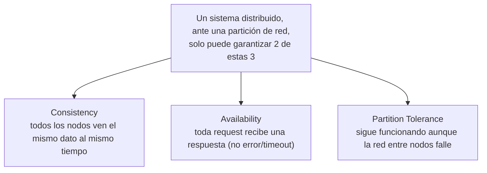

# Bases de datos — SQL vs NoSQL, y el teorema que explica el trade-off (ACID/CAP)

La pregunta que dispara este documento: *"¿por qué no migramos todo a NoSQL si escala mejor?"* — porque escalar mejor casi siempre significa **sacrificar algo** (consistencia fuerte, transacciones multi-fila, joins) que un SQL tradicional da por sentado. Este documento es el marco para justificar esa decisión en una entrevista, no una preferencia de gusto.

## SQL vs NoSQL — la pregunta de fondo no es "cuál es mejor"

| | SQL (relacional) | NoSQL |
|---|---|---|
| Modelo de datos | Filas/tablas, esquema fijo, relaciones normalizadas. | Documento (Mongo), key-value (Redis/DynamoDB), column-family (Cassandra), grafo (Neo4j) — esquema flexible. |
| Transacciones | ACID nativo, multi-fila/multi-tabla. | Generalmente atómico solo a nivel de un documento/partición; transacciones multi-documento son la excepción, no la regla. |
| Escalamiento típico | Vertical primero, horizontal con sharding (complejo — ver [`01-scale-from-zero-to-millions.md`](01-scale-from-zero-to-millions.md)). | Horizontal nativo desde el diseño — particionado y replicación son de primera clase. |
| Joins | Nativos y eficientes (con índices). | Generalmente no soportados o costosos — el modelo de datos se **desnormaliza a propósito** para evitarlos. |
| Cuándo preferirlo | El dominio tiene relaciones complejas y consistencia fuerte es un requisito real (dinero, inventario, citas médicas — ver [`ddd/aggregates.md`](../ddd/aggregates.md)). | Alto volumen de escritura/lectura simple, esquema que cambia seguido, o el acceso es casi siempre "por una clave" (sesiones, catálogos, series de tiempo, logs de eventos). |

**Frase para entrevista:** "no elijo NoSQL porque 'escala mejor' en abstracto — elijo NoSQL cuando el patrón de acceso real (mayormente por clave, sin joins complejos) no necesita lo que un motor relacional me da a cambio de su costo de escalar horizontalmente."

## ACID — lo que un SQL tradicional garantiza por defecto

| Garantía | Qué significa en la práctica |
|---|---|
| **A**tomicity | Una transacción con varios pasos se aplica completa o no se aplica nada — nunca a medias. |
| **C**onsistency | La base de datos pasa de un estado válido a otro válido — las constraints (FK, `NOT NULL`, `CHECK`) nunca se violan, ni a mitad de una transacción concurrente. |
| **I**solation | Transacciones concurrentes no se pisan entre sí — cada una ve el mundo como si corriera sola (con distintos niveles: `READ COMMITTED`, `REPEATABLE READ`, `SERIALIZABLE`, cada uno con más garantía y menos throughput). |
| **D**urability | Una vez que el commit se confirmó, el dato sobrevive un crash — ya está en disco (WAL — write-ahead log), no solo en memoria. |

Esto es lo que hace que `@Transactional` (Spring, ver [`../frameworks/spring-boot/spring-data.md`](../frameworks/spring-boot/spring-data.md)) tenga sentido: envuelve varias operaciones para que ACID las trate como una sola unidad.

## CAP Theorem — por qué NoSQL distribuido no puede prometer todo

- **En la práctica, `P` no es opcional** — cualquier sistema distribuido real debe tolerar particiones de red (los nodos están en distintas máquinas/zonas). Por eso el teorema, en la práctica, se reduce a elegir entre **CP** (consistencia, sacrificando disponibilidad durante una partición) y **AP** (disponibilidad, sacrificando consistencia inmediata — *eventual consistency*).
- **CP típico:** MongoDB (configuración por defecto con `majority` write concern), HBase, bases relacionales con réplicas síncronas — priorizan que el dato leído sea siempre correcto, aunque eso implique rechazar/esperar una request durante una partición.
- **AP típico:** Cassandra, DynamoDB (por defecto), Riak — siempre responden, pero dos clientes pueden leer valores distintos por un momento hasta que la replicación converge (*eventual consistency* — mismo concepto que en [`microservices-patterns/README.md`](../microservices-patterns/README.md), sección consistencia de datos).
- **Frase para entrevista:** "el CAP theorem no es una opción de diseño de un solo sistema — es una restricción física de cualquier sistema distribuido ante una partición de red. La pregunta real de diseño es CP vs AP, porque P no se puede evitar."

## BASE — la alternativa que proponen los sistemas AP

Frente a ACID, los sistemas AP suelen describirse como **BASE**: **B**asically **A**vailable, **S**oft state, **E**ventual consistency — el sistema siempre responde, el estado puede estar temporalmente desactualizado entre réplicas, pero converge con el tiempo. No es "peor" que ACID de forma absoluta — es el trade-off correcto cuando la disponibilidad importa más que la consistencia instantánea (ej. un contador de "me gusta", un catálogo de productos).

## Cómo decidir en una entrevista — el framework de respuesta

1. **Preguntá por el patrón de acceso real**: ¿se consulta mayormente por clave (id, partición) o hacen falta joins/consultas ad-hoc complejas?
2. **Preguntá qué pasa si dos usuarios ven datos ligeramente desactualizados por un segundo** — si es inaceptable (saldo bancario, disponibilidad de un turno médico — ver [`ddd/aggregates.md`](../ddd/aggregates.md)), la respuesta empuja a CP/SQL. Si es tolerable (contador de vistas, feed de noticias), empuja a AP/NoSQL.
3. **Nombrá una base concreta y por qué**, no un tipo abstracto — "Postgres porque necesito transacciones ACID multi-tabla para reservar un turno y descontar disponibilidad atómicamente" es una respuesta de nivel senior; "uso NoSQL porque escala" no lo es.

## Drills de repaso

| Tiempo | Pregunta |
|---|---|
| 4 min | "¿Por qué el CAP theorem en la práctica se reduce a elegir entre CP y AP?" |
| 5 min | "Diseñás el sistema de turnos de una clínica. ¿SQL o NoSQL? Justificá con el patrón de acceso y el costo de una inconsistencia." |
| 4 min | "¿Qué significa 'eventual consistency' y en qué se diferencia de simplemente 'un bug de datos desincronizados'?" |
| 4 min | "¿Por qué Cassandra prioriza disponibilidad y Postgres (con réplicas síncronas) prioriza consistencia? ¿Es una limitación técnica o una decisión de diseño?" |

## Referencias

- Brewer, E. — formulación original del CAP Theorem (2000), y su propia revisión posterior ("CAP Twelve Years Later", 2012) aclarando que P no es realmente opcional.
- Kleppmann, M. — *Designing Data-Intensive Applications* (2017) — el libro de referencia moderno para replicación, particionado, consistencia y los trade-offs reales entre SQL y NoSQL.
- Xu, A. — *System Design Interview* — contexto de cuándo este trade-off aparece en una entrevista de diseño de sistemas.

Relacionado: [`01-scale-from-zero-to-millions.md`](01-scale-from-zero-to-millions.md) para sharding/replicación en la práctica, [`ddd/aggregates.md`](../ddd/aggregates.md) para el costo de negocio de una inconsistencia dentro de un límite transaccional, y [`microservices-patterns/README.md`](../microservices-patterns/README.md) para consistencia eventual entre microservicios (mismo concepto, a otra escala).
