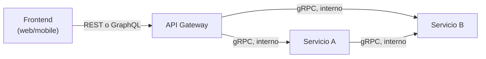

# Estilos de API — REST vs GraphQL vs gRPC

La pregunta que dispara este documento: *"¿por qué no usamos gRPC para todo si es más rápido que REST?"* — porque "más rápido" no es el único criterio: cada estilo optimiza para un consumidor y un contexto de red distintos, y usar el equivocado genera fricción real (un frontend que no puede debuggear fácil, un cliente externo que no puede generar el stub).

## Los tres estilos, en una tabla de decisión

| | REST | GraphQL | gRPC |
|---|---|---|---|
| Formato de payload | JSON, sobre HTTP/1.1 o HTTP/2. | JSON, sobre HTTP (típicamente un solo endpoint `POST /graphql`). | Protocol Buffers (binario), sobre HTTP/2. |
| Quién define la forma de la respuesta | El servidor — el cliente recibe lo que el endpoint decide devolver. | El **cliente** — pide exactamente los campos que necesita en la query. | El servidor, vía un contrato `.proto` estricto y tipado, compartido en build time. |
| Over-fetching / under-fetching | Común — un endpoint fijo trae de más o de menos según el consumidor. | Resuelto por diseño — cada cliente pide su propia forma. | No aplica igual — el contrato ya define exactamente los campos del mensaje. |
| Descubribilidad/debugging | Alta — se prueba con `curl`/Postman sin herramientas extra, cacheable por HTTP estándar (`GET` + `ETag`). | Media — necesita un cliente GraphQL o introspección; cachear por URL no funciona igual (un solo endpoint para todo). | Baja para un humano — payload binario, necesita el `.proto` y una herramienta (`grpcurl`) para inspeccionar a mano. |
| Rendimiento | Bueno — HTTP/1.1 o HTTP/2, texto. | Similar a REST en transporte — el ahorro está en evitar múltiples round-trips, no en el formato en sí. | El más eficiente — binario + HTTP/2 multiplexado + streaming bidireccional nativo. |
| Cuándo preferirlo | API pública, consumida por muchos clientes distintos (browsers, terceros) que valoran simplicidad y caché HTTP. | Un frontend propio (app móvil + web) con necesidades de datos muy distintas entre pantallas, y un equipo que puede mantener un schema centralizado. | Comunicación **interna** entre microservicios, con contratos estrictos y alto volumen — no pensado para un browser consumiéndolo directo. |

## REST — el default por buenas razones, no por inercia

```
GET  /appointments/{id}       → 200 + el turno, o 404
POST /appointments            → 201 + Location: /appointments/{id}
PUT  /appointments/{id}       → reemplaza completo (idempotente)
PATCH /appointments/{id}      → modifica parcialmente
DELETE /appointments/{id}     → 204
```

- Se apoya en la semántica **ya existente** de HTTP (verbos, status codes, caché vía `ETag`/`Cache-Control`) — un cliente HTTP genérico, un proxy, o un CDN ya saben qué hacer con eso sin lógica adicional.
- El problema clásico de **over-fetching** (`GET /appointments/{id}` siempre trae 15 campos aunque el cliente solo necesite 2) o **under-fetching** (la vista necesita datos de 3 recursos distintos → 3 round-trips) es justamente lo que GraphQL ataca de raíz.
- Errores contra `ProblemDetail`/RFC 7807 (ver [`../frameworks/spring-boot/webflux.md`](../frameworks/spring-boot/webflux.md)) o el equivalente de Exception Filters en NestJS (ver [`../frameworks/nestjs/request-lifecycle.md`](../frameworks/nestjs/request-lifecycle.md)) — un contrato de error consistente es parte de un buen diseño REST, no un detalle menor.

## GraphQL — el cliente pide la forma exacta que necesita

```graphql
query {
  appointment(id: "abc-123") {
    scheduledAt
    patient { name }       # un solo round-trip, en vez de 2 llamadas REST separadas
  }
}
```

- Resuelve over/under-fetching por diseño — el cliente decide qué campos trae cada request, sin que el backend anticipe cada combinación posible con endpoints distintos.
- El costo real no es de performance, es de **operación**: un único endpoint dificulta cachear por URL (a diferencia de REST, donde cada recurso tiene su propia URL cacheable), y una query mal diseñada por el cliente puede disparar N+1 en el resolver del backend (el mismo problema N+1 de [`../frameworks/spring-boot/spring-data.md`](../frameworks/spring-boot/spring-data.md)/[`../frameworks/nestjs/persistence.md`](../frameworks/nestjs/persistence.md), pero ahora a nivel de resolver de GraphQL) — se mitiga con **DataLoader** (batching + caching de resolvers dentro de una misma request).
- Tiene sentido cuando **un equipo propio** controla ambos lados (frontend + backend) y las pantallas tienen necesidades de datos muy variables — pierde parte de su ventaja si el consumidor es un tercero externo que solo quiere "el recurso completo".

## gRPC — contratos estrictos para comunicación interna de alto volumen

```protobuf
service AppointmentService {
  rpc GetAppointment (GetAppointmentRequest) returns (Appointment);
  rpc StreamAppointmentUpdates (StreamRequest) returns (stream AppointmentEvent); // streaming nativo
}
```

- El archivo `.proto` es el contrato — se genera código cliente/servidor tipado para ambos lados (Java, TypeScript, Go, lo que haga falta) a partir del mismo archivo, eliminando el desajuste manual de tipos entre servicios que sí puede pasar con JSON suelto.
- **Streaming bidireccional nativo** (HTTP/2 multiplexado) es una ventaja real sobre REST/GraphQL para casos como actualizaciones en tiempo real entre microservicios — no hace falta WebSockets aparte.
- La contra real: no es apto para un browser consumiéndolo directo (necesita `grpc-web` + un proxy), y el payload binario hace que inspeccionar tráfico en desarrollo sea más trabajoso que un simple `curl`. Por eso el patrón típico es: **gRPC entre microservicios internos, REST/GraphQL en el borde público** hacia clientes externos/frontend.

## Cómo se combina con arquitectura de microservicios



Es común mezclar los tres: **REST o GraphQL** en el borde (lo que consume el frontend/terceros), **gRPC** para la comunicación interna entre microservicios donde el volumen y la latencia importan más que la legibilidad humana del payload. Ver [`microservices-patterns/README.md`](../microservices-patterns/README.md) para cómo esto se combina con comunicación síncrona/asíncrona (colas) — gRPC/REST/GraphQL son formas de comunicación **síncrona**; conviven con el patrón asíncrono (colas/eventos) para los casos donde el caller no necesita la respuesta ya.

## Drills de repaso

| Tiempo | Pregunta |
|---|---|
| 4 min | "¿Qué problema concreto de REST resuelve GraphQL, y qué costo operativo introduce a cambio?" |
| 5 min | "Diseñás la comunicación entre 4 microservicios internos de alto volumen. ¿Por qué gRPC en vez de REST ahí, y por qué no gRPC también hacia el frontend?" |
| 4 min | "¿Qué es el problema N+1 en un resolver de GraphQL, y cómo se resuelve (DataLoader)?" |
| 4 min | "¿Por qué REST se cachea más fácil con infraestructura HTTP estándar que GraphQL?" |

## Referencias

- Fielding, R. — tesis doctoral (2000), definición original de REST.
- [GraphQL — Official Documentation](https://graphql.org/learn/) — over-fetching/under-fetching, N+1 y DataLoader.
- [gRPC — Official Documentation](https://grpc.io/docs/what-is-grpc/introduction/) — Protocol Buffers, streaming, casos de uso.

Relacionado: [`microservices-patterns/README.md`](../microservices-patterns/README.md) para comunicación síncrona vs. asíncrona entre servicios, [`../frameworks/spring-boot/spring-data.md`](../frameworks/spring-boot/spring-data.md) y [`../frameworks/nestjs/persistence.md`](../frameworks/nestjs/persistence.md) para el problema N+1 del lado de persistencia (mismo concepto, otro nivel), y [`02-databases-sql-vs-nosql.md`](02-databases-sql-vs-nosql.md) para el trade-off de consistencia que suele acompañar esta misma conversación de arquitectura.
