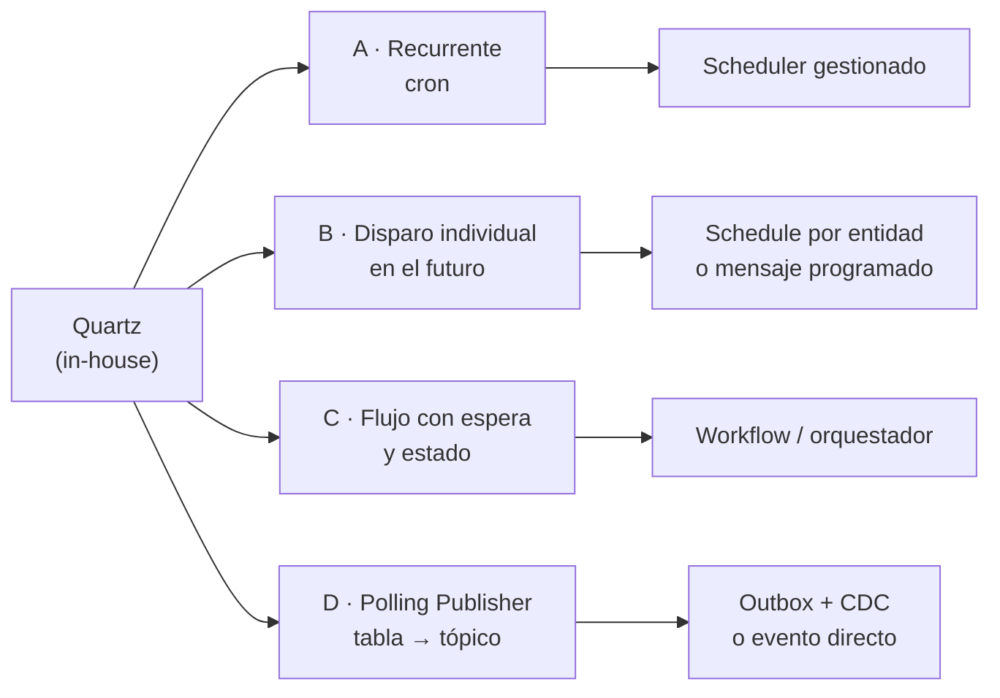
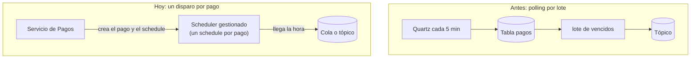
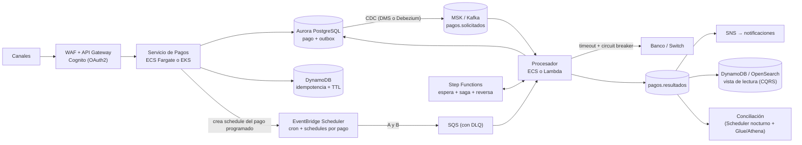
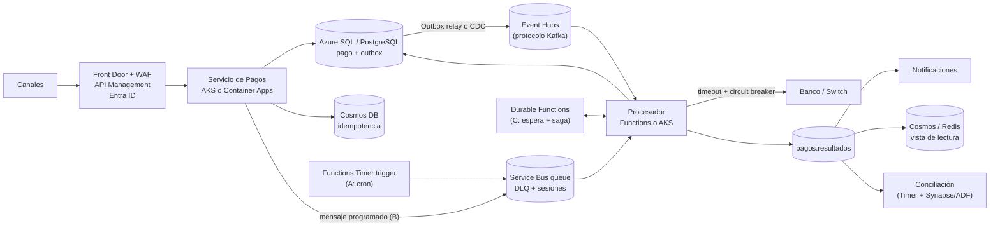
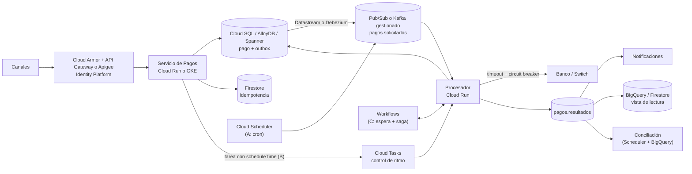

# Caso de diseño — Pasarela de pagos hoy, con servicios gestionados (AWS, Azure, GCP)

La misma pasarela de [`caso-pasarela-pagos.md`](caso-pasarela-pagos.md) (la solución *in-house* con Quartz, base de datos y tópicos), pero diseñada como se haría **hoy** para un producto nuevo, apoyándose en los servicios gestionados de cada nube.

> **La idea central:** el *system design* (qué problema resuelves, qué garantías necesitas, qué componentes y por qué) **no cambia**. Lo que cambia es **quién opera cada pieza**. Kafka, MSK, Event Hubs y Pub/Sub son el mismo concepto (un log o bus de eventos) con nombres distintos. Quien entiende el diseño puede traducirlo a cualquier nube; quien memoriza servicios, no.

## 🍎 Con manzanas (empieza aquí)

**Antes:** un asistente (Quartz) revisaba la agenda **cada 5 minutos** para ver qué cobros tocaban. Si tocaba alguno, lo hacía.

**Hoy:** por cada cobro programado pones **una alarma propia en un servicio de alarmas** (EventBridge Scheduler, Service Bus programado, Cloud Tasks). Cuando llega la hora, suena y el trabajo llega solo. Nadie revisa la agenda en vacío.

| Antes (Quartz) | Hoy (nube) | En la frutería |
|---|---|---|
| Un asistente que repasa la agenda | Un servicio de alarmas | Dejas de revisar y pones una alarma por cita |
| El cuaderno compartido con locks | Lo opera el proveedor | Ya no cuidas el cuaderno |
| Kafka que operas tú | MSK, Event Hubs, Pub/Sub | El mismo libro de ventas, pero lo guarda otra empresa |
| Estados y esperas en tablas | Step Functions, Durable Functions, Workflows | Un coordinador que recuerda dónde iba cada pedido |

**Lo que no cambia:** el sello "YA COBRADO" (idempotencia), el "no sé si el banco cobró" (estado pendiente) y cuadrar la caja al final (conciliación).

Glosario: [`../messaging-streaming/glosario.md`](../messaging-streaming/glosario.md).

### Qué debes dominar según tu nivel

| Nivel | Debes poder explicar |
|---|---|
| 🟢 **Junior** | Que Kafka, MSK, Event Hubs y Pub/Sub son el mismo concepto con otro nombre; qué es un scheduler gestionado |
| 🟡 **Mid** | Qué servicio hace cron, cuál un disparo individual y cuál un flujo con espera, en cada nube |
| 🔴 **Senior** | Descomponer Quartz en sus tres trabajos; polling vs un disparo por pago; límites de cada servicio; *lock-in*; ruta de migración sin riesgo; cuándo **no** migrar |

## 1. Qué hacía Quartz realmente: tres trabajos en uno

Antes de reemplazarlo hay que ver que Quartz resolvía **tres problemas distintos** con una sola herramienta. Las nubes los separan en servicios distintos.

| # | Trabajo de Quartz | Ejemplo en la pasarela | Naturaleza |
|---|---|---|---|
| **A** | **Disparador recurrente** (cron) | Cada día a las 02:00 correr la conciliación; cada 5 minutos revisar pendientes | Tiempo recurrente, sin datos propios |
| **B** | **Disparo individual en el futuro** | "Cobrar este pago el día 5 a las 08:00"; "reintentar en 10 minutos" | Un evento por entidad, en un momento exacto |
| **C** | **Flujo con espera y estado** | "Esperar 30 min la respuesta del banco; si no llega, consultar; si falla, reversar" | Orquestación de larga duración (Saga con timeout) |

Y había una **cuarta pieza implícita**: el **Polling Publisher** (el job leía la tabla de pendientes y publicaba al tópico). Hoy se evita sondear una tabla cuando se puede **reaccionar a un evento**.

## 2. Tabla de equivalencias (la "piedra Rosetta")

| Pieza del diseño | In-house (el caso original) | AWS | Azure | GCP |
|---|---|---|---|---|
| **Bus de eventos / log** | Kafka propio | **MSK** (Kafka gestionado) o **Kinesis** | **Event Hubs** (endpoint compatible con Kafka) | **Pub/Sub** o **Managed Service for Apache Kafka** |
| **Cola de trabajo / DLQ** | Cola o tópico de reintento | **SQS** (DLQ integrada) | **Service Bus** (DLQ integrada, sesiones) | **Pub/Sub** (dead-letter topic) o **Cloud Tasks** |
| **Fan-out** | Consumer groups | **SNS** → SQS | **Service Bus topics** / **Event Grid** | **Pub/Sub** (varias suscripciones) |
| **A · Cron recurrente** | Quartz CronTrigger | **EventBridge Scheduler** | **Functions Timer trigger** / Logic Apps | **Cloud Scheduler** |
| **B · Disparo individual futuro** | Trigger por pago en `QRTZ_*` | **EventBridge Scheduler** (schedule de una sola vez) | **Service Bus: mensaje programado** | **Cloud Tasks** (`scheduleTime`) |
| **C · Flujo con espera** | Jobs + estados en tablas | **Step Functions** (estado `Wait`, Saga) | **Durable Functions** (timers, orquestaciones) | **Workflows** |
| **Cómputo de los servicios** | Spring Boot en VMs | **ECS/Fargate**, **EKS**, **Lambda** | **AKS**, **Container Apps**, **Functions** | **Cloud Run**, **GKE** |
| **BD transaccional del pago** | PostgreSQL / Oracle | **Aurora PostgreSQL** / RDS | **Azure SQL** / PostgreSQL Flexible | **Cloud SQL** / **AlloyDB** / **Spanner** |
| **Idempotencia y estado rápido** | Tabla en la BD | **DynamoDB** (escritura condicional, TTL) | **Cosmos DB** | **Firestore** / Spanner |
| **API Gateway** | Gateway propio | **API Gateway** + WAF | **API Management** + Front Door | **API Gateway** / **Apigee** |
| **Identidad** | Servidor OAuth propio | **Cognito** / IAM | **Entra ID** | **Identity Platform** |
| **Secretos y claves** | Vault | **Secrets Manager**, **KMS** | **Key Vault** | **Secret Manager**, **Cloud KMS** |
| **Outbox / CDC** | Relay con polling o Debezium | **DMS** / DynamoDB Streams / Debezium sobre MSK | **Cosmos change feed** / Debezium sobre Event Hubs | **Datastream** / Debezium |
| **Observabilidad** | Prometheus, ELK | **CloudWatch**, **X-Ray** | **Application Insights**, Azure Monitor | **Cloud Logging**, **Cloud Trace** |

Los nombres exactos de los servicios cambian con el tiempo; lo que no cambia es el **rol** de cada pieza. Antes de afirmar una capacidad concreta en una entrevista, conviene revisar la documentación vigente.

## 3. Cambio de mentalidad: de "sondear una tabla" a "un evento por cosa"

**In-house (Quartz):** un job se despierta cada N minutos, **consulta** la tabla de pagos que vencieron y los publica en lote.

**Cloud-native:** al crear un pago programado, **se registra un disparo individual** para su fecha exacta. Cuando llega la hora, el servicio **entrega el evento** al procesador. No hay job que sondee.

| | Polling por lote (Quartz) | Un disparo por pago (cloud) |
|---|---|---|
| **Precisión** | La del intervalo del job (minutos) | Exacta, a la hora pedida (con ventana flexible opcional) |
| **Carga en la BD** | Consultas constantes aunque no haya nada | Cero consultas en vacío |
| **Escala** | Limitada por la BD de locks | Millones de schedules gestionados por el servicio |
| **Complejidad operativa** | Operar cluster, tablas `QRTZ_*`, relojes, misfires | La opera el proveedor |
| **Riesgo** | Cuello de botella, doble ejecución | Duplicados (*at-least-once*), límites del servicio, lock-in |
| **Cuándo conviene** | Muchos pagos agrupados que se procesan juntos (lotes, cortes bancarios) | Disparos individuales, volumen alto y variable |

**Ojo:** un disparo por pago **no siempre es mejor**. Los **lotes con corte bancario** (archivo a las 17:00) siguen siendo naturalmente un trabajo recurrente (tipo A), y ahí un cron gestionado es lo correcto.

## 4. Límites verificados que importan al elegir

| Servicio | Dato | Implicación |
|---|---|---|
| **EventBridge Scheduler** | Soporta schedules de **una sola vez**, **cron** y **rate**; ventana de entrega flexible; política de reintentos (hasta 185 reintentos y 24 h de antigüedad máxima del evento); **DLQ en SQS** | Cubre A y B sin servidores. Si el destino falla, reintenta y manda a la DLQ |
| **SQS delay** | El retraso por mensaje llega **hasta 15 minutos** (0 a 900 s) | **No sirve** para "cobrar el día 5": solo para retrasos cortos (backoff) |
| **SQS FIFO** | Deduplicación por `MessageDeduplicationId` en una ventana de **5 minutos** | Ayuda con duplicados cercanos, **no reemplaza** la idempotencia de negocio |
| **Cloud Tasks (GCP)** | Programa tareas hasta **30 días** adelante; admite deduplicación por nombre de tarea y control de ritmo | Cubre B (disparo individual) con control de tasa hacia el banco |
| **Pub/Sub (GCP)** | **No** tiene entrega programada ni deduplicación en la creación; las **ordering keys** dan orden por clave, pero la entrega sigue siendo *at-least-once* | Para disparos futuros se combina con Cloud Tasks o Scheduler |
| **Durable Functions (Azure)** | Los *durable timers* de .NET y Java admiten duraciones largas; en JavaScript, Python y PowerShell están limitados a **6 días** | Para esperas largas elegir bien el lenguaje o proveedor de almacenamiento |
| **Service Bus (Azure)** | Los **mensajes programados** (`ScheduledEnqueueTimeUtc`) retrasan la entrega a una hora futura | Cubre B. Revisar en la documentación el límite máximo de programación antes de depender de fechas muy lejanas |

**Moraleja de entrevista:** *no hay un servicio que lo haga todo.* Se elige por **plazo** (minutos, días, meses), **cantidad** (cientos o millones) y **semántica** (cron, una vez, flujo con espera).

## 5. Arquitectura en AWS

**Cómo se reparte el trabajo de Quartz:**
- **A (cron):** EventBridge Scheduler con una expresión cron a la cola o a la función de conciliación.
- **B (por pago):** el servicio crea un **schedule de una sola vez** al registrar el pago programado; llegada la hora, el mensaje entra a SQS (con DLQ) y lo consume el procesador. Para reintentos cortos, el *delay* de SQS (hasta 15 min) o el reintento propio del Scheduler.
- **C (espera y saga):** **Step Functions** con el estado `Wait` y ramas de compensación.
- **Idempotencia:** DynamoDB con escritura condicional (`attribute_not_exists`) y TTL.
- **Outbox → Kafka:** CDC de Aurora hacia MSK, o publicar con Kinesis/SNS si no se necesita Kafka.

**Si no necesitas releer eventos:** SNS + SQS puede reemplazar a Kafka y baja mucho la complejidad.

## 6. Arquitectura en Azure

**Cómo se reparte el trabajo de Quartz:**
- **A (cron):** **Functions con Timer trigger** (corre una sola instancia aunque la función escale) o Logic Apps.
- **B (por pago):** **Service Bus con mensajes programados**: se envía el mensaje con `ScheduledEnqueueTimeUtc` y aparece en la cola a esa hora, con DLQ y sesiones para el orden por cuenta.
- **C (espera y saga):** **Durable Functions** con timers duraderos y compensaciones.
- **Event Hubs con endpoint Kafka:** las aplicaciones Kafka existentes se conectan casi sin cambios.
- **Mensajes de comandos vs eventos:** Service Bus para comandos y trabajo con garantías (sesiones, DLQ, duplicados); Event Hubs para el flujo masivo de eventos.

## 7. Arquitectura en GCP

**Cómo se reparte el trabajo de Quartz:**
- **A (cron):** **Cloud Scheduler**, que publica en Pub/Sub o llama a un endpoint HTTP.
- **B (por pago):** **Cloud Tasks** con `scheduleTime` (hasta 30 días) y **control de tasa de despacho**: ideal para no saturar al banco. La deduplicación por nombre de tarea ayuda a evitar duplicados al crear.
- **C (espera y saga):** **Workflows**.
- **Pub/Sub** es el bus: ordering keys para el orden por cuenta, dead-letter topic; **no** reemplaza a Cloud Tasks para entrega programada.

## 8. Opción agnóstica de nube (Kubernetes)

Cuando hay que evitar el *lock-in* o correr en varias nubes o on-prem:

| Pieza | Opción |
|---|---|
| Cómputo | Kubernetes (EKS, AKS, GKE o propio) |
| Bus | **Kafka** (Strimzi, Confluent Platform/Cloud) |
| Cron | **Kubernetes CronJob** |
| Disparo individual y flujos largos | **Temporal** (motor de workflows: timers duraderos, reintentos, sagas con estado) o Camunda |
| BD | PostgreSQL |
| CDC | Debezium |

**Temporal** es hoy la alternativa más cercana a "Quartz + estado + saga" en una sola herramienta, pero **más potente**: el flujo del pago se escribe como código y el motor garantiza que sobreviva a caídas. Costo: operar o contratar el servicio, y una curva de aprendizaje.

## 9. ¿Seguir con Quartz o pasar a gestionado?

| Situación | Recomendación |
|---|---|
| App Java existente con Quartz que funciona, volumen moderado | **Mantener Quartz**. No migrar por moda |
| Lotes recurrentes con corte bancario fijo | Cron gestionado (A) o Quartz; ambos valen |
| Millones de disparos individuales, volumen muy variable | Scheduler por pago (EventBridge Scheduler, Cloud Tasks, Service Bus programado) |
| Flujos con esperas largas, compensaciones y estado | Workflow engine (Step Functions, Durable Functions, Workflows, Temporal) |
| Equipo pequeño sin capacidad para operar infraestructura | Gestionado de punta a punta |
| Regulación que exige datos on-prem o multinube | Kubernetes + Kafka + Temporal |
| Producto nuevo en una sola nube | Servicios gestionados de esa nube |

**Ruta de migración sin romper nada (Strangler Fig):**
1. Dejar Quartz como está y **extraer los flujos nuevos** al scheduler gestionado.
2. Mover primero los **cron simples** (tipo A), que son los más fáciles.
3. Reemplazar el **polling publisher** por **Outbox + CDC** (menos carga en la BD).
4. Migrar los pagos programados (tipo B) a disparos individuales, con **doble escritura** y comparación durante un tiempo.
5. Mover las sagas (tipo C) a un workflow engine.
6. Apagar Quartz cuando ya no tenga triggers.

## 10. Qué cambia (y qué no) en un producto de pagos nuevo

**No cambia:**
- Idempotencia en API, consumidor y banco (todo sigue siendo *at-least-once*).
- El estado `PENDIENTE_CONFIRMACION` ante un timeout del banco y la conciliación.
- Outbox, Saga, Circuit Breaker, Bulkhead y DLQ.
- Modelo de datos del pago, auditoría inmutable y máquina de estados ([`caso-pasarela-pagos.md`](caso-pasarela-pagos.md)).

**Sí cambia:**
- **Menos infraestructura que operar:** Kafka, scheduler y workflows gestionados reducen el trabajo del equipo.
- **Menos alcance de PCI DSS:** delegar la tarjeta a un proveedor o servicio de tokenización saca datos sensibles de tu sistema (verificar con el área de cumplimiento).
- **Seguridad por identidad:** roles y *managed identities* en lugar de credenciales en archivos.
- **Infraestructura como código** (Terraform, Bicep, CDK) y despliegues repetibles por entorno.
- **Observabilidad integrada** (trazas distribuidas, métricas, alertas).
- **Pagos en tiempo real 24/7:** los rieles de pago inmediato (transferencias instantáneas, billeteras) reducen la dependencia de los cortes diarios; la conciliación pasa a ser continua en lugar de nocturna.
- **Costo por uso** en lugar de capacidad fija: hay que vigilar el costo a gran volumen.

**Riesgos nuevos:** *lock-in*, límites propios de cada servicio (ver sección 4), dificultad para probar localmente (por eso LocalStack o emuladores; ver [`../cloud-aws/`](../cloud-aws)), y mayor dispersión de piezas que hay que observar de punta a punta.

## 11. Cómo contarlo en una entrevista

1. **Diseño primero, servicios después:** *"Primero fijo qué garantías necesita un pago: no duplicar, no perder, auditar. De ahí salen los patrones: idempotencia, Outbox, saga. Los servicios concretos los elijo después según la nube."*
2. **La descomposición de Quartz (la frase que lo demuestra):** *"En el proyecto Quartz hacía tres cosas: cron recurrente, disparos individuales y flujos con espera. Hoy las separaría: un scheduler gestionado para el cron, un schedule por pago o mensaje programado para los disparos individuales, y un workflow engine para los flujos con espera."*
3. **Por qué ya no sondear:** *"Cambiaría el polling por un disparo por pago o por Outbox con CDC, para no consultar la base de datos en vacío y escalar mejor."*
4. **Lo que no cambia:** *"La idempotencia, el estado de confirmación pendiente y la conciliación son iguales en cualquier nube."*
5. **Criterio, no moda:** *"Si la aplicación ya tiene Quartz y funciona, no migraría solo por migrar; extraería primero los flujos nuevos."*

### Preguntas probables

| Pregunta | Respuesta corta |
|---|---|
| ¿Qué reemplazaría a Quartz en AWS, Azure y GCP? | **Cron:** EventBridge Scheduler / Functions Timer / Cloud Scheduler. **Disparo individual:** EventBridge Scheduler / Service Bus programado / Cloud Tasks. **Flujo con espera:** Step Functions / Durable Functions / Workflows |
| ¿Por qué no usar el delay de SQS para pagos programados? | Llega solo a 15 minutos; sirve para backoff, no para fechas lejanas |
| ¿Qué diferencia hay entre Kafka, MSK, Event Hubs y Pub/Sub? | El mismo concepto de log o bus de eventos; cambian el operador, el protocolo y los límites. Event Hubs habla protocolo Kafka |
| ¿Cuándo usarías Temporal? | Flujos largos con timers, reintentos y compensaciones, escritos como código, sobre cualquier nube |
| ¿Qué ventaja tiene un disparo por pago frente al polling? | Precisión, cero consultas en vacío y escala; a cambio, *at-least-once* y límites del servicio |
| ¿Cuándo mantendrías Quartz? | Cuando ya funciona, el volumen es moderado y los lotes son recurrentes |
| ¿Cómo migrarías sin riesgo? | Strangler Fig: flujos nuevos al gestionado, luego cron, luego pagos programados, luego sagas |
| ¿Qué no cambia al ir a la nube? | Idempotencia, estado pendiente del banco, Outbox, auditoría y conciliación |

## Vínculos

- Caso base *in-house*: [`caso-pasarela-pagos.md`](caso-pasarela-pagos.md)
- Quartz a fondo y alternativas: [`../messaging-streaming/quartz-scheduler.md`](../messaging-streaming/quartz-scheduler.md)
- Kafka y comparación de brokers: [`../messaging-streaming/kafka.md`](../messaging-streaming/kafka.md), [`../messaging-streaming/README.md`](../messaging-streaming/README.md)
- Outbox, Saga, resiliencia: [`../microservices-patterns/`](../microservices-patterns)
- CQRS: [`../ddd/cqrs.md`](../ddd/cqrs.md)
- Servicios AWS y práctica con LocalStack: [`../cloud-aws/`](../cloud-aws)
- Escalado: [`01-scale-from-zero-to-millions.md`](01-scale-from-zero-to-millions.md)

## Fuentes consultadas

- [Amazon EventBridge Scheduler (documentación de AWS)](https://docs.aws.amazon.com/eventbridge/latest/userguide/using-eventbridge-scheduler.html)
- [Elegir entre Pub/Sub y Cloud Tasks (Google Cloud)](https://docs.cloud.google.com/pubsub/docs/choosing-pubsub-or-cloud-tasks)
- [Orden de mensajes en Pub/Sub (Google Cloud)](https://docs.cloud.google.com/pubsub/docs/ordering)
- [Timers en Durable Functions (Microsoft Learn)](https://learn.microsoft.com/azure/azure-functions/durable/durable-functions-timers)
- [Amazon SQS: colas con retraso (AWS)](https://docs.aws.amazon.com/AWSSimpleQueueService/latest/SQSDeveloperGuide/sqs-delay-queues.html)
