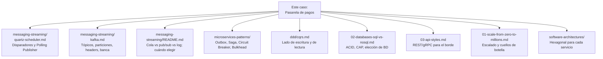
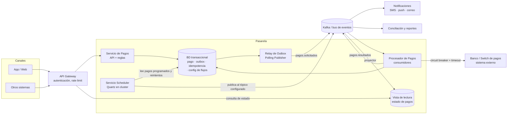
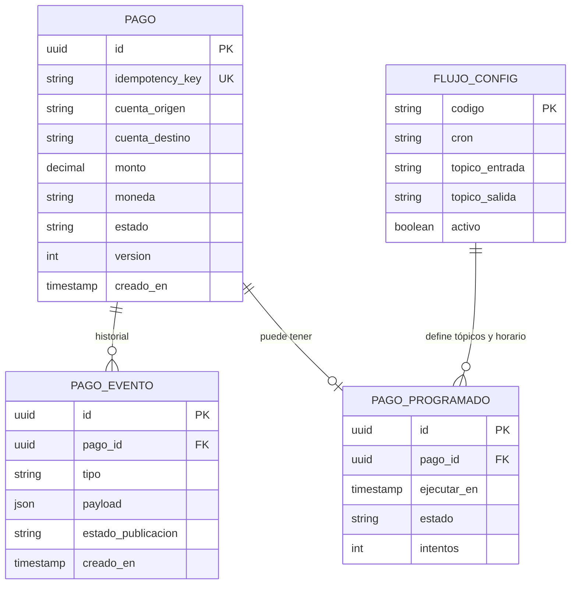
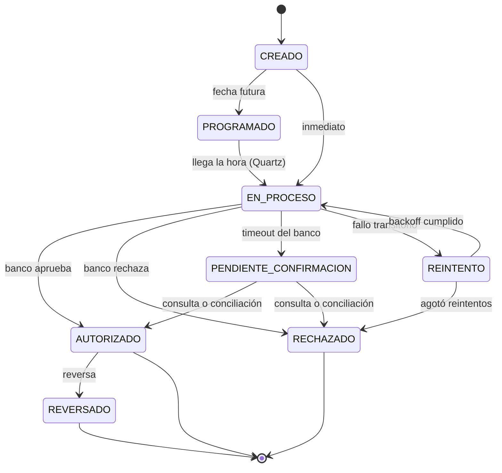
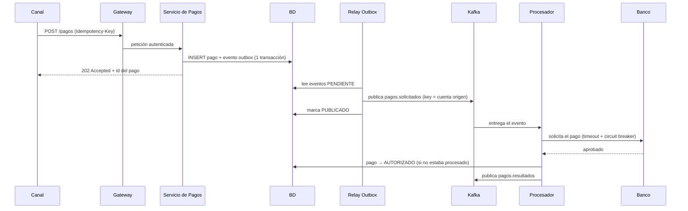
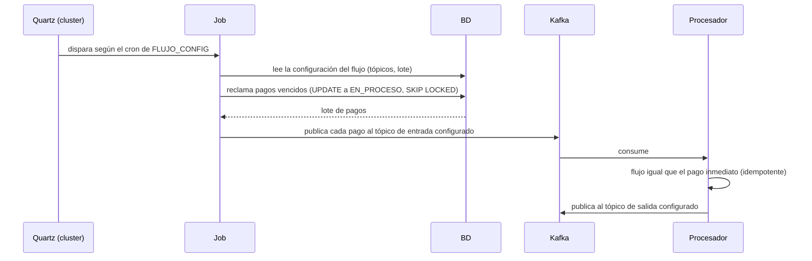

# Caso de diseño — Pasarela de pagos con disparadores programados y eventos

System design de la solución de pagos que se construyó con **Quartz + mensajería (tópicos) + base de datos**: qué se hizo, por qué, cómo, y el dibujo de todo el sistema. Pensado para explicarlo en una entrevista frente a un Tech Lead o Principal Engineer.

> **Honestidad sobre la fuente:** este diseño es una **reconstrucción razonable** a partir de lo que se recuerda del proyecto (Quartz leyendo una tabla, disparando a una hora y enviando a tópicos de entrada y salida) más las prácticas habituales de pagos. **Los detalles marcados con 🔎 hay que contrastarlos con la memoria del proyecto real** antes de afirmarlos como hechos. Los números son ilustrativos.

## 🍎 El caso con manzanas (empieza aquí)

Una pasarela de pagos es **la caja de la frutería conectada al banco**. Cobrar una manzana parece fácil; lo difícil es que **nunca se cobre dos veces ni se pierda un cobro**.

| Pieza del diseño | En la frutería |
|---|---|
| **API Gateway** | La puerta de la tienda: revisa quién entra |
| **Servicio de Pagos** | La caja: anota la venta |
| **Outbox** | En la misma hoja anotas "vendí 3 manzanas" **y** "avisar a bodega"; así nunca queda una sin la otra |
| **Relay de Outbox** | El mensajero que lleva los avisos de la columna "avisar" |
| **Kafka** | El libro de ventas que leen bodega, contabilidad y notificaciones |
| **Procesador** | El empleado que llama al banco para cobrar |
| **Idempotency-Key** | El número del ticket: si llega dos veces, es la misma compra |
| **Quartz** | La agenda: "el día 5, cobrar la suscripción"; "dentro de 10 minutos, reintentar" |
| **Circuit Breaker** | Si el banco no contesta varias veces, dejas de llamar un rato |
| **PENDIENTE_CONFIRMACION** | El banco no contestó: **no sabes si cobró**; no cobres de nuevo, pregunta primero |
| **Conciliación** | Cuadrar la caja con el banco al cierre |
| **CQRS** | El libro de ventas (escribir) y la pizarra de resumen (consultar rápido) |

Glosario: [`../messaging-streaming/glosario.md`](../messaging-streaming/glosario.md).

### Qué debes dominar según tu nivel

| Nivel | Debes poder explicar |
|---|---|
| 🟢 **Junior** | El flujo de un pago de punta a punta; qué es un estado del pago; por qué usar una cola entre servicios; qué es la idempotencia |
| 🟡 **Mid** | Outbox y por qué; Quartz como disparador y su riesgo de duplicados; reintentos con backoff; DLT; Circuit Breaker; la máquina de estados |
| 🔴 **Senior** | Justificar cada decisión con su alternativa; el estado desconocido ante un timeout del banco; consistencia por capas; modos de falla; escalado y cuellos de botella; seguridad y PCI; cómo migrarlo a la nube |

## Mapa de vínculos (cada pieza tiene su documento de detalle)

| Tema usado en el caso | Dónde profundizar |
|---|---|
| Quartz, tablas `QRTZ_*`, cluster, misfire, Polling Publisher | [`../messaging-streaming/quartz-scheduler.md`](../messaging-streaming/quartz-scheduler.md) |
| Tópicos, particiones, key, headers, `acks=all`, DLT, seguridad en banca | [`../messaging-streaming/kafka.md`](../messaging-streaming/kafka.md) |
| Elegir cola vs log vs pub/sub | [`../messaging-streaming/README.md`](../messaging-streaming/README.md) |
| Outbox, Saga, idempotencia, Circuit Breaker, Bulkhead, API Gateway | [`../microservices-patterns/`](../microservices-patterns) |
| CQRS (consulta de estado separada de la escritura) | [`../ddd/cqrs.md`](../ddd/cqrs.md), [`../ddd/domain-events.md`](../ddd/domain-events.md) |
| Escalado, caché, réplicas de lectura | [`01-scale-from-zero-to-millions.md`](01-scale-from-zero-to-millions.md) |
| ACID, CAP, SQL vs NoSQL | [`02-databases-sql-vs-nosql.md`](02-databases-sql-vs-nosql.md) |
| Estilo de la API de entrada | [`03-api-styles.md`](03-api-styles.md) |
| Estructura interna de cada servicio | [`../software-architectures/`](../software-architectures) |
| Seguridad (OWASP, JWT, mTLS) | [`../frameworks/spring-boot/security.md`](../frameworks/spring-boot/security.md) |

---

## 1. El problema

Una **pasarela de pagos** recibe órdenes de pago de canales (app, web, otros sistemas), las valida, las procesa contra el banco o el switch de pagos, y devuelve el resultado. Además de los pagos inmediatos, tiene **trabajo que depende del tiempo**:

- **Pagos programados y recurrentes** ("débito el día 5 de cada mes", "transferencia mañana a las 08:00").
- **Reintentos** de pagos que fallaron por causas transitorias.
- **Vencimiento** de pagos que quedaron pendientes demasiado tiempo.
- **Conciliación** y **cortes** (cierre de lotes con el banco a una hora fija).

Ese trabajo temporal es lo que resolvía **Quartz**.

## 2. Requisitos

**Funcionales**
1. Crear un pago (inmediato o programado) desde varios canales.
2. Procesarlo contra el banco y reflejar el resultado.
3. Consultar el estado de un pago.
4. Disparar procesos por horario configurable, **sin redesplegar**.
5. Reintentar fallos transitorios y conciliar al final del día.

**No funcionales (lo que de verdad define el diseño)**

| Requisito | Qué implica |
|---|---|
| **Nunca duplicar un cobro** | Idempotencia de punta a punta |
| **Nunca perder un pago** | Persistencia antes de responder; mensajería con `acks=all` y Outbox |
| **Auditoría completa** | Registro inmutable de cada cambio de estado |
| **Alta disponibilidad** | Sin punto único de falla; varios nodos del scheduler y del procesador |
| **Consistencia fuerte en el dinero** | Transacciones ACID en la base de datos del pago; eventual en lo demás |
| **Seguridad** | Datos de tarjeta/cuenta protegidos (PCI DSS), OWASP, autenticación entre servicios |
| **Observabilidad** | Trazabilidad de un pago entre servicios con `correlationId` |

## 3. Estimación (ilustrativa, para dimensionar)

| Supuesto | Valor |
|---|---|
| Pagos por día | 2 millones |
| Promedio | ~25 pagos/s |
| Pico (×10, quincena y fin de mes) | ~250 pagos/s |
| Tamaño de un evento | ~1 KB |
| Tráfico de eventos por día | ~2 GB por tópico, varias veces con los eventos de estado |
| Retención en Kafka | 7 días en caliente |
| Lectura vs escritura | Muchas más consultas de estado que pagos nuevos (de 10 a 50 veces) |

Conclusión: el volumen **no exige** un sistema extremo; lo difícil es la **corrección** (no duplicar, no perder) y los picos. Eso justifica una base relacional transaccional y un broker con particiones, y **no** un diseño exótico. 🔎 Contrastar los volúmenes reales del proyecto.

## 4. Arquitectura de alto nivel

### Responsabilidades

| Componente | Responsabilidad | Patrón |
|---|---|---|
| **API Gateway** | Autenticación (OAuth2/JWT), rate limit, enrutamiento | API Gateway |
| **Servicio de Pagos** | Validar, guardar el pago y el evento **en la misma transacción**, responder `202 Accepted` | Transactional Outbox, idempotencia |
| **Relay de Outbox** | Publicar a Kafka lo pendiente de la tabla outbox | Polling Publisher (o CDC) |
| **Scheduler (Quartz)** | Disparar a la hora configurada: leer pendientes y publicar al tópico indicado en la configuración | Job Scheduler, Polling Publisher |
| **Procesador** | Consumir, llamar al banco, registrar el resultado y publicar el evento de resultado | Competing consumers, idempotent consumer, Circuit Breaker, Bulkhead |
| **Vista de lectura** | Responder consultas de estado rápido | CQRS |
| **Notificaciones / Conciliación** | Reaccionar a los eventos sin acoplarse al emisor | Pub/Sub |
| **Kafka** | Desacoplar, absorber picos, guardar el historial de eventos | Event streaming |

## 5. Modelo de datos (esencial)

- **`PAGO`:** `idempotency_key` con restricción **única** → el mismo pedido dos veces no crea dos pagos. `version` para bloqueo optimista. Dinero en `DECIMAL`, nunca `float`.
- **`PAGO_EVENTO`:** sirve de **auditoría** y de **tabla outbox** (con `estado_publicacion`: `PENDIENTE` → `PUBLICADO`).
- **`PAGO_PROGRAMADO`:** lo que Quartz recoge cuando llega la hora.
- **`FLUJO_CONFIG`:** 🔎 la "tabla parametrizada" que recuerdas: hora (cron), tópico de entrada y tópico de salida de cada flujo. **Cambiar el comportamiento es cambiar una fila, sin redesplegar.**
- **Tablas `QRTZ_*`:** las gestiona Quartz (ver [`quartz-scheduler.md`](../messaging-streaming/quartz-scheduler.md)).

## 6. Máquina de estados del pago

**El estado que más se pregunta es `PENDIENTE_CONFIRMACION`:** si el banco **no responde** (timeout), **no sabes si cobró o no**. Reintentar a ciegas puede cobrar dos veces. Lo correcto es **consultar el estado** al banco o dejar que la **conciliación** lo resuelva, y usar la misma llave de idempotencia hacia el banco si lo soporta.

## 7. Flujos

### 7.1 Pago inmediato

**Por qué `202 Accepted` y no `200`:** el procesamiento es asíncrono; el cliente consulta el estado o recibe una notificación. Da al sistema margen para absorber picos.

### 7.2 Pago programado (el rol de Quartz)

- **Un solo nodo** de Quartz dispara cada trigger (lock de BD), aunque haya varios.
- Los pagos se **reclaman** con estado `EN_PROCESO` y `SKIP LOCKED` para que dos ejecuciones o nodos **no tomen las mismas filas**.
- Es el patrón **Polling Publisher**, activado por tiempo.

### 7.3 Reintentos con backoff

Dos opciones, según el caso:
- **Topics de reintento** (`pagos.retry-1m`, `pagos.retry-10m`) y una DLT al agotarse. Simple y sin tabla.
- **Quartz + `PAGO_PROGRAMADO.intentos`:** un job periódico recoge los pagos en `REINTENTO` cuyo `ejecutar_en` ya venció, con backoff exponencial y jitter. Útil cuando necesitas control fino y consulta por BD.

Solo se reintentan **fallos transitorios** (red, 503), no rechazos de negocio (fondos insuficientes).

### 7.4 Conciliación nocturna

Un job de Quartz a una hora fija compara los pagos del día con el archivo o la API del banco, resuelve los `PENDIENTE_CONFIRMACION`, detecta diferencias y publica `ConciliacionCompletada`. Se apoya en el historial inmutable de eventos.

## 8. Decisiones clave: por qué así

| Decisión | Por qué | Alternativa y su costo |
|---|---|---|
| **BD relacional transaccional** para el pago | El dinero necesita ACID; el modelo es relacional | NoSQL: consistencia eventual, mal ajuste para el libro de pagos ([`02-databases-sql-vs-nosql.md`](02-databases-sql-vs-nosql.md)) |
| **Outbox** para publicar eventos | Guardar y publicar sin transacción distribuida | Publicar directo: inconsistencias si uno de los dos falla |
| **Mensajería asíncrona** entre pago y banco | Absorbe picos, desacopla, permite reintentos | Síncrono: el banco lento tumba al servicio |
| **Kafka (log)** y no una cola simple | Auditoría, releer eventos, varios consumidores (notificaciones, conciliación, analítica) | Cola (SQS, Service Bus): más simple, pero sin historial releíble ([`../messaging-streaming/README.md`](../messaging-streaming/README.md)) |
| **Quartz** para lo temporal | Disparadores persistentes, dinámicos, en cluster, con misfire | `@Scheduled` + lock; mensajes programados del broker; serverless timer |
| **Configuración en tabla** (cron, tópicos) | Cambiar horarios y rutas sin redesplegar | Config en código o YAML: redespliegue por cada cambio |
| **Key = cuenta origen** en Kafka | Orden de los eventos por cuenta | Sin key: sin orden por entidad |
| **CQRS ligero** para consultar estado | La lectura (alta) no compite con la escritura | Leer de la tabla transaccional: contención |
| **Idempotencia en todas partes** | Quartz y Kafka entregan *at-least-once* | Confiar en exactly-once: engañoso fuera de Kafka |

## 9. Consistencia e idempotencia (el corazón del diseño)

| Punto | Mecanismo |
|---|---|
| Entrada de la API | Cabecera `Idempotency-Key` + restricción única; repetir devuelve el resultado original |
| BD → Kafka | **Outbox** (misma transacción) |
| Quartz | *At-least-once*: estado del pago (`EN_PROCESO`), reclamo con `SKIP LOCKED`, `@DisallowConcurrentExecution` |
| Consumidor | Tabla de eventos procesados por `eventId` y transición de estado condicional (`UPDATE ... WHERE estado = 'EN_PROCESO'`) |
| Hacia el banco | Misma llave de idempotencia o consulta de estado antes de reintentar |
| Orden | Key por cuenta en Kafka; `version` en `PAGO` (bloqueo optimista) |
| Flujo largo | **Saga**: si falla un paso, compensar (reversa) ([`../microservices-patterns/`](../microservices-patterns)) |

## 10. Modos de falla

| Falla | Qué pasa | Mitigación |
|---|---|---|
| Cae un nodo de Quartz | Otro nodo toma el trigger; jobs con `requestsRecovery` se re-ejecutan | Cluster, jobs idempotentes |
| Se pasó la hora (misfire) | Disparo tardío | Política `FIRE_ONCE_NOW` y reclamo idempotente |
| El banco responde lento | Hilos ocupados, cascada | Timeout corto, **Circuit Breaker**, **Bulkhead**, fallback a `PENDIENTE_CONFIRMACION` |
| El banco no responde | Estado desconocido | Consulta de estado, conciliación; nunca reintento ciego |
| Mensaje que siempre falla | Bloquea la partición | Reintentos con backoff y **Dead Letter Topic** con alerta |
| Cae un broker de Kafka | Se elige nuevo líder | RF=3, `min.insync.replicas=2`, `acks=all` |
| El job publica y cae antes de marcar | Duplicado | Consumidor idempotente |
| Pico (quincena) | Lag creciente | Más particiones y consumidores, autoscaling, vigilar el lag |
| BD saturada | Todo se frena | Réplicas de lectura, índices, lotes pequeños, CQRS |
| Dos nodos toman las mismas filas | Cobro doble | `UPDATE` con estado condicional o `FOR UPDATE SKIP LOCKED` |

## 11. Escalado y cuellos de botella

- **Servicios sin estado** (Pagos, Procesador): escalado horizontal tras el balanceador y consumidores en un grupo ([`01-scale-from-zero-to-millions.md`](01-scale-from-zero-to-millions.md)).
- **Kafka:** más particiones permiten más consumidores del procesador.
- **Quartz:** el cuello de botella es la **base de datos** de los locks. Mitigación: pocos triggers que cada uno procese **lotes**, y no un trigger por pago. Si se necesitaran miles de disparos individuales por segundo, usar mensajes programados del broker o un workflow engine.
- **BD de pagos:** índices, particionado por fecha, archivado histórico, réplicas para lectura.
- **El banco:** suele ser el límite real; controlar la concurrencia con el procesador (bulkhead) y el rate limit hacia el banco.

## 12. Seguridad

- **Borde:** API Gateway con OAuth2/JWT, rate limit y validación de entrada (OWASP A01, A03, A07).
- **Entre servicios:** mTLS y credenciales de corta vida.
- **Kafka:** TLS, SASL, **ACLs por tópico** y por grupo, cifrado en reposo ([`../messaging-streaming/kafka.md`](../messaging-streaming/kafka.md)).
- **Datos sensibles:** tokenizar o cifrar número de tarjeta y cuentas (PCI DSS); no loguear payloads; enmascarar.
- **Secretos:** gestor de secretos (Key Vault, Secrets Manager), nunca en el repo.
- **Auditoría:** el historial de `PAGO_EVENTO` es inmutable (solo inserciones).
- **Scheduler:** el acceso a la configuración de flujos (quién cambia un cron o un tópico) debe estar autorizado y auditado.

## 13. Observabilidad

| Qué | Cómo |
|---|---|
| Trazabilidad de un pago | `correlationId` y `traceparent` en headers de Kafka y en los logs |
| Salud del flujo | Lag del consumidor, tasa de errores, tamaño de la DLT, pagos en `PENDIENTE_CONFIRMACION` por antigüedad |
| Quartz | Duración y fallos de cada job (`JobListener`), misfires, jobs que no corrieron en su ventana |
| Negocio | Tasa de aprobación, tiempo de extremo a extremo, montos |
| Alertas | Sobre síntomas (latencia, errores, lag), no sobre causas |

## 14. La misma solución en Azure (útil para Arkano)

> Versión completa para **AWS, Azure y GCP** (qué reemplaza a Quartz, equivalencias, límites y migración): [`caso-pasarela-pagos-cloud.md`](caso-pasarela-pagos-cloud.md).

| Pieza | En Java/on-prem (la solución original) | En Azure |
|---|---|---|
| Disparador por tiempo | Quartz en cluster | **Azure Functions con Timer trigger**, Logic Apps o **Durable Functions** (timers, reintentos) |
| Entregar más tarde | Pago programado + Quartz | **Service Bus: mensajes programados** (`ScheduledEnqueueTimeUtc`) |
| Bus de eventos | Kafka | **Event Hubs** (compatible con Kafka) o **Service Bus** (comandos, DLQ, sesiones) |
| API Gateway | Gateway propio | **API Management** (políticas de rate limit, retry, circuit breaker) |
| Servicios | Spring Boot en VMs o contenedores | **AKS** o App Service |
| Base de datos | PostgreSQL/Oracle | Azure SQL / PostgreSQL gestionado |
| Secretos | Vault | **Key Vault** |
| Identidad | Servidor de autorización | **Entra ID** |
| Observabilidad | Prometheus, ELK | **Application Insights**, Azure Monitor |

Frase útil: *"El diseño es el mismo; cambia el soporte. Lo temporal pasa de Quartz a Functions con Timer o mensajes programados de Service Bus, y el bus a Event Hubs o Service Bus según necesite releer eventos o solo repartir trabajo."*

## 15. Cómo contarlo en 5 minutos (guion)

1. **Problema (30 s):** pasarela de pagos con trabajo inmediato y trabajo dependiente del tiempo.
2. **Requisitos clave (30 s):** no duplicar, no perder, auditar, alta disponibilidad.
3. **Dibujo (1 min):** canal → gateway → servicio de pagos → BD con outbox → Kafka → procesador → banco; y aparte, Quartz → BD → Kafka.
4. **Decisiones (1,5 min):** relacional por ACID, Outbox por consistencia, Kafka por desacople y auditoría, Quartz por disparadores persistentes en cluster, configuración en tabla.
5. **Garantías (1 min):** *at-least-once* en todas partes, por eso idempotencia en API, consumidor y banco; `PENDIENTE_CONFIRMACION` para el timeout.
6. **Fallas y escala (30 s):** circuit breaker, bulkhead, DLT, lag, el cuello de botella de Quartz es la BD.

**Preguntas probables y por dónde ir:**

| Pregunta | Respuesta en una línea | Documento |
|---|---|---|
| ¿Por qué Quartz y no `@Scheduled`? | Persistencia, cluster, misfire y programación dinámica | [`quartz-scheduler.md`](../messaging-streaming/quartz-scheduler.md) |
| ¿Cómo evitas cobrar dos veces? | Idempotency-Key, estado condicional, consumidor idempotente, llave hacia el banco | Sección 9 |
| ¿Qué haces si el banco no responde? | `PENDIENTE_CONFIRMACION`, consulta de estado y conciliación, nunca reintento ciego | Sección 6 |
| ¿Por qué Kafka y no una cola? | Historial releíble, varios consumidores, orden por cuenta | [`kafka.md`](../messaging-streaming/kafka.md) |
| ¿Cómo publicas el evento sin inconsistencias? | Transactional Outbox | [`../microservices-patterns/`](../microservices-patterns) |
| ¿Dónde está CQRS? | La consulta de estado usa una vista de lectura alimentada por eventos | [`../ddd/cqrs.md`](../ddd/cqrs.md) |
| ¿Qué escala y qué no? | Servicios y consumidores sí; Quartz depende de la BD | Sección 11 |
| ¿Cómo lo harías en Azure? | Functions Timer o Service Bus programado, Event Hubs, APIM | Sección 14 |

## 16. Por validar con tu memoria del proyecto 🔎

- ¿Se publicaba a **Kafka** o a otra cola (por ejemplo IBM MQ)?
- ¿Existía de verdad la tabla de **configuración por flujo** (cron, tópico de entrada, tópico de salida)?
- ¿El job **publicaba** o **ejecutaba** el pago directamente?
- ¿Cómo evitaban **duplicados** y cómo trataban el **timeout del banco**?
- ¿Quartz corría en **cluster**, y con qué base de datos?
- ¿Cuántos pagos por día y qué picos había?
- ¿Hubo reintentos, conciliación o reversas en el alcance?

Ajusta este documento con las respuestas reales: **un diseño que cuentas con precisión de lo que hiciste vale más que uno perfecto que no recuerdas.**
