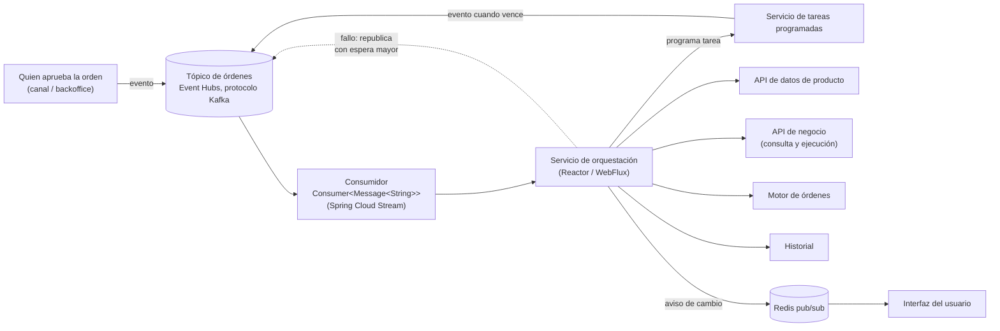
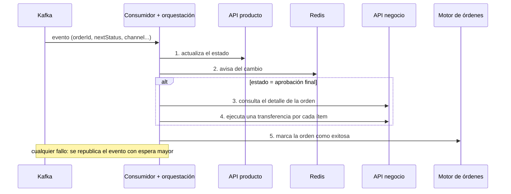
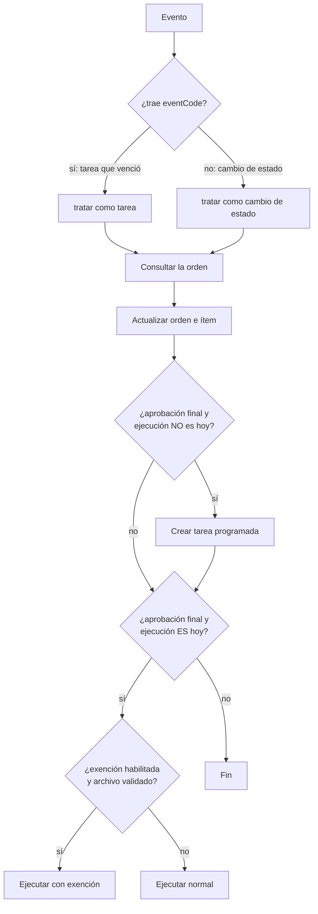
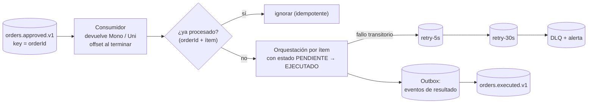

# Caso de diseño — Transferencias asíncronas con eventos (banca)

Los dos servicios de producción que construiste en el banco: **transferencias interbancarias** y **órdenes de transferencia al exterior**. Ambos son **consumidores de eventos** con Spring Cloud Stream sobre **Azure Event Hubs (protocolo Kafka)** que orquestan la ejecución de una orden.

> Fuente: tus casos de estudio en el repo de Kafka ([`case-studies/`](https://github.com/edzamo/kafka-streaming-lab) · `async-interbank-transfer.md` y `async-abroad-transfer-order.md`). Aquí se **analiza la arquitectura**, se revisa con ojo crítico y se prepara para la entrevista. 🔎 = contrasta con tu memoria del proyecto.
>
> Relacionado: [`caso-pasarela-pagos.md`](caso-pasarela-pagos.md) (misma familia de problemas) · [`../messaging-streaming/kafka.md`](../messaging-streaming/kafka.md) · [`../messaging-streaming/practica-kafka-ejercicios.md`](../messaging-streaming/practica-kafka-ejercicios.md)

## 🍎 Con manzanas (empieza aquí)

Una orden de transferencia es **un pedido grande de manzanas**. Quien aprueba el pedido **no espera** a que se despache: deja una **nota** en el libro de ventas (el evento en Kafka) y se va. Un **empleado de despacho** (el consumidor) lee la nota y hace todo el trabajo: avisa a bodega, pide el camión y marca el pedido como entregado. Si el camión no está, **vuelve a dejar la nota con una pausa más larga**. Y si el pedido es **para dentro de tres días**, el empleado pone una **alarma** y, cuando suena, vuelve a aparecer la nota en el libro.

| Pieza del diseño | En la frutería |
|---|---|
| **Evento en Kafka** | La nota en el libro de ventas |
| **Consumidor (Spring Cloud Stream)** | El empleado de despacho |
| **Servicio de orquestación** | La lista de pasos del despacho, en orden |
| **Reintento con espera creciente** | Volver a dejar la nota con una pausa cada vez mayor |
| **Headers de trazabilidad** | El número de seguimiento pegado a cada nota |
| **Tarea programada** | La alarma "el día 5, despachar" |
| **Redis pub/sub** | Un timbre en la pantalla de la tienda: "cambió el estado" |
| **Idempotencia (aún pendiente)** | El sello "YA DESPACHADO" para no enviar dos veces |

### Qué debes dominar según tu nivel

| Nivel | Debes poder explicar |
|---|---|
| 🟢 **Junior** | Por qué se usa un evento en vez de una llamada directa; qué hace un consumidor; qué son los headers de trazabilidad |
| 🟡 **Mid** | La orquestación paso a paso, el reintento con espera creciente, las tareas programadas, coherencia entre sistemas sin transacción distribuida |
| 🔴 **Senior** | Los **riesgos** de ese diseño (ack, orden, duplicados, bloqueo) y cómo lo rediseñarías hoy: DLQ, idempotencia, Outbox, clave de partición |

## 1. Qué hacen los dos servicios

| | **Transferencia interbancaria** | **Orden de transferencia al exterior** |
|---|---|---|
| **Cuándo se dispara** | Una orden llega a su estado final de aprobación | Cada **cambio de estado** de la orden, y también una **tarea programada que vence** |
| **Qué hace** | Actualiza el estado, avisa a la interfaz, consulta el detalle y **ejecuta una transferencia por cada ítem** | Actualiza; si la ejecución es otro día, **programa una tarea**; si es hoy, **ejecuta** (flujo normal o con exención) |
| **Particularidad** | Reintento con espera creciente **dentro del evento**; aviso por **Redis** | **Un solo tópico, dos tipos de evento** (`eventCode` lo distingue); tareas programadas |
| **Sistemas que toca** | API de producto, API de negocio, motor de órdenes, Redis | API de orden e ítems, API de negocio, motor de órdenes, historial, tareas programadas, cuentas |

## 2. Arquitectura



**Capas (de afuera hacia adentro):**
1. **Entrada:** un bean `Consumer<Message<String>>` enlazado a un tópico por configuración; solo deserializa y arma los *headers*.
2. **Orquestación:** servicio reactivo que encadena llamadas (`flatMap`) y decide qué pasos aplican según el estado.
3. **Salida:** clientes HTTP **generados desde OpenAPI** (sin DTO a mano).
4. **Mapeo:** MapStruct, del evento a la petición de cada API.

Esto **es una arquitectura hexagonal en la práctica**: el consumidor es un **adaptador de entrada**, las APIs son **adaptadores de salida**, y la orquestación es el caso de uso ([`../software-architectures/hexagonal-architecture.md`](../software-architectures/hexagonal-architecture.md)).

## 3. Flujos

### 3.1 · Interbancaria: una orden de punta a punta



### 3.2 · Exterior: la decisión según la fecha



**La idea clave:** el **tiempo** lo maneja un componente especializado (tareas programadas) y **Kafka solo transporta el aviso**. Es el mismo patrón que Quartz en la pasarela de pagos ([`../messaging-streaming/quartz-scheduler.md`](../messaging-streaming/quartz-scheduler.md)): el reloj vive en un sitio y publica un evento cuando toca.

## 4. Decisiones de diseño y su porqué

| Decisión | Por qué | Costo |
|---|---|---|
| **Evento en vez de llamada síncrona** | El usuario no espera; si un servicio cae, la orden se reintenta | Consistencia eventual; más difícil de depurar |
| **Un consumidor que orquesta** (no coreografía) | Un solo lugar conoce el flujo completo | El orquestador concentra la lógica y es un punto crítico |
| **Estado del reintento viaja en el mensaje** (`segIntervalError`) | No requiere infraestructura extra; el límite es configurable | Rompe el orden y bloquea (ver riesgos) |
| **Headers estándar de trazabilidad** + MDC en el contexto de Reactor | Reconstruir una orden entre 4 o 5 servicios | Hay que reenviarlos en cada llamada |
| **Clientes HTTP generados desde OpenAPI** | Cero deriva entre contrato y código | Dependes de que el contrato sea correcto |
| **MapStruct** | Mapeo sin código manual ni reflexión en ejecución | Un mapper más por API |
| **Tiempo delegado a tareas programadas** | El consumidor queda simple; el reloj está en un componente probado | Un servicio más que operar |
| **Redis pub/sub para avisar a la interfaz** | Aviso ligero sin sondear | No es duradero: es una pista, no la fuente de verdad |
| **Actualizar solo si hace falta** (motor de órdenes se parchea si el estado difiere) | Acerca la operación a la idempotencia con coste cero | No sustituye una clave de idempotencia |
| **Configuración 100% por variables de entorno** | Mismo artefacto en todos los ambientes; sin secretos en el código | Disciplina con las variables |
| **Código de operación = agencia + literal + número de orden (8 dígitos)** 🔎 | Identificador único y trazable por orden | Hay que verificar que el destino lo use para deduplicar |

## 5. Revisión crítica: lo que está bien y lo que preocupa

### ✅ Lo que está bien
- **Desacople con eventos** y un único punto de entrada (adaptador de entrada fino).
- **Trazabilidad real**: headers estándar, generación de `request-id` si falta y MDC.
- **Contratos generados** y mapeo declarativo.
- **Configuración sin secretos** y, sobre todo, **un análisis honesto de sus propios límites** (tus casos ya traen "lo que mejoraría hoy").
- **Tiempo delegado** a un componente especializado.

### ⚠️ Riesgos, de mayor a menor (en dinero, el orden importa)

| # | Riesgo | Por qué importa | Cómo lo resolvería hoy |
|---|---|---|---|
| 1 | **Posible pérdida del mensaje por `subscribe()` dentro del consumidor** | En Spring Cloud Stream, un `Consumer` imperativo que devuelve **sin esperar** a que termine la cadena reactiva hace que el binder **confirme el offset de inmediato**. Si la cadena falla después, **el error no se propaga y el mensaje ya se dio por procesado** (se perdió). Es la garantía *at-least-once* rota en silencio | Usar el soporte reactivo de Spring Cloud Stream (función que **devuelve el `Mono`/`Flux`**) para que el offset se confirme al terminar; o bloquear en el borde; y en Quarkus, `Uni<Void>` como retorno del `@Incoming` |
| 2 | **Sin idempotencia y con fallo parcial** | Si la orden tiene 5 ítems y falla el 3.º, el reintento **vuelve a ejecutar los 5**: **transferencias duplicadas** (dinero real) | **Clave de idempotencia por orden e ítem**, estado por ítem (`PENDIENTE → EJECUTADO`) y usar el código de operación como llave hacia el destino |
| 3 | **Espera con `Thread.sleep` y republicar en el mismo tópico** | Bloquea el hilo del consumidor (retrasa todo lo que esté en esa partición) y **rompe el orden** por entidad | **Tópicos de reintento escalonados** (`retry-5s`, `retry-30s`) y **DLQ**; o `delayed-retry-topic` en SmallRye |
| 4 | **Sin DLQ** | Tras agotar reintentos, la orden queda en error pero el mensaje se pierde sin rastro | DLQ con alerta y herramienta de reproceso |
| 5 | **Sin clave de partición** | No hay orden por orden; dos eventos de la misma orden pueden procesarse en paralelo o desordenados | `key = orderId` |
| 6 | **Un tópico con dos tipos de evento** | El consumidor tiene que adivinar por un campo; el esquema crece sin control | Campo `eventType` explícito con esquema versionado, o dos tópicos |
| 7 | **Tres sistemas sin transacción distribuida** | Un fallo entre el sistema A y el B deja estados incoherentes | Estados por ítem, **Saga** con compensación, y conciliación; **Outbox** si el servicio también publica |
| 8 | **Sin `group` en el binding (exterior)** | Grupo anónimo: **cada instancia recibe todos los mensajes** y se duplica el trabajo | Definir `group` |
| 9 | **`doOnSuccess` que lanza otra operación reactiva sin suscribirla** | Esa operación **nunca se ejecuta** | Encadenar con `flatMap` |
| 10 | **Claves compartidas de Event Hubs** | Una filtración compromete el hub | Entra ID / identidad administrada, Key Vault |

> **El #1 es el más sutil y el que más impresiona en una entrevista:** *"Descubrí que al hacer `subscribe()` dentro del consumidor, el offset se confirmaba antes de terminar, así que un fallo se perdía. Lo corregiría devolviendo el `Mono` al framework."* Si en el proyecto real ya lo resolviste distinto, cuéntalo como lo hiciste. 🔎 Verifica en el código real si ocurre.

## 6. Cómo lo diseñarías hoy



| Tema | Hoy |
|---|---|
| Entrega | *At-least-once* + **consumidor idempotente** |
| Reintentos | Tópicos por niveles + DLQ (fuera del hilo del consumidor) |
| Orden | `key = orderId` |
| Eventos | `eventType` explícito + Schema Registry |
| Resultado | Evento de resultado publicado con **Outbox** |
| Tiempo | Scheduler gestionado o mensaje programado ([`caso-pasarela-pagos-cloud.md`](caso-pasarela-pagos-cloud.md)) |
| Seguridad | Entra ID e identidad administrada |

**En Quarkus (la pregunta de Arkano):**
```java
@Incoming("orders")
@Blocking                              // si hay JDBC; si todo es reactivo, devolver Uni<Void>
public Uni<Void> procesar(OrderApproved e) {
    return orquestador.ejecutar(e);    // el ack ocurre cuando el Uni termina
}
```
```properties
mp.messaging.incoming.orders.failure-strategy=dead-letter-queue
mp.messaging.incoming.orders.dead-letter-queue.topic=orders.approved.v1.dlt
```
Detalle: [`../frameworks/quarkus/smallrye-reactive-messaging.md`](../frameworks/quarkus/smallrye-reactive-messaging.md).

## 7. Cómo contarlo en la entrevista (3 minutos, formato STAR)

1. **Situación (30 s):** "En el banco, una orden de transferencia pasaba por varias aprobaciones y ejecutarla implicaba llamar a varios servicios que podían fallar por separado. Hacerlo en la petición del usuario era frágil."
2. **Tarea:** "Desacoplar la ejecución y hacerla resistente a fallos."
3. **Acción (1,5 min):** "Quien aprueba publica un evento en Kafka (Event Hubs con su protocolo Kafka). Un consumidor con Spring Cloud Stream orquesta con Reactor: actualiza el estado, consulta el detalle y ejecuta una transferencia por ítem. Para los fallos, un contador de espera dentro del evento y republicación. Para las órdenes con fecha futura, delegamos el tiempo a un servicio de tareas programadas que vuelve a publicar un evento al vencer. Cada mensaje llevaba headers de trazabilidad que reenviábamos a cada API."
4. **Resultado:** "Los usuarios dejaron de esperar la ejecución y los fallos se reintentaban solos."
5. **Aprendizaje (el diferenciador):** "Al revisarlo vi tres riesgos: la espera con `Thread.sleep` bloquea la partición y rompe el orden; sin idempotencia un fallo parcial podía duplicar transferencias; y hay que confirmar el offset al terminar de verdad. Hoy usaría tópicos de reintento, DLQ, clave de idempotencia y `key = orderId`."

> Terminar con el aprendizaje demuestra **criterio senior**: sabes lo que construiste *y* sus límites.

### Escalera de respuesta

| Pregunta | 🟢 Junior | 🟡 Mid | 🔴 Senior |
|---|---|---|---|
| **¿Por qué eventos y no una llamada directa?** | "Para que el usuario no espere y se pueda reintentar." | "Desacopla la disponibilidad: si un servicio cae, la orden se reintenta." | "A cambio hay consistencia eventual, y el consumidor debe ser idempotente porque la entrega es *at-least-once*." |
| **¿Cómo manejaste los reintentos?** | "Reintentaba con una espera mayor cada vez." | "El contador viajaba en el mensaje y se republicaba hasta un límite." | "Tenía costos: bloquea la partición y rompe el orden; hoy usaría tópicos de reintento y DLQ." |
| **¿Cómo evitas transferencias duplicadas?** | "Con un identificador único por operación." | "Código de operación por orden y actualizaciones condicionales." | "Clave de idempotencia por ítem, estado por ítem y que el destino la respete; reforzaría el consumidor." |
| **¿Cómo programaste las órdenes futuras?** | "Con tareas programadas." | "Un servicio de tareas vuelve a publicar un evento al vencer." | "El reloj vive en un componente especializado y Kafka solo avisa; hoy lo haría con un scheduler gestionado o un mensaje programado." |
| **¿Cómo trazaste una orden entre servicios?** | "Con un id en los headers." | "`request-id` y `process-code` en headers y en el MDC de Reactor." | "Hoy usaría `traceparent` de OpenTelemetry." |

## 8. Preguntas "de revisión de diseño" que podrían hacerte

| Pregunta | Dónde está la respuesta |
|---|---|
| ¿Qué pasa si el consumidor cae a mitad de una orden? | Riesgo 2: sin idempotencia puede duplicar; con estado por ítem se retoma |
| ¿Cómo garantizas el orden de los eventos de una orden? | Riesgo 5: `key = orderId` |
| ¿Dónde se pierde un mensaje? | Riesgo 1: `subscribe()` y offset; riesgo 4: sin DLQ |
| ¿Por qué un orquestador y no coreografía? | Un lugar conoce el flujo; costo: punto crítico y acoplamiento |
| ¿Cómo evitarías un cuello de botella? | Particiones y consumidores; reintentos fuera del hilo; lotes por orden |
| ¿Cómo lo harías en Azure hoy? | Event Hubs o Service Bus; Functions Timer o mensajes programados; identidad administrada ([`caso-pasarela-pagos-cloud.md`](caso-pasarela-pagos-cloud.md)) |

## 9. Por validar con tu memoria 🔎

- ¿El consumidor hacía `subscribe()` interno o devolvía el `Mono`? ¿Qué *ack mode* usaba?
- ¿El destino deduplicaba por el código de operación?
- ¿Quién publicaba las tareas programadas: un servicio propio, Quartz u otro?
- ¿Cuántas órdenes por día y qué picos?
- ¿Cómo se monitoreaba el lag y los mensajes en error?
