# Introducción a los sistemas distribuidos — la pizzería que escala

Clase 1 de la serie de System Design de *Warup Sensei* (YouTube): "How to start with distributed systems". La idea central: **cada concepto técnico es la solución a un problema de negocio que ya entiendes**. Abrimos una pizzería con un solo chef y vamos resolviendo problemas de a uno; cada solución tiene un nombre técnico.

> Este archivo es material de repaso, no una transcripción. Donde el video simplifica de más, hay una nota **⚠️ Ojo**.

## El mapa completo: de 1 chef a un sistema distribuido

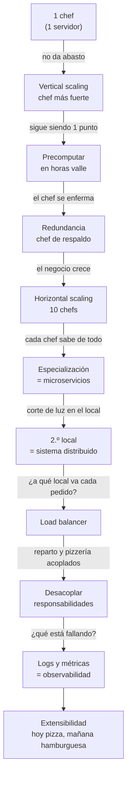

Cada flecha es un problema real. **Un buen diseño no empieza con "usemos Kubernetes", empieza con "¿qué se está rompiendo?"**.

---

## Píldora 1 — Escalamiento vertical (el chef trabaja más fuerte)

**Problema:** un chef no puede con todos los pedidos.
**Solución más obvia:** pagarle más, darle mejores herramientas. Mismo chef, más capacidad.

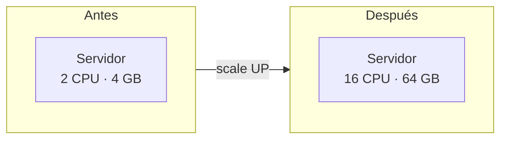

| | |
|---|---|
| **Qué es** | Ponerle más CPU, RAM o disco a la **misma** máquina. |
| **Ventaja** | Simple. No cambias código ni arquitectura. |
| **Límite** | Hay un techo físico (y de precio: pasar de 64 a 128 GB cuesta desproporcionadamente más). |
| **Riesgo** | Sigue siendo **una sola máquina** → si cae, cae todo. |

**Regla de junior a senior:** vertical es el primer paso barato, pero **nunca es la respuesta final**. Un senior lo usa para ganar tiempo mientras diseña lo horizontal.

---

## Píldora 2 — Precomputar en horas valle (la masa de pizza a las 4 a.m.)

**Problema:** cuando llega el pedido, el chef pierde tiempo haciendo la masa.
**Solución:** dejar la masa lista antes, en un horario donde no hay clientes.

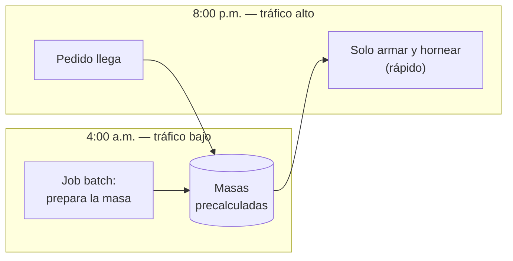

- **Mapeo técnico:** trabajos batch / cron nocturnos, caché precalentado, vistas materializadas, reportes pregenerados.
- **La idea:** mueve el trabajo pesado **fuera del camino crítico** de la petición del usuario.
- **⚠️ Ojo:** el video lo pone bajo "vertical scaling" pero en rigor es **optimizar procesos**, no agregar hardware. Es una técnica distinta y complementaria: te da más throughput con los mismos recursos.

---

## Píldora 3 — Resiliencia: eliminar el punto único de falla (SPOF)

**Problema:** el chef se enferma → ese día no hay negocio.
**Concepto:** un **Single Point of Failure (SPOF)** es cualquier componente cuya caída tumba todo el sistema.

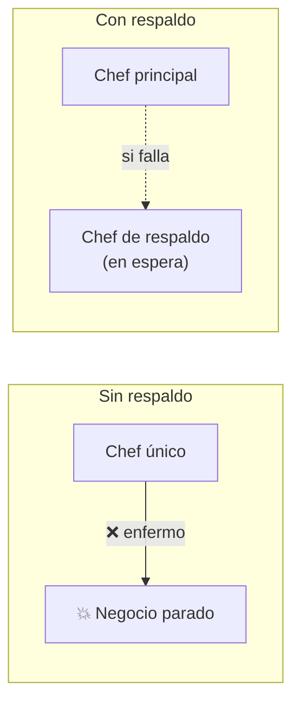

- **Mapeo técnico:** arquitectura **primary / replica** (el video la llama *master–slave*; hoy se prefieren los términos primary/replica o leader/follower), failover automático, hot/cold standby.
- **Tipos de respaldo:**
  - **Cold standby:** el backup está apagado; hay que encenderlo (barato, tarda en reaccionar).
  - **Hot standby:** el backup está encendido y sincronizado (más caro, casi sin downtime).

**Regla de oro:** por cada componente pregúntate *"¿qué pasa si este muere ahora?"*. Si la respuesta es "todo se cae", encontraste un SPOF.

---

## Píldora 4 — Escalamiento horizontal (contratar más chefs)

**Problema:** el negocio sigue creciendo; un chef fuerte + uno de respaldo ya no alcanzan.
**Solución:** más chefs, iguales entre sí, trabajando en paralelo.

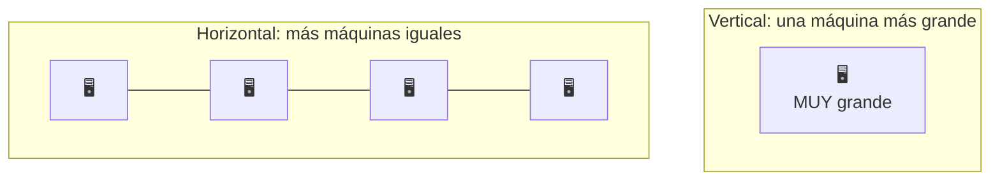

| | Vertical | Horizontal |
|---|---|---|
| **Cómo** | Máquina más grande | Más máquinas |
| **Techo** | Sí (hardware) | Prácticamente no |
| **Tolerancia a fallas** | Baja (1 SPOF) | Alta (si una cae, quedan otras) |
| **Complejidad** | Baja | Alta (hay que repartir trabajo y datos) |
| **Requisito clave** | Ninguno | Servicios **stateless** (que no guarden estado local) |

- El backup deja de ser "el suplente" y pasa a ser **parte del equipo** que trabaja siempre.
- **Costo oculto:** ahora necesitas alguien que reparta pedidos entre los chefs → aparece el **load balancer** (Píldora 7).
- **Requisito importante:** para que cualquier chef pueda atender cualquier pedido, el estado (sesiones, carritos) no debe vivir en un chef concreto, sino en un almacén compartido (Redis, base de datos).

---

## Píldora 5 — Especialización por tarea = microservicios

**Problema:** 10 chefs iguales, pero hacen pizza y pan de ajo indistintamente. Ineficiente y cada cambio de receta hay que avisarlo a todos.
**Solución:** equipos especializados, cada uno dueño de **una sola responsabilidad**.

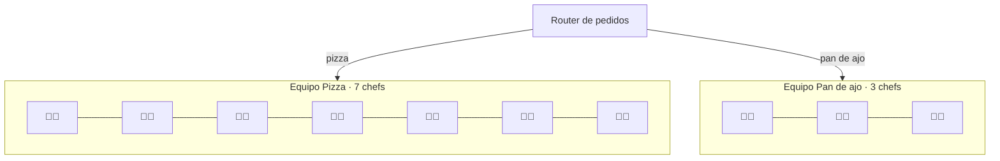

**Beneficios (los que explica el video):**

1. **Cambios localizados:** cambia la receta del pan de ajo → solo avisas al equipo de pan de ajo.
2. **Consultas localizadas:** ¿estado de un pedido de pan de ajo? Sabes exactamente a quién preguntar.
3. **Escala independiente:** pizza tiene más demanda → 7 chefs; pan de ajo → 3. Cada equipo escala a su propio ritmo.
4. **Responsabilidades claras:** cada equipo hace solo lo que le corresponde al negocio.

**⚠️ Ojo (nivel senior):** microservicios **no son gratis**. A cambio de esa independencia pagas en red (latencia, fallos parciales), despliegue, observabilidad y consistencia de datos. Para un equipo pequeño, un monolito bien modularizado suele ser mejor punto de partida. Detalle en [`../../microservices-patterns/`](../../microservices-patterns).

---

## Píldora 6 — Sistema distribuido: el segundo local

**Problema:** un corte de luz en el local, o perder la licencia un día → no hay negocio. Aunque tengas 100 chefs, **todos están en el mismo lugar**.
**Solución:** abrir otro local en otra ubicación. *"No pongas todos los huevos en una canasta, ni siquiera en un solo local."*

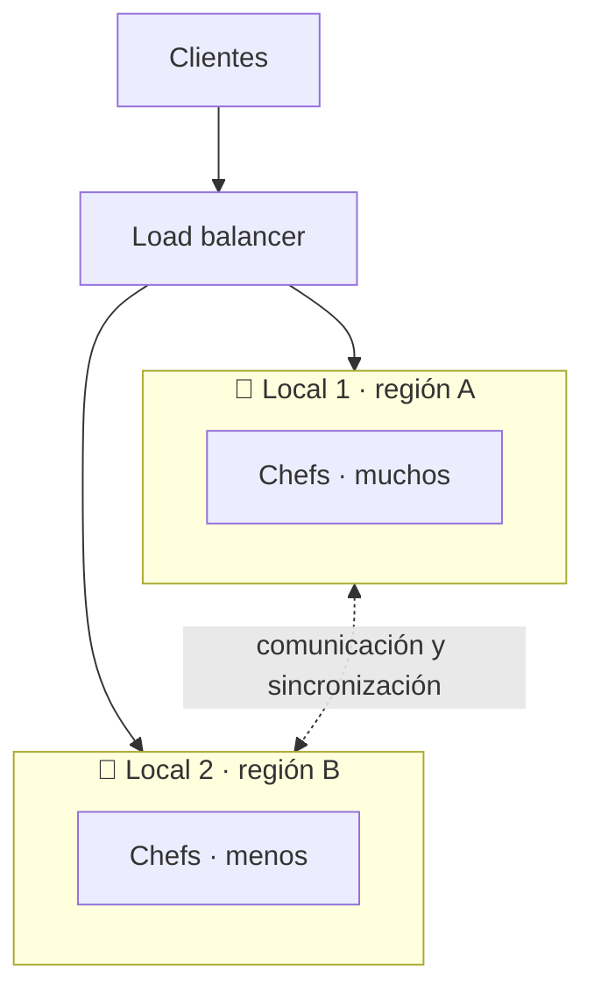

**Dos ventajas:**

| Ventaja | Explicación |
|---|---|
| **Tolerancia a fallas de zona/región** | Si el local 1 pierde luz, el local 2 sigue vendiendo (quizá más lento, pero sigue). |
| **Menor latencia** | Un cliente cercano al local 2 recibe su pedido más rápido. Es lo que hace Facebook: servidores locales cerca de cada región. |

**El precio (el video lo llama "el paso más grande en complejidad"):**

- Los locales necesitan **comunicarse** y a veces **sincronizar datos**.
- Hay que **decidir a qué local va cada pedido**.
- Aparecen los problemas duros de los sistemas distribuidos: la red falla, los relojes no coinciden, y no puedes tener consistencia perfecta y disponibilidad total a la vez → ver **CAP** en [`02-databases-sql-vs-nosql.md`](../02-databases-sql-vs-nosql.md).

**Mapeo técnico:** multi-AZ, multi-región, CDN, réplicas geográficas. Comparar con la sección de capas de AWS en [`../../cloud-aws/`](../../cloud-aws).

---

## Píldora 7 — Load balancer: el despachador inteligente

**Problema:** el cliente no debe decidir si pide al local 1 o al 2. Necesita un **punto central** que reparta.
**Solución:** el **load balancer** recibe todos los pedidos y los enruta con un criterio claro.

**El criterio del video:** *¿cuánto tiempo tarda el cliente en recibir su pizza?*

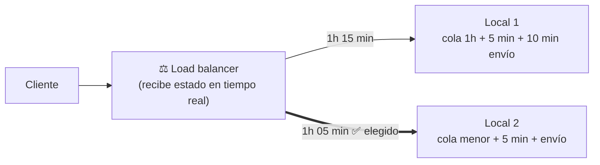

- **Total = espera en cola + preparación + entrega.** Gana el que tenga el menor total.
- Solo funciona si el balanceador recibe **datos en tiempo real** (carga actual, salud, latencia de cada local).

**Estrategias reales de balanceo** (el video usa la de "menor tiempo total"; en la práctica hay varias):

| Estrategia | Idea | Cuándo |
|---|---|---|
| Round robin | Uno a uno, en orden | Servidores homogéneos, peticiones parecidas |
| Least connections | Al que tenga menos peticiones activas | Peticiones de duración variable |
| Latency-based / geográfico | Al más rápido o más cercano | Sistemas multi-región |
| Hash de una clave | Mismo cliente → mismo servidor | Cuando se necesita afinidad/caché local |

**Doble beneficio:** reparte carga **y** es lo que hace tolerante a fallas al sistema (saca del reparto a un local caído).

**⚠️ Ojo:** el load balancer mismo puede ser un SPOF. En producción se replica (LB en par activo/pasivo o gestionado por el proveedor cloud).

---

## Píldora 8 — Desacoplamiento: el reparto no es la pizzería

**Observación:** la pizzería y el repartidor **no tienen nada en común**. Podría ser una hamburguesería o cualquier otra cosa: el repartidor solo quiere entregar rápido; la pizzería no le importa si viene el repartidor o el cliente a recoger.

**Solución:** separar sistemas y responsabilidades — incluso a nivel de equipos de gestión.

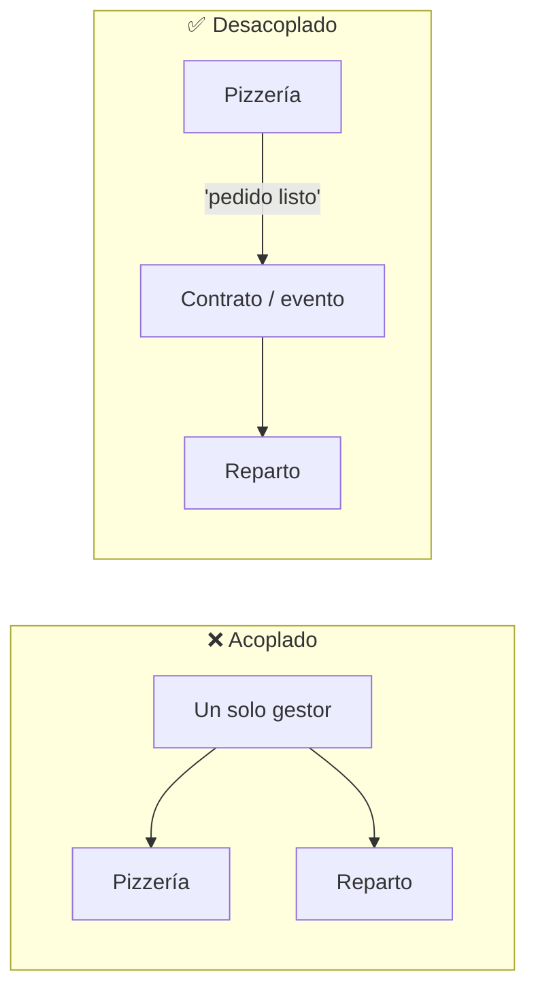

- **Mapeo técnico:** contratos de API claros, colas y eventos (Kafka, SQS, RabbitMQ), bounded contexts (DDD).
- **Beneficio:** cada lado evoluciona, falla y escala **sin arrastrar al otro**.
- **Test de calidad:** si para cambiar el reparto tienes que tocar la pizzería, están acoplados.

Relacionado: [`../../ddd/`](../../ddd) para los límites entre contextos.

---

## Píldora 9 — Observabilidad: logs y métricas

**Problema:** el horno del local 1 se descompone y su producción baja. Una moto del repartidor falla y sus entregas tardan más. **¿Cómo te enteras?**

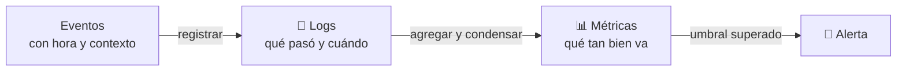

| Concepto | Pregunta que responde | Ejemplo pizzería |
|---|---|---|
| **Logs** | ¿Qué pasó exactamente y en qué orden? | "14:03 pedido #42 entró · 14:20 horneado · 14:55 entregado" |
| **Métricas** | ¿Cómo está el sistema en general? | "tiempo promedio de entrega subió de 30 a 55 min" |
| **Alertas** | ¿Debo actuar ahora? | "el horno del local 1 rinde 50 % menos" |

- Los **logs** guardan cada evento con su hora; las **métricas** condensan esos eventos para darles sentido.
- Sin esto, un sistema distribuido es una caja negra: sabes que va lento pero no dónde.
- Se completa con **tracing distribuido** (seguir un pedido a través de todos los locales y servicios): los "tres pilares de observabilidad" son logs + métricas + trazas.

---

## Píldora 10 — Extensibilidad: hoy pizza, mañana hamburguesa

**El punto más importante del video:** como backend engineer **no quieres reescribir código cada vez que cambia el propósito del negocio**.

- El repartidor **no necesita saber** que lleva una pizza. Mañana es una hamburguesa.
- **Amazon:** al principio solo entregaba paquetes. Pudo crecer a otros negocios porque desacopló todo.

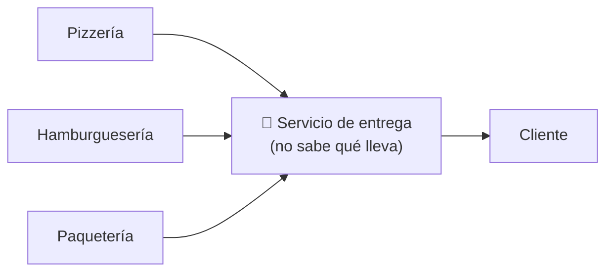

**Mapeo a código (puente con LLD):** programar contra interfaces, no contra implementaciones → principios SOLID (especialmente *Open/Closed* y *Dependency Inversion*). Ver [`../../solid-principles/`](../../solid-principles).

---

## High-Level Design vs Low-Level Design

Lo que acabamos de hacer es **HLD**. Su contraparte es **LLD**:

| | HLD — High-Level Design | LLD — Low-Level Design |
|---|---|---|
| **Pregunta** | ¿Qué piezas hay y cómo se hablan? | ¿Cómo se programa cada pieza? |
| **Nivel** | Servidores, servicios, redes, bases de datos, balanceadores | Clases, objetos, métodos, firmas de funciones |
| **Ejemplos** | "Un LB reparte entre 2 regiones, cola entre pedidos y reparto" | "Interfaz `OrderRepository`, patrón Strategy para el precio" |
| **Herramientas** | Diagramas de componentes y de flujo | UML de clases, patrones de diseño, SOLID |
| **Dónde en este repo** | Esta carpeta `system-design/` | [`../../oop-design/`](../../oop-design), [`../../design-pattern/`](../../design-pattern), [`../../solid-principles/`](../../solid-principles), [`../../uml/`](../../uml) |

**Consejo de carrera del video:** para llegar a senior necesitas **ambos**. HLD para decidir la estructura del sistema; LLD (código limpio y eficiente) para que esa estructura sea implementable y mantenible.

---

## Tabla resumen: problema → solución → nombre técnico

| # | Problema de negocio | Solución | Término técnico |
|---|---|---|---|
| 1 | Un chef no da abasto | Chef mejor pagado / mejor equipado | **Vertical scaling** |
| 2 | Se pierde tiempo preparando la masa por pedido | Prepararla antes, en horas valle | **Precómputo / batch / caché** |
| 3 | El chef se enferma → negocio parado | Chef de respaldo | **Redundancia, eliminar SPOF, failover** |
| 4 | El negocio sigue creciendo | Más chefs iguales | **Horizontal scaling** |
| 5 | Chefs generalistas, cambios difíciles | Equipos por especialidad | **Microservicios** |
| 6 | Corte de luz / pérdida de licencia | Segundo local en otro lugar | **Sistema distribuido, multi-región** |
| 7 | ¿A qué local va cada pedido? | Un despachador central inteligente | **Load balancer** |
| 8 | Reparto y pizzería dependen uno del otro | Separar responsabilidades | **Decoupling** |
| 9 | Algo falla y no se sabe qué | Registrar y resumir eventos | **Logs y métricas (observabilidad)** |
| 10 | Cambiar de pizza a hamburguesa obliga a reescribir | Piezas que no saben qué transportan | **Extensibilidad** |

## Lo esencial (para repasar en 30 segundos)

1. **Vertical = máquina más grande** (simple, con techo). **Horizontal = más máquinas** (sin techo, más complejo).
2. **SPOF:** cualquier pieza cuya caída tumba todo. Se elimina con redundancia.
3. **Especializar** (microservicios) permite escalar y cambiar cada parte por separado, a cambio de complejidad operativa.
4. **Distribuir en varios sitios** da tolerancia a fallas y menor latencia, pero es el salto más caro en complejidad.
5. El **load balancer** decide a dónde va cada petición y necesita datos en tiempo real.
6. **Desacopla** todo lo que puedas: lo que no se conoce no se rompe.
7. **Sin logs ni métricas** no hay sistema distribuido operable.
8. **HLD** = qué piezas y cómo se hablan. **LLD** = cómo se codifican. Un senior domina ambos.

## Preguntas de autoevaluación

- ¿Cuándo escalar vertical y cuándo horizontal? ¿Qué pasa si el servicio guarda estado local?
- Dado un diagrama, ¿puedes señalar los SPOF? (Tip: ¿y el load balancer?)
- ¿Qué costos nuevos aparecen al pasar de un local a dos?
- ¿Por qué el repartidor "no debe saber" que lleva pizza? ¿Qué principio SOLID es?
- ¿Qué diferencia hay entre un log y una métrica?
