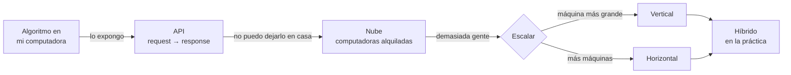
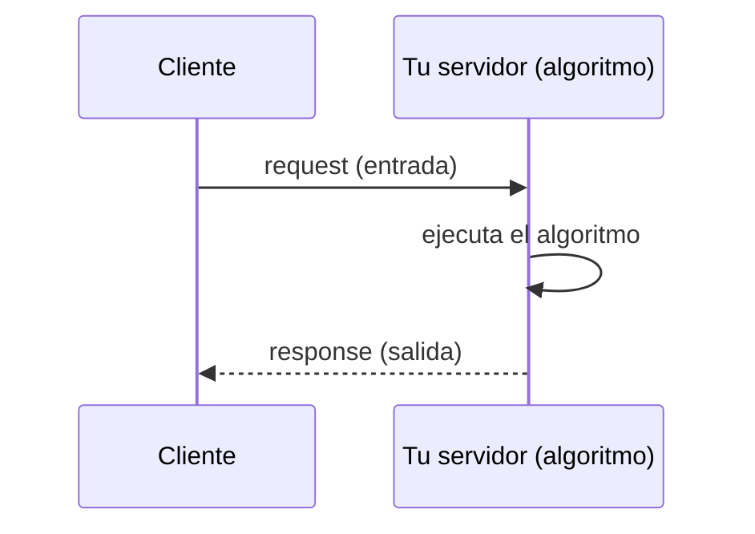
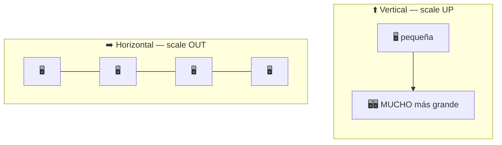
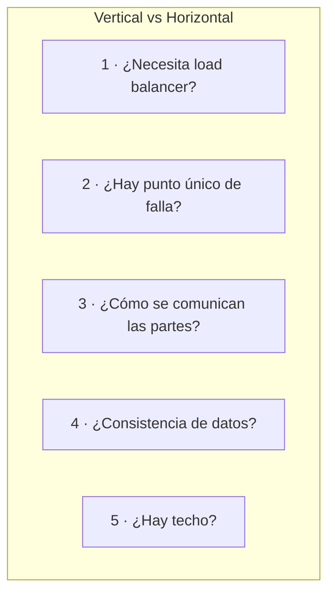
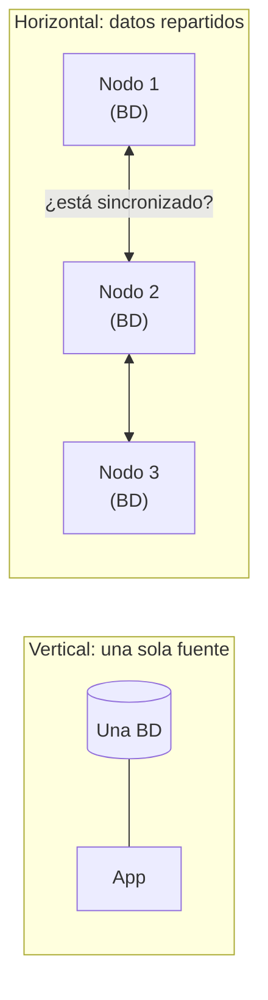
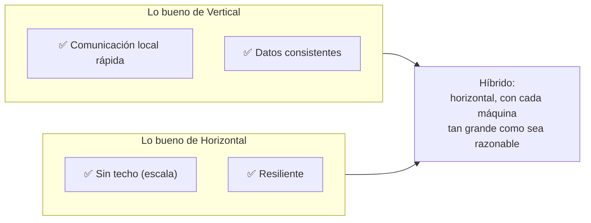
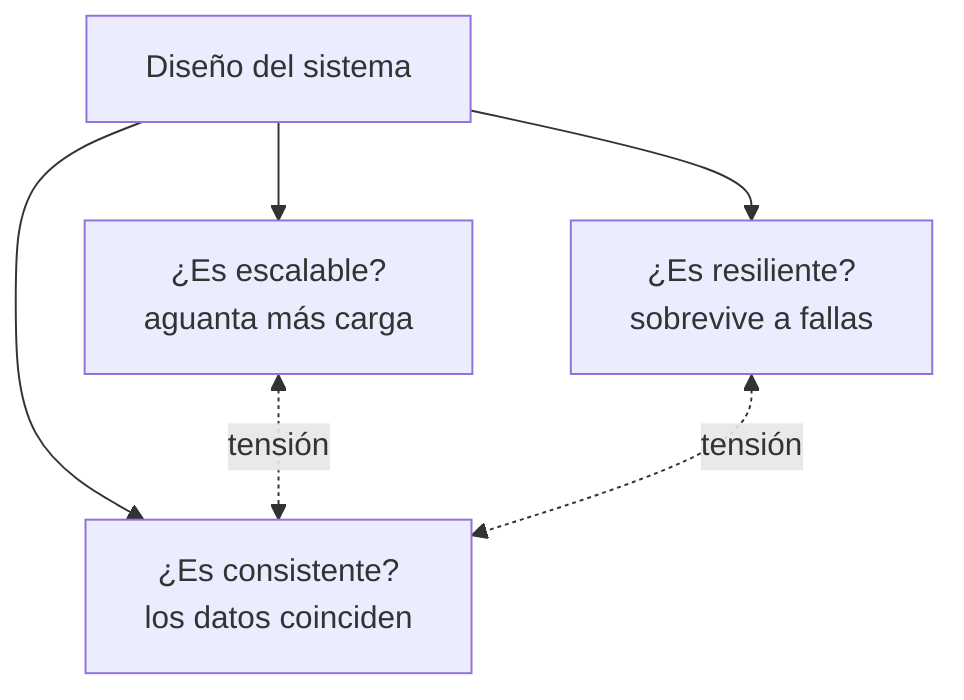

# Escalamiento vertical vs horizontal — los fundamentos

Video 2 de la serie de *Warup Sensei*: "System Design Basics: Horizontal vs Vertical Scaling". Es el "video 0" técnico: parte de cero (qué es una API, por qué la nube) y llega a la comparación que se pregunta en toda entrevista.

Aquí ya no hay pizzería: es la versión sin analogía de lo que vimos en [`01-intro-sistemas-distribuidos.md`](01-intro-sistemas-distribuidos.md) (Píldoras 1 y 4). Lo repetido se enlaza; lo nuevo se explica.

## El camino en una imagen

---

## Píldora 1 — Del algoritmo al servicio: request y response

Tienes un código que recibe una entrada y devuelve una salida, y a la gente le sirve tanto que paga por usarlo. No les vas a regalar tu computadora, así que **expones el código por internet mediante una API**.

- **Request:** lo que te envía el cliente. **Response:** lo que devuelves, en lugar de guardarlo en un archivo o una base de datos local.
- **Regla:** a cada request le corresponde una response.
- **API (Application Programming Interface):** el contrato de cómo se pide y qué se devuelve. Detalle de estilos en [`../03-api-styles.md`](../03-api-styles.md).

---

## Píldora 2 — Por qué no alojarlo en tu propia computadora (self-hosting)

| Problema | Ejemplo |
|---|---|
| Hay que armar todo a mano | Base de datos, endpoints, configuración de red. |
| **Cero resiliencia** | Corte de luz, alguien desenchufa el equipo → servicio caído mientras hay gente pagando. |
| Todo depende de una máquina | Es un SPOF (ver Píldora 3 del video 1). |

**Solución: la nube.** La nube no es magia: es **un conjunto de computadoras que alguien te alquila**. Le pagas a un proveedor (AWS, el más popular) y te da capacidad de cómputo; entras por login remoto y ejecutas tu algoritmo ahí.

- **Qué ganas:** el proveedor se encarga en gran parte de la configuración, los ajustes y la fiabilidad.
- **Qué cambia para ti:** dejas de preocuparte por el hardware y te enfocas en los **requisitos del negocio**.

**⚠️ Ojo:** el video dice "no hay diferencia entre un desktop y la nube". Es cierto en esencia (son computadoras), pero la diferencia real es **elasticidad y operación**: puedes crear o destruir máquinas en minutos y pagas por uso. Más en [`../../cloud-aws/`](../../cloud-aws).

---

## Píldora 3 — Escalabilidad: qué es y las dos maneras de lograrla

Llega el éxito: hay tantos usuarios que el código no da abasto con todas las conexiones.

> **Escalabilidad** = capacidad de manejar más peticiones agregando recursos.

Y hay solo dos palancas, ambas "poniendo dinero al problema":

| | Vertical | Horizontal |
|---|---|---|
| **Idea** | Una computadora más grande → procesa las peticiones más rápido. | Más computadoras → cada petición cae en una cualquiera y se reparte la carga. |
| **Truco para recordar** | Más **grande** (hacia arriba). | Más **cantidad** (hacia los lados). |

---

## Píldora 4 — Las 5 diferencias clave

Las cinco que el video usa para comparar, con qué significa cada una en la práctica:

| # | Criterio | Vertical | Horizontal |
|---|---|---|---|
| 1 | **Load balancer** | No hace falta: con una sola máquina no hay carga que repartir. | **Sí.** Alguien debe decidir a qué máquina va cada petición (ver [video 1, Píldora 7](01-intro-sistemas-distribuidos.md)). |
| 2 | **Resiliencia** | **SPOF**: si esa máquina cae, cae todo. | **Resiliente:** si una falla, las peticiones se redirigen a las demás. |
| 3 | **Comunicación** | **Entre procesos (IPC)** dentro de la misma máquina: rápida. | **Llamadas de red (RPC):** lentas, porque cruzan la red (I/O). |
| 4 | **Consistencia de datos** | **Consistente:** todos los datos viven en un solo sistema. | **Complicada:** los datos están repartidos. |
| 5 | **Límite** | **Techo de hardware:** no se puede agrandar la máquina indefinidamente. | **Escala casi linealmente:** más usuarios → más servidores. |

### Ampliando los puntos 3 y 4 (donde está el nivel senior)

**Punto 3 — Red vs memoria local.** Una llamada dentro del mismo proceso o máquina cuesta nanosegundos o microsegundos; una llamada por la red cuesta milisegundos **y además puede fallar** (timeouts, paquetes perdidos, el otro lado caído). Por eso en horizontal hay que diseñar para el fallo parcial: reintentos, timeouts, circuit breakers.

**Punto 4 — Consistencia.** El video da un ejemplo: la máquina 3 manda datos a la 4, la 4 a la 5, la 5 a la 1. Si esa operación debe ser **atómica** (todo o nada), tendrías que **bloquear todas las bases de datos involucradas a la vez**, lo cual es impráctico. Por eso, en la práctica se acepta una **garantía transaccional más débil**.

**⚠️ Ojo (esto el video lo deja en el aire):** "garantía transaccional más débil" tiene nombres concretos que un senior debe conocer:

| Técnica | Idea |
|---|---|
| **Consistencia eventual** | Los nodos convergen al mismo valor con el tiempo, no de inmediato. |
| **Saga** | Una transacción larga se divide en pasos locales, cada uno con su acción de compensación si algo falla. |
| **Two-phase commit (2PC)** | Consistencia fuerte entre nodos, pero bloqueante y frágil; se evita cuando se puede. |

Esto conecta directamente con **CAP** en [`../02-databases-sql-vs-nosql.md`](../02-databases-sql-vs-nosql.md) y con Saga en [`../../microservices-patterns/`](../../microservices-patterns).

**Nota sobre el punto 5:** que el techo horizontal sea "casi lineal" es una simplificación. En la práctica hay cuellos de botella compartidos (la base de datos, el balanceador, la coordinación entre nodos) que hacen que duplicar servidores no siempre duplique la capacidad.

---

## Píldora 5 — En el mundo real se usa la combinación (el híbrido)

Ninguna de las dos gana sola: **se toman las mejores cualidades de cada una**.

**La receta del video:**

1. **Inicio:** escala verticalmente todo lo que quieras. Es simple y barato de operar.
2. **Cuando los usuarios "empiezan a confiar en ti"** (el negocio se consolida): pasa a horizontal.
3. **Ya en horizontal:** usa **máquinas lo más grandes que sean viables en costo**, no cientos de máquinas diminutas.

**Por qué máquinas grandes dentro de un esquema horizontal:** menos nodos = menos llamadas de red, menos coordinación y menos problemas de consistencia. Así conservas parte de las ventajas de vertical sin quedar atado a un SPOF.

**Consejo senior (más allá del video):** no saltes a horizontal "por si acaso". Escalar horizontalmente añade complejidad real (balanceo, estado compartido, consistencia, observabilidad). Empieza simple, mide, y **escala cuando los números lo pidan**, no cuando el diagrama se vea más bonito.

---

## Píldora 6 — Las tres preguntas de todo diseño (y por qué siempre hay trade-offs)

El cierre del video resume qué es diseñar un sistema: **decidir hasta dónde llega cada una de estas tres cualidades**.

- **Siempre hay trade-offs:** mejorar una cualidad suele costar otra. Por ejemplo, ganar escala y resiliencia (horizontal) cuesta consistencia.
- **System design = elegir conscientemente esos trade-offs** para cumplir los requisitos del negocio.
- En una entrevista, la respuesta senior nunca es "horizontal siempre" o "vertical siempre": es *"depende de X, Y y Z, y esto es lo que sacrificamos"*.

---

## Tabla resumen: vertical vs horizontal

| Criterio | ⬆️ Vertical | ➡️ Horizontal |
|---|---|---|
| Qué haces | Máquina más grande | Más máquinas |
| Load balancer | No necesario | Necesario |
| Punto único de falla | Sí | No (con redundancia) |
| Comunicación | Interna (rápida) | Por red (lenta, puede fallar) |
| Consistencia de datos | Simple | Compleja |
| Techo | Sí (hardware) | Casi ninguno |
| Complejidad operativa | Baja | Alta |
| Cuándo | Al inicio, para ganar tiempo | Al consolidarse el negocio |

## Lo esencial (para repasar en 30 segundos)

1. Exponer código por **API** = request → response; la nube = **computadoras alquiladas**, con la fiabilidad a cargo del proveedor.
2. **Escalabilidad** = manejar más peticiones. Vertical = máquina más grande. Horizontal = más máquinas.
3. Cinco diferencias: **load balancer, SPOF, comunicación (IPC vs red), consistencia, techo**.
4. Vertical gana en **velocidad interna y consistencia**; horizontal gana en **escala y resiliencia**.
5. En la práctica: **híbrido**. Empieza vertical, pasa a horizontal al crecer, con máquinas tan grandes como sea razonable.
6. Todo diseño balancea **escalable, resiliente y consistente**, y siempre hay que ceder algo.

## Preguntas de autoevaluación

- ¿Por qué con una sola máquina no hace falta load balancer?
- ¿Por qué una transacción atómica entre varios nodos es "impráctica"? ¿Qué se usa en su lugar?
- ¿Qué costo tiene cambiar una llamada local por una llamada de red?
- Si tu sistema está en la fase de "pocos usuarios", ¿escalas vertical u horizontal? ¿Por qué?
- ¿Qué cuello de botella limita que horizontal sea de verdad "lineal"?
