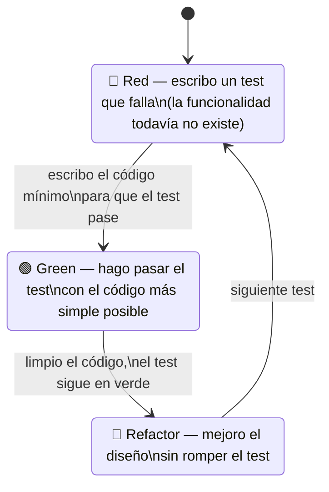
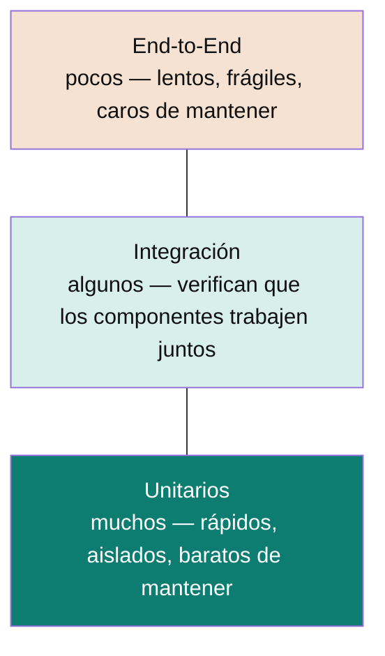

# Test-Driven Development (TDD)

El ciclo "semáforo" — rojo, verde, refactor — y el resto de conceptos de testing que hacen falta para aplicarlo con criterio, no solo de memoria.

## El ciclo Red-Green-Refactor



> 🧠 **Píldora:** el orden importa. Nunca se escribe código de producción sin antes tener un test en rojo que lo justifique — si no hay un test que falle primero, no es TDD, es "testing después".

| Fase | Qué hago | Qué NO hago |
|---|---|---|
| 🔴 Red | Escribo un test que describe el comportamiento que quiero, y lo corro para confirmar que falla. | No escribo código de producción todavía. |
| 🟢 Green | Escribo el código **mínimo** para que el test pase. | No optimizo, no genero abstracciones "por si acaso". |
| 🔵 Refactor | Mejoro nombres, extraigo métodos, elimino duplicación — con los tests en verde como red de seguridad. | No agrego funcionalidad nueva en este paso. |

## Por qué usar TDD

- **Mejor diseño:** pensar el test primero obliga a un código más modular y desacoplado — si es difícil de testear, generalmente es un problema de diseño, no del test.
- **Red de seguridad para refactorizar:** con una buena suite, refactorizar deja de dar miedo — si algo se rompe, un test lo avisa.
- **Documentación viva:** los tests describen cómo se supone que funciona el sistema, y a diferencia de un comentario, no se desactualizan sin que algo falle.
- **Menos bugs, más baratos:** un bug atrapado por un test escrito hoy es mucho más barato que el mismo bug encontrado en producción.

## La pirámide de testing



| Nivel | Qué verifica |
|---|---|
| **Unitario** | Una unidad de código aislada (una clase, un método) — sin red, sin DB, sin dependencias reales. |
| **Integración** | Que dos o más componentes funcionan bien juntos (ej: el adaptador de persistencia contra una DB real). |
| **Sistema (end-to-end)** | El sistema completo, desde la perspectiva de un usuario. |
| **Aceptación** | Que el sistema cumple con el requerimiento de negocio, no solo con la especificación técnica. |

## El patrón AAA (Arrange-Act-Assert)

Estructura para que cualquier test se lea igual de rápido, sin importar quién lo escribió:

- **Arrange:** preparo el escenario — instancio objetos, mockeo dependencias, defino los datos de entrada.
- **Act:** ejecuto la acción que quiero probar — usualmente una sola línea.
- **Assert:** verifico el resultado.

```java
@Test
void shouldReturnFizzWhenDivisibleBy3() {
    // Arrange
    FizzBuzz fizzBuzz = new FizzBuzz();

    // Act
    String result = fizzBuzz.play(3);

    // Assert
    assertEquals("Fizz", result);
}
```

## Ejemplo aplicado: kata FizzBuzz

No hace falta resolver decenas de katas para interiorizar el ciclo — con uno bien hecho alcanza para ver el patrón. Encadenando un test a la vez:

```java
// 1. Red — test que falla, FizzBuzz ni existe
@Test void shouldReturnFizzWhenDivisibleBy3() {
    assertEquals("Fizz", new FizzBuzz().play(3));
}

// 2. Green — código mínimo que lo hace pasar
class FizzBuzz {
    String play(int n) {
        return n % 3 == 0 ? "Fizz" : String.valueOf(n);
    }
}

// siguiente test en Red...
@Test void shouldReturnBuzzWhenDivisibleBy5() {
    assertEquals("Buzz", new FizzBuzz().play(5));
}

// 3. Refactor tras un par de vueltas más del ciclo
class FizzBuzz {
    String play(int n) {
        if (n % 15 == 0) return "FizzBuzz";
        if (n % 3 == 0) return "Fizz";
        if (n % 5 == 0) return "Buzz";
        return String.valueOf(n);
    }
}
```

Relacionado: [`microservices-patterns/`](../microservices-patterns) y [`frameworks/spring-boot/webflux.md`](../frameworks/spring-boot/webflux.md) tienen sus propias secciones de testing (`StepVerifier`, Testcontainers) para los casos que van más allá de un test unitario simple.

## Referencias

- Beck, K. — *Test Driven Development: By Example* (2002) — origen del ciclo red-green-refactor.
- Martin, R. C. — *Clean Code* (2008), capítulo sobre tests unitarios — base del patrón AAA (Arrange-Act-Assert) usado en los ejemplos.
