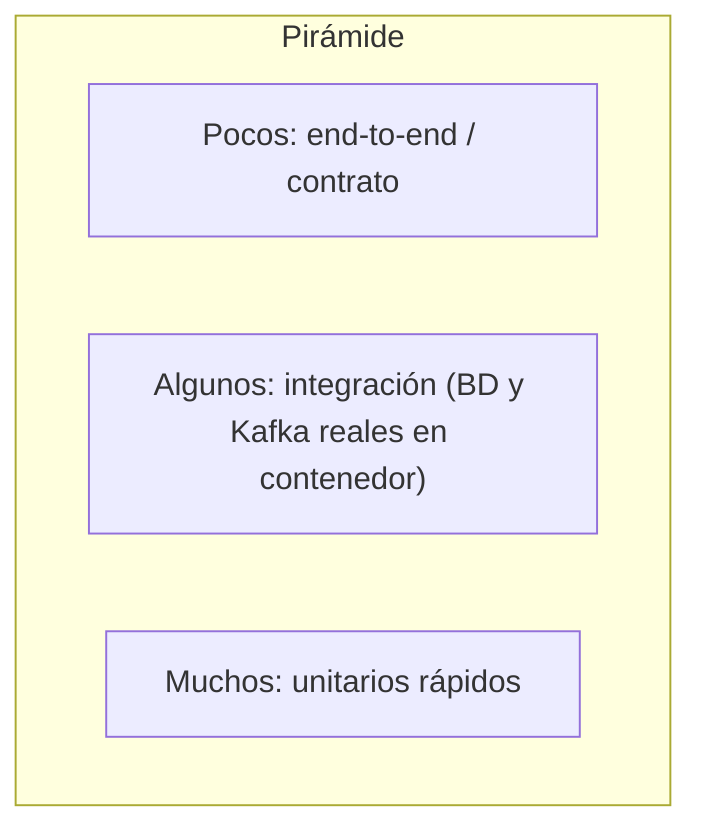

# Testing con JUnit 5 y Mockito (y cómo se ve en Quarkus y Spring)

Lo que se pregunta en una entrevista cuando dicen "Testing: JUnit 5 y Mockito".

> Ciclo y pirámide: [`README.md`](README.md) · Quarkus: [`../frameworks/quarkus/README.md`](../frameworks/quarkus/README.md) · Hexagonal (cómo se testea por capas): [`../software-architectures/hexagonal-architecture.md`](../software-architectures/hexagonal-architecture.md)

## 🍎 Con manzanas (empieza aquí)

Tienes una caja que cobra manzanas y llama al banco por teléfono.

- **JUnit** es la **lista de comprobación**: "si cobro 3 manzanas a 2 soles, el total es 6".
- **Mockito** es **un banco de mentira**: un actor que contesta lo que tú le indiques ("aprobado", "rechazado", "no contesta") para probar tu caja **sin llamar al banco real**.
- Una prueba tiene tres pasos: **preparar** (el actor y los datos), **actuar** (cobrar) y **comprobar** (el total y que se haya llamado al banco una vez). Es el patrón **AAA**.

### Qué debes dominar según tu nivel

| Nivel | Debes poder explicar |
|---|---|
| 🟢 **Junior** | `@Test`, asserts, patrón AAA; qué es un mock; `when(...).thenReturn(...)` y `verify` |
| 🟡 **Mid** | `@ExtendWith(MockitoExtension.class)`, `@Mock`/`@InjectMocks`; `@ParameterizedTest`; `assertThrows`; `ArgumentCaptor`; mock vs spy vs fake; testing de excepciones |
| 🔴 **Senior** | Pirámide y qué probar en cada capa; no mockear lo que no es tuyo; tests frágiles por exceso de mocks; Testcontainers vs mocks; `@QuarkusTest`/`@InjectMock`; testing de mensajería; TDD |

## 1. JUnit 5

Tres módulos: **Platform** (ejecuta), **Jupiter** (el modelo de programación y las anotaciones) y **Vintage** (compatibilidad con JUnit 4).

| Anotación | Para qué |
|---|---|
| `@Test` | Un caso de prueba |
| `@BeforeEach` / `@AfterEach` | Antes/después de **cada** prueba |
| `@BeforeAll` / `@AfterAll` | Una vez por clase (métodos `static`) |
| `@DisplayName` | Nombre legible |
| `@Nested` | Agrupar pruebas por escenario |
| `@ParameterizedTest` + `@ValueSource`, `@CsvSource`, `@MethodSource` | La misma prueba con varios datos |
| `@Disabled` | Saltar una prueba |
| `@Tag` | Etiquetar (`unit`, `integration`) para filtrar |
| `@RepeatedTest` | Repetir |
| `@Timeout` | Falla si tarda demasiado |

```java
class CalculadoraPagoTest {

    @Test
    @DisplayName("el total es precio por cantidad")
    void total() {
        // Arrange
        var calc = new CalculadoraPago();
        // Act
        var total = calc.total(new BigDecimal("2.00"), 3);
        // Assert
        assertEquals(new BigDecimal("6.00"), total);
    }

    @ParameterizedTest
    @CsvSource({"0", "-1"})
    void rechazaCantidadInvalida(int cantidad) {
        assertThrows(IllegalArgumentException.class,
            () -> new CalculadoraPago().total(BigDecimal.ONE, cantidad));
    }

    @Test
    void variasAserciones() {
        var pago = Pago.nuevo("k-1", new BigDecimal("10"));
        assertAll(
            () -> assertEquals(EstadoPago.CREADO, pago.estado()),
            () -> assertNotNull(pago.id()));
    }
}
```

**Asserts útiles:** `assertEquals`, `assertTrue/False`, `assertNull/NotNull`, `assertThrows`, `assertAll`, `assertTimeout`. **AssertJ** (`assertThat(x).isEqualTo(...)`) da aserciones más legibles y se usa mucho junto con JUnit.

**JUnit 5 vs 4:** `@Test` sin `expected`; `@BeforeEach` en lugar de `@Before`; `@ExtendWith` en lugar de `@RunWith`; `@Nested`, `@ParameterizedTest`; extensión por composición, no una sola `Runner`.

## 2. Mockito

```java
@ExtendWith(MockitoExtension.class)
class CobrarPagoServiceTest {

    @Mock BancoPort banco;                     // puerto de salida (hexagonal)
    @Mock PagoRepository repo;
    @InjectMocks CobrarPagoService service;    // recibe los mocks por constructor

    @Test
    void cobraYGuarda() {
        // Arrange: el banco de mentira aprueba
        var pago = Pago.nuevo("k-1", new BigDecimal("10"));
        when(banco.cobrar(pago)).thenReturn(ResultadoBanco.aprobado());

        // Act
        service.cobrar(pago);

        // Assert
        verify(banco).cobrar(pago);                              // se llamó una vez
        verify(repo).guardar(argThat(p -> p.estado() == EstadoPago.AUTORIZADO));
        verifyNoMoreInteractions(banco);
    }

    @Test
    void siElBancoNoResponde_quedaPendiente() {
        when(banco.cobrar(any())).thenThrow(new TimeoutException());
        // ... assert estado PENDIENTE_CONFIRMACION
    }
}
```

| Concepto | Qué hace |
|---|---|
| `mock(X.class)` / `@Mock` | Objeto falso: todos los métodos devuelven valores por defecto (null, 0, vacío) |
| `when(...).thenReturn(...)` / `thenThrow(...)` | Programa la respuesta (*stubbing*) |
| `doReturn(...).when(spy).metodo()` / `doThrow` | Stubbing para `void` y para spies |
| `verify(mock).metodo()` / `times(n)` / `never()` | Comprueba que se llamó |
| `ArgumentCaptor` | Captura el argumento con el que se llamó, para inspeccionarlo |
| Matchers: `any()`, `eq()`, `argThat()` | Flexibilizar argumentos (si usas uno, **todos** deben ser matchers) |
| `@Spy` | Objeto **real** vigilado: se llama al código real salvo que lo sustituyas |
| `@InjectMocks` | Crea el objeto bajo prueba inyectándole los `@Mock` |
| `Mockito.lenient()` | Evita la queja de *strict stubs* por un stub sin usar |
| `MockedStatic` | Mockear métodos estáticos |
| `BDDMockito` | `given(...).willReturn(...)` y `then(...).should()` para estilo BDD |

**Strict stubs:** con `MockitoExtension`, un `when(...)` que no se usa hace fallar la prueba (`UnnecessaryStubbingException`). Es una ayuda: evita pruebas con basura.

**Mock vs Spy vs Fake vs Stub:**

| | Qué es | Cuándo |
|---|---|---|
| **Mock** | Falso que además **verifica** interacciones | Comprobar que se llamó al banco |
| **Stub** | Falso que solo **devuelve** respuestas programadas | Simular la respuesta |
| **Spy** | Objeto real parcialmente falso | Raro; casi siempre indica un diseño mejorable |
| **Fake** | Implementación **simple y funcional** (repositorio en memoria) | Pruebas de varias piezas sin infraestructura real |

**Qué no mockear:** tipos que no son tuyos (un `HttpClient`, `EntityManager`): mejor un adaptador propio que sí mockeas, o una prueba de integración. **Y no mockear objetos de valor ni el dominio:** se instancian reales.

## 3. Qué probar en cada capa (hexagonal + pirámide)



| Capa | Cómo probarla | Con qué |
|---|---|---|
| **Dominio** (entidades, reglas) | Unitaria **pura**, sin framework, sin mocks | JUnit |
| **Aplicación** (casos de uso) | Unitaria con **mocks de los puertos de salida** (`BancoPort`, `PagoRepository`) | JUnit + Mockito |
| **Adaptador de entrada** (REST) | Prueba del endpoint con el caso de uso mockeado | `@QuarkusTest` + RestAssured + `@InjectMock` |
| **Adaptador de salida** (JPA, Kafka) | **Integración** con la tecnología real | Dev Services / Testcontainers |
| **Flujo completo** | Pocas pruebas end-to-end | `@QuarkusIntegrationTest` |

**La ventaja de hexagonal para testear:** el dominio y los casos de uso no dependen de frameworks, así que se prueban en milisegundos con mocks de los puertos.

## 4. En Quarkus

```java
@QuarkusTest
class PagoResourceTest {

    @InjectMock CrearPagoUseCase crearPago;        // reemplaza el bean por un mock (quarkus-junit5-mockito)

    @Test
    void creaPago() {
        when(crearPago.ejecutar(any())).thenReturn(new PagoId(UUID.randomUUID()));

        given()
            .contentType(ContentType.JSON)
            .body("""
                {"cuentaOrigen":"A","cuentaDestino":"B","monto":"10.00"}""")
        .when().post("/pagos")
        .then().statusCode(201).header("Location", notNullValue());
    }
}
```

| Pieza | Para qué |
|---|---|
| `@QuarkusTest` | Arranca la aplicación (una vez para todas las pruebas) |
| `@InjectMock` | Mock de un bean CDI (equivale a `@MockBean`) |
| **RestAssured** | Probar endpoints HTTP |
| **Dev Services** | Levanta PostgreSQL y Kafka reales en contenedor para pruebas de integración |
| `@QuarkusTestResource` | Recursos externos de prueba |
| `InMemoryConnector` | Probar consumidores y productores de Kafka sin broker (ver [mensajería](../frameworks/quarkus/smallrye-reactive-messaging.md)) |
| `@QuarkusIntegrationTest` | Prueba contra el artefacto empaquetado o nativo |
| `@TestTransaction` | Hace rollback al terminar la prueba |

**En Spring:** `@SpringBootTest`, `@WebMvcTest`/`@WebFluxTest`, `@MockBean`, `@DataJpaTest`, `EmbeddedKafka`, Testcontainers.

## 5. Buenas prácticas

- **AAA** y **un concepto por prueba**.
- Nombre que dice **qué pasa y cuándo** (`siElBancoNoResponde_quedaPendiente`).
- **Pruebas independientes**: sin orden ni estado compartido.
- **Rápidas**: los unitarios sin arrancar el framework.
- **Probar comportamiento, no implementación**: demasiados `verify` vuelven frágiles los tests.
- **Casos límite**: nulos, vacíos, montos cero y negativos, timeouts, duplicados.
- **Datos de prueba legibles** (builders o *object mothers*).
- **Probar el camino de error** (banco rechaza, no responde, mensaje duplicado).
- **TDD** cuando la regla es clara: rojo, verde, refactor ([`README.md`](README.md)).

## 6. Preguntas de entrevista con escalera de respuesta

| Pregunta | 🟢 Junior | 🟡 Mid | 🔴 Senior |
|---|---|---|---|
| **¿Qué es un mock?** | "Un objeto falso que reemplaza a una dependencia en una prueba." | "Mockito programa respuestas con `when` y verifica llamadas con `verify`; distingo mock, stub, spy y fake." | "Mockeo los puertos del dominio, no tipos de terceros; demasiados mocks acoplan la prueba a la implementación." |
| **¿Cómo pruebas un servicio que llama al banco?** | "Mockeo el cliente del banco." | "`@Mock` del puerto, `@InjectMocks` del servicio, y pruebo aprobado, rechazado y timeout." | "Prueba unitaria con mocks de puertos y una de integración del adaptador contra un banco simulado, para cubrir contrato y errores." |
| **¿Diferencia entre `@Mock` y `@Spy`?** | "Mock es falso; spy es real vigilado." | "El spy llama al código real salvo que lo sustituyas." | "Un spy suele indicar una clase con demasiadas responsabilidades." |
| **¿Qué es una prueba parametrizada?** | "La misma prueba con varios datos." | "`@ParameterizedTest` con `@CsvSource` o `@MethodSource`." | "La uso para tablas de reglas de negocio y valores límite." |
| **¿Cómo pruebas el acceso a datos?** | "Con una base de datos de prueba." | "Integración con la BD real en contenedor (Dev Services o Testcontainers) y rollback por prueba." | "Evito H2 como sustituto de PostgreSQL: difiere en SQL y tipos; uso la misma base real." |
| **¿Qué porcentaje de cobertura exiges?** | "Alta." | "La cobertura es un indicador, no un objetivo; miro ramas y caminos de error." | "Prefiero pruebas de mutación y revisar riesgos antes que perseguir un número." |

## Referencias

- [JUnit 5: guía de usuario](https://junit.org/junit5/docs/current/user-guide/)
- [Mockito: documentación](https://javadoc.io/doc/org.mockito/mockito-core/latest/org/mockito/Mockito.html)
- [Quarkus: guía de testing](https://quarkus.io/guides/getting-started-testing)
