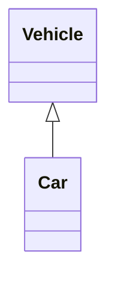
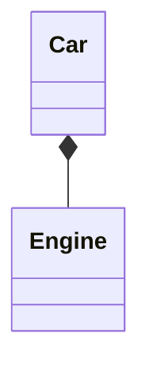
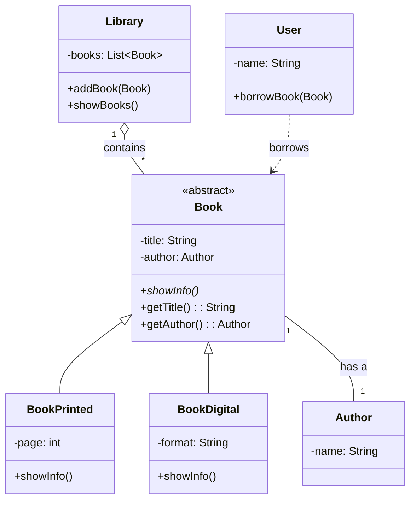

# UML Project Example

This project is a simple Java setup to demonstrate basic Object-Oriented Programming concepts, illustrated with UML (Unified Modeling Language) diagrams.

## What is UML?

UML, or Unified Modeling Language, is a standardized modeling language used in software engineering to visualize, specify, construct, and document the artifacts of a software system. It provides a set of graphical notations to create visual models of software-intensive systems.

---

## Key OOP Concepts in UML

### 1. Inheritance

Inheritance is a mechanism where a new class (subclass or derived class) inherits attributes and methods from an existing class (superclass or base class). It represents an "is-a" relationship.

**Example Diagram:**

A `Car` is a type of `Vehicle`. The `Car` class inherits from the `Vehicle` class.



### 2. Composition

Composition is a restricted form of aggregation where two entities are highly dependent on each other. It represents a "part-of" relationship. The composed object cannot exist without the other entity.

**Example Diagram:**

A `Car` has an `Engine`. The `Engine` is part of the `Car` and cannot exist independently.



## Project Class Diagram

Here is the UML class diagram for the implemented Java code:



## Sequence Diagram

This diagram shows the sequence of interactions between objects as defined in the `Main.java` file.

```mermaid
sequenceDiagram
    participant Main
    participant Library
    participant "book1:BookPrinted"
    participant "book2:BookDigital"
    participant "user:User"

    Main->>Library: addBook(book1)
    Main->>Library: addBook(book2)

    Main->>Library: showBooks()
    activate Library
    Library->>"book1:BookPrinted": showInfo()
    Library->>"book2:BookDigital": showInfo()
    deactivate Library

    Main->>"user:User": borrowBook(book1)
    activate "user:User"
    "user:User"->>"book1:BookPrinted": getTitle()
    "user:User"->>"book1:BookPrinted": getAuthor()
    deactivate "user:User"
    
    Main->>"user:User": borrowBook(book2)
    activate "user:User"
    "user:User"->>"book2:BookDigital": getTitle()
    "user:User"->>"book2:BookDigital": getAuthor()
    deactivate "user:User"
```
