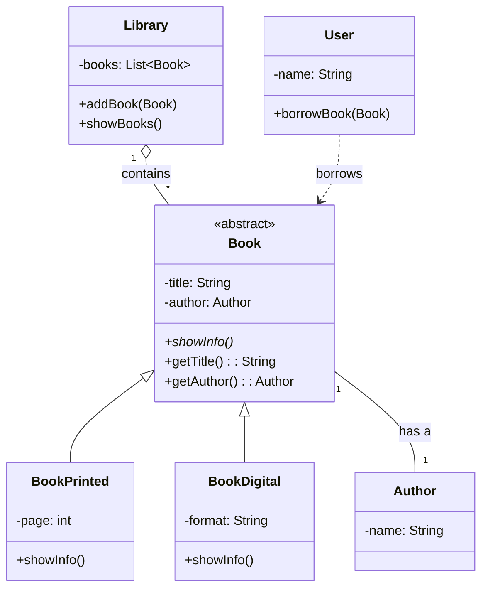

# UML Project Example

This project is a simple Java setup to demonstrate basic Object-Oriented Programming concepts, illustrated with UML (Unified Modeling Language) diagrams.

## What is UML?

UML, or Unified Modeling Language, is a standardized modeling language used in software engineering to visualize, specify, construct, and document the artifacts of a software system. It provides a set of graphical notations to create visual models of software-intensive systems.

---

## Key OOP Concepts and UML Notation

Here are some of the fundamental relationships between classes in OOP, along with their standard UML notation.

### Herencia (Inheritance)
- **Relación:** Una clase (subclase) hereda propiedades y comportamientos de otra (superclase). Representa una relación "es un".
- **Notación UML:** Línea sólida con una flecha de triángulo hueco que apunta a la superclase.
- **Ejemplo:**
  ```mermaid
  classDiagram
    Animal <|-- Perro
  ```

### Asociación (Association)
- **Relación:** Describe una conexión entre clases. Es la relación más general.
- **Notación UML:** Línea sólida entre clases.
- **Ejemplo:**
  ```mermaid
  classDiagram
    Persona -- Direccion
  ```

### Agregación (Aggregation)
- **Relación:** Una forma especializada de asociación que representa una relación "tiene un" donde las clases tienen ciclos de vida independientes.
- **Notación UML:** Línea sólida con un rombo hueco en el lado del contenedor.
- **Ejemplo:**
  ```mermaid
  classDiagram
    Universidad o-- Facultad
  ```

### Composición (Composition)
- **Relación:** Una forma fuerte de agregación donde el ciclo de vida de la clase contenida depende de la clase contenedora. Representa una relación "es parte de".
- **Notación UML:** Línea sólida con un rombo relleno en el lado del contenedor.
- **Ejemplo:**
  ```mermaid
  classDiagram
    Casa *-- Habitacion
  ```

### Dependencia (Dependency)
- **Relación:** Ocurre cuando un cambio en una clase puede afectar a otra clase, sin que haya una relación estructural directa.
- **Notación UML:** Línea discontinua con una flecha abierta.
- **Ejemplo:**
  ```mermaid
  classDiagram
    Controlador ..> Servicio
  ```

## Project Class Diagram

Here is the UML class diagram for the implemented Java code:



## Sequence Diagram

This diagram shows the sequence of interactions between objects as defined in the `Main.java` file.

```mermaid
sequenceDiagram
    participant Main
    participant Library
    participant "book1:BookPrinted"
    participant "book2:BookDigital"
    participant "user:User"

    Main->>Library: addBook(book1)
    Main->>Library: addBook(book2)

    Main->>Library: showBooks()
    activate Library
    Library->>"book1:BookPrinted": showInfo()
    Library->>"book2:BookDigital": showInfo()
    deactivate Library

    Main->>"user:User": borrowBook(book1)
    activate "user:User"
    "user:User"->>"book1:BookPrinted": getTitle()
    "user:User"->>"book1:BookPrinted": getAuthor()
    deactivate "user:User"
    
    Main->>"user:User": borrowBook(book2)
    activate "user:User"
    "user:User"->>"book2:BookDigital": getTitle()
    "user:User"->>"book2:BookDigital": getAuthor()
    deactivate "user:User"
```
