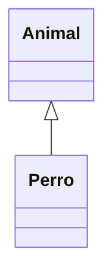
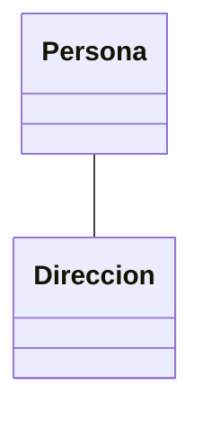
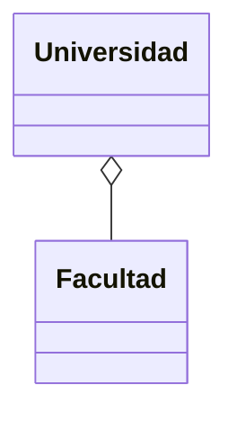
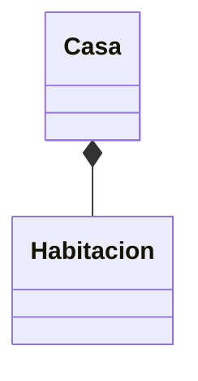
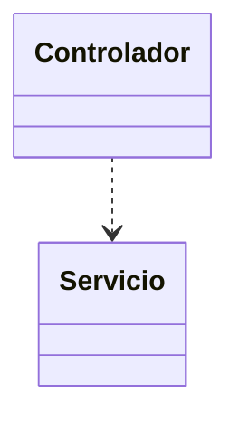
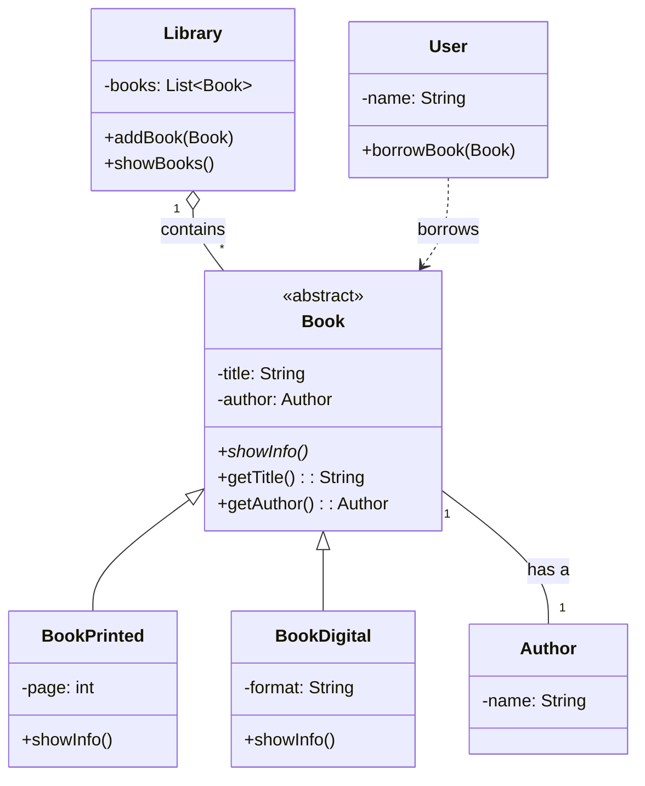
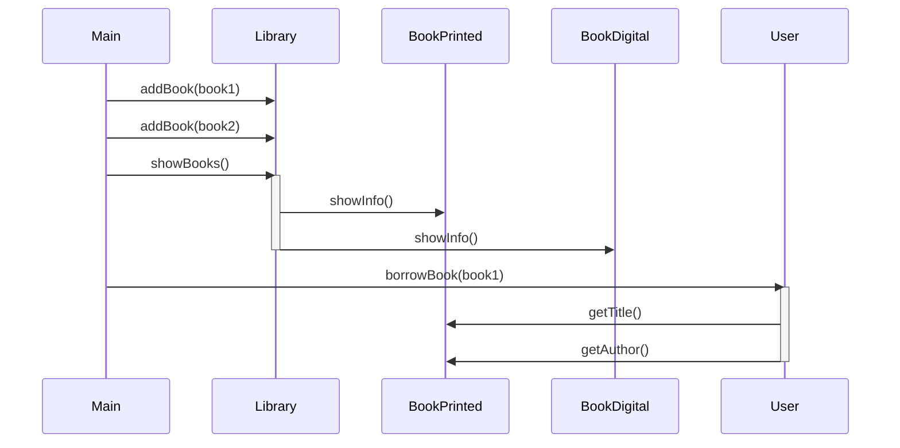

# Notación UML — referencia rápida

Cómo se representan las relaciones entre clases en UML (Unified Modeling Language), para usar al diseñar la arquitectura de un sistema o documentar un artefacto — sin necesidad de ningún proyecto de código, es pura notación.

## Cheatsheet — las 5 relaciones que hay que reconocer al vuelo

| Relación | Pregunta que responde | Notación | Fuerza del vínculo |
|---|---|---|---|
| **Herencia** (Inheritance) | "¿Es un...?" | Línea sólida + triángulo hueco apuntando a la superclase | Fuerte — acoplamiento estructural |
| **Asociación** (Association) | "¿Se conecta con...?" | Línea sólida simple | La más general/débil |
| **Agregación** (Aggregation) | "¿Tiene un... (pero puede vivir sin él)?" | Línea sólida + rombo **hueco** del lado del contenedor | Débil — ciclos de vida independientes |
| **Composición** (Composition) | "¿Es parte de... (y no existe sin él)?" | Línea sólida + rombo **relleno** del lado del contenedor | Fuerte — ciclo de vida dependiente |
| **Dependencia** (Dependency) | "¿Usa a... en algún método, sin guardar una referencia?" | Línea punteada + flecha abierta | La más débil — acoplamiento temporal |

> 🧠 **Píldora — agregación vs composición, la duda más común:** preguntate "si borro el contenedor, ¿el contenido sigue existiendo?". Una `Facultad` sigue existiendo sin la `Universidad` (agregación). Una `Habitacion` no tiene sentido sin la `Casa` (composición).

## Cada relación, en un diagrama

### Herencia (Inheritance)
Una subclase hereda propiedades y comportamientos de una superclase. Relación "es un".

```mermaid
classDiagram
    Animal <|-- Perro
```

### Asociación (Association)
Conexión entre clases sin implicar posesión — la más general de todas.

```mermaid
classDiagram
    Persona -- Direccion
```

### Agregación (Aggregation)
Relación "tiene un" donde las clases tienen ciclos de vida **independientes**.

```mermaid
classDiagram
    Universidad o-- Facultad
```

### Composición (Composition)
Forma fuerte de agregación: el ciclo de vida de la parte **depende** del todo. Relación "es parte de".

```mermaid
classDiagram
    Casa *-- Habitacion
```

### Dependencia (Dependency)
Un cambio en una clase puede afectar a otra, sin relación estructural directa (por ejemplo, un parámetro de método).

```mermaid
classDiagram
    Controlador ..> Servicio
```

## Ejemplo aplicado — combinando varias relaciones

Un mismo modelo (biblioteca de libros) mostrando herencia, asociación, agregación y dependencia juntas:

```mermaid
classDiagram
    class Book {
        <<abstract>>
        -title: String
        -author: Author
        +showInfo()*
        +getTitle(): String
        +getAuthor(): Author
    }
    class BookPrinted {
        -page: int
        +showInfo()
    }
    class BookDigital {
        -format: String
        +showInfo()
    }
    class Author {
        -name: String
    }
    class User {
        -name: String
        +borrowBook(Book)
    }
    class Library {
        -books: List~Book~
        +addBook(Book)
        +showBooks()
    }

    Book <|-- BookPrinted
    Book <|-- BookDigital
    Book "1" -- "1" Author : has a
    Library "1" o-- "*" Book : contains
    User ..> Book : borrows
```

- `Book <|-- BookPrinted` — **herencia**: `BookPrinted` es un `Book`.
- `Book -- Author` — **asociación**: cada libro tiene un autor.
- `Library o-- Book` — **agregación**: la biblioteca contiene libros, pero un libro puede existir sin esa biblioteca puntual.
- `User ..> Book` — **dependencia**: `User.borrowBook()` usa `Book` como parámetro, sin guardar una referencia permanente.

### El mismo modelo, como diagrama de secuencia

Útil para mostrar el **orden de interacciones** entre objetos, no solo su estructura:

```mermaid
sequenceDiagram
    participant Main
    participant Library
    participant book1 as BookPrinted
    participant book2 as BookDigital
    participant user as User

    Main->>Library: addBook(book1)
    Main->>Library: addBook(book2)

    Main->>Library: showBooks()
    activate Library
    Library->>book1: showInfo()
    Library->>book2: showInfo()
    deactivate Library

    Main->>user: borrowBook(book1)
    activate user
    user->>book1: getTitle()
    user->>book1: getAuthor()
    deactivate user
```

## Cuándo usar cada tipo de diagrama

| Diagrama | Para qué |
|---|---|
| **Clases** | Estructura estática del sistema — qué entidades existen y cómo se relacionan. Es el que más se usa al diseñar un dominio o revisar una arquitectura hexagonal. |
| **Secuencia** | Orden temporal de interacciones entre objetos/servicios para un flujo puntual — ideal para documentar un caso de uso o un endpoint. |
| **Estados** | Ciclo de vida de una entidad con estados y transiciones (ej: un pedido: creado → pagado → enviado → entregado). |

Relacionado: [`hexagonal-architecture/`](../hexagonal-architecture) y [`system-design/`](../system-design) usan esta misma notación para documentar arquitectura real.
